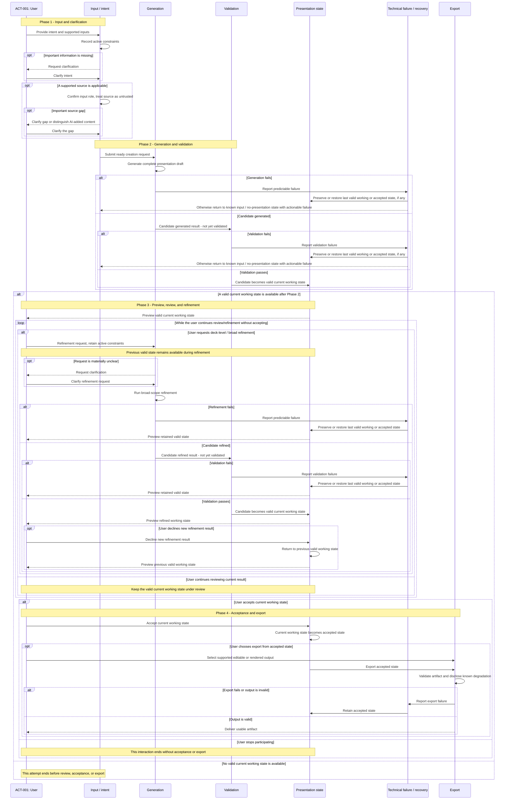

# UC-001 — Create Presentation

> Scope: V1
>
> Artifact type: Derived product-behavior diagram
>
> Generated: 2026-09-20
>
> Snapshot path: `.project-hub/snapshot/`
>
> Snapshot `syncedAt`: `2026-09-20T08:56:18.337178Z`
>
> Schema version: `1`

## Traceability

- Source tables: `use_cases`, `requirements`, `constraints`, `business_rules`, `assumptions`,
  `decisions`
- Stable entity IDs:
  - Use Cases: `UC-001`, `UC-002`, `UC-004`, `UC-008`
  - Requirements: `R-001`, `R-002`, `R-003`, `R-004`, `R-006`, `R-007`, `R-008`, `R-009`,
    `R-011`, `R-013`, `R-019`, `R-020`, `R-021`, `R-024`, `R-025`, `R-026`, `R-027`,
    `R-028`, `R-031`, `R-032`, `R-033`, `R-041`, `R-043`
  - Constraints: `C-001`, `C-003`, `C-004`
  - Business Rules: `BR-001`, `BR-002`, `BR-003`, `BR-005`, `BR-006`, `BR-007`, `BR-008`
  - Assumptions: `A-008`, `A-009`, `A-013`, `A-015`, `A-017`, `A-020`, `A-021`, `A-022`,
    `A-023`
  - Decisions: `D-006`, `D-007`, `D-009`, `D-011`, `D-012`, `D-013`, `D-014`, `D-015`,
    `D-016`, `D-017`, `D-026`
- Source-table SHA-256:
  - `use_cases`: `sha256:94080163bf1eeabab7b9007754a5137fdf60bad800d17be6b0fb9d723b3c523f`
  - `requirements`: `sha256:a2081f6d6acdbb8a832668cca6c3d2a72322f14fe6d40531dee419d55a152002`
  - `constraints`: `sha256:317160d5e1fb143f4921e8277884836fa10efc727fa152d02f3891eacdc785b0`
  - `business_rules`: `sha256:2d738a60cdd5b5236a7164dc959cb3b8316317d03e2bddbd5d7e0addd29b571a`
  - `assumptions`: `sha256:e305a9accf2c3025736106c18bb92cd99c8423f6ea879627ca3c9a66ad3ccd88`
  - `decisions`: `sha256:50786c22159c2355fde9ba461957ae5b3b5e980458d3096f84349ab448cf2ab0`

## Activity diagram

The sequence and branch structure are **derived behavior** assembled from multiple Project Hub
records; they are not a new Requirement or Decision. Validation is deliberately shown as required
behavior without selecting an implementation mechanism. Imported-presentation refinement, manual
professional editing, and localized element-level editing are not part of this V1 flow.

Validation and user acceptance are separate gates: validation promotes a candidate to a valid
current working state, while only explicit user acceptance creates the accepted state used for
export. After a refined candidate passes validation, the prior valid state remains available if the
user declines the new refinement result. The exact state-promotion and return mechanism is
intentionally unspecified; this is a **derived behavior** clarification, not a new Requirement or
Decision.

## Open points

- `Open point` — The specific source types supported in V1 remain unresolved (`UC-002`, `R-003`).
- `Open point` — The deck-level refinement types sufficient for V1 remain unresolved (`UC-004`,
  `A-021`, `D-014`).
- `Resolved` — The V1 output baseline is PPTX (editable) and PDF (rendered/static); broader
  output formats remain a later direction (`UC-008`, `A-023`, `D-026`, superseding `D-016`).
- `Open point` — The validation mechanism and the concrete minimum-quality rubric are intentionally
  unspecified here (`R-021`, `R-033`, `D-011`).

## Review triggers

Review this artifact when:

- a referenced entity changes;
- the status or scope of a referenced Use Case or Requirement changes;
- a referenced Decision is Reopened or Superseded; or
- a current source-table hash differs from the hash recorded above.
