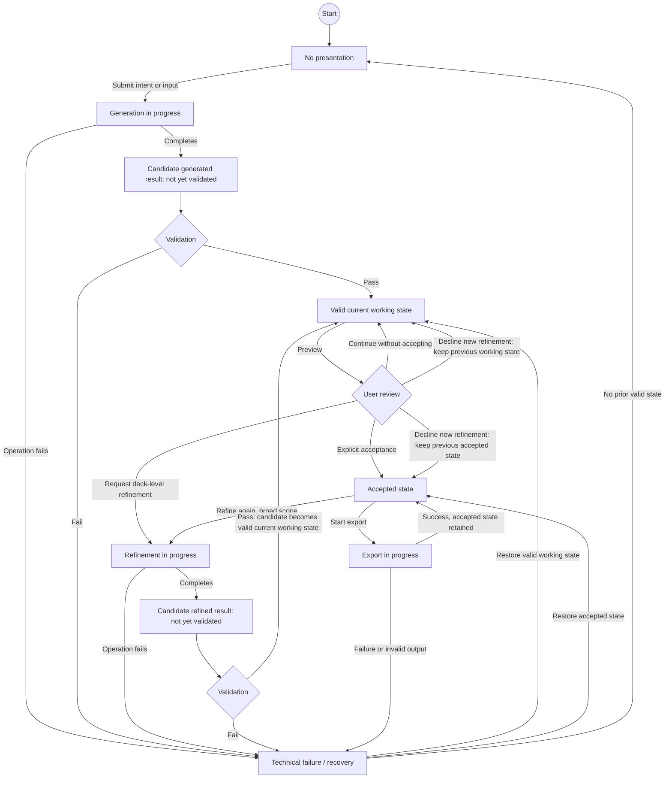

# Presentation Lifecycle

> Scope: V1
>
> Artifact type: Derived state model
>
> Model type: Derived behavioral model
>
> Not an implementation state machine specification
>
> Generated: 2026-09-20
>
> Snapshot path: `.project-hub/snapshot/`
>
> Snapshot `syncedAt`: `2026-09-20T08:56:18.337178Z`
>
> Schema version: `1`

## Traceability

- Source tables: `use_cases`, `requirements`, `business_rules`, `assumptions`, `decisions`
- Stable entity IDs:
  - Use Cases: `UC-001`, `UC-004`, `UC-008`
  - Requirements: `R-006`, `R-011`, `R-013`, `R-019`, `R-020`, `R-021`, `R-025`, `R-027`,
    `R-028`, `R-031`, `R-032`, `R-033`
  - Business Rules: `BR-005`, `BR-006`
  - Assumptions: `A-017`, `A-021`, `A-023`
  - Decisions: `D-011`, `D-012`, `D-014`, `D-016`, `D-017`, `D-026`
- Source-table SHA-256:
  - `use_cases`: `sha256:94080163bf1eeabab7b9007754a5137fdf60bad800d17be6b0fb9d723b3c523f`
  - `requirements`: `sha256:a2081f6d6acdbb8a832668cca6c3d2a72322f14fe6d40531dee419d55a152002`
  - `business_rules`: `sha256:2d738a60cdd5b5236a7164dc959cb3b8316317d03e2bddbd5d7e0addd29b571a`
  - `assumptions`: `sha256:e305a9accf2c3025736106c18bb92cd99c8423f6ea879627ca3c9a66ad3ccd88`
  - `decisions`: `sha256:50786c22159c2355fde9ba461957ae5b3b5e980458d3096f84349ab448cf2ab0`

## State diagram

These states and transitions are **derived behavior** synthesized from multiple Project Hub records;
they are not a new Requirement or Decision. A candidate AI result becomes a valid current working
state only after applicable validation; validation does not constitute user acceptance. Only
explicit acceptance creates the accepted state used for export. Technical failure preserves or
restores the last valid working or accepted state. Declining a new refinement result is normal review
behavior, not a technical failure.

After a refined candidate passes validation, the diagram treats it as the valid working result under
review while keeping the prior valid state available if the user declines the new refinement result.
The exact state-promotion and return mechanism is intentionally unspecified. Not accepting an initial
working state may leave the user in review/refinement or end the user's participation; no detailed
cancellation feature is defined here.

The model intentionally says nothing about storage, canonical representations, scene models,
patching, routing, databases, snapshot/version mechanisms, event sourcing, agent topology,
PPTX-first/HTML-first approaches, or providers/models.

## Open points

- `Open point` — The concrete validation mechanism and minimum-quality rubric are unspecified
  (`R-021`, `R-033`, `D-011`).
- `Resolved` — The V1 output baseline is PPTX (editable) and PDF (rendered/static); broader
  output formats remain a later direction (`A-023`, `D-026`, superseding `D-016`).

## Review triggers

Review this artifact when:

- a referenced entity changes;
- the status or scope of a referenced Use Case or Requirement changes;
- a referenced Decision is Reopened or Superseded; or
- a current source-table hash differs from the hash recorded above.
