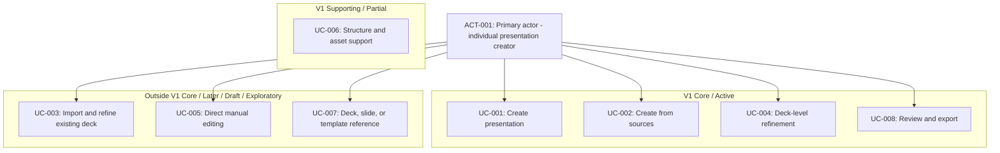

# Use Case Overview

> Scope: V1 scope with non-V1 boundary context
>
> Artifact type: Derived product-behavior diagram
>
> Generated: 2026-09-20
>
> Snapshot path: `.project-hub/snapshot/`
>
> Snapshot `syncedAt`: `2026-09-20T08:56:18.337178Z`
>
> Schema version: `1`

## Traceability

- Source tables: `actors`, `use_cases`, `constraints`, `decisions`
- Stable entity IDs:
  - Actors: `ACT-001`
  - Use Cases: `UC-001`, `UC-002`, `UC-003`, `UC-004`, `UC-005`, `UC-006`, `UC-007`,
    `UC-008`
  - Constraints: `C-001`
  - Decisions: `D-006`, `D-012`, `D-013`, `D-014`, `D-015`
- Source-table SHA-256:
  - `actors`: `sha256:a736079ee8ccfceb8a8ab560afbdb26a5eaf3d805dea9e5b0e2b7e09b5730c8f`
  - `use_cases`: `sha256:94080163bf1eeabab7b9007754a5137fdf60bad800d17be6b0fb9d723b3c523f`
  - `constraints`: `sha256:317160d5e1fb143f4921e8277884836fa10efc727fa152d02f3891eacdc785b0`
  - `decisions`: `sha256:50786c22159c2355fde9ba461957ae5b3b5e980458d3096f84349ab448cf2ab0`

## Diagram

The grouping is a **derived behavior/scope view** assembled from the current Use Case statuses and
notes plus the active scope decisions. It is not a new Requirement or Decision. In particular,
`UC-006` is shown as a supporting capability rather than a direct `ACT-001` goal: it contributes
only the subset needed by the creation-first V1 flow and does not promote a full asset-management
capability. Imported-deck refinement, a professional/manual editor, and localized element-level
editing remain outside V1 Core.

## Review triggers

Review this artifact when:

- a referenced entity changes;
- the status or scope of a referenced Use Case or Requirement changes;
- a referenced Decision is Reopened or Superseded; or
- a current source-table hash differs from the hash recorded above.
