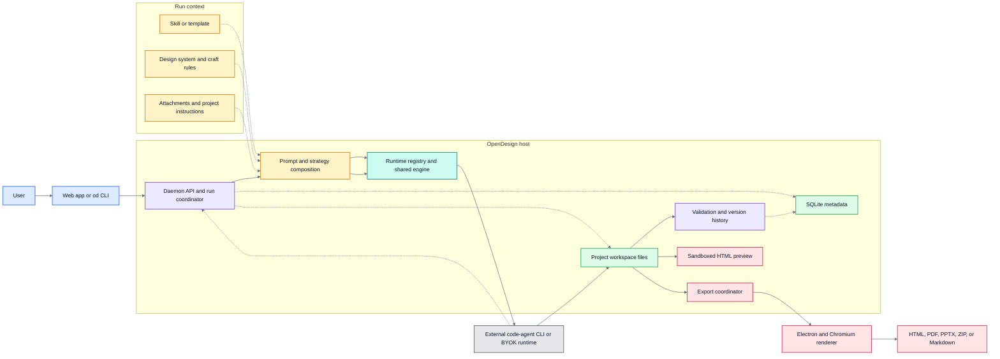
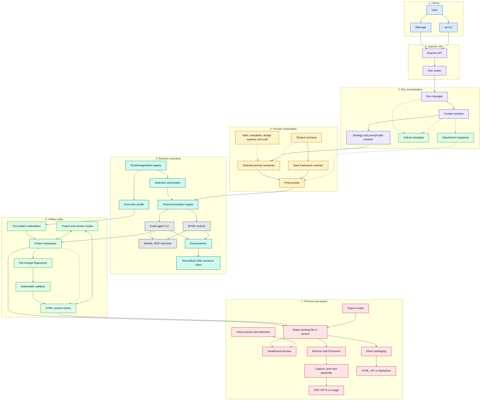

# OpenDesign Architecture Research (DOC-007)

- Status: Draft — ready for review
- Produced by: W-031 · Used by: W-033
- Contract: [DOC-005 Reference-System Research Contract](../reference-system-research-contract.md)
- Criteria: [DOC-004 Architecture Acceptance Criteria](../../architecture/architecture-acceptance-criteria.md)

## 1. Header

- System: OpenDesign
- Researcher: DeckAgent architecture workstream (W-031)
- Research dates: 2026-09-25; architecture-focused revision 2026-09-30
- Official repository confirmation: The official `nexu-io` organization links to `https://github.com/nexu-io/open-design`, and the installation instructions use this repository. Research started only after `git ls-remote` confirmed the release tag and commit.

Versions used (DOC-005 §5.2):

- Repository: `https://github.com/nexu-io/open-design` @ tag `open-design-v0.24.0`, commit `0d3a14c1df6dc5017f3cc3ef05b24558250c220b` (commit date 2026-09-21).
- Version caveat: The pinned tag is `open-design-v0.24.0`, but the root and daemon `package.json` files at that commit report version `0.23.1`. The findings therefore name both the tag and the commit.
- Docs: repository `README.md`, `docs/architecture.md`, `docs/agent-adapters.md`, `docs/prompt-composition.md`, `docs/modes.md`, and `docs/adr/0001-centralize-daemon-startup.md` at the pinned commit; GitHub pages accessed 2026-09-25.
- Release material: official GitHub release/tag `open-design-v0.24.0`, accessed 2026-09-25.
- Paper or other official material: No OpenDesign research paper was found in the official repository, README, architecture documentation, or release material.
- Historical version used, and why: None. Historical notes and changelog entries are used only to explain replaced design choices for RQ-17.

Sources consulted, in priority order (DOC-005 §5.1):

1. Pinned official architecture and decision records: `docs/architecture.md`, `docs/agent-adapters.md`, `docs/prompt-composition.md`, `docs/modes.md`, and `docs/adr/0001-centralize-daemon-startup.md`.
2. Pinned official source tree, mainly `apps/daemon`, `apps/web`, `apps/desktop`, `packages/contracts`, and deck/export modules.
3. Official `README.md`, `CHANGELOG.md`, and focused strategy material where it supplies evidence for a specific finding.
4. No secondary sources were used.

### 1.1 Scope and method

This research studies the architecture used by the deck workflow. OpenDesign also supports prototypes, media, plugins, automations, and other artifact types. Those parts are included only when they explain a shared boundary used by decks.

Strategy-specific rollout mechanics are outside the main scope because they are less stable than the host, state, runtime, and rendering boundaries. They are cited only when they provide the clearest available evidence for an RQ; a strategy-specific observation is not generalized to every run path.

The design-rationale review distinguishes four evidence levels: a formal ADR; an explicit argument in a design document; a historical explanation tied to a change; and rationale inferred from code structure. Only `docs/adr/0001-centralize-daemon-startup.md` is a formal ADR at the pinned commit. The remaining decisions are assessed from architecture documents, implementation history, and code, with the evidential limit stated where the original source does not record alternatives or consequences.

## 2. Architecture overview

### 2.1 System shape

OpenDesign is an orchestration system around existing coding agents. The web app and CLI are clients. The daemon is the product authority. It builds the run context, selects a strategy and runtime, manages state, and exposes one HTTP/SSE API. The chosen agent performs the model and tool loop. The shared result is a project workspace containing real files, usually HTML/CSS/assets for a deck. Preview and export read those files.

The main boundaries are:

| Boundary | Owns | Does not own |
|---|---|---|
| Web app / `od` CLI | User interaction, request input, event display, preview controls | Business rules, durable project state, agent loop |
| Daemon | HTTP API, prompt assembly, run lifecycle, runtime selection, metadata, files, versions, validation, export coordination | Provider-specific reasoning and tool loop |
| Prompt and strategy layer | Instructions, skills, design rules, task stages, host artifact contracts | Durable state or file rendering |
| Runtime registry and shared engine | Detection, launch, normalized events, cancellation, runtime capabilities | Deck content model or export format |
| External agent runtime | Model calls, tool use, context handling, and file edits | OpenDesign project authority |
| Project workspace | Current artifact bytes: HTML, CSS, assets, and exports | Conversation and run metadata |
| SQLite | Projects, conversations, messages, runs, sessions, and related metadata | Canonical artifact bytes |
| Preview and export | Render or package a selected file/version | Content generation or user intent |

Source: OpenDesign states these component responsibilities and data flows in `docs/architecture.md` — `open-design@0d3a14c1df6dc5017f3cc3ef05b24558250c220b:docs/architecture.md#L55-L110`, `#L148-L173`, `#L175-L199`.

### 2.2 How one prompt moves through the system

1. The web app or CLI sends the user's brief, selected project, attachments, runtime/model choice, and workflow options to the daemon.
2. The daemon resolves the project context. It loads the active skill or template, design system, craft rules, project instructions, conversation context, and attachment references.
3. The daemon selects the applicable strategy and prompt-composition path for that run.
4. The prompt layer builds the system and task instructions. It also adds host contracts that generated decks must follow, such as the deck protocol used by preview and export.
5. The runtime registry selects a `RuntimeAgentDef`. The shared engine starts the external CLI or a BYOK/API runtime and sends the composed prompt using that runtime's supported transport.
6. A filesystem-capable agent edits the project workspace directly. A text-only runtime returns one complete artifact, and the host writes it into the same workspace.
7. The daemon streams normalized events to the client, tracks changed files, validates the deliverable, and records HTML history after a successful run.
8. The preview reads the selected working file. Export reads the working file or an explicit HTML version and sends it to the renderer. Export does not ask the model to recreate the deck.

This is more than a frontend-to-backend call. The daemon is a coordinator between prompt policy, runtime variation, workspace state, validation, preview, and export.

### 2.3 Main architectural choices and their rationale

| Choice | Why OpenDesign chose it | Alternative or pressure recorded by the source | Main cost |
|---|---|---|---|
| Delegate the full agent loop to existing coding agents | Reuse mature model, tool, permission, context, resume, and cancel behavior | Building another agent loop was rejected in `agent-adapters.md` | Runtime behavior and safety differ by external agent |
| Use declarative runtime definitions plus one shared engine | Add agents without copying the run lifecycle | Per-agent classes and per-agent `run()` implementations are explicitly avoided | A new wire format can still require engine work |
| Put product authority in the daemon | Give web, desktop, packaged, and CLI clients one business path | Earlier browser-only and split-process ideas were replaced | The daemon becomes a large and important boundary |
| Keep artifact bytes in workspace files and metadata in SQLite | Let agents work on normal code files while keeping searchable run/project state | Earlier in-memory state and `history.jsonl` were replaced | File changes are not one atomic database transaction |
| Keep prompt strategy separate from host artifact contracts | Strategies may change, but preview/export contracts must stay stable | A deck-protocol change first reached only one prompt path; a later change moved the contract to one shared source | Some prompt composition paths are still duplicated |
| Render HTML for preview and export | Reuse browser layout and keep the working artifact as real HTML/CSS | Earlier agent-driven PPTX creation was replaced by capture/assembly for the default screenshot path | Screenshot PPTX favors visual match over editable slide objects |
| Centralize daemon startup | Keep CLI daemon mode and sidecars on the same start/stop path | The formal ADR rejects a narrow CLI-only lazy import and continued split startup | The low-level server builder still remains a separate seam |

Evidence: `open-design@0d3a14c1df6dc5017f3cc3ef05b24558250c220b:docs/agent-adapters.md#L5-L27`; `open-design@0d3a14c1df6dc5017f3cc3ef05b24558250c220b:docs/architecture.md#L5-L16`; `open-design@0d3a14c1df6dc5017f3cc3ef05b24558250c220b:docs/prompt-composition.md#L82-L123`; `open-design@0d3a14c1df6dc5017f3cc3ef05b24558250c220b:docs/adr/0001-centralize-daemon-startup.md#L7-L31`.

### 2.4 Full implementation architecture

The overview in §2.1 shows the stable system boundaries. The diagram below is the detailed implementation view at the pinned commit. It names the main modules that take part in a deck run, but it does not list every route, helper, runtime adapter, or export format.

Color and line guide:

| Visual | Meaning |
|---|---|
| Blue | User-facing client layer |
| Purple | Daemon control and orchestration |
| Amber | Prompt rules and host contracts |
| Teal | Runtime adapter and execution machinery |
| Gray | External agents and services |
| Green | Stored state, files, validation, and history |
| Rose | Preview, rendering, and export delivery |
| Solid arrow | Main control or artifact flow |
| Dashed arrow | Context, metadata, or feedback flow |
| Two-way arrow | Read and write relationship |

How to read this implementation view:

- The main generation path is `run routes → context → strategy → prompt → runtime engine → external agent → workspace`.
- `RuntimeAgentDef` changes how an agent is detected and called. It does not replace the shared run lifecycle.
- Filesystem-capable agents write the workspace directly. Text-only runtimes pass through the artifact materializer before reaching the same workspace.
- Runtime events return through parsers and SSE. Artifact bytes do not travel through SSE as the canonical state.
- Completion validation reads run state and workspace changes. A successful result can create HTML history, but live workspace changes may already be visible in preview.
- Preview and export select stored HTML. Preview uses a sandboxed iframe. Export sends the selected source to Electron/Chromium and then to format-specific assembly.
- SQLite and the workspace have different ownership: SQLite holds control metadata; the workspace holds current artifact bytes.
- Project/version routes and export routes are placed beside the state they operate on to keep connectors short. Both are still part of the daemon HTTP API.

Primary implementation sources for this view:

| Area | Main implementation source |
|---|---|
| Web client and preview | `apps/web/src/` |
| Daemon composition | `apps/daemon/src/server.ts` |
| Run API and task lifecycle | `apps/daemon/src/routes/runs.ts` |
| Prompt composition | `apps/daemon/src/prompts/`, `packages/contracts/src/prompts/`, and strategy packages |
| Runtime definitions and engine | `apps/daemon/src/runtimes/` |
| Shared API and runtime contracts | `packages/contracts/src/` |
| Project files and versions | `apps/daemon/src/routes/project/`, `project-file-versions.ts`, `run-html-version-snapshots.ts` |
| Validation and file-change tracking | `run-deliverable-validation.ts`, `run-artifact-fs.ts` |
| Export and binary assembly | `import-export-routes.ts`, `deck-export.ts`, `apps/desktop/` |

Evidence: `open-design@0d3a14c1df6dc5017f3cc3ef05b24558250c220b:docs/architecture.md#L79-L199`, `#L263-L274`; `open-design@0d3a14c1df6dc5017f3cc3ef05b24558250c220b:docs/agent-adapters.md#L15-L27`, `#L552-L590`; `open-design@0d3a14c1df6dc5017f3cc3ef05b24558250c220b:docs/prompt-composition.md#L5-L82`, `#L82-L123`.

## 3. Findings

### 3.1 Input & source

### F-OD-01 — The daemon separates attachment transport from prompt instructions

- Research questions: RQ-01
- Problem addressed: Give the agent source material without placing all file bytes inside the prompt.
- Responsibility / boundary: The daemon owns attachment intake and snapshot references. The prompt layer labels the material as task data. The selected agent can still read it.
- Decision / mechanism: Attachment metadata is added to the run contract, while managed snapshot files hold the bytes. User and project instructions enter through separate prompt fields.
- Source says: In the inspected strategy path, attachment facts are serialized without file bodies or absolute paths, while the daemon creates checked snapshot files for the run — `open-design@0d3a14c1df6dc5017f3cc3ef05b24558250c220b:packages/contracts/src/prompts/od-next-task-inputs.ts#L36-L65`, `#L93-L108`; `open-design@0d3a14c1df6dc5017f3cc3ef05b24558250c220b:apps/daemon/src/strategies/od-next/task-input-snapshot.ts#L610-L724`.
- Inference: Transport is separated, but there is no hard security boundary between source content and the agent that reads it. External models and enabled tools may receive user content.
- Rationale: Keeping bytes outside the prompt reduces prompt size and gives the host a controlled file boundary. This rationale is inferred from the contract.
- Trade-off: The prompt stays smaller, but safe treatment of untrusted source text still depends on prompt rules, agent behavior, and tool policy.
- DeckAgent implication / relevance: AC-02, AC-11 — useful evidence for separating file transport from instructions and for making every external content path explicit.
- Mismatch / caution: This transport contract was inspected in one strategy path, not established as a universal attachment contract. OpenDesign also allows broad agent and MCP tool access; DeckAgent may need a narrower exposure boundary.
- Confidence: Strong inference.

### F-OD-02 — Input role is modeled separately from file media type

- Research questions: RQ-02
- Problem addressed: Let the same file type serve different workflows.
- Responsibility / boundary: Attachment metadata describes the file; skill, template, design-system, and plugin registries describe its workflow role.
- Decision / mechanism: Media facts and task configuration are separate contracts.
- Source says: In the inspected task-input contract, attachment facts are separate from task configuration; independently, the architecture defines skills, templates, design systems, and plugins as different registries — `open-design@0d3a14c1df6dc5017f3cc3ef05b24558250c220b:packages/contracts/src/prompts/od-next-task-inputs.ts#L16-L65`; `open-design@0d3a14c1df6dc5017f3cc3ef05b24558250c220b:docs/architecture.md#L126-L146`.
- Inference: A PDF, image, or HTML file is not forced into one role by its extension alone.
- Rationale: The separation lets workflow policy change without changing basic file metadata. This is inferred.
- Trade-off: The model is flexible, but the daemon must resolve and validate role configuration.
- DeckAgent implication / relevance: AC-13 — shows an input boundary where role and file type can evolve independently.
- Mismatch / caution: OpenDesign supports more roles than DeckAgent V1 needs.
- Confidence: Strong inference.

### 3.2 Intent

### F-OD-03 — Intent is assembled from several context sources

- Research questions: RQ-03
- Problem addressed: Carry user goals and design rules into generation and later edits.
- Responsibility / boundary: The daemon composes conversation intent, current instructions, project instructions, skill/template rules, design system, and craft guidance.
- Decision / mechanism: A run receives a composed context instead of reading intent from the current deck alone.
- Source says: The daemon owns prompt composition from active design system, skill/template, craft, project metadata, and per-turn additions — `open-design@0d3a14c1df6dc5017f3cc3ef05b24558250c220b:docs/architecture.md#L96-L110`.
- Inference: High-level intent can survive because it is stored outside the artifact, but detailed constraints remain spread across messages and prompt inputs rather than one typed constraint model.
- Rationale: OpenDesign must combine reusable design policy with conversation-specific requests. This is inferred from the composition boundary.
- Trade-off: The system can reuse many context sources, but it is harder to inspect one complete, durable set of active constraints.
- DeckAgent implication / relevance: AC-04 — shows why intent state should be visible outside the generated deck.
- Mismatch / caution: OpenDesign's context includes many product surfaces that DeckAgent may not need.
- Confidence: Strong inference.

### 3.3 Generation & provenance

### F-OD-04 — Generation is a host-orchestrated pipeline around an external agent

- Research questions: RQ-04
- Problem addressed: Support several agents and execution modes without copying the product flow.
- Responsibility / boundary: The daemon resolves context and runs; the prompt layer gives task policy; the external agent performs model/tool work; the workspace receives the artifact.
- Decision / mechanism: Both filesystem and text-artifact execution profiles end in the same project-file boundary.
- Source says: The two generation profiles and their common workspace handoff are documented in `docs/architecture.md` — `open-design@0d3a14c1df6dc5017f3cc3ef05b24558250c220b:docs/architecture.md#L175-L199`.
- Inference: The stable architectural path is `request → context/prompt → runtime → workspace → validation → preview/export`, even when the selected agent transport changes.
- Rationale: OpenDesign wants to integrate existing agents instead of owning another agent loop. This is stated in `docs/agent-adapters.md#L5-L10`.
- Trade-off: The host stays agent-neutral, but exact tool, permission, and recovery behavior varies by runtime.
- DeckAgent implication / relevance: AC-01, AC-23 — provides a clear stage map and shows where runtime changes can be isolated.
- Mismatch / caution: OpenDesign is a multi-artifact platform; DeckAgent can use a narrower pipeline.
- Confidence: Explicit.

### F-OD-05 — Provenance is recorded at file/version level, not inside deck content

- Research questions: RQ-05
- Problem addressed: Link an artifact version to the run and prompt that created it.
- Responsibility / boundary: Version history records file-level origin. It does not label each sentence or object as source-derived, user-provided, or generated.
- Decision / mechanism: Successful runs can snapshot changed HTML and attach prompt/origin metadata to the file version.
- Source says: The version model stores source, prompt, parent history, digest, and origin, and successful runs create HTML snapshots for touched files — `open-design@0d3a14c1df6dc5017f3cc3ef05b24558250c220b:apps/daemon/src/project-file-versions.ts#L15-L59`, `#L491-L560`; `open-design@0d3a14c1df6dc5017f3cc3ef05b24558250c220b:apps/daemon/src/run-html-version-snapshots.ts#L82-L132`.
- Inference: OpenDesign can answer which run produced a file version, but not which claims in that version came from the source.
- Rationale: File-level history fits the code-file workspace. This is inferred.
- Trade-off: History stays simple, but detailed content provenance cannot be checked after edits.
- DeckAgent implication / relevance: AC-03, AC-16 — shows that run/file provenance and content-level provenance solve different problems.
- Mismatch / caution: DeckAgent's source-grounding need is stricter than OpenDesign's general artifact history.
- Confidence: Strong inference.

### 3.4 State & ownership

### F-OD-06 — Workspace files are the working artifact; SQLite is supporting state

- Research questions: RQ-06
- Problem addressed: Give agents normal files while keeping durable project and run metadata.
- Responsibility / boundary: The project workspace owns current artifact bytes. SQLite owns projects, conversations, messages, runs, and related metadata. Preview and export read files or an explicit HTML version.
- Decision / mechanism: OpenDesign splits content state from control metadata instead of storing the full deck only in the database.
- Source says: The architecture assigns persistence and project-file authority to the daemon and describes the workspace/SQLite split — `open-design@0d3a14c1df6dc5017f3cc3ef05b24558250c220b:docs/architecture.md#L96-L110`, `#L148-L162`.
- Inference: Managed projects survive reload and application restart until removed. This is not a session-only model. The file selected by preview and export is observable, but a live file can change unless export is pinned to a version.
- Rationale: Normal files work well with coding agents; SQLite supports queryable control state. This is inferred.
- Trade-off: Each store has a clear role, but consistency across file changes and metadata updates needs coordination.
- DeckAgent implication / relevance: AC-05, AC-15, AC-30 — useful for locating version bytes, preview selection, export selection, and lifecycle state.
- Mismatch / caution: DeckAgent V1 is session-only, while OpenDesign is a durable project system.
- Confidence: Strong inference.

### F-OD-07 — Version history supports restore, but there is no pending-version gate

- Research questions: RQ-07
- Problem addressed: Recover an earlier HTML artifact after edits.
- Responsibility / boundary: The workspace is changed directly during a run. HTML history can later restore one file. No separate component accepts or rejects a whole-deck candidate before it becomes the working state.
- Decision / mechanism: A file write changes the live working artifact immediately; a successful physical run may then snapshot changed HTML. Restore copies a historical HTML version back into the working file and records the restore as another version.
- Source says: File events update the workspace and preview during execution, while successful runs snapshot touched HTML. Version history is limited to HTML, and restore overwrites the working file from a selected version; listing returns every manifest entry with no count parameter — `open-design@0d3a14c1df6dc5017f3cc3ef05b24558250c220b:docs/architecture.md#L175-L199`; `open-design@0d3a14c1df6dc5017f3cc3ef05b24558250c220b:apps/daemon/src/run-html-version-snapshots.ts#L82-L132`; `open-design@0d3a14c1df6dc5017f3cc3ef05b24558250c220b:apps/daemon/src/project-file-versions.ts#L439-L448`; `open-design@0d3a14c1df6dc5017f3cc3ef05b24558250c220b:apps/daemon/src/routes/project/index.ts#L7236-L7264`, `#L7407-L7472`.
- Inference: OpenDesign has no transition equivalent to DeckAgent's commit boundary because it has no pending/accepted lifecycle. If request N+1 arrives while the result of N is being reviewed, N is not promoted at request arrival, confirmation, or processing start: the current workspace is already the working authority, and N+1 starts from whatever bytes are live when its runtime reads the project. The later HTML snapshot is history, not promotion. The inspected version store returns all manifest entries and exposes no fixed retention count. Restoring artifact bytes does not restore request intent; see F-OD-14.
- Rationale: Direct file edits match the coding-agent workflow. The source does not state why a candidate gate is absent.
- Trade-off: Live iteration is simple, but there is no review-time isolation or commit event; rejection is a later per-file restore and may not cover all files or conversation intent changed by one run.
- DeckAgent implication / relevance: AC-06, AC-07, AC-17, AC-29 — provides a useful contrast between history and an explicit version lifecycle.
- Mismatch / caution: OpenDesign's restore model must not be treated as DeckAgent's accepted/pending model.
- Confidence: Strong inference.

### 3.5 Refinement

### F-OD-08 — Refinement chooses bounded direct edit or full planning

- Research questions: RQ-08
- Problem addressed: Avoid full regeneration for a clear local change while keeping broader changes planned.
- Responsibility / boundary: The strategy resolver classifies scope. The agent still performs the edit in the workspace.
- Decision / mechanism: Eligible, well-bounded requests use Direct Edit. Wider or uncertain requests use Full Plan.
- Source says: A bundled strategy defines Direct Edit eligibility, protected content, and fallback to Full Plan — `open-design@0d3a14c1df6dc5017f3cc3ef05b24558250c220b:plugins/_official/scenarios/od-next-strategy/assets/general-orchestration.md#L132-L202`.
- Inference: Refinement scope is a planning choice, not a separate slide patch representation. Existing files and context are the baseline.
- Rationale: The source states that direct edit is for minimal, known changes and full planning is for broader work.
- Trade-off: Small edits can be faster, but correctness still depends on the agent respecting scope and on later validation.
- DeckAgent implication / relevance: AC-01, AC-04, AC-27 — shows one routing point for local versus whole-deck refinement.
- Mismatch / caution: The documented Direct Edit policy belongs to one strategy and must not be assumed for every OpenDesign run. DeckAgent V1 requires deck-level refinement, while OpenDesign's object and local-edit features are wider in scope.
- Confidence: Explicit.

### 3.6 Validation & quality

### F-OD-09 — Run completion validation checks artifact integrity, not presentation quality

- Research questions: RQ-09
- Problem addressed: Distinguish a completed run with a usable deliverable from a run that only emitted events or partial files.
- Responsibility / boundary: The daemon validates run status, expected entry file, changed paths, artifact kind, and readability after the run. Preview can show workspace file changes while the run is still active. It does not decide whether the deck's meaning and layout are good.
- Decision / mechanism: Validation sits after runtime execution and controls completion evidence; it does not own a workspace transaction or rollback.
- Source says: The validator separates “this run produced it” from “the project has it” and checks status, entry, touched path, kind, and readability — `open-design@0d3a14c1df6dc5017f3cc3ef05b24558250c220b:apps/daemon/src/run-deliverable-validation.ts#L163-L230`, `#L233-L346`. File events can update the workspace and preview during execution — `open-design@0d3a14c1df6dc5017f3cc3ef05b24558250c220b:docs/architecture.md#L177-L189`. On a physically successful run, the close path records an invalid result but still reaches the HTML snapshot call without conditioning it on `deliverable.valid` — `open-design@0d3a14c1df6dc5017f3cc3ef05b24558250c220b:apps/daemon/src/server.ts#L16761-L16816`, `#L16911-L16933`.
- Inference: After deliverable validation fails, workspace changes are retained; there is no automatic revert to the pre-run state. Touched HTML may also be recorded in version history when the physical run reaches the success finalizer, even though a strategy-level completion is rejected as invalid. The result and reason remain observable, but live preview is not behind this gate. For model/tool failure or cancellation before success finalization, no success snapshot is created and partial file writes can still remain; see F-OD-14.
- Rationale: A run must not be marked successful only because a file already existed. This is directly reflected in the validator split.
- Trade-off: The check is cheap and observable, but it separates completion classification from recovery: invalid output can remain live and can enter history, while deeper quality still needs other stages.
- DeckAgent implication / relevance: AC-06, AC-10 — shows why integrity and quality validation should be separate and observable.
- Mismatch / caution: OpenDesign does not have DeckAgent's pending-version promotion point.
- Confidence: Strong inference.

### F-OD-10 — Quality evidence is spread across source, preview, render, and optional audit stages

- Research questions: RQ-10
- Problem addressed: Detect different classes of presentation failure without one very expensive check on every edit.
- Responsibility / boundary: Source lint checks HTML patterns; preview reports runtime and geometry signals; Chromium gives rendered output; an optional audit inspects PPTX fidelity.
- Decision / mechanism: Quality checks are layered by cost and by the artifact form they can observe.
- Source says: Preview exposes render-health and geometry data, while the optional audit reads PPTX text, position, size, typography, and bounds — `open-design@0d3a14c1df6dc5017f3cc3ef05b24558250c220b:packages/contracts/src/runtime/preview-observability.ts#L86-L127`; `open-design@0d3a14c1df6dc5017f3cc3ef05b24558250c220b:skills/pptx-html-fidelity-audit/SKILL.md#L57-L103`, `#L178-L209`.
- Inference: No single stage owns complete content and visual quality. Render-based evidence is needed for failures that source checks cannot see.
- Rationale: Fast checks support iteration, while artifact inspection is more costly. This is inferred.
- Trade-off: Layering limits routine cost, but evidence is fragmented and optional checks may not run.
- DeckAgent implication / relevance: AC-14, AC-18, AC-25 — supports separating cheap structural checks from rendered whole-deck checks.
- Mismatch / caution: OpenDesign's checks cover many artifact types, not only decks.
- Confidence: Strong inference.

### 3.7 Rendering & export

### F-OD-11 — Preview and export render stored HTML instead of regenerating content

- Research questions: RQ-11
- Problem addressed: Keep rendering separate from model generation and allow export retry without another model call.
- Responsibility / boundary: Preview renders a selected project file. Export resolves a working file or explicit HTML version, then asks the desktop renderer to capture or print it.
- Decision / mechanism: HTML is the shared source for preview and the main deck export paths.
- Source says: Preview uses sandboxed file-workspace iframes, and the export route reads `fileName` plus optional `versionId` before desktop rendering — `open-design@0d3a14c1df6dc5017f3cc3ef05b24558250c220b:docs/architecture.md#L164-L173`; `open-design@0d3a14c1df6dc5017f3cc3ef05b24558250c220b:apps/daemon/src/import-export-routes.ts#L951-L989`, `#L1103-L1126`.
- Inference: A version-pinned export is tied to stored bytes. An unpinned export reads the current file, so exact preview/export identity depends on file stability between those actions. Export does not change the source version. The inspected route streams the produced file and deletes scratch render files; it does not create a durable export record linked to the version and format.
- Rationale: Browser rendering reuses the authored HTML and avoids asking an agent to rebuild content during export. The replacement of agent-driven export is recorded in the export route comments.
- Trade-off: Export is repeatable from stored HTML, but it depends on Chromium and on HTML behaving the same in capture/print modes.
- DeckAgent implication / relevance: AC-01, AC-05, AC-09, AC-15, AC-29, AC-30 — shows both the value of version-pinned export and the risk of exporting mutable working state.
- Mismatch / caution: OpenDesign does not use DeckAgent's accepted/pending promotion rules.
- Confidence: Strong inference.

### F-OD-12 — Output formats share an HTML source but not one universal exporter

- Research questions: RQ-12
- Problem addressed: Offer several output formats while reusing the same authored artifact.
- Responsibility / boundary: The export coordinator selects the format. Browser/Electron rendering supports PDF and screenshot capture; format-specific modules package PPTX, ZIP, Markdown, or editable output.
- Decision / mechanism: Formats share upstream HTML and some rendering steps, then branch where the format needs different behavior.
- Source says: OpenDesign lists HTML, PDF, PPTX, ZIP, and Markdown outputs, and the export routes contain shared capture plus format branches — `open-design@0d3a14c1df6dc5017f3cc3ef05b24558250c220b:README.md#L198-L213`; `open-design@0d3a14c1df6dc5017f3cc3ef05b24558250c220b:apps/daemon/src/import-export-routes.ts#L1074-L1177`, `#L1228-L1267`.
- Inference: Adding a format usually reuses artifact selection but may need a new renderer or packager.
- Rationale: Shared rendering improves visual consistency; separate branches preserve format-specific features. This is inferred.
- Trade-off: Shared stages reduce duplication, but the shared renderer is also a common failure point.
- DeckAgent implication / relevance: AC-26 — helps identify which export seams can be stable while formats grow.
- Mismatch / caution: DeckAgent V1 only requires PPTX and PDF.
- Confidence: Strong inference.

### F-OD-13 — Normal export does not create a durable fidelity report

- Research questions: RQ-13
- Problem addressed: Detect where a produced file differs from the intended deck.
- Responsibility / boundary: Screenshot export reduces layout conversion, while a separate optional audit can compare HTML and PPTX. The normal export path does not own a stored per-slide degradation report.
- Decision / mechanism: The default screenshot PPTX embeds one slide image per page; fidelity analysis is a separate workflow.
- Source says: Screenshot PPTX and raster PDF package captured slide images, while the audit separately extracts and compares PPTX properties — `open-design@0d3a14c1df6dc5017f3cc3ef05b24558250c220b:apps/daemon/src/deck-export.ts#L146-L218`; `open-design@0d3a14c1df6dc5017f3cc3ef05b24558250c220b:skills/pptx-html-fidelity-audit/SKILL.md#L17-L40`, `#L57-L103`.
- Inference: OpenDesign mainly reduces visual drift for the screenshot path instead of measuring and storing drift for every export.
- Rationale: Image-backed slides preserve browser appearance. The source does not state why normal export omits a fidelity record.
- Trade-off: Visual output is stable, but PPTX editability and later compatibility analysis are weaker.
- DeckAgent implication / relevance: AC-19 — separates prevention of differences from detection and recording of differences.
- Mismatch / caution: DeckAgent cannot assume that image-only PPTX is acceptable.
- Confidence: Strong inference.

### 3.8 Failure & recovery

### F-OD-14 — Run recovery protects the operation more than the workspace

- Research questions: RQ-14
- Problem addressed: End failed or cancelled external-agent runs clearly, avoid repeating side effects, and determine which artifact and intent state persists.
- Responsibility / boundary: The run manager owns status, cancellation, process termination, events, and retry policy. The workspace remains the mutation target. Conversation messages and conversation-level intent signals are separate durable state.
- Decision / mechanism: Retry is limited after visible output, tool calls, cancellation, or file writes. A filesystem baseline detects changed paths but does not store old bytes for rollback. The task-oriented run route uses a revision check when cancellation and completion compete. Ordinary chat can briefly overlap when a new “send now” request is cancelling the earlier run. Run creation persists the user request before execution, and prompt construction monotonically latches detected deck/media/platform intent onto the conversation.
- Source says: Retry is suppressed after side effects, while the baseline stores fingerprints and changed paths rather than a byte copy — `open-design@0d3a14c1df6dc5017f3cc3ef05b24558250c220b:apps/daemon/src/run-retry-policy.ts#L226-L279`; `open-design@0d3a14c1df6dc5017f3cc3ef05b24558250c220b:apps/daemon/src/run-artifact-fs.ts#L105-L124`, `#L382-L459`. The run route documents allowed cancel overlap and applies revision-checked task cancellation before physical process finish — `open-design@0d3a14c1df6dc5017f3cc3ef05b24558250c220b:apps/daemon/src/routes/runs.ts#L395-L405`, `#L3612-L3648`. It also seeds the user message before the new run claim — `#L2449-L2467`, `#L2605-L2649`. Prompt construction latches detected intent signals for the conversation lifetime — `open-design@0d3a14c1df6dc5017f3cc3ef05b24558250c220b:apps/daemon/src/server.ts#L11317-L11345`; `open-design@0d3a14c1df6dc5017f3cc3ef05b24558250c220b:apps/daemon/src/db.ts#L2560-L2601`. User- and project-level instructions are read as separate prompt inputs — `open-design@0d3a14c1df6dc5017f3cc3ef05b24558250c220b:apps/daemon/src/server.ts#L10098-L10103`, `#L10581-L10613`.
- Inference: Task status has a clear winner when cancel and completion race, but partial or late file writes can still remain because task-state control is not a workspace transaction. Request-specific intent is not rolled back with the artifact: the user message remains in conversation history, and the inspected coarse intent signals remain latched even when the run later fails or is stopped. Project instructions are separate state and are not changed by the run path. No source-backed rule was found that classifies every arbitrary goal or constraint from a failed/stopped request as active or inactive for the next run; its later influence depends on conversation/session prompt composition. This is an evidence gap, not a claim that all failed-request constraints persist.
- Rationale: The retry policy directly states that replay after side effects is unsafe.
- Trade-off: The system lowers duplicate-action risk and preserves conversational traceability, but failure or stop does not restore either artifact bytes or all intent-related state to one common pre-run boundary.
- DeckAgent implication / relevance: AC-08, AC-09, AC-20, AC-28 — shows the difference between stopping an operation, rejecting late work, and restoring artifact state.
- Mismatch / caution: OpenDesign allows direct file mutation and retains conversation state across terminal outcomes; DeckAgent may require one explicit rollback boundary for both candidate artifact and request-specific constraints.
- Confidence: Strong inference.

### 3.9 Editor dependency

### F-OD-15 — Code and agent conversation are the main editing surface

- Research questions: RQ-15
- Problem addressed: Create and refine artifacts without building a full professional slide editor.
- Responsibility / boundary: Agents edit HTML/CSS; OpenDesign provides chat, preview, comments, and some focused edit tools; external tools can receive the exported result.
- Decision / mechanism: Real code files are the editable medium, not a native slide-object canvas.
- Source says: The product describes itself as code-first and hands off real HTML/CSS or exported files — `open-design@0d3a14c1df6dc5017f3cc3ef05b24558250c220b:README.md#L34-L38`, `#L367-L375`.
- Inference: The main deck flow does not require object editing in PowerPoint, but detailed changes rely on agent instructions or code editing.
- Rationale: OpenDesign treats coding agents as the design engine. This is stated in its product and adapter documents.
- Trade-off: The product avoids a large editor surface, but nontechnical users depend on language-based iteration and runtime quality.
- DeckAgent implication / relevance: AC-12 — supports an agent-led core flow with later external-editor handoff.
- Mismatch / caution: Screenshot-backed PPTX is less editable than a native-object deck.
- Confidence: Explicit.

### 3.10 Dependencies & cost

### F-OD-16 — Runtime and rendering variation are isolated at different seams

- Research questions: RQ-16
- Problem addressed: Support many agents and several export formats without mixing every dependency into one module.
- Responsibility / boundary: `RuntimeAgentDef` isolates agent launch and stream differences. Electron/Chromium isolates visual rendering. Format libraries isolate binary packaging.
- Decision / mechanism: Agent adapters are declarative data read by a shared engine; screenshot export uses a desktop rendering sidecar.
- Source says: OpenDesign calls the adapter layer its main design decision and states that a shared engine consumes plain runtime definitions — `open-design@0d3a14c1df6dc5017f3cc3ef05b24558250c220b:docs/agent-adapters.md#L5-L27`. Desktop-only screenshot export is explicit in the daemon routes — `open-design@0d3a14c1df6dc5017f3cc3ef05b24558250c220b:apps/daemon/src/import-export-routes.ts#L936-L940`, `#L1036-L1041`.
- Inference: Provider change and renderer change have different impact areas. However, many export paths share Chromium, so renderer failure can affect several formats.
- Rationale: The source states that OpenDesign prefers integration with mature agents over a new agent loop.
- Trade-off: The seams allow extension, but the system depends on external CLIs, Node/Electron, native SQLite, and renderer packaging.
- DeckAgent implication / relevance: AC-21, AC-22 — useful for comparing AI dependency isolation separately from rendering dependency isolation.
- Mismatch / caution: OpenDesign supports far more agents and artifact types than DeckAgent V1.
- Confidence: Explicit for the adapter choice; strong inference for failure spread.

### 3.11 Evolution

### F-OD-17 — OpenDesign replaced several early boundaries as the product grew

- Research questions: RQ-17
- Problem addressed: Move from an early browser-focused design to desktop, headless, multi-runtime, and durable project use.
- Responsibility / boundary: The current daemon, contracts, sidecars, runtime definitions, and file workspace replaced several earlier assumptions.
- Decision / mechanism: Current architecture uses HTTP/SSE, SQLite, request-time registries, packaged sidecars, and a BYOK proxy. It also moved the deck host contract to shared prompt code and replaced the old default agent-driven PPTX route with repeatable rendering/capture.
- Source says: `docs/architecture.md` names the earlier WebSocket, in-memory, `history.jsonl`, and browser-only ideas as overtaken — `open-design@0d3a14c1df6dc5017f3cc3ef05b24558250c220b:docs/architecture.md#L5-L16`. `docs/prompt-composition.md` records why the deck protocol moved to one shared contract — `open-design@0d3a14c1df6dc5017f3cc3ef05b24558250c220b:docs/prompt-composition.md#L82-L123`.
- Inference: Transport, persistence, runtime integration, prompt policy, and export were changeable seams, but some changes crossed many product layers.
- Rationale: Sources connect these changes to durable state, shared host contracts, headless reuse, and consistent agent support. They do not provide complete migration-cost data.
- Trade-off: The newer architecture supports more run shapes and reuse, but it is larger and has more coordination points.
- DeckAgent implication / relevance: AC-23, AC-24 — shows where early choices can spread and where a stable shared contract can limit later change.
- Mismatch / caution: These changes came from OpenDesign's broad platform goals and do not define DeckAgent's architecture.
- Confidence: Strong inference.

## 4. ADR and design-rationale review

### 4.1 How rationale is recorded

OpenDesign does not maintain a comprehensive ADR series. At the pinned commit, the rationale corpus is distributed across four forms:

| Evidence form | What it can establish | Limitation |
|---|---|---|
| Accepted ADR | Context, decision, considered alternatives, and consequences | Only one architectural decision is recorded this way |
| Design document | An explicit thesis, ownership rule, or implementation constraint | Often describes the chosen design without a full alternatives analysis |
| Change history and retrospective note | The pressure that caused a boundary to change and the scale of the corrective work | Commit size is not a reliable measure of engineering cost |
| Code-backed inference | The responsibility split that exists in the implementation | It cannot establish the authors' intent unless another source says why |

This distinction matters because an implemented boundary is not automatically a documented rationale. The analysis below labels a decision “explicit” only when the source states the problem or reason; otherwise it records the rationale as partial or inferred.

### 4.2 Formal ADR: centralize daemon startup

`ADR-0001: Centralize daemon startup` is accepted. It responds to startup code leaking into client-only CLI commands and to duplicated startup behavior between CLI and sidecar paths. It is the strongest rationale record in the repository because it connects a concrete failure mechanism to ownership, alternatives, and consequences.

- Chosen design: one startup orchestrator owns CLI parsing, server startup, shutdown, optional browser opening, and signal handling.
- Rejected narrow option: lazy import only in the CLI would fix the immediate failure but keep startup duplicated.
- Rejected status quo: direct sidecar startup would keep ownership split.
- Deferred stronger option: fully extracting runtime context from `server.ts` was considered larger than the current need.
- Consequence: client-only commands no longer evaluate daemon startup checks; the CLI and sidecar share start/stop mechanics; route tests retain the lower-level server constructor.
- Architectural interpretation: the boundary is deepened around product lifecycle ownership without hiding the lower-level construction seam needed by tests.

Evidence: `open-design@0d3a14c1df6dc5017f3cc3ef05b24558250c220b:docs/adr/0001-centralize-daemon-startup.md#L7-L31`.

### 4.3 Rationale for the agent boundary

The adapter document calls delegation of the full agent loop OpenDesign's “most load-bearing design decision.” The problem is duplication: model calls, tools, permissions, context management, resume, and cancellation already exist in mature coding-agent CLIs. OpenDesign therefore owns detection, prompt and working-directory handoff, normalized streaming, and product state, while the selected runtime owns the agent loop.

The adjacent adapter decision follows from that boundary. A runtime integration is a `RuntimeAgentDef` data object consumed by one engine, not a subclass with its own `run()` and `cancel()` implementation. The rejected shape is explicit: per-agent lifecycle implementations. The gain is a small extension surface for existing transports; the cost is that genuinely new wire formats still require engine and parser work, and runtime permission or recovery semantics are not uniform.

Evidence: `open-design@0d3a14c1df6dc5017f3cc3ef05b24558250c220b:docs/agent-adapters.md#L5-L27`, `#L69-L100`. Rationale strength: **explicit**.

### 4.4 Rationale for daemon authority and split persistence

The architecture document assigns product authority to the daemon and states that the web app and CLI call the same HTTP API rather than implementing business behavior twice. It also records that the implemented HTTP/SSE, SQLite-backed daemon, request-time registries, packaged sidecars, and BYOK proxy replaced earlier browser-only, WebSocket, in-memory, and `history.jsonl` sketches.

The resulting persistence split is coherent with the agent boundary: ordinary project files are the medium that coding agents can inspect and edit, while SQLite holds queryable projects, conversations, messages, runs, and related control state. The benefit is compatibility with file-oriented tools plus durable product metadata. The cost is cross-store coordination: a filesystem mutation and a metadata transition are not one atomic transaction, which is visible in recovery and versioning behavior.

The sources establish the current ownership and the abandoned earlier shapes, but they do not contain a decision record comparing transaction models or explaining why SSE was preferred to the earlier WebSocket design. That part of the rationale remains **strong inference**, not an explicit architectural argument.

Evidence: `open-design@0d3a14c1df6dc5017f3cc3ef05b24558250c220b:docs/architecture.md#L11-L16`, `#L55-L77`, `#L96-L110`, `#L148-L162`, `#L201-L225`.

### 4.5 Rationale for centralizing host contracts

The most informative non-ADR case is the deck protocol. A first change introduced a versioned navigation protocol into the daemon and contract prompt copies but missed another live prompt-composition path. Tests remained green because their inputs never reached that path. A corrective change then moved the deck scaffold into `packages/contracts` so every composer consumed the same host-owned contract.

This history explains the seam more clearly than a static component diagram. Navigation markup, ready events, slide-state messages, and print behavior are not stylistic prompt guidance; product code consumes them. They therefore belong to the host contract and must outlive any individual prompting strategy. The alternative—copying the contract into each prompt path—had already produced behavioral drift. The documented corrective work touched more files than the original change, but the repository does not provide effort data, so file counts are evidence of change spread rather than a precise cost measure.

Evidence: `open-design@0d3a14c1df6dc5017f3cc3ef05b24558250c220b:docs/prompt-composition.md#L82-L121`, `#L123-L175`. Rationale strength: **explicit**, with migration cost only partially observable.

### 4.6 Rationale for HTML-first rendering and export

Preview and the principal deck export paths consume stored HTML. Browser rendering is therefore downstream of generation: export can be retried without asking a model to recreate the deck, and screenshot-backed PPTX can preserve the browser's visual result. Format-specific code still branches after rendering because PDF printing, image capture, PPTX assembly, and editable conversion have different contracts.

The implementation and release history show that deterministic capture replaced the earlier default agent-driven PPTX route. They do not provide an ADR with considered alternatives. The likely rationale—repeatability and lower visual drift—is strongly supported by the data flow and export implementation, but remains partly inferred. Its principal cost is also architectural: screenshot PPTX preserves appearance by giving up native slide-object editability, while all browser-backed formats share Chromium as a failure and packaging dependency.

Evidence: `open-design@0d3a14c1df6dc5017f3cc3ef05b24558250c220b:apps/daemon/src/import-export-routes.ts#L951-L989`, `#L1074-L1177`; `open-design@0d3a14c1df6dc5017f3cc3ef05b24558250c220b:apps/daemon/src/deck-export.ts#L146-L218`; commit `9534b87e7` (`feat(export): programmatic screenshot-based PPTX/PDF export`). Rationale strength: **strong inference**.

### 4.7 Rationale gaps

The repository records enough rationale to explain its two deepest seams—the external agent boundary and centralized host contracts—but not enough to reconstruct every major choice. In particular, no formal alternatives analysis was found for the file/SQLite split, HTTP/SSE, live workspace mutation, per-file HTML versioning, or the absence of an export provenance record. These should be treated as observed design properties, not as proven recommendations.

The documentation pattern also affects maintainability. A future reader must combine an ADR, architecture notes, prompt-maintenance guidance, implementation comments, and history to recover the reasoning behind the current system. The material is useful, but its distribution weakens traceability between a decision, the code that enforces it, and the tests that protect it.

## 5. System-specific evidence

### 5.1 State model in one view

| State | Location | Changed by | Read by | Important limit |
|---|---|---|---|---|
| User and project intent | SQLite messages/project metadata plus prompt inputs | UI, CLI, daemon | Prompt composition | No single typed record contains every active constraint |
| Current artifact | Project workspace | Agent runtime or host materialization | Preview, export, later runs | May change during a run |
| HTML history | Version store | Daemon after runs, edits, or restore | Restore and version-pinned export | Per-file HTML history, not whole-project transaction |
| Run state | SQLite and in-memory process control | Run manager | UI/CLI through HTTP/SSE | Determinate run status does not mean files were rolled back |
| Rendered output | Export destination | Export coordinator and renderer | User/external application | Normal export does not store a full fidelity report |

### 5.2 Architecture limits that matter for comparison

- OpenDesign has no distinct accepted and pending deck states.
- It has durable projects, not a session-only deck lifecycle.
- Its canonical editable form is code in project files, not a native presentation object model.
- It delegates the agent loop, so capability and safety vary by selected runtime.
- Prompt composition has more than one implementation path. Host contracts are centralized where identified, but other prompt content is still duplicated.
- Screenshot PPTX is designed for visual similarity, not for native object editability.

These are observations about OpenDesign. They are not proposals or verdicts for DeckAgent.

## 6. Coverage table

| RQ | Priority | Status | Findings | Where looked (required unless Answered) |
|---|---|---|---|---|
| RQ-01 | Core | Answered | F-OD-01 | |
| RQ-02 | Core | Answered | F-OD-02 | |
| RQ-03 | Core | Answered | F-OD-03 | |
| RQ-04 | Core | Answered | F-OD-04 | |
| RQ-05 | Core | Answered | F-OD-05 | |
| RQ-06 | Core | Answered | F-OD-06 | |
| RQ-07 | Core | Answered | F-OD-07 | |
| RQ-08 | Core | Answered | F-OD-08 | |
| RQ-09 | Core | Answered | F-OD-09 | |
| RQ-10 | Core | Answered | F-OD-10 | |
| RQ-11 | Core | Answered | F-OD-11 | |
| RQ-12 | Extended | Answered | F-OD-12 | |
| RQ-13 | Core | Answered | F-OD-13 | |
| RQ-14 | Core | Answered | F-OD-14 | |
| RQ-15 | Extended | Answered | F-OD-15 | |
| RQ-16 | Core | Answered | F-OD-16 | |
| RQ-17 | Extended | Answered | F-OD-17 | |
