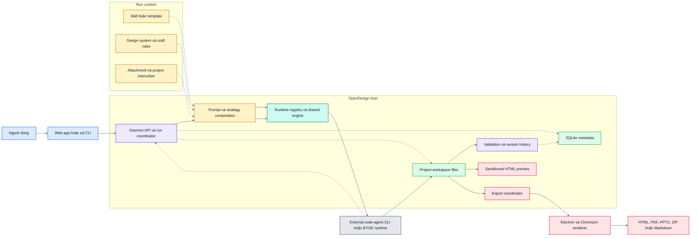
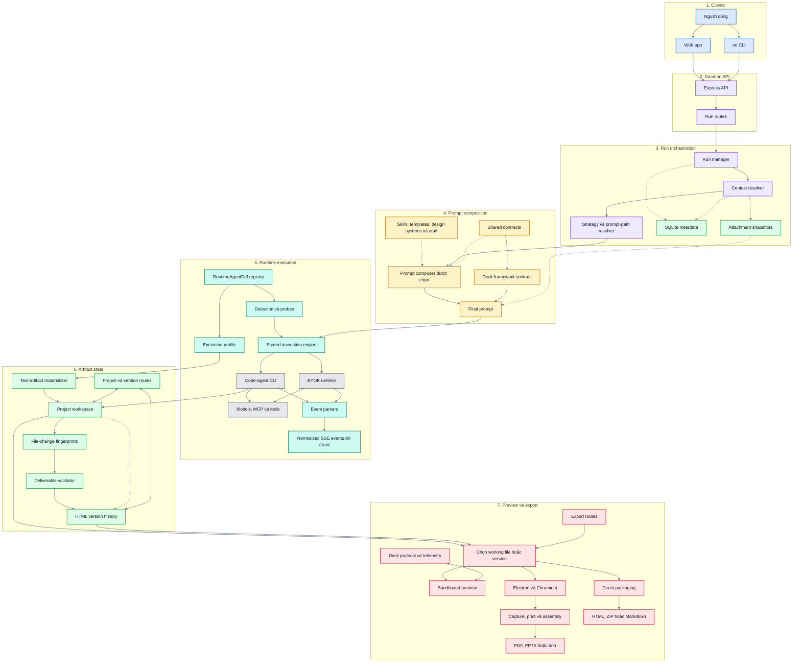

# Nghiên cứu kiến trúc OpenDesign — Bản tiếng Việt

> Đây là reader version của
> [`opendesign-architecture-research.md`](./opendesign-architecture-research.md).
> Bản tiếng Anh là nguồn chuẩn và chứa trích dẫn đầy đủ. Bản tiếng Việt giữ cùng kết luận,
> mã finding, ánh xạ RQ/AC và mức độ tin cậy.

## 1. Phạm vi và nguồn nghiên cứu

- Work: W-031 · Artifact: DOC-007 · Dùng bởi: W-033.
- System: OpenDesign.
- Repository: `https://github.com/nexu-io/open-design`.
- Phiên bản pin: tag `open-design-v0.24.0`, commit `0d3a14c1df6dc5017f3cc3ef05b24558250c220b`.
- Lưu ý phiên bản: `package.json` ở root và daemon vẫn ghi `0.23.1`; vì vậy research gắn với cả tag và commit.
- Không tìm thấy paper chính thức của OpenDesign.
- Nguồn chính: `docs/architecture.md`, `docs/agent-adapters.md`, `docs/prompt-composition.md`, `docs/modes.md`, ADR-0001, source code daemon/web/desktop/contracts, README và changelog.
- Coverage: 14/14 Core RQ và 3/3 Extended RQ đều `Answered`.

Phạm vi chính là deck workflow. Các phần prototype, media, plugin và automation chỉ được đưa vào khi chúng dùng chung boundary với deck. OpenDesign là reference evidence, không phải candidate architecture hay nguồn scope cho DeckAgent.

### 1.1 Phạm vi và phương pháp phân tích design rationale

Các cơ chế rollout của từng strategy không thuộc trọng tâm vì kém ổn định hơn các boundary về host, state, runtime và rendering. Tài liệu chỉ dùng bằng chứng strategy-specific khi đó là nguồn rõ nhất cho một RQ, và không khái quát quan sát ấy cho mọi run path.

Phần design rationale phân biệt bốn loại bằng chứng: ADR chính thức; lập luận được nói rõ trong design document; giải thích lịch sử gắn với một thay đổi; và lý do suy ra từ cấu trúc code. Repo chỉ có một ADR chính thức tại commit đã pin: `docs/adr/0001-centralize-daemon-startup.md`. Với các quyết định còn lại, tài liệu nêu rõ khi source không ghi alternatives hoặc consequences.

## 2. Kiến trúc tổng quan

### 2.1 System shape

OpenDesign là một orchestration system bao quanh các coding agent có sẵn. Web app và `od` CLI là client. Daemon là product authority: nó quản lý API, context, prompt, runtime, run lifecycle, metadata, file, version, validation và export. External agent sở hữu model/tool loop. Kết quả cuối cùng hội tụ vào project workspace chứa HTML/CSS/assets thật.

Sơ đồ trên có cùng topology với bản tiếng Anh. Nó cũng bám theo Component topology chính thức dạng ASCII trong `docs/architecture.md`; repo không có PNG/SVG/Mermaid architecture chính thức để nhúng nguyên bản.

### 2.2 Boundary và ownership

| Boundary | Sở hữu | Không sở hữu |
|---|---|---|
| Web app / `od` CLI | Interaction, request input, event display, preview controls | Business rules, durable project state, agent loop |
| Daemon | HTTP API, prompt assembly, run lifecycle, runtime selection, metadata, files, versions, validation, export coordination | Provider-specific reasoning và tool loop |
| Prompt/strategy layer | Instructions, skills, design rules, task stages, host artifact contracts | Durable state và rendering |
| Runtime registry/shared engine | Detection, launch, normalized events, cancellation, runtime capabilities | Deck content model và export format |
| External agent runtime | Model calls, tool use, context handling, file edits | OpenDesign project authority |
| Project workspace | Artifact bytes hiện tại: HTML, CSS, assets, exports | Conversation/run metadata |
| SQLite | Projects, conversations, messages, runs, sessions và metadata | Canonical artifact bytes |
| Preview/export | Render hoặc package file/version được chọn | Content generation và user intent |

### 2.3 Một prompt đi qua hệ thống như thế nào

1. Web app hoặc CLI gửi brief, project, attachment, runtime/model và workflow options tới daemon.
2. Daemon resolve project context: skill/template, design system, craft rules, project instructions, conversation context và attachment references.
3. Daemon chọn strategy và prompt-composition path phù hợp cho run.
4. Prompt layer tạo system/task prompt và thêm host contracts mà deck phải tuân theo.
5. Runtime registry chọn `RuntimeAgentDef`; shared engine launch external CLI hoặc BYOK/API runtime và dùng transport phù hợp để gửi prompt.
6. Filesystem agent sửa workspace trực tiếp. Text-only runtime trả một artifact hoàn chỉnh để host materialize vào cùng workspace.
7. Daemon stream normalized events, theo dõi file thay đổi, validate deliverable và tạo HTML history sau run thành công.
8. Preview đọc working file được chọn. Export đọc working file hoặc một HTML version cụ thể; export không gọi model để sinh lại deck.

Daemon vì vậy không chỉ là backend nhận request. Nó phối hợp prompt policy, runtime variation, workspace state, validation, preview và export.

### 2.4 Các lựa chọn kiến trúc chính

| Lựa chọn | Lý do | Alternative/pressure đã ghi nhận | Chi phí chính |
|---|---|---|---|
| Giao toàn bộ agent loop cho coding agent có sẵn | Tái sử dụng model, tool, permission, context, resume và cancel đã trưởng thành | Tự xây thêm agent loop bị bác bỏ | Behavior và safety khác nhau theo runtime |
| Dùng declarative runtime definitions với một shared engine | Thêm agent mà không copy run lifecycle | Tránh per-agent class và per-agent `run()` | Wire format mới vẫn có thể cần sửa engine |
| Đặt product authority trong daemon | Web, desktop, packaged và CLI dùng chung một business path | Browser-only và split-process designs cũ đã bị thay thế | Daemon trở thành boundary lớn và quan trọng |
| Workspace giữ artifact bytes; SQLite giữ metadata | Agent làm việc với file thường, control state vẫn query được | In-memory state và `history.jsonl` cũ đã bị thay | File và metadata không nằm trong một atomic transaction |
| Tách prompt strategy khỏi host artifact contract | Strategy có thể đổi nhưng preview/export contract phải ổn định | Deck protocol từng chỉ tới một prompt path rồi phải centralize | Một số prompt path vẫn còn duplicate |
| Dùng HTML/browser cho preview và export | Tái sử dụng browser layout và giữ artifact là HTML/CSS thật | Default agent-driven PPTX cũ được thay bằng capture/assembly | Screenshot PPTX ưu tiên visual match hơn editability |
| Centralize daemon startup | CLI daemon mode và sidecar dùng cùng start/stop path | ADR bác bỏ CLI-only lazy import và split startup | Low-level server builder vẫn là seam riêng |

### 2.5 Full Implementation Architecture

Sơ đồ này có cùng node, edge và layer với bản tiếng Anh; chỉ dịch label. Đây là implementation view được tái dựng từ official topology, docs và pinned code, không phải ảnh kiến trúc chính thức do OpenDesign phát hành.

Quy ước: xanh dương = client; tím = daemon control; vàng = prompt/contracts; xanh ngọc = runtime; xám = external; xanh lá = state/validation; hồng = preview/export. Mũi tên liền là main flow; mũi tên đứt là context/metadata; mũi tên hai chiều là read/write.

Các route project/version và export được đặt gần state mà chúng thao tác để đường nối ngắn hơn; chúng vẫn thuộc daemon HTTP API.

| Khu vực | Source chính |
|---|---|
| Web và preview | `apps/web/src/` |
| Daemon composition | `apps/daemon/src/server.ts` |
| Run API/lifecycle | `apps/daemon/src/routes/runs.ts` |
| Prompt composition | `apps/daemon/src/prompts/`, `packages/contracts/src/prompts/` và các strategy package |
| Runtime registry/engine | `apps/daemon/src/runtimes/` |
| Files và versions | Project routes, `project-file-versions.ts`, `run-html-version-snapshots.ts` |
| Validation/diff | `run-deliverable-validation.ts`, `run-artifact-fs.ts` |
| Export | `import-export-routes.ts`, `deck-export.ts`, `apps/desktop/` |

## 3. Các phát hiện chính

Mỗi finding dưới đây giữ cùng nội dung kết luận với finding tương ứng trong bản tiếng Anh. Trích dẫn code đầy đủ nằm trong bản chuẩn.

### F-OD-01 — Daemon tách transport của attachment khỏi prompt instruction

- **RQ/AC:** RQ-01 · AC-02, AC-11 · **Confidence:** Strong inference.
- **Kiến trúc:** Daemon quản lý attachment intake và snapshot references; prompt layer đánh dấu material là task data; agent được chọn vẫn có thể đọc material đó.
- **Cơ chế/kết luận:** Prompt chỉ nhận metadata/reference; bytes nằm trong managed snapshot files. User/project instructions đi qua field khác. Đây là separation về transport, không phải security boundary tuyệt đối. Model hoặc tool bên ngoài vẫn có thể nhận user content.
- **Lý do/trade-off:** Prompt nhỏ hơn và file boundary rõ hơn, nhưng safety vẫn phụ thuộc prompt rule, agent behavior và tool policy.
- **Giới hạn khi đối chiếu:** Contract này được kiểm tra trên một strategy path, chưa được chứng minh là attachment contract chung cho mọi run. OpenDesign còn cho agent/MCP quyền truy cập rộng hơn; DeckAgent có thể cần exposure boundary hẹp hơn.

### F-OD-02 — Input role được tách khỏi media type

- **RQ/AC:** RQ-02 · AC-13 · **Confidence:** Strong inference.
- **Kiến trúc:** Attachment metadata mô tả file; skill, template, design-system và plugin registries mô tả workflow role.
- **Cơ chế/kết luận:** Media facts và task configuration là contract riêng. PDF, image hoặc HTML không bị khóa vào một role chỉ vì extension.
- **Lý do/trade-off:** Role có thể thay đổi mà không sửa basic file metadata; đổi lại daemon phải resolve và validate role configuration.
- **Giới hạn khi đối chiếu:** Task-input contract được kiểm tra trên một strategy path; OpenDesign cũng hỗ trợ nhiều role hơn phạm vi V1 của DeckAgent.

### F-OD-03 — Intent được ghép từ nhiều nguồn context

- **RQ/AC:** RQ-03 · AC-04 · **Confidence:** Strong inference.
- **Kiến trúc:** Daemon compose conversation intent, current/project instructions, skill/template, design system và craft rules.
- **Cơ chế/kết luận:** Run không suy intent chỉ từ deck hiện tại. High-level intent có thể sống ngoài artifact, nhưng detailed constraints vẫn phân tán thay vì nằm trong một typed constraint model.
- **Lý do/trade-off:** Hệ thống kết hợp reusable design policy với yêu cầu theo conversation; đổi lại khó inspect một bộ active constraints hoàn chỉnh.
- **Caution cho DeckAgent:** Context của OpenDesign rộng hơn deck-only V1.

### F-OD-04 — Generation là host-orchestrated pipeline quanh external agent

- **RQ/AC:** RQ-04 · AC-01, AC-23 · **Confidence:** Explicit.
- **Kiến trúc:** Daemon resolve context và quản lý run; prompt layer đặt policy; external agent thực hiện model/tool work; workspace nhận artifact.
- **Cơ chế/kết luận:** Filesystem profile và text-artifact profile cùng hội tụ về project-file boundary. Stable path là `request → context/prompt → runtime → workspace → validation → preview/export`.
- **Lý do/trade-off:** OpenDesign tích hợp agent trưởng thành thay vì tự sở hữu agent loop; đổi lại tool, permission và recovery behavior khác nhau theo runtime.
- **Caution cho DeckAgent:** OpenDesign là multi-artifact platform; DeckAgent có thể dùng pipeline hẹp hơn.

### F-OD-05 — Provenance ở cấp file/version, không ở content fragment

- **RQ/AC:** RQ-05 · AC-03, AC-16 · **Confidence:** Strong inference.
- **Kiến trúc:** Version history lưu file-level origin, prompt, parent/digest; successful run có thể snapshot HTML đã thay đổi.
- **Cơ chế/kết luận:** Hệ thống có thể biết run nào tạo một file version, nhưng không biết từng câu/claim là source-derived, user-provided hay generated.
- **Lý do/trade-off:** File-level history hợp với code workspace và đơn giản hơn; đổi lại detailed content provenance mất sau edit.
- **Caution cho DeckAgent:** Source-grounding của DeckAgent chặt hơn general artifact history này.

### F-OD-06 — Workspace giữ working artifact; SQLite giữ supporting state

- **RQ/AC:** RQ-06 · AC-05, AC-15, AC-30 · **Confidence:** Strong inference.
- **Kiến trúc:** Workspace giữ artifact bytes; SQLite giữ project, conversation, message, run và metadata. Preview/export đọc working file hoặc explicit HTML version.
- **Cơ chế/kết luận:** Managed project tồn tại qua reload/restart cho tới khi bị xóa; đây không phải session-only model. Unpinned export có thể đọc live file đã thay đổi.
- **Lý do/trade-off:** File thường hợp với coding agents, SQLite hợp với control state; đổi lại consistency giữa file và metadata cần coordination.
- **Caution cho DeckAgent:** DeckAgent V1 là session-only, khác lifecycle của OpenDesign.

### F-OD-07 — Version history hỗ trợ restore nhưng không có pending-version gate

- **RQ/AC:** RQ-07 · AC-06, AC-07, AC-17, AC-29 · **Confidence:** Strong inference.
- **Kiến trúc:** Agent thay working file trực tiếp; successful physical run có thể snapshot HTML đã chạm; history cho phép restore từng file sau đó.
- **Cơ chế/kết luận:** OpenDesign không có transition tương đương commit boundary của DeckAgent vì không có pending/accepted lifecycle. Nếu request N+1 đến khi kết quả N đang được review, N không được promote tại lúc request đến, lúc confirm hay lúc processing bắt đầu: live workspace đã là working authority, và N+1 đọc các bytes đang tồn tại khi runtime truy cập project. HTML snapshot là history, không phải promotion. Restore ghi version cũ trở lại live file và tạo một restore version mới. Version store trả mọi manifest entry và không thấy fixed retention count trong source đã kiểm tra. Restore artifact không restore request intent; xem F-OD-14.
- **Lý do/trade-off:** Direct file edit đơn giản cho agent workflow; đổi lại không có review isolation hoặc commit event, còn reject chỉ là per-file restore sau mutation và không bao phủ conversation intent.
- **Caution cho DeckAgent:** Không được xem history/restore này như accepted/pending lifecycle.

### F-OD-08 — Refinement chọn Direct Edit hoặc Full Plan

- **RQ/AC:** RQ-08 · AC-01, AC-04, AC-27 · **Confidence:** Explicit.
- **Kiến trúc:** Strategy resolver phân loại phạm vi; agent vẫn sửa workspace.
- **Cơ chế/kết luận:** Request rõ và bounded dùng Direct Edit; request rộng hoặc không chắc dùng Full Plan. Scope routing là planning choice, không phải slide-patch representation.
- **Lý do/trade-off:** Small edit nhanh hơn, nhưng correctness vẫn phụ thuộc agent giữ scope và validation phía sau.
- **Giới hạn khi đối chiếu:** Direct Edit là policy của một strategy, không phải behavior đã được chứng minh cho mọi run. OpenDesign còn có local/object editing rộng hơn deck-level refinement của V1.

### F-OD-09 — Completion validation kiểm tra integrity, không kiểm tra presentation quality

- **RQ/AC:** RQ-09 · AC-06, AC-10 · **Confidence:** Strong inference.
- **Kiến trúc:** Daemon kiểm tra run status, expected entry, changed path, artifact kind và readability sau run. Preview có thể thấy file thay đổi khi run còn chạy.
- **Cơ chế/kết luận:** Validation phân loại completion evidence nhưng không sở hữu transaction hoặc rollback. Nếu deliverable validation trả invalid, workspace changes vẫn được giữ. Trên physically successful run, HTML đã chạm vẫn có thể được snapshot vào history vì snapshot call không phụ thuộc `deliverable.valid`; strategy-level completion tương ứng bị reject là invalid. Với model/tool failure hoặc cancellation trước success finalization, success snapshot không được tạo nhưng partial file writes vẫn có thể còn lại; xem F-OD-14.
- **Lý do/trade-off:** Check rẻ và observable, nhưng completion classification tách khỏi recovery: invalid output có thể vẫn live và đi vào history; quality sâu hơn cần stage khác.
- **Caution cho DeckAgent:** OpenDesign không có pending-version promotion point.

### F-OD-10 — Quality evidence nằm ở nhiều stage

- **RQ/AC:** RQ-10 · AC-14, AC-18, AC-25 · **Confidence:** Strong inference.
- **Kiến trúc:** Source lint kiểm tra HTML; preview báo runtime/geometry; Chromium tạo rendered view; optional audit kiểm tra PPTX fidelity.
- **Cơ chế/kết luận:** Không stage nào sở hữu toàn bộ content và visual quality. Một số lỗi bắt buộc cần rendered evidence.
- **Lý do/trade-off:** Layered checks giảm chi phí iteration; đổi lại evidence bị phân mảnh và optional audit có thể không chạy.
- **Caution cho DeckAgent:** Checks của OpenDesign phục vụ nhiều artifact type, không chỉ deck.

### F-OD-11 — Preview và export render stored HTML, không regenerate content

- **RQ/AC:** RQ-11 · AC-01, AC-05, AC-09, AC-15, AC-29, AC-30 · **Confidence:** Strong inference.
- **Kiến trúc:** Preview render project file; export resolve working file hoặc explicit HTML version rồi gọi desktop renderer.
- **Cơ chế/kết luận:** Version-pinned export gắn với stored bytes. Unpinned export phụ thuộc live file không đổi giữa review và export. Export không đổi source version. Route stream file rồi xóa scratch files; không tạo durable export record gắn với version/format.
- **Lý do/trade-off:** Có thể retry export mà không gọi model, nhưng phụ thuộc Chromium và behavior giữa capture/print modes.
- **Caution cho DeckAgent:** OpenDesign không dùng accepted/pending promotion rules của DeckAgent.

### F-OD-12 — Output formats dùng chung HTML source nhưng không dùng một universal exporter

- **RQ/AC:** RQ-12 · AC-26 · **Confidence:** Strong inference.
- **Kiến trúc:** Export coordinator chọn format; browser/Electron render PDF/capture; module riêng package PPTX, ZIP, Markdown hoặc editable output.
- **Cơ chế/kết luận:** Format dùng chung upstream artifact selection và một phần rendering, sau đó branch theo nhu cầu format.
- **Lý do/trade-off:** Reuse tăng visual consistency và giảm duplication; shared renderer cũng là common failure point.
- **Caution cho DeckAgent:** V1 chỉ yêu cầu PPTX và PDF.

### F-OD-13 — Normal export không tạo durable fidelity report

- **RQ/AC:** RQ-13 · AC-19 · **Confidence:** Strong inference.
- **Kiến trúc:** Default screenshot PPTX đặt một slide image trên mỗi page; HTML↔PPTX audit là workflow riêng.
- **Cơ chế/kết luận:** OpenDesign chủ yếu giảm visual drift ở screenshot path, không tự đo và lưu degradation cho mọi export.
- **Lý do/trade-off:** Image-backed slide giữ browser appearance, nhưng PPTX editability và later compatibility analysis yếu hơn.
- **Caution cho DeckAgent:** Không thể mặc định image-only PPTX là chấp nhận được.

### F-OD-14 — Recovery bảo vệ operation nhiều hơn workspace

- **RQ/AC:** RQ-14 · AC-08, AC-09, AC-20, AC-28 · **Confidence:** Strong inference.
- **Kiến trúc:** Run manager sở hữu status, cancel, process termination, events và retry policy; workspace vẫn là mutation target. Conversation messages và conversation-level intent signals là durable state riêng.
- **Cơ chế/kết luận:** Retry bị chặn sau side effect. Filesystem baseline chỉ lưu fingerprint, không lưu bytes để rollback. Task-oriented run route dùng revision check khi cancel và completion race; ordinary chat có thể overlap ngắn khi “send now” đang cancel run cũ. Request được persist thành user message trước execution; các deck/media/platform intent signal được latch đơn điệu khi build prompt. Vì vậy failed/stopped request không rollback cùng artifact: user message vẫn nằm trong conversation và các coarse intent signal đã phát hiện vẫn ảnh hưởng các run sau. Project instructions là state riêng và không bị run path thay đổi. Source không cho phép xác định một rule chung rằng mọi arbitrary goal/constraint của failed/stopped request còn active hay inactive ở run kế tiếp; ảnh hưởng của chúng phụ thuộc conversation/session prompt composition. Đây là evidence gap, không phải suy luận rằng mọi constraint đều tồn tại.
- **Lý do/trade-off:** Hệ thống giảm duplicate side effect và giữ conversational traceability; đổi lại failure/stop không đưa artifact bytes và toàn bộ intent-related state về cùng một pre-run boundary.
- **Giới hạn khi đối chiếu:** OpenDesign cho phép direct file mutation và giữ conversation state qua terminal outcomes; DeckAgent có thể cần một rollback boundary rõ cho cả candidate artifact và request-specific constraints.

### F-OD-15 — Code và agent conversation là editing surface chính

- **RQ/AC:** RQ-15 · AC-12 · **Confidence:** Explicit.
- **Kiến trúc:** Agent sửa HTML/CSS; OpenDesign cung cấp chat, preview, comments và một số focused edit tools; external tools nhận exported result.
- **Cơ chế/kết luận:** Real code files là editable medium, không phải native slide-object canvas. Core flow không bắt buộc PowerPoint object editing.
- **Lý do/trade-off:** Không phải xây full slide editor; đổi lại nontechnical users phụ thuộc language-based iteration và runtime quality.
- **Caution cho DeckAgent:** Screenshot-backed PPTX ít editable hơn native-object deck.

### F-OD-16 — Runtime variation và rendering variation được tách ở hai seam

- **RQ/AC:** RQ-16 · AC-21, AC-22 · **Confidence:** Explicit cho adapter choice; strong inference cho failure spread.
- **Kiến trúc:** `RuntimeAgentDef` cô lập launch/stream differences; Electron/Chromium cô lập rendering; format libraries cô lập binary packaging.
- **Cơ chế/kết luận:** Declarative adapter được shared engine đọc; provider change và renderer change có impact area khác nhau. Nhiều export path dùng chung Chromium nên renderer failure có thể ảnh hưởng nhiều format.
- **Lý do/trade-off:** Dễ thêm runtime và format seam; đổi lại phụ thuộc external CLIs, Node/Electron, native SQLite và packaging.
- **Caution cho DeckAgent:** OpenDesign hỗ trợ nhiều agent/artifact hơn nhu cầu V1.

### F-OD-17 — OpenDesign đã thay nhiều boundary ban đầu khi sản phẩm lớn lên

- **RQ/AC:** RQ-17 · AC-23, AC-24 · **Confidence:** Strong inference.
- **Kiến trúc:** HTTP/SSE, SQLite, request-time registries, packaged sidecars, BYOK proxy và file workspace thay browser-only, WebSocket, in-memory state và `history.jsonl` cũ.
- **Cơ chế/kết luận:** Deck host contract được chuyển vào shared prompt code; default agent-driven PPTX được thay bằng repeatable render/capture. Transport, persistence, runtime, prompt policy và export là các seam có thể thay, nhưng một số migration chạm nhiều layer.
- **Lý do/trade-off:** Kiến trúc mới hỗ trợ durable state, shared contracts và nhiều runtime shape hơn; đổi lại system lớn hơn và có nhiều coordination point. Source không có đầy đủ migration-cost data.
- **Caution cho DeckAgent:** Các pressure này đến từ platform scope rộng của OpenDesign, không quyết định kiến trúc DeckAgent.

## 4. ADR và design rationale

### 4.1 Design rationale được ghi lại như thế nào

OpenDesign không có một bộ ADR bao quát toàn bộ kiến trúc. Tại commit đã pin, design rationale phân tán trong bốn dạng bằng chứng:

| Dạng bằng chứng | Có thể xác lập | Giới hạn |
|---|---|---|
| ADR đã được chấp nhận | Context, decision, alternatives và consequences | Chỉ có một quyết định kiến trúc được ghi theo dạng này |
| Design document | Thesis, ownership rule hoặc implementation constraint được nói rõ | Thường mô tả lựa chọn hiện tại nhưng không phân tích đầy đủ alternatives |
| Change history và retrospective note | Pressure làm boundary thay đổi và phạm vi của corrective work | Số file hoặc dòng thay đổi không đo chính xác engineering cost |
| Suy luận từ code | Responsibility split đang tồn tại trong implementation | Không chứng minh được ý định của tác giả nếu không có nguồn giải thích “why” |

Vì vậy, một boundary đã tồn tại trong code chưa tự động trở thành documented rationale. Phần dưới chỉ gọi một lý do là “explicit” khi source nêu vấn đề hoặc nguyên nhân; các trường hợp khác được ghi là partial hoặc inferred.

### 4.2 ADR chính thức: centralize daemon startup

`ADR-0001: Centralize daemon startup` có status Accepted. Đây là rationale record mạnh nhất trong repo vì nối một failure mechanism cụ thể với ownership, alternatives và consequences.

- Vấn đề: client-only CLI command từng evaluate daemon startup globals; CLI và sidecar có startup behavior tách đôi.
- Quyết định: một startup orchestrator dùng chung sở hữu CLI parsing, server startup, shutdown, optional browser opening và signal handling.
- Alternative bị bác bỏ: CLI-only lazy import chỉ sửa symptom; để sidecar gọi `startServer` trực tiếp vẫn giữ split ownership.
- Phương án mạnh hơn nhưng defer: tách toàn bộ runtime context khỏi `server.ts` vì lớn hơn nhu cầu hiện tại.
- Hệ quả: client-only command không còn evaluate daemon startup checks; CLI và sidecar dùng chung start/stop mechanics; route test vẫn dùng được low-level server constructor.
- Diễn giải kiến trúc: lifecycle ownership được gom sau một entry point nhưng seam xây dựng server cấp thấp vẫn được giữ cho test.

### 4.3 Rationale của agent boundary

`docs/agent-adapters.md` gọi việc giao toàn bộ agent loop cho coding-agent CLI là design decision quan trọng nhất. Vấn đề cần tránh là tái triển khai model call, tool use, permission, context management, resume và cancel dù các coding agent trưởng thành đã có các khả năng đó. Vì vậy OpenDesign sở hữu detection, prompt/working-directory handoff, normalized streaming và product state; runtime được chọn sở hữu agent loop.

Quyết định dùng `RuntimeAgentDef` dạng data object cũng đi từ boundary này. Một shared engine đọc definition thay vì mỗi agent có subclass với `run()` và `cancel()` riêng. Lợi ích là extension surface nhỏ đối với transport đã hỗ trợ; chi phí là wire format thực sự mới vẫn cần sửa engine/parser, còn permission và recovery semantics không đồng nhất giữa các runtime.

Bằng chứng: `docs/agent-adapters.md#L5-L27`, `#L69-L100`. Mức rationale: **explicit**.

### 4.4 Rationale của daemon authority và split persistence

`docs/architecture.md` đặt product authority trong daemon và xác định web app cùng CLI gọi chung HTTP API thay vì có hai implementation của business logic. Tài liệu này cũng ghi rằng HTTP/SSE, SQLite-backed daemon, request-time registries, packaged sidecars và BYOK proxy đã thay các phác thảo browser-only, WebSocket, in-memory state và `history.jsonl` ban đầu.

Persistence split phù hợp với agent boundary: project files là medium mà coding agent có thể đọc/sửa, còn SQLite giữ project, conversation, message, run và control state có thể query. Lợi ích là tương thích với file-oriented tools và vẫn có durable metadata. Chi phí là filesystem mutation và metadata transition không nằm trong một atomic transaction, thể hiện rõ ở recovery và versioning.

Source xác lập ownership hiện tại và các shape cũ đã bị thay, nhưng không có decision record so sánh transaction model hoặc giải thích vì sao SSE được chọn thay WebSocket. Phần rationale này là **strong inference**, không phải explicit argument đầy đủ.

### 4.5 Rationale của việc centralize host contract

Case ngoài ADR rõ nhất là deck protocol. Một thay đổi đầu tiên đưa versioned navigation protocol vào daemon và contract prompt copies nhưng bỏ sót một prompt-composition path đang chạy. Test vẫn xanh vì input của test không đi qua path đó. Thay đổi sửa lỗi sau đó chuyển deck scaffold vào `packages/contracts` để mọi composer dùng cùng một host-owned contract.

Lịch sử này giải thích seam tốt hơn static component diagram. Navigation markup, ready event, slide-state message và print behavior không phải style preference trong prompt; product code trực tiếp consume chúng. Vì thế chúng thuộc host contract và phải tồn tại độc lập với từng prompting strategy. Alternative là copy contract vào mỗi prompt path đã tạo behavioral drift. Corrective work chạm nhiều file hơn thay đổi đầu, nhưng repo không có effort data; file count chỉ cho thấy change spread, không phải cost chính xác.

Bằng chứng: `docs/prompt-composition.md#L82-L121`, `#L123-L175`. Mức rationale: **explicit**; migration cost chỉ quan sát được một phần.

### 4.6 Rationale của HTML-first rendering và export

Preview và các deck export path chính consume stored HTML. Rendering vì vậy nằm downstream của generation: export có thể retry mà không gọi model sinh lại deck, còn screenshot-backed PPTX giữ được visual result của browser. Sau bước rendering, format-specific code vẫn tách nhánh vì PDF printing, image capture, PPTX assembly và editable conversion có contract khác nhau.

Implementation và release history cho thấy deterministic capture đã thay default agent-driven PPTX route cũ, nhưng không có ADR phân tích alternatives. Repeatability và giảm visual drift là lý do được code/data flow hỗ trợ mạnh nhưng vẫn chỉ được ghi một phần. Chi phí kiến trúc là screenshot PPTX đổi native slide-object editability để lấy visual fidelity; đồng thời các format browser-backed cùng phụ thuộc Chromium.

Bằng chứng: `apps/daemon/src/import-export-routes.ts#L951-L989`, `#L1074-L1177`; `apps/daemon/src/deck-export.ts#L146-L218`; commit `9534b87e7`. Mức rationale: **strong inference**.

### 4.7 Những khoảng trống của rationale

Repo giải thích tương đối rõ hai seam sâu nhất: external-agent boundary và centralized host contract. Tuy nhiên, không tìm thấy formal alternatives analysis cho file/SQLite split, HTTP/SSE, live workspace mutation, per-file HTML versioning hoặc việc không có export provenance record. Đây là observed design properties, không phải recommendation đã được chứng minh.

Một người đọc tương lai phải ghép ADR, architecture notes, prompt-maintenance guide, code comments và history để khôi phục reasoning của hệ thống hiện tại. Nội dung đủ hữu ích cho nghiên cứu, nhưng sự phân tán này làm traceability giữa decision, enforcing code và protective tests yếu hơn.

## 5. State model và giới hạn so sánh

### 5.1 State model

| State | Nằm ở đâu | Ai thay đổi | Ai đọc | Giới hạn quan trọng |
|---|---|---|---|---|
| User/project intent | SQLite messages/project metadata + prompt inputs | UI, CLI, daemon | Prompt composition | Không có một typed record chứa mọi active constraint |
| Current artifact | Project workspace | Agent runtime hoặc host materialization | Preview, export, later runs | Có thể đổi trong khi run đang chạy |
| HTML history | Version store | Daemon sau run/edit/restore | Restore và version-pinned export | Per-file history, không phải whole-project transaction |
| Run state | SQLite + in-memory process control | Run manager | UI/CLI qua HTTP/SSE | Determinate status không đồng nghĩa file đã rollback |
| Rendered output | Export destination | Export coordinator + renderer | User/external application | Normal export không lưu full fidelity report |

### 5.2 Giới hạn cần nhớ khi so sánh với DeckAgent

- OpenDesign không có accepted deck và pending deck tách biệt.
- Project của OpenDesign là durable, không phải session-only lifecycle.
- Canonical editable form là code files, không phải native presentation object model.
- Agent loop được delegate nên capability và safety khác nhau theo runtime.
- Prompt composition có nhiều implementation path; một số host contract đã centralize, nhưng prompt content khác vẫn duplicate.
- Screenshot PPTX ưu tiên visual similarity, không ưu tiên native object editability.

Đây là observation về OpenDesign, không phải proposal hoặc verdict cho DeckAgent.

## 6. Coverage RQ

| RQ | Priority | Status | Finding |
|---|---|---|---|
| RQ-01 | Core | Answered | F-OD-01 |
| RQ-02 | Core | Answered | F-OD-02 |
| RQ-03 | Core | Answered | F-OD-03 |
| RQ-04 | Core | Answered | F-OD-04 |
| RQ-05 | Core | Answered | F-OD-05 |
| RQ-06 | Core | Answered | F-OD-06 |
| RQ-07 | Core | Answered | F-OD-07 |
| RQ-08 | Core | Answered | F-OD-08 |
| RQ-09 | Core | Answered | F-OD-09 |
| RQ-10 | Core | Answered | F-OD-10 |
| RQ-11 | Core | Answered | F-OD-11 |
| RQ-12 | Extended | Answered | F-OD-12 |
| RQ-13 | Core | Answered | F-OD-13 |
| RQ-14 | Core | Answered | F-OD-14 |
| RQ-15 | Extended | Answered | F-OD-15 |
| RQ-16 | Core | Answered | F-OD-16 |
| RQ-17 | Extended | Answered | F-OD-17 |
