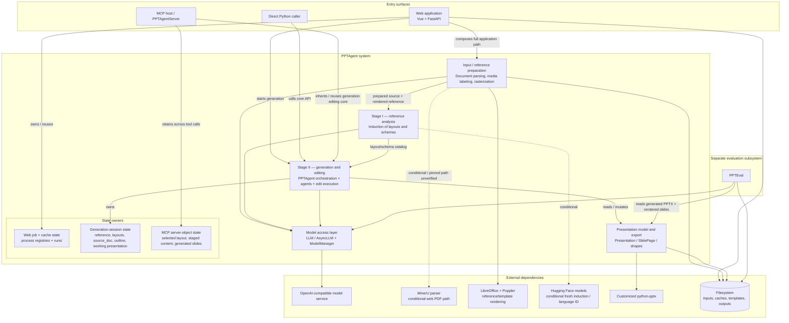
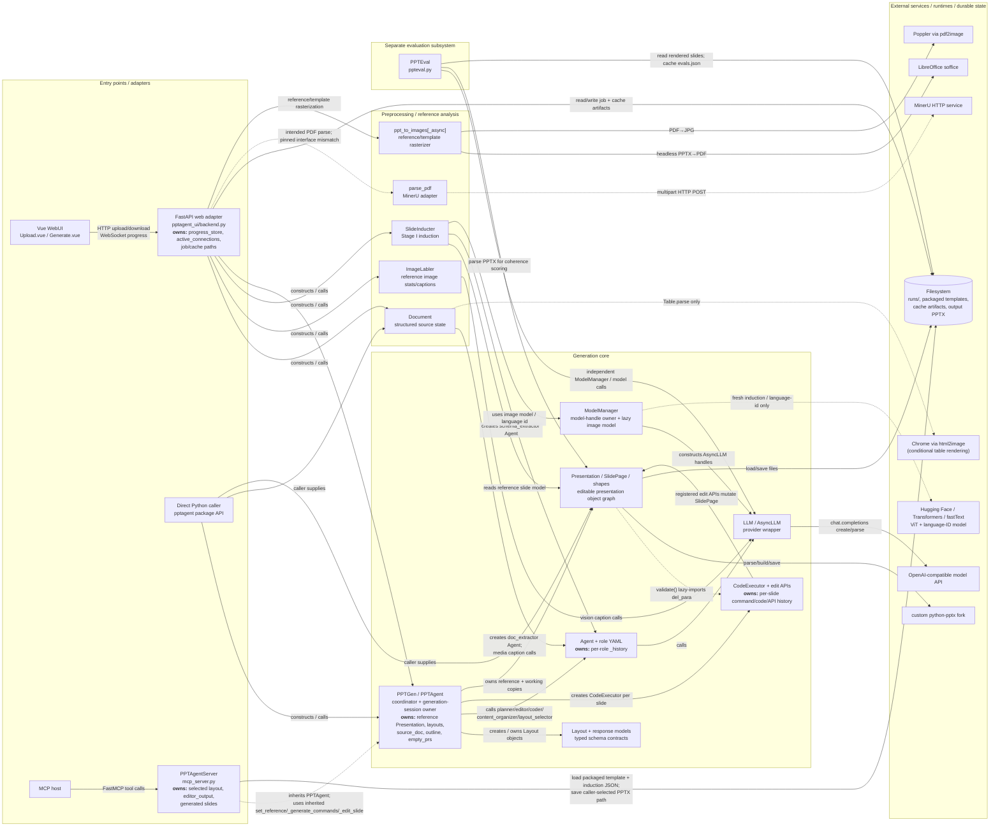

# PPTAgent Architecture Research (DOC-006)

- Status: Ready for review — research content complete for the pinned version and aligned 2026-09-30 to DOC-004 AC-01 … AC-30 and the widened DOC-005 RQs; pinned-runtime caveats remain as recorded
- Produced by: W-030 · Used by: W-033
- Contract: [DOC-005 Reference-System Research Contract](../reference-system-research-contract.md)
- Criteria: [DOC-004 Architecture Acceptance Criteria](../../architecture/architecture-acceptance-criteria.md)

## 1. Header

- System: PPTAgent
- Researcher: W-030 research owner (personal name not provided in the available project sources; fill if the repository workflow requires a human name)
- Research dates: `2026-09-28 … 2026-09-30`

Versions used (DOC-005 §5.2):

- Repository: `https://github.com/icip-cas/PPTAgent` @ tag `v0.2.0`, commit `d53296bc0ddd73e81d51c523d20dd711c7f233f3` (accessed 2026-09-28)
- Paper: published EMNLP 2025 version, ACL Anthology `2025.emnlp-main.728`, DOI `10.18653/v1/2025.emnlp-main.728` (the published version corresponding to arXiv 2501.03936; accessed 2026-09-28)
- Docs: repository `README.md` at `v0.2.0`, `https://github.com/icip-cas/PPTAgent/blob/v0.2.0/README.md` (accessed 2026-09-28); `DOC.md` at `v0.2.0`, `https://github.com/icip-cas/PPTAgent/blob/v0.2.0/DOC.md` (accessed 2026-09-28); `BESTPRACTICE.md` at `v0.2.0`, `https://github.com/icip-cas/PPTAgent/blob/v0.2.0/BESTPRACTICE.md` (accessed 2026-09-28); official release record for `v0.2.0`, `https://github.com/icip-cas/PPTAgent/releases/tag/v0.2.0` (accessed 2026-09-28)
- Historical version used, and why: `v0.2.0` is intentionally used instead of the current `main` branch. The current official repository explicitly directs readers reproducing/studying the PPTAgent (EMNLP 2025) system to the pinned `v0.2.0` code, while later repository history incorporates DeepPresenter and newer runtime/skill architecture. Pinning `v0.2.0` keeps code and versioned repository documentation aligned with the PPTAgent paper being studied.

Sources consulted, in priority order (DOC-005 §5.1):

1. Official PPTAgent repository at tag `v0.2.0` / commit `d53296bc0ddd73e81d51c523d20dd711c7f233f3`, including versioned `README.md`, `DOC.md`, and `BESTPRACTICE.md` (accessed 2026-09-28).
2. Published paper: Hao Zheng et al., “PPTAgent: Generating and Evaluating Presentations Beyond Text-to-Slides,” EMNLP 2025, ACL Anthology `2025.emnlp-main.728`, `https://aclanthology.org/2025.emnlp-main.728/` (accessed 2026-09-28).
3. arXiv record `2501.03936`, `https://arxiv.org/abs/2501.03936` (accessed 2026-09-28), retained to trace the contract's named paper identifier; architecture claims will be checked against the published paper and pinned code/docs rather than treating prior research notes as primary evidence.

Contract alignment update (2026-09-30): DOC-005 widened RQ-06, RQ-07, RQ-09, RQ-11, and RQ-14 after DOC-004 added/strengthened the accepted/pending version lifecycle, stop semantics, session-loss state, validation observability, and D-030 commit-boundary recovery. Existing finding IDs were retained. F-PPT-18 and F-PPT-19 add session/export-outcome and stop/concurrency coverage; F-PPT-20 closes the request-derived state lifecycle question after failure. F-PPT-09 now states the post-hoc PPTEval recovery semantics explicitly. Section 4 keeps the reference-system decision reconstruction evidence-only; comparison alternatives from the earlier working draft are preserved separately in §4.2 and explicitly labelled `Researcher-derived comparison hypothesis — not PPTAgent evidence` for W-033 handoff.

## 2. Findings

### 2.1 Input & source

Research questions: RQ-01, RQ-02

### F-PPT-01 — The WebUI backend is the full-system composition root and owns job/cached artifact state

- Research questions: RQ-01, RQ-02, RQ-04, RQ-06, RQ-11, RQ-14, RQ-16
- Problem addressed: Connect uploaded source/reference files, preprocessing, Stage I reference analysis, Stage II generation, progress reporting, and final download into one runnable application.
- Responsibility / boundary: `pptagent_ui/backend.py` is an application-layer orchestrator above the reusable `pptagent` package. The Vue frontend only uploads files, watches task progress, and downloads the result; the backend instantiates/uses `Presentation`, `ImageLabler`, PDF parsing, `Document`, `SlideInducter`, and `PPTAgent`.
- Decision / mechanism: The backend keeps short-lived task coordination in process (`progress_store`, `active_connections`) while writing inputs, caches, intermediate analysis, and final PPTX under `runs/`. Uploaded PPTX/PDF inputs are cached by MD5; a task has its own run directory and `task.json`; reference analysis and document parsing are reused from `image_stats.json`, `slide_induction.json`, `source.md`, and `refined_doc.json` when present.
- Source says: FastAPI owns model startup checking plus in-memory task/WebSocket registries — `repo@d53296bc0ddd73e81d51c523d20dd711c7f233f3:pptagent_ui/backend.py#L46-L66`. Upload creates task and content-addressed PPTX/PDF directories, then starts `ppt_gen` asynchronously — `repo@d53296bc0ddd73e81d51c523d20dd711c7f233f3:pptagent_ui/backend.py#L105-L142`. `ppt_gen` constructs per-task/reference `Config` directories — `repo@d53296bc0ddd73e81d51c523d20dd711c7f233f3:pptagent_ui/backend.py#L199-L226` — and explicitly composes parse/caption/document/induction/generation components, caching their artifacts before saving `final.pptx` — `repo@d53296bc0ddd73e81d51c523d20dd711c7f233f3:pptagent_ui/backend.py#L232-L369`. The Vue upload component only posts multipart input and retains the returned task id — `repo@d53296bc0ddd73e81d51c523d20dd711c7f233f3:pptagent_ui/src/components/Upload.vue#L60-L96`; the generation view uses a WebSocket for status and `/api/download` for the PPTX — `repo@d53296bc0ddd73e81d51c523d20dd711c7f233f3:pptagent_ui/src/components/Generate.vue#L33-L61`.
- Inference: The web application's authoritative workflow state is split by lifetime: transient job coordination is process memory; reusable preprocessing/analysis and final artifacts are filesystem state; the core `PPTAgent` object exists only inside one running `ppt_gen` task. The frontend is not a presentation-state owner.
- Rationale: The repository docs present the backend and Vue frontend as the local WebUI path and point programmatic generation back to `backend.py:ppt_gen` (`DOC.md#L154-L186`). Reuse of MD5-keyed caches appears implementation-driven rather than described in the paper.
- Trade-off: Reusing expensive parse/analysis artifacts across tasks reduces repeated model/rendering work, but the application layer becomes responsible for cache layout, process-local coordination, and cleanup.
- DeckAgent implication / relevance: AC-05, AC-08, AC-11, AC-15, AC-20, AC-22, AC-30 — this is evidence about where a reference system places orchestration, artifact state, external boundaries, failure reporting, and session/job state; it is not a claim that DeckAgent should copy this layout.
- Mismatch / caution: The paper describes the algorithmic two-stage framework, not this web job/caching architecture. The web path is PDF-content + PPTX-reference oriented and exports PPTX only, unlike DeckAgent's V1 input/output boundary. Its task/filesystem state is also not a DeckAgent accepted/pending version or export-outcome ledger; that widened RQ-06/RQ-11 coverage is recorded explicitly in F-PPT-18.
- Confidence: Strong inference — the ownership split is visible directly in the pinned backend/frontend code.

### F-PPT-02 — Input roles are adapter-defined rather than represented as a general role abstraction

- Research questions: RQ-01, RQ-02
- Problem addressed: Route content and reference material into the correct preprocessing path.
- Responsibility / boundary: In the WebUI adapter, a PPTX is treated as the reference/template source and a PDF as the content source. In the MCP adapter, packaged templates are reference presentations and slide content is supplied explicitly by the MCP client.
- Decision / mechanism: Role is implicit in entry-point parameters and storage paths, not represented by a reusable `Input(role=...)` domain object.
- Source says: The upload endpoint has separate `pptxFile` and `pdfFile` parameters and stores them under `runs/pptx/<md5>/source.pptx` and `runs/pdf/<md5>/source.pdf` — `repo@d53296bc0ddd73e81d51c523d20dd711c7f233f3:pptagent_ui/backend.py#L105-L138`. The MCP `set_template` tool loads a packaged `source.pptx` plus precomputed induction artifacts — `repo@d53296bc0ddd73e81d51c523d20dd711c7f233f3:pptagent/mcp_server.py#L99-L132`.
- Inference: The semantic role is determined by the adapter path, but in the WebUI it is effectively tied to file kind by separate parameters and directories. MCP demonstrates that the core generation classes themselves do not require the web adapter's PDF/PPTX role pairing.
- Rationale: Not stated in the paper; the paper assumes one input document and one reference presentation when formulating the task.
- Trade-off: Simple adapter wiring avoids a role model, while alternative roles require new adapter paths or calls.
- DeckAgent implication / relevance: AC-02, AC-11, AC-13 — evidence about where PPTAgent binds source/reference semantics.
- Mismatch / caution: DeckAgent first V1 explicitly keeps extension and role conceptually separate; PPTAgent's WebUI should not be read as a general file-role architecture.
- Confidence: Strong inference.

### 2.2 Intent

Research questions: RQ-03

### F-PPT-03 — Generation intent is transient session state owned by `PPTGen`, not a separate durable intent model

- Research questions: RQ-03, RQ-06
- Problem addressed: Carry requested slide count, selected document content, destination language, outline, and derived length policy through generation.
- Responsibility / boundary: `PPTGen/PPTAgent` becomes the owner after `set_reference` and `generate_pres` are called.
- Decision / mechanism: Reference-derived state (`presentation`, `reference_lang`, functional layouts, `Layout` objects, an `empty_prs` copy) is installed by `set_reference`; source-document and generated-plan state (`source_doc`, `outline`, `simple_outline`, destination language/length factor) is stored on the same object during `generate_pres`.
- Source says: `set_reference` installs the parsed `Presentation`, consumes language/functional keys from the induction dict, creates `Layout` objects, and deep-copies the reference presentation — `repo@d53296bc0ddd73e81d51c523d20dd711c7f233f3:pptagent/pptgen.py#L90-L138`. `generate_pres` stores `source_doc`, derives language/length state, generates/stores the outline and simple outline, and later resets `empty_prs` to a fresh reference copy — `repo@d53296bc0ddd73e81d51c523d20dd711c7f233f3:pptagent/pptgen.py#L140-L237`.
- Inference: There is no independent long-lived intent/constraint object in v0.2.0. The generation object itself is the session aggregate for both reference context and request-derived planning state.
- Rationale: The paper states that PPTAgent plans a structured outline containing purpose, reference slide, and document content source before slide generation (EMNLP 2025 §2.3, pp. 14404–14405). It does not specify software ownership or persistence.
- Trade-off: Co-locating this state simplifies orchestration calls but couples repeated generation behavior to mutable object state.
- DeckAgent implication / relevance: AC-04, AC-05, AC-17, AC-29, AC-30 — evidence about one reference system's intent/state lifetime, without a claim that it implements DeckAgent's accepted/pending version lifecycle or session-loss accounting.
- Mismatch / caution: PPTAgent has no deck-level follow-up refinement loop comparable to DeckAgent V1, so this state is generation-session state, not a demonstrated accepted/pending version, commit-boundary, recovery-baseline, or session-loss state model.
- Confidence: Strong inference.

### 2.3 Generation & provenance

Research questions: RQ-04, RQ-05

### F-PPT-04 — Stage I is an analysis service that emits a serializable layout/schema catalog consumed by Stage II

- Research questions: RQ-04, RQ-06, RQ-16
- Problem addressed: Convert an arbitrary reference presentation into a reusable set of functional/layout categories and content schemas.
- Responsibility / boundary: `SlideInducter` owns the analysis operation; `Presentation` supplies parsed slide structure; rendered slide images plus local embeddings/vision calls supply visual grouping; `schema_extractor` converts a representative slide's HTML into element schema. The output is a plain dictionary, not a live reference to the analyzer.
- Decision / mechanism: Functional slides are identified from full-presentation text with the language model. Remaining slides are grouped by PowerPoint layout/content type and image-embedding similarity; a representative slide is selected per cluster, named by the vision model, then content schemas are extracted from its HTML.
- Source says: `SlideInducter` is explicitly Stage I and owns the reference presentation, rendered folders, model handles, and `schema_extractor` — `repo@d53296bc0ddd73e81d51c523d20dd711c7f233f3:pptagent/induct.py#L37-L93`. Category/layout induction is implemented in `category_split`, `layout_split`, and `layout_induct` — `repo@d53296bc0ddd73e81d51c523d20dd711c7f233f3:pptagent/induct.py#L95-L174`; schema extraction passes `slide.to_html()` to the agent and returns the enriched induction dictionary — `repo@d53296bc0ddd73e81d51c523d20dd711c7f233f3:pptagent/induct.py#L176-L210`. The WebUI persists this boundary as `slide_induction.json` — `repo@d53296bc0ddd73e81d51c523d20dd711c7f233f3:pptagent_ui/backend.py#L310-L345`.
- Inference: `slide_induction` is the software interface between Stage I and Stage II. It is an explicit serializable handoff containing language, functional keys, template ids, cluster membership, and content schemas.
- Rationale: The paper explicitly defines Stage I as slide clustering plus content-schema extraction, used to guide reference selection and Stage II generation (EMNLP 2025 §2.2, p. 14404). The implementation makes the inter-stage contract concrete and cacheable.
- Trade-off: Decoupling analysis from generation enables template reuse (especially in MCP) but makes the induction schema an implicit compatibility contract between modules.
- DeckAgent implication / relevance: AC-05, AC-21, AC-22, AC-23 — shows a separable, cached analysis boundary whose failure/change need not rerun generation logic itself.
- Mismatch / caution: PPTAgent analyzes a reference presentation for layouts; DeckAgent V1 does not baseline reference-template input.
- Confidence: Strong inference — stage responsibilities are explicit, while characterizing `slide_induction` as the architectural inter-stage interface is inferred from the implementation.

### F-PPT-05 — `PPTAgent` is the fixed Stage II orchestrator; role agents are workers, not autonomous peers

- Research questions: RQ-04, RQ-06, RQ-16
- Problem addressed: Coordinate outline planning, content retrieval, layout choice, content writing, API-code generation, slide editing, and assembly.
- Responsibility / boundary: `PPTGen` defines Stage II state and lifecycle; `PPTAgent` implements per-slide generation. The orchestrator creates named `Agent` instances from YAML role definitions and invokes them in a fixed call graph.
- Decision / mechanism: `PPTGen.roles` declares editor/coder/content-organizer/layout-selector and `_hire_staffs` always adds planner. `generate_pres` plans once, then launches one `generate_slide` task per outline item; each content slide goes through content organizer → layout selector → editor → content validation → command generation → coder → edit executor.
- Source says: The base class imports its lower-level dependencies and declares Stage II/roles — `repo@d53296bc0ddd73e81d51c523d20dd711c7f233f3:pptagent/pptgen.py#L13-L88`. `_hire_staffs` constructs the role agents from shared language/vision model handles — `repo@d53296bc0ddd73e81d51c523d20dd711c7f233f3:pptagent/pptgen.py#L364-L384`. `generate_pres` fans slide generation out through `asyncio.gather` — `repo@d53296bc0ddd73e81d51c523d20dd711c7f233f3:pptagent/pptgen.py#L181-L228`. Per-slide orchestration is explicit in `_select_layout`, `_generate_content`, and `_edit_slide` — `repo@d53296bc0ddd73e81d51c523d20dd711c7f233f3:pptagent/pptgen.py#L392-L529`.
- Inference: The implementation is an orchestrated workflow with model-backed role functions, not a decentralized multi-agent system. Control flow and dependency direction are encoded in `PPTAgent`; agents do not dispatch to one another.
- Rationale: The paper calls PPTAgent an agentic workflow and describes outline generation followed by iterative slide generation (EMNLP 2025 §2.3, pp. 14404–14405). The code reveals the specific fixed orchestration that the paper abstracts away.
- Trade-off: Central orchestration makes the path inspectable and parallelizable per slide; changing stage order or ownership requires changes in the orchestrator.
- DeckAgent implication / relevance: AC-01, AC-21, AC-22, AC-23 — evidence about responsibility partitioning and blast-radius boundaries.
- Mismatch / caution: These roles generate a new deck; they are not a general revision architecture.
- Confidence: Strong inference.

### F-PPT-15 — Source linkage survives through planning/retrieval, but provenance is not retained in generated slide state

- Research questions: RQ-05
- Problem addressed: Keep generated slide content grounded in selected parts of the source document while avoiding fabricated material.
- Responsibility / boundary: The planner and `OutlineItem` carry document section/subsection indexes and selected image paths into per-slide retrieval; the editor receives the retrieved content. The final `EditorOutput` and presentation object model do not carry a source/user/AI origin field.
- Decision / mechanism: Planner output is schema-constrained to valid document section/subsection names and image paths. `OutlineItem.retrieve` dereferences those indexes back into `Document`, and the editor prompt explicitly instructs the model not to fabricate information absent from source material. After that point, `EditorOutput` contains only element `name` plus `data` values, so the source linkage is no longer first-class state.
- Source says: Planner output records `indexes` and `images` against document structure — `repo@d53296bc0ddd73e81d51c523d20dd711c7f233f3:pptagent/roles/planner.yaml#L4-L18`; `OutlineItem` stores those fields and retrieves content from `Document` — `repo@d53296bc0ddd73e81d51c523d20dd711c7f233f3:pptagent/response/outline.py#L30-L83`. The editor is told to rewrite source content faithfully and not fabricate — `repo@d53296bc0ddd73e81d51c523d20dd711c7f233f3:pptagent/roles/editor.yaml#L3-L16`. `EditorOutput` stores only slide elements with `name` and `data` — `repo@d53296bc0ddd73e81d51c523d20dd711c7f233f3:pptagent/response/pptgen.py#L6-L45`.
- Inference: PPTAgent has transient grounding metadata at the planning/retrieval boundary, but not end-to-end provenance metadata attached to final deck content. A generated text element cannot be inspected later to determine whether it is source-derived, user-stated, or AI-added from the saved generation state alone.
- Rationale: The paper emphasizes faithful use of source content and reference-guided generation, but does not specify a persistent provenance representation. The implementation optimizes for retrieving relevant content into slide generation rather than preserving origin metadata through every representation.
- Trade-off: Keeping source indexes only while they are needed for retrieval keeps response/domain models small and generation prompts simpler, but origin information is no longer available from generated slide state for later attribution, refinement, or verification.
- DeckAgent implication / relevance: AC-03, AC-16, AC-25 — relevant because DeckAgent requires the source/user/AI distinction both to hold and to be observable.
- Mismatch / caution: DeckAgent explicitly needs content origin observable in deck state; PPTAgent's grounding linkage is not preserved as a first-class property after the editor stage.
- Confidence: Strong inference.

### 2.4 State & ownership

Research questions: RQ-06, RQ-07

### F-PPT-06 — The editable presentation object is the core domain state above a required custom `python-pptx` fork

- Research questions: RQ-06, RQ-11, RQ-16
- Problem addressed: Give higher-level generation/editing code a readable and editable slide model while preserving PowerPoint layout/style structures for final PPTX output.
- Responsibility / boundary: `Presentation` owns a list of `SlidePage` domain objects plus the underlying `python-pptx` presentation (`self.prs`). `SlidePage`/`ShapeElement` model text, pictures, groups, geometry, backgrounds, notes, and layout identity.
- Decision / mechanism: `Presentation.from_file` parses each visible PPTX slide into the custom object model and records per-slide parse failures. Saving clears slides from the underlying `python-pptx` object and rebuilds them from owned `SlidePage` state against the original layout mapping. `Presentation.validate` adds post-processing deletions for unedited paragraphs before building a slide.
- Source says: `SlidePage` is the internal slide representation and is constructed from `pptx.slide.Slide` — `repo@d53296bc0ddd73e81d51c523d20dd711c7f233f3:pptagent/presentation/presentation.py#L32-L119`. `Presentation` is described as PPTAgent's readable/editable representation; `from_file` parses slides and accumulates `error_history` instead of failing the whole file on one bad slide — `repo@d53296bc0ddd73e81d51c523d20dd711c7f233f3:pptagent/presentation/presentation.py#L266-L350`. `save`, `build_slide`, and `validate` rebuild the PPTX — `repo@d53296bc0ddd73e81d51c523d20dd711c7f233f3:pptagent/presentation/presentation.py#L352-L396`. Package import rejects stock/incompatible `python-pptx` and requires the project fork marker — `repo@d53296bc0ddd73e81d51c523d20dd711c7f233f3:pptagent/__init__.py#L14-L25`.
- Inference: This object graph, rather than raw PPTX XML or the Stage-I schema, is the working slide state during edits and final assembly. The underlying library object is an output/build substrate retained inside the same owner.
- Rationale: The paper states that direct manipulation of verbose PowerPoint XML is unreliable and motivates an HTML representation plus editing APIs (EMNLP 2025 §2.3, p. 14405). The code shows the additional internal object model that the paper does not describe.
- Trade-off: The richer model supports semantic editing and HTML projection while creating a strong dependency on PPTX parsing behavior and the custom fork.
- DeckAgent implication / relevance: AC-05, AC-14, AC-15, AC-19, AC-22 — relevant evidence about working-state ownership and output-library coupling.
- Mismatch / caution: PPTAgent's working state is specifically presentation/PPTX-shaped and exports PPTX. It is not itself an accepted/pending version model; DeckAgent's accepted/pending lifecycle, promotion events, and recovery baseline are explicit requirements in the updated DOC-004 rather than properties shown by this reference system.
- Confidence: Strong inference.

### F-PPT-18 — Web task artifacts persist, but there is no version/export-outcome state for session-loss decisions

- Research questions: RQ-06, RQ-11
- Problem addressed: Keep a generated Web task downloadable and reuse expensive input preprocessing across jobs.
- Responsibility / boundary: FastAPI owns task creation and run/cache directories; the browser `Generate` view holds the task id needed for progress/download. No separate component owns accepted/pending version status, successful export/download outcomes, or a session-loss warning rule.
- Decision / mechanism: Each upload creates a new UUID job directory and launches a fresh async `ppt_gen` task. The job writes `task.json` and, if generation succeeds, `final.pptx`; reference/source caches remain in MD5-addressed directories. `/api/download` is a read of `final.pptx`, not an event recorded in application state. The browser gets `taskId` from navigation history and `beforeUnmount` only closes its WebSocket.
- Source says: upload creates a task id, job directory, MD5-addressed input caches, stores the task in `progress_store`, and starts `ppt_gen` with `asyncio.create_task` — `repo@d53296bc0ddd73e81d51c523d20dd711c7f233f3:pptagent_ui/backend.py#L105-L142`. Once `ppt_gen` has an active WebSocket it removes the task from `progress_store`; WebSocket disconnect removes the entry from `active_connections`, while later `report_progress` asserts that the active connection still exists — `repo@d53296bc0ddd73e81d51c523d20dd711c7f233f3:pptagent_ui/backend.py#L69-L102`, `#L121-L157`, `#L199-L226`. Successful generation later writes `final.pptx` — `#L348-L365`. `/api/download` returns the file if it exists and changes no tracked state — `#L158-L173`. `Generate.vue` reads `history.state.taskId`, fetches the download after terminal progress, and closes the WebSocket on unmount — `repo@d53296bc0ddd73e81d51c523d20dd711c7f233f3:pptagent_ui/src/components/Generate.vue#L20-L70`.
- Inference: PPTAgent has persistent task/artifact storage, but not the state model asked about by DeckAgent's session-loss rule. The inspected Web path does not record which accepted/pending version exists, which version produced an export, or whether each format was successfully exported/downloaded. Starting another upload creates an independent job rather than a modeled “new deck” transition. During an active job, browser unmount/reload closes the progress socket; the backend has no reconnect/session-resume state after `progress_store` is popped, and a later progress report can fail because `active_connections` no longer contains the task. This is coupling to the progress channel, not a designed session-loss or stop transition.
- Rationale: Cross-job cache and downloadable artifact persistence are implementation conveniences of the released WebUI. The paper does not define browser-session loss semantics or an export/download lifecycle.
- Trade-off: Filesystem persistence makes completed artifacts recoverable by task path and amortizes preprocessing, but it is not semantically rich enough to evaluate version-specific “work at risk” without additional bookkeeping.
- DeckAgent implication / relevance: AC-05, AC-17, AC-29, AC-30 — useful evidence that durable files alone are different from explicit version/export-outcome state available at session-ending boundaries.
- Mismatch / caution: DeckAgent's AC-30 does not require persistence across sessions; it requires enough current-session state to evaluate Product's later definition of “undownloaded.” PPTAgent's durable files should therefore not be treated as evidence that such state exists.
- Confidence: Strong inference from the complete pinned Web endpoints/components inspected.

### 2.5 Refinement

Research questions: RQ-08

### F-PPT-07 — The pinned core has generation retries, but no post-generation deck refinement transaction

- Research questions: RQ-07, RQ-08, RQ-09, RQ-14
- Problem addressed: Recover from invalid model-produced slide content or editing actions during generation.
- Responsibility / boundary: Retry behavior lives inside content validation and slide editing; `generate_pres` then decides whether a failed slide aborts the deck based on `error_exit`.
- Decision / mechanism: Invalid `EditorOutput` is returned to the editor agent for correction. Coder/API failures are retried using traceback feedback, and each code attempt starts from a fresh deep copy of the reference slide. Failed slide tasks are returned as exceptions by `asyncio.gather`; with `error_exit=False` (the WebUI setting), they are skipped rather than restoring a DeckAgent-style recovery baseline.
- Source says: `_validate_content` validates layout/image constraints and recursively asks the editor agent to retry — `repo@d53296bc0ddd73e81d51c523d20dd711c7f233f3:pptagent/pptgen.py#L531-L571`. `_edit_slide` creates a new `CodeExecutor`, asks the coder for API calls, deep-copies the template slide on each retry, and passes execution feedback into `Agent.retry` — `repo@d53296bc0ddd73e81d51c523d20dd711c7f233f3:pptagent/pptgen.py#L493-L529`. `generate_pres` gathers slide exceptions and either stops (`error_exit=True`) or skips failures — `repo@d53296bc0ddd73e81d51c523d20dd711c7f233f3:pptagent/pptgen.py#L203-L237`; WebUI constructs the agent with `error_exit=False, retry_times=5` — `repo@d53296bc0ddd73e81d51c523d20dd711c7f233f3:pptagent_ui/backend.py#L348-L364`.
- Inference: Retry/rollback scope is one generated slide attempt, not an accepted/pending version transaction. There is no core API in the inspected path for “refine this already generated deck, hold the result as pending, preview it, keep/reject it, or restore the recovery baseline.” Because no post-generation refinement transaction exists, there is also no PPTAgent equivalent of DeckAgent's further-refinement commit boundary or promotion event.
- Rationale: The paper's self-correction mechanism is explicitly about execution failures during slide generation and ends when valid slides are generated or retry limit is reached (EMNLP 2025 §2.3, p. 14405).
- Trade-off: Fresh-copy retries contain partial mutation inside a slide attempt, while `error_exit=False` favors producing a partial deck over all-or-nothing generation.
- DeckAgent implication / relevance: AC-06, AC-07, AC-08, AC-10, AC-17, AC-20, AC-29 — evidence about a narrower runtime validation/retry boundary, what happens when content/edit validation exhausts retries, and the absence of a candidate/authoritative transition equivalent; it should not be interpreted as evidence for DeckAgent's version lifecycle.
- Mismatch / caution: The paper experiments allow at most two self-correction iterations (EMNLP 2025 §4.2, p. 14406), whereas the v0.2.0 core default is 3 and WebUI explicitly uses 5.
- Confidence: Strong inference.

### 2.6 Validation & quality

Research questions: RQ-09, RQ-10

### F-PPT-08 — Editing is a constrained API-execution boundary over HTML, not the unrestricted Python REPL implied by the paper shorthand

- Research questions: RQ-09, RQ-14, RQ-16
- Problem addressed: Let an LLM perform fine-grained edits without exposing raw PowerPoint XML directly, while detecting invalid generated actions.
- Responsibility / boundary: `PPTAgent._edit_slide` owns the retry loop; `CodeExecutor` exposes a small registered function set and executes the coder's text against one `SlidePage`; the concrete edit functions mutate that object model.
- Decision / mechanism: The coder receives `SlidePage.to_html()` and generated API documentation. `CodeExecutor` scans line-by-line, rejects function definitions/unknown functions and incompatible clone/delete mixes, and calls only functions in `API_TYPES.Agent` through `eval` with a restricted local function binding. It records command/code/API histories and returns a traceback on the first failing action.
- Source says: `CodeExecutor` registers only `API_TYPES.all_funcs`, validates candidate lines, and invokes the selected registered function through a restricted `eval` environment — `repo@d53296bc0ddd73e81d51c523d20dd711c7f233f3:pptagent/apis.py#L63-L203`. The Agent API set in v0.2.0 is `replace_image`, `del_image`, `clone_paragraph`, `replace_paragraph`, `del_paragraph` — `repo@d53296bc0ddd73e81d51c523d20dd711c7f233f3:pptagent/apis.py#L527-L543`. `_edit_slide` supplies API docs and HTML to the coder then executes against a deep-copied template slide — `repo@d53296bc0ddd73e81d51c523d20dd711c7f233f3:pptagent/pptgen.py#L493-L529`.
- Inference: Although the paper describes running LLM code in a Python REPL, the pinned implementation is materially narrower: it accepts an API-call mini-language and dispatches only registered editing functions. This boundary is also where runtime edit errors become model feedback.
- Rationale: The paper explicitly says HTML plus provided APIs replaces direct XML interaction and describes execution in a Python REPL with runtime-error feedback (EMNLP 2025 §2.3, p. 14405). Table 2 names span-oriented APIs, while v0.2.0 uses paragraph-oriented text APIs.
- Trade-off: Constraining executable actions limits the mutation surface and makes errors attributable to individual API calls, at the cost of restricting the coder to predefined operations.
- DeckAgent implication / relevance: AC-02, AC-08, AC-10, AC-20, AC-22 — evidence about a tool boundary and failure feedback mechanism.
- Mismatch / caution: Paper API names (`del_span`, `replace_span`) and the REPL description are not literal matches for the v0.2.0 executor (`del_paragraph`, `replace_paragraph`, restricted dispatch). Both should be recorded rather than silently reconciled.
- Confidence: Strong inference — the paper/code facts are explicit, while the constrained-execution architectural characterization is inferred from the pinned implementation.

### F-PPT-09 — PPTEval is a separate post-hoc evaluation subsystem and does not drive recovery or state transition

- Research questions: RQ-09, RQ-10
- Problem addressed: Evaluate slide content, design, and presentation coherence after generated artifacts/renderings exist.
- Responsibility / boundary: `pptagent/ppteval.py` initializes its own `ModelManager`, reads an existing PPTX path plus rendered slide images, computes content/design/coherence evaluations, and writes `evals.json`. The WebUI and MCP generation paths do not import or call PPTEval.
- Decision / mechanism: Evaluation is artifact-consuming and post-hoc. The generated PPTX exists independently before PPTEval runs; PPTEval records evaluation data but does not call back into `PPTAgent`, replace/delete the generated artifact, restore an earlier presentation, or perform a version/state transition.
- Source says: `pres_score(prs_source)` reads the existing presentation through `Presentation.from_file(prs_source)` and writes results to `evals.json`; `slide_score` likewise reads rendered slide images and writes evaluation results — `repo@d53296bc0ddd73e81d51c523d20dd711c7f233f3:pptagent/ppteval.py#L46-L119`. The WebUI generation path completes with `generate_pres` followed by `prs.save(.../final.pptx)` and contains no PPTEval call — `repo@d53296bc0ddd73e81d51c523d20dd711c7f233f3:pptagent_ui/backend.py#L348-L369`.
- Inference: A low or otherwise undesirable PPTEval result has no recovery semantics in the inspected runtime: it does not trigger rollback, restore, artifact suppression, or a presentation-state transition. Runtime content/layout validation inside Stage II is a different mechanism from PPTEval and can retry an edit before the slide result is returned.
- Evidence limit: The pinned paper/code does not define an application pass/fail threshold that turns PPTEval scores into a `validation failure`, nor a policy for what an application should do with such a score. Therefore no rollback behavior after a PPTEval quality result is claimed beyond the observed absence of any PPTEval-to-generation/state integration.
- Rationale: The paper introduces PPTEval as a separate evaluation framework after the PPTAgent generation section (EMNLP 2025 §3, pp. 14405–14406), consistent with the implementation boundary.
- Trade-off: Evaluation can be run independently on already-produced artifacts and evolve separately from generation, but its result cannot prevent that artifact from having already been saved by the Web generation path.
- DeckAgent implication / relevance: AC-06, AC-10, AC-14, AC-18, AC-25 — distinguishes post-hoc quality evaluation from a validation boundary whose outcome controls whether a result becomes visible/authoritative or is delivered.
- Mismatch / caution: Do not interpret PPTEval as a rollback or acceptance mechanism. DeckAgent's recovery after failed validation is a separate lifecycle requirement; PPTAgent v0.2.0 provides no equivalent PPTEval-driven transition.
- Confidence: Strong inference for the separation/no state mutation observed in code; the meaning of a hypothetical non-passing PPTEval score is not specified by the source.

### 2.7 Rendering & export

Research questions: RQ-11, RQ-12, RQ-13

### F-PPT-10 — Export is a rebuild from the in-memory `Presentation` state; rendering is an external utility used for analysis, not the export source of truth

- Research questions: RQ-11, RQ-12
- Problem addressed: Produce the editable PPTX and render reference/template slides for visual analysis.
- Responsibility / boundary: `Presentation.save` owns PPTX serialization; `utils.ppt_to_images[_async]` owns external rendering to images through LibreOffice → PDF → Poppler.
- Decision / mechanism: The generated `Presentation.slides` list is assigned to a copy of the reference presentation, then `save` clears/rebuilds the underlying PPTX object. Separately, reference/template PPTX files are converted with `soffice --headless --convert-to pdf` and `pdf2image`.
- Source says: successful generation assigns `generated_slides` to `self.empty_prs.slides` and returns that `Presentation` — `repo@d53296bc0ddd73e81d51c523d20dd711c7f233f3:pptagent/pptgen.py#L213-L237`. `Presentation.save` rebuilds the underlying `python-pptx` presentation from `self.slides` — `repo@d53296bc0ddd73e81d51c523d20dd711c7f233f3:pptagent/presentation/presentation.py#L352-L375`. Rendering uses LibreOffice and `pdf2image` — `repo@d53296bc0ddd73e81d51c523d20dd711c7f233f3:pptagent/utils.py#L361-L439`. WebUI writes only `final.pptx` — `repo@d53296bc0ddd73e81d51c523d20dd711c7f233f3:pptagent_ui/backend.py#L360-L365`; `/api/download` only checks whether that file exists and returns it, without recording a successful download/export outcome — `repo@d53296bc0ddd73e81d51c523d20dd711c7f233f3:pptagent_ui/backend.py#L158-L173`. MCP likewise saves a caller-selected PPTX path, returns a message, clears its accumulated slides, and marks itself uninitialized, without retaining an export ledger — `repo@d53296bc0ddd73e81d51c523d20dd711c7f233f3:pptagent/mcp_server.py#L236-L251`.
- Inference: The editable domain state is the direct source for PPTX output. Rendered images support induction/evaluation but are not a canonical intermediate used to export the final deck. Export in the pinned system is artifact production, not a transition between accepted/pending versions: no version id is associated with the file, no successful export/download outcome is retained by version+format, and there is no equivalent of DeckAgent's promotion-on-export event.
- Rationale: The paper focuses on edit-based slide generation and HTML as the LLM interaction representation; it does not describe a separate software export or version-lifecycle architecture.
- Trade-off: Editable output preserves reference presentation structures but ties export capability to the presentation object model and customized `python-pptx`; the simple file-oriented path avoids version/export bookkeeping but cannot directly support rules that depend on which version/format was successfully exported.
- DeckAgent implication / relevance: AC-01, AC-05, AC-09, AC-15, AC-19, AC-26, AC-29, AC-30 — evidence about export direction, renderer/library dependencies, and the absence of version-linked export outcomes in this reference system.
- Mismatch / caution: v0.2.0's exposed generation paths produce PPTX, not DeckAgent's PPTX+PDF delivery pair, and do not model export-triggered promotion or successful exports traceable to accepted/pending version and format.
- Confidence: Strong inference.

### F-PPT-16 — Real artifacts can be reparsed and rendered, but the pinned system does not implement a version-to-output degradation comparison

- Research questions: RQ-13, RQ-10, RQ-11
- Problem addressed: Inspect actual presentation artifacts and rendered slides after generation.
- Responsibility / boundary: `Presentation.save` produces the real PPTX artifact; `Presentation.from_file` can parse PPTX back into the internal model; `ppt_to_images[_async]` can render PPTX through LibreOffice/Poppler; PPTEval consumes PPTX text plus rendered slide images.
- Decision / mechanism: Artifact inspection is possible by re-entering through the parser/renderer/evaluator stack, but no pinned component compares the generated artifact against a separately retained accepted or pending version or records cross-artifact degradation. The Web path also has no final-PDF delivery path at this pin.
- Source says: `Presentation.save` rebuilds and writes PPTX, while `from_file` parses visible slides and records parse errors — `repo@d53296bc0ddd73e81d51c523d20dd711c7f233f3:pptagent/presentation/presentation.py#L284-L367`. Rendering converts PPTX to PDF with `soffice` and PDF to slide images with `pdf2image` — `repo@d53296bc0ddd73e81d51c523d20dd711c7f233f3:pptagent/utils.py#L361-L439`. PPTEval reads generated PPTX and rendered slide folders and caches scores/descriptions — `repo@d53296bc0ddd73e81d51c523d20dd711c7f233f3:pptagent/ppteval.py#L46-L119`. The Web generation path writes `final.pptx` only — `repo@d53296bc0ddd73e81d51c523d20dd711c7f233f3:pptagent_ui/backend.py#L348-L365`.
- Inference: The implementation contains useful observability primitives for actual artifacts, but degradation discovery is post-hoc and evaluator-oriented rather than an explicit comparison between a named presentation version and its PPTX/PDF outputs.
- Rationale: The paper's PPTEval goal is benchmarking presentation quality, not enforcing an application-level output-consistency invariant.
- Trade-off: Reusing parser/render/evaluator utilities keeps generation independent from artifact verification, but the observed system has no explicit link from a named presentation version to degradation findings on its real output artifacts.
- DeckAgent implication / relevance: AC-15, AC-18, AC-19, AC-25.
- Mismatch / caution: DeckAgent requires degradation between a version and each real output artifact produced from it to be discoverable; PPTAgent has the primitives to inspect artifacts but not that explicit version-to-output comparison boundary.
- Confidence: Strong inference; PPTEval whole-presentation execution retains the pinned async caveat recorded elsewhere.

### 2.8 Failure & recovery

Research questions: RQ-14

### F-PPT-11 — Failure boundaries exist at model calls, per-slide edit attempts, per-slide tasks, and the WebUI job

- Research questions: RQ-14
- Problem addressed: Contain failures from external models/tools and generated editing actions.
- Responsibility / boundary: `LLM/AsyncLLM` retries provider calls; `CodeExecutor` turns edit exceptions into feedback; `PPTAgent` isolates slide tasks; WebUI converts any uncaught pipeline exception into a terminal progress error.
- Decision / mechanism: LLM calls are wrapped by a tenacity decorator; action execution returns traceback rather than throwing through the edit loop; slide tasks use `return_exceptions=True`; the web orchestration has one broad `try/except` around preprocessing through save.
- Source says: `LLM.__call__` and `AsyncLLM.__call__` are decorated and re-raise service failures — `repo@d53296bc0ddd73e81d51c523d20dd711c7f233f3:pptagent/llms.py#L31-L102`, `repo@d53296bc0ddd73e81d51c523d20dd711c7f233f3:pptagent/llms.py#L237-L346`; the retry decorator defaults to five attempts with fixed waits — `repo@d53296bc0ddd73e81d51c523d20dd711c7f233f3:pptagent/utils.py#L203-L274`. Per-slide isolation is visible in `generate_pres` — `repo@d53296bc0ddd73e81d51c523d20dd711c7f233f3:pptagent/pptgen.py#L203-L237`. The WebUI reports a failed stage and drops the active connection on pipeline exceptions — `repo@d53296bc0ddd73e81d51c523d20dd711c7f233f3:pptagent_ui/backend.py#L69-L102`, `repo@d53296bc0ddd73e81d51c523d20dd711c7f233f3:pptagent_ui/backend.py#L367-L369`.
- Inference: Failure containment is hierarchical but not transactional across the whole job: caches/files already written before a later failure remain. A serialization/save exception is caught by the Web job boundary, but the inspected code has no explicit cleanup or validity check for a partially written `final.pptx`; whether a failed underlying save leaves a file therefore depends on the library/filesystem failure mode and is not established by the source.
- Rationale: The paper discusses self-correction for generated edit code; provider, filesystem, renderer, and web-job failure boundaries are implementation details not covered there.
- Trade-off: Multiple retry/containment layers improve resilience to transient and local slide failures but create different failure semantics at each boundary.
- DeckAgent implication / relevance: AC-08, AC-09, AC-20, AC-22 — useful evidence about where a reference system catches, retries, reports, or propagates failure.
- Mismatch / caution: There is no DeckAgent-style accepted/pending version or recovery-baseline transaction to preserve because this path is generation, not refinement. User-initiated stop semantics are recorded in F-PPT-19; lifecycle of request-derived `PPTAgent` fields after failure is recorded separately in F-PPT-20 so artifact recovery is not conflated with intent/constraint recovery.
- Confidence: Strong inference.

### F-PPT-19 — The pinned Web runtime exposes no user stop transition or late-result suppression contract

- Research questions: RQ-14
- Problem addressed: Determine whether a running generation/refinement can be stopped and what happens to concurrent or late work.
- Responsibility / boundary: Web task start lives in `create_task`; browser progress is a WebSocket connection; `ppt_gen`/model calls own the actual work. The pinned Web API/UI contains no explicit cancel/stop endpoint, stop control, operation token, or committed-result guard.
- Decision / mechanism: Every upload launches `ppt_gen` with `asyncio.create_task` and does not retain the returned task handle for cancellation. `Generate.vue` can close its WebSocket, but that method is used for component/socket lifecycle and is not a stop request. Multiple uploads can create separate async jobs; within one `generate_pres`, slide generation itself fans out through `asyncio.gather` (optionally bounded by a semaphore). Provider calls and edit attempts have retry behavior, but no user-stop state is checked before a result is assembled/saved.
- Source says: `create_task` creates a fresh UUID and starts `ppt_gen` via `asyncio.create_task(ppt_gen(task_id))`; the exposed backend routes are upload, WebSocket progress, download, feedback, and root, with no cancel/stop route in the pinned file — `repo@d53296bc0ddd73e81d51c523d20dd711c7f233f3:pptagent_ui/backend.py#L69-L196`. `Generate.vue` exposes progress, download, and feedback only; `closeSocket()` closes the WebSocket and is called on component unmount/terminal progress — `repo@d53296bc0ddd73e81d51c523d20dd711c7f233f3:pptagent_ui/src/components/Generate.vue#L1-L85`. `generate_pres` creates all per-slide coroutines and gathers them concurrently — `repo@d53296bc0ddd73e81d51c523d20dd711c7f233f3:pptagent/pptgen.py#L181-L237`.
- Inference: v0.2.0 does not define the reference-system equivalent of DeckAgent's stopped-operation state. Because there is no explicit stop transition, there is also no designed rule for suppressing a result that arrives after stop, resolving a stop/completion race, or restoring a version/constraint recovery baseline after stop. Closing the progress socket must not be interpreted as such a contract. Separate generation jobs can overlap, so the implementation also does not embody DeckAgent's “at most one generation or refinement at a time” behavior.
- Rationale: The paper describes self-correction/retry of failed slide editing, not user cancellation of a running generation. The WebUI implementation likewise exposes no stop behavior.
- Trade-off: Omitting cancellation simplifies orchestration and avoids a commit/cancellation protocol, but long-running external/model work has no user-controlled terminal transition and concurrent jobs consume shared process/model resources without a single-operation invariant.
- DeckAgent implication / relevance: AC-20, AC-22, AC-23, AC-28 — direct evidence about the absence of stop/late-result/concurrency semantics in the reference system and the task/model/result boundaries involved in that behavior.
- Mismatch / caution: This is an `Answered` absence under DOC-005, not a verdict against PPTAgent. PPTAgent's product scope differs; DeckAgent specifically requires the behavior captured by AC-28. Closing the WebSocket may disrupt progress/job execution as described in F-PPT-18, but that accidental coupling is not an explicit user-stop contract.
- Confidence: Strong inference from the complete pinned Web route/UI surface plus the generation concurrency path.

### F-PPT-20 — Request-derived generation state can remain on a reused `PPTAgent`, while the Web path isolates it by creating a fresh object per task

- Research questions: RQ-03, RQ-14
- Problem addressed: Determine whether request-specific generation context survives a failed operation and can affect a later invocation.
- Responsibility / boundary: `PPTGen/PPTAgent` owns request-derived fields such as `source_doc`, `dst_lang`, `length_factor`, `outline`, and `simple_outline`. The direct Python caller controls the lifetime of that object; the Web path constructs a new `PPTAgent` inside each `ppt_gen` task.
- Decision / mechanism: `generate_pres` writes request-derived fields onto `self` as generation progresses. At its normal return path it explicitly resets only `empty_prs` to a fresh copy of the reference presentation; it does not clear `source_doc`, `dst_lang`, `length_factor`, `outline`, or `simple_outline`. A later call on the same object overwrites several of those fields when execution reaches the corresponding assignments. In the Web path, however, each task constructs a fresh local `PPTAgent`, so a failed task's in-memory request state is not reused by a later upload/task.
- Source says: `generate_pres` stores `self.source_doc`, destination language/length state, `self.outline`, and `self.simple_outline`, and resets `self.empty_prs` immediately before returning — `repo@d53296bc0ddd73e81d51c523d20dd711c7f233f3:pptagent/pptgen.py#L140-L237`. `set_reference` also stores reference/layout state on the same object — `repo@d53296bc0ddd73e81d51c523d20dd711c7f233f3:pptagent/pptgen.py#L90-L138`. The Web `ppt_gen` function creates a new `PPTAgent(...)` for that job and keeps it only as a local variable before save/error exit — `repo@d53296bc0ddd73e81d51c523d20dd711c7f233f3:pptagent_ui/backend.py#L348-L369`. The direct Python test constructs a `PPTAgent` in caller scope and invokes it directly, demonstrating caller-owned object lifetime — `repo@d53296bc0ddd73e81d51c523d20dd711c7f233f3:test/test_pptgen.py#L14-L28`.
- Inference: Artifact recovery and request-intent recovery are different in v0.2.0. The Web adapter effectively discards failed-request in-memory generation context when the task coroutine/object ends. A caller that deliberately reuses the same `PPTAgent` object can still have old request-derived fields resident until a later call overwrites them; the class does not implement a rollback snapshot or explicit “failed request constraints are cancelled” operation.
- Evidence limit: No inspected paper/doc/test specifies supported reuse of the same `PPTAgent` instance after a failed `generate_pres`, or defines which residual fields are semantically authoritative after such a failure. If an exception escapes before the normal return path, the source also does not provide a cleanup/finally contract for all request-derived fields. Therefore the document records field lifetime visible in code, not a stronger intended recovery guarantee.
- Rationale: The stateful coordinator is optimized around a generation session; the Web adapter obtains isolation by object lifetime rather than by a formal request-state rollback protocol. This rationale is inferred from implementation.
- Trade-off: Instance-local state reduces argument plumbing and lets generation roles share context, but reused-object semantics after failure are implicit. The Web path avoids cross-task carry-over by constructing a fresh coordinator, at the cost of making that isolation an adapter-lifetime property rather than a core recovery invariant.
- DeckAgent implication / relevance: AC-04, AC-08, AC-28 — evidence that preserving/restoring an artifact and preserving/restoring request-derived intent are separate concerns; PPTAgent does not provide a general constraint-recovery contract.
- Mismatch / caution: PPTAgent's fields are generation context, not DeckAgent active constraints. They should not be mapped to accepted constraint state except as evidence about state ownership/lifetime.
- Confidence: Strong inference — field/object lifetimes are visible in code; intended semantics for reusing a failed instance are not claimed.

### 2.9 Editor dependency

Research questions: RQ-15

### F-PPT-12 — No user-facing professional editor is in the core generation path

- Research questions: RQ-15
- Problem addressed: Generate editable PowerPoint without requiring the user to manipulate individual objects during generation.
- Responsibility / boundary: Object-level edits are performed internally by LLM-generated API calls; the WebUI exposes upload/progress/download only.
- Decision / mechanism: The web frontend contains no slide-object editor; final handoff is a PPTX file. MCP exposes structured slide/content tools rather than a GUI object editor.
- Source says: Web upload and generation components expose files, page count, progress, download, and feedback only — `repo@d53296bc0ddd73e81d51c523d20dd711c7f233f3:pptagent_ui/src/components/Upload.vue#L1-L100`, `repo@d53296bc0ddd73e81d51c523d20dd711c7f233f3:pptagent_ui/src/components/Generate.vue#L1-L85`. MCP exposes template/layout/content/generate/save operations — `repo@d53296bc0ddd73e81d51c523d20dd711c7f233f3:pptagent/mcp_server.py#L84-L251`.
- Inference: Deep manual editing is outside PPTAgent's UI/runtime responsibility; editable PPTX is the downstream handoff.
- Rationale: The paper's edit-based paradigm refers to the agent editing reference slides, not a user-facing editor.
- Trade-off: Keeps product surface small while leaving manual post-generation correction to PowerPoint-compatible tools.
- DeckAgent implication / relevance: AC-12.
- Mismatch / caution: MCP's structured tools let an external agent/client drive slide construction, which is a different interaction model from the WebUI.
- Confidence: Strong inference.

### 2.10 Dependencies & cost

Research questions: RQ-16

### F-PPT-13 — External dependencies are isolated behind several adapters, but the presentation layer has a module cycle

- Research questions: RQ-16
- Problem addressed: Bridge model providers, PDF parsing, vision embeddings, Office rendering, browser rendering, and PPTX serialization.
- Responsibility / boundary: `llms.py` wraps OpenAI-compatible chat clients; `ModelManager` constructs language/vision clients and lazy local vision/language-id models; `parse_pdf` calls MinerU over HTTP; `utils` shells out to LibreOffice and uses Poppler/Chrome-based rendering; `presentation` wraps the required custom `python-pptx`.
- Decision / mechanism: Most infrastructure dependencies are hidden behind utility/model modules, while `pptgen` depends downward on these abstractions. One notable exception is a presentation/editing cycle: `apis.py` imports presentation types, while `Presentation.validate` performs a local import of `pptagent.apis.del_para`.
- Source says: OpenAI-compatible clients are created in `LLM`/`AsyncLLM` — `repo@d53296bc0ddd73e81d51c523d20dd711c7f233f3:pptagent/llms.py#L31-L102`, `repo@d53296bc0ddd73e81d51c523d20dd711c7f233f3:pptagent/llms.py#L237-L346`. `ModelManager`, Hugging Face language-id/ViT, and MinerU boundaries are in `model_utils.py` — `repo@d53296bc0ddd73e81d51c523d20dd711c7f233f3:pptagent/model_utils.py#L20-L100`, `repo@d53296bc0ddd73e81d51c523d20dd711c7f233f3:pptagent/model_utils.py#L110-L190`. LibreOffice/Poppler rendering is in `utils.py` — `repo@d53296bc0ddd73e81d51c523d20dd711c7f233f3:pptagent/utils.py#L361-L439`; HTML table rendering uses `Html2Image`/Chrome — `repo@d53296bc0ddd73e81d51c523d20dd711c7f233f3:pptagent/utils.py#L328-L358`. The presentation/edit cycle is visible from `apis.py` importing `pptagent.presentation` — `repo@d53296bc0ddd73e81d51c523d20dd711c7f233f3:pptagent/apis.py#L20-L22` — and `Presentation.validate` importing `del_para` locally — `repo@d53296bc0ddd73e81d51c523d20dd711c7f233f3:pptagent/presentation/presentation.py#L377-L396`.
- Inference: Dependency direction is mostly entry adapter → orchestration → domain/model adapters → external libraries/services, but presentation validation and edit APIs are mutually dependent rather than strictly layered.
- Rationale: The paper names model configurations and the HTML/API editing concept but does not describe these runtime integration boundaries. It reports experiment models GPT-4o/Qwen2.5/Qwen2-VL and vLLM deployment (EMNLP 2025 §4.2, p. 14406); v0.2.0 instead exposes provider/model selection through OpenAI-compatible configuration, and its versioned docs recommend a 70B+ language model such as gpt-4.1 plus a 7B+ vision model — `repo@d53296bc0ddd73e81d51c523d20dd711c7f233f3:DOC.md#L28-L45`.
- Trade-off: Adapter modules make several external services swappable, whereas the custom `python-pptx` fork and the presentation/API cycle are stronger coupling points.
- DeckAgent implication / relevance: AC-21, AC-22, AC-23.
- Mismatch / caution: The paper's experiment deployment is not the same thing as the released application's default runtime configuration.
- Confidence: Strong inference.

### 2.11 Evolution

Research questions: RQ-17

### F-PPT-14 — Web, programmatic, and MCP entry paths compose the same core at different layers; there is no separate non-MCP generation CLI

- Research questions: RQ-04, RQ-15, RQ-16, RQ-17
- Problem addressed: Expose PPTAgent to browser users, Python callers, and MCP-capable agent hosts.
- Responsibility / boundary: WebUI composes the complete parse/analyze/generate path. Programmatic use imports and calls the core classes directly. MCP subclasses `PPTAgent` but turns generation into an explicit stateful tool protocol driven by the MCP client.
- Decision / mechanism: `pyproject.toml` registers only one console script, `pptagent-mcp`. Official docs call the other non-web path “Generate Via Code” and point to `backend.py:ppt_gen` and `test/test_pptgen.py`, not a CLI command. MCP's `PPTAgentServer` keeps template/layout/editor-output/generated-slides as server object state, bypasses document parsing, planner, content organizer, layout selector, and editor, and reuses inherited command generation/coder editing. Saving resets generated slides and marks the reference uninitialized.
- Source says: The only `[project.scripts]` entry is `pptagent-mcp = pptagent.mcp_server:main` — `repo@d53296bc0ddd73e81d51c523d20dd711c7f233f3:pyproject.toml#L69-L75`. Docs separately describe WebUI, “Generate Via Code,” and MCP — `repo@d53296bc0ddd73e81d51c523d20dd711c7f233f3:DOC.md#L65-L110`, `repo@d53296bc0ddd73e81d51c523d20dd711c7f233f3:DOC.md#L142-L186`. `PPTAgentServer` narrows roles to coder, owns server/session fields, and constructs one model client — `repo@d53296bc0ddd73e81d51c523d20dd711c7f233f3:pptagent/mcp_server.py#L50-L82`; its tools implement a state machine `set_template → create_slide → write_slide → generate_slide → save_generated_slides` — `repo@d53296bc0ddd73e81d51c523d20dd711c7f233f3:pptagent/mcp_server.py#L84-L257`.
- Inference: “CLI” should not be modeled as a third full generation frontend for v0.2.0. The shell-visible `pptagent-mcp` command starts the MCP server; ordinary batch/programmatic generation is a Python API. The MCP architecture shifts planning/content ownership outward to the host/client while retaining PPTAgent's template representation and coder/editing boundary.
- Rationale: MCP support was added to the released application after the original paper workflow; the paper therefore does not describe this entry path.
- Trade-off: Reusing lower-level editing primitives lets MCP expose a more interactive composition without invoking the full document-to-outline pipeline, but it creates entry-path-specific state and validation semantics.
- DeckAgent implication / relevance: AC-01, AC-12, AC-21, AC-22, AC-23, AC-24.
- Mismatch / caution: Do not attribute MCP architecture to the EMNLP paper's described system design; it is present in the pinned v0.2.0 implementation/docs and should be recorded as such.
- Confidence: Strong inference — entry points are explicit, while the ownership/lifecycle interpretation across adapters is inferred from their implementations.

### F-PPT-17 — Changeability is asymmetric: new entry adapters reuse the core, while reference strategy and output format are cross-cutting assumptions

- Research questions: RQ-17, RQ-12, RQ-16
- Problem addressed: Extend how the system is invoked and how presentation artifacts are produced without duplicating the full generation implementation.
- Responsibility / boundary: Web, Python, and MCP all reuse the `PPTAgent`/presentation/editing core, but the core itself assumes reference-derived `Layout` objects and a PPTX-shaped `Presentation` model backed by customized `python-pptx`.
- Decision / mechanism: Adapter variation is achieved by composition (Web/Python) or inheritance plus protected-method reuse (MCP). In contrast, reference induction, layout selection, edit command generation, and the presentation model all encode the reference-slide strategy; output serialization terminates directly in `Presentation.save()` rather than an output-port abstraction.
- Source says: Web constructs `PPTAgent`, direct Python constructs the same class, and `PPTAgentServer` subclasses it — `repo@d53296bc0ddd73e81d51c523d20dd711c7f233f3:pptagent_ui/backend.py#L348-L364`; `repo@d53296bc0ddd73e81d51c523d20dd711c7f233f3:test/test_pptgen.py#L14-L28`; `repo@d53296bc0ddd73e81d51c523d20dd711c7f233f3:pptagent/mcp_server.py#L50-L70`. Reference induction produces the layout/schema contract consumed by `set_reference` — `repo@d53296bc0ddd73e81d51c523d20dd711c7f233f3:pptagent/induct.py#L154-L210`; `repo@d53296bc0ddd73e81d51c523d20dd711c7f233f3:pptagent/pptgen.py#L90-L138`. PPTX serialization is implemented directly by `Presentation.save` — `repo@d53296bc0ddd73e81d51c523d20dd711c7f233f3:pptagent/presentation/presentation.py#L352-L367`.
- Inference: Adding another entry surface can reuse substantial existing behavior, but replacing the reference-driven generation strategy would touch Stage I, Stage II layout/content contracts, and editing logic. Adding a fundamentally different editable output target would also reach beyond a single thin exporter because the working domain model and build path are PPTX-oriented.
- Rationale: The paper deliberately makes reference-slide editing the central generation method; the released application subsequently demonstrates adapter-level reuse through Web/Python/MCP.
- Trade-off: Strong specialization around reference PPTX and edit APIs reduces complexity for the primary use case and enables adapter reuse, while making changes to the reference-generation strategy or editable output model cross-cutting rather than isolated at one seam.
- DeckAgent implication / relevance: AC-23, AC-24, AC-26, AC-27.
- Mismatch / caution: DeckAgent explicitly keeps further output formats and whole-deck translation as future option-value questions; PPTAgent's main seams are stronger at the entry boundary than at the output/refinement boundary.
- Confidence: Strong inference.

## 3. System-specific evidence

### Software architecture reconstruction (implementation view)

The paper defines the conceptual split as Stage I reference-presentation analysis and Stage II outline/edit-based generation. The pinned v0.2.0 implementation expands that into an adapter/orchestration/domain/integration structure:

#### Abstract component architecture diagram

This view intentionally stops at subsystem boundaries. It shows entry surfaces, major internal responsibilities, persistent/session state boundaries, and external dependency classes without expanding individual generation roles or edit APIs.

**Abstract-edge verification.** The Web adapter is the full composition root: it imports and invokes document parsing, reference-image labeling, Stage-I induction, `PPTAgent`, `Presentation`, rendering utilities, and filesystem-backed job/cache paths (`repo@d53296bc0ddd73e81d51c523d20dd711c7f233f3:pptagent_ui/backend.py#L26-L32`; `#L105-L142`; `#L232-L369`). Direct Python usage constructs `PPTAgent`, supplies a `Presentation`, induction data, and a `Document`, then calls `generate_pres` (`repo@d53296bc0ddd73e81d51c523d20dd711c7f233f3:test/test_pptgen.py#L14-L28`). MCP is a separate adapter that subclasses `PPTAgent`, loads packaged template/induction assets, keeps staged slide state across tool calls, and reuses inherited generation/editing methods (`repo@d53296bc0ddd73e81d51c523d20dd711c7f233f3:pptagent/mcp_server.py#L50-L82`; `#L99-L132`; `#L204-L251`).

The Stage-I → Stage-II boundary is explicit in the implementation: `SlideInducter` analyzes a parsed reference `Presentation` and produces induction/layout-schema data, while `PPTGen.set_reference` consumes that data to create `Layout` objects and install the reference presentation (`repo@d53296bc0ddd73e81d51c523d20dd711c7f233f3:pptagent/induct.py#L37-L93`; `repo@d53296bc0ddd73e81d51c523d20dd711c7f233f3:pptagent/pptgen.py#L90-L138`). Stage II owns generation-session state such as `source_doc`, outline, layouts, and the working `empty_prs` (`repo@d53296bc0ddd73e81d51c523d20dd711c7f233f3:pptagent/pptgen.py#L140-L237`). The presentation model is the editable/export boundary and serializes through the customized `python-pptx` implementation (`repo@d53296bc0ddd73e81d51c523d20dd711c7f233f3:pptagent/presentation/presentation.py#L266-L367`; `repo@d53296bc0ddd73e81d51c523d20dd711c7f233f3:pptagent/__init__.py#L14-L25`).

The external arrows are dependency classes rather than a linear runtime pipeline. `LLM`/`AsyncLLM` wrap OpenAI-compatible clients (`repo@d53296bc0ddd73e81d51c523d20dd711c7f233f3:pptagent/llms.py#L31-L102`; `#L237-L346`); fresh reference processing may use Hugging Face ViT/fastText (`repo@d53296bc0ddd73e81d51c523d20dd711c7f233f3:pptagent/model_utils.py#L20-L48`; `#L110-L136`); reference/template rasterization uses LibreOffice followed by Poppler/pdf2image (`repo@d53296bc0ddd73e81d51c523d20dd711c7f233f3:pptagent/utils.py#L361-L439`). The Web→MinerU parser edge remains marked conditional/unverified because the pinned backend call does not match the pinned `parse_pdf` signature (`repo@d53296bc0ddd73e81d51c523d20dd711c7f233f3:pptagent_ui/backend.py#L276-L286`; `repo@d53296bc0ddd73e81d51c523d20dd711c7f233f3:pptagent/model_utils.py#L139-L190`). PPTEval stays outside generation: it initializes its own model handles and reads PPTX/rendered-slide artifacts rather than being called by `generate_pres` (`repo@d53296bc0ddd73e81d51c523d20dd711c7f233f3:pptagent/ppteval.py#L10-L16`; `#L46-L119`; `repo@d53296bc0ddd73e81d51c523d20dd711c7f233f3:pptagent_ui/backend.py#L348-L369`).

#### Detailed component architecture diagram

**Verification of significant edges.** The Web adapter directly imports and composes `Document`, `SlideInducter`, `ModelManager`/`parse_pdf`, `ImageLabler`, `PPTAgent`, `Presentation`, and rendering utilities (`repo@d53296bc0ddd73e81d51c523d20dd711c7f233f3:pptagent_ui/backend.py#L26-L32`), and owns its process registries at `#L65-L66`. `PPTGen.set_reference` installs the reference `Presentation`, constructs `Layout` objects, and deep-copies the working presentation (`repo@d53296bc0ddd73e81d51c523d20dd711c7f233f3:pptagent/pptgen.py#L90-L138`); `generate_pres` then owns `source_doc`, outline/session state, creates per-slide work, and returns/reset the working `Presentation` (`#L140-L237`). Role objects are created by `_hire_staffs` (`#L364-L384`); each `Agent` loads role YAML, selects an LLM, and owns `_history` (`repo@d53296bc0ddd73e81d51c523d20dd711c7f233f3:pptagent/agent.py#L55-L101`). `_edit_slide` creates `CodeExecutor`, asks the coder for registered edit calls, and executes them against a copied `SlidePage` (`repo@d53296bc0ddd73e81d51c523d20dd711c7f233f3:pptagent/pptgen.py#L493-L529`; `repo@d53296bc0ddd73e81d51c523d20dd711c7f233f3:pptagent/apis.py#L63-L203`). The presentation layer wraps the customized PPTX implementation for parse/build/save (`repo@d53296bc0ddd73e81d51c523d20dd711c7f233f3:pptagent/presentation/presentation.py#L266-L367`), with the reverse lazy dependency from `Presentation.validate()` to `del_para` in `apis.py` at `#L377-L396`.

`SlideInducter` is a distinct Stage-I service: it consumes the parsed `Presentation`, creates a `schema_extractor` `Agent`, uses image embeddings/vision and language models, and emits the serializable layout/schema catalog (`repo@d53296bc0ddd73e81d51c523d20dd711c7f233f3:pptagent/induct.py#L37-L93`; `#L95-L210`). The MCP edge is inheritance rather than a parallel implementation: `PPTAgentServer(PPTAgent)` owns MCP-specific staged state (`layout`, `editor_output`, `slides`) and its tools call inherited `set_reference`, `_generate_commands`, and `_edit_slide` (`repo@d53296bc0ddd73e81d51c523d20dd711c7f233f3:pptagent/mcp_server.py#L50-L70`; `#L99-L126`; `#L204-L250`). The package exposes only the MCP command-line script (`pptagent-mcp = pptagent.mcp_server:main`), while direct generation is a Python API path (`repo@d53296bc0ddd73e81d51c523d20dd711c7f233f3:pyproject.toml#L73-L74`; `repo@d53296bc0ddd73e81d51c523d20dd711c7f233f3:test/test_pptgen.py#L14-L28`).

PPTEval is intentionally outside the generation subsystem in the diagram. It initializes its own `ModelManager`, reads PPTX/rendered-slide artifacts, and writes `evals.json`; the Web generation composition instead ends at `generate_pres` + `Presentation.save` with no PPTEval call (`repo@d53296bc0ddd73e81d51c523d20dd711c7f233f3:pptagent/ppteval.py#L10-L16`; `#L46-L119`; `repo@d53296bc0ddd73e81d51c523d20dd711c7f233f3:pptagent_ui/backend.py#L348-L369`).

The remaining integration edges are also explicit in the pinned implementation. `Document.from_markdown` creates a `doc_extractor` `Agent` and schedules media/table caption work against the supplied language/vision models (`repo@d53296bc0ddd73e81d51c523d20dd711c7f233f3:pptagent/document/document.py#L89-L184`), while `ImageLabler.caption_images_async` calls the vision model for reference images (`repo@d53296bc0ddd73e81d51c523d20dd711c7f233f3:pptagent/multimodal.py#L13-L79`). `LLM`/`AsyncLLM` instantiate OpenAI-compatible clients and call `chat.completions.create`/`parse` (`repo@d53296bc0ddd73e81d51c523d20dd711c7f233f3:pptagent/llms.py#L31-L102`; `#L237-L346`); `ModelManager` owns those handles and lazy-loads the local image model (`repo@d53296bc0ddd73e81d51c523d20dd711c7f233f3:pptagent/model_utils.py#L56-L100`; `#L110-L136`). The MinerU adapter is the HTTP `parse_pdf` function (`#L139-L190`), rasterization invokes LibreOffice followed by `pdf2image`/Poppler (`repo@d53296bc0ddd73e81d51c523d20dd711c7f233f3:pptagent/utils.py#L361-L439`), and the Web adapter's hash-keyed/job directories make the filesystem a durable integration boundary rather than merely an implementation detail (`repo@d53296bc0ddd73e81d51c523d20dd711c7f233f3:pptagent_ui/backend.py#L105-L142`; `#L232-L345`).

#### Runtime / integration state view

```mermaid
flowchart TB
  subgraph WEBPATH["Web runtime — process + per-job + durable cache"]
    WPROC["FastAPI process<br/><b>process lifetime:</b> ModelManager,<br/>progress_store, active_connections"]
    WJOB["ppt_gen task<br/><b>job lifetime:</b> Presentation, Document,<br/>SlideInducter, PPTAgent"]
    RCACHE[("reference cache<br/>runs/pptx/&lt;md5&gt;/<br/>slide_images, image_stats,<br/>template_images, slide_induction")]
    DCACHE[("source cache<br/>runs/pdf/&lt;md5&gt;/<br/>source.pdf, source.md, refined_doc")]
    JOBDIR[("job directory<br/>runs/&lt;date&gt;/&lt;uuid&gt;/<br/>task.json, final.pptx")]
    WPROC -->|"creates async job"| WJOB
    WJOB <-->|"reuse / populate"| RCACHE
    WJOB <-->|"reuse / populate"| DCACHE
    WJOB -->|"durable output"| JOBDIR
  end

  subgraph PYPATH["Direct Python runtime — caller-controlled"]
    CALLER["Caller process<br/><b>owns lifetime + persistence policy</b>"]
    POBJ["PPTAgent instance<br/><b>object lifetime:</b> reference, layouts,<br/>current source_doc/session state"]
    INPUTS["Caller-supplied<br/>Presentation + induction + Document"]
    RETURNED["Returned Presentation<br/>caller decides if/where to save"]
    CALLER -->|"constructs / retains"| POBJ
    INPUTS -->|"set_reference / generate_pres args"| POBJ
    POBJ -->|"returns"| RETURNED
  end

  subgraph MCPPATH["MCP runtime — long-lived server-object state"]
    SERVER["PPTAgentServer<br/><b>server lifetime:</b> reference Presentation,<br/>layouts, coder Agent/history"]
    STAGED["staged slide state<br/>layout + editor_output"]
    SLIDES["generated slides list<br/>persists across tool calls"]
    TEMPLATES[("packaged template assets<br/>source.pptx + image_stats.json +<br/>slide_induction.json")]
    OUT[("caller-selected output PPTX")]
    TEMPLATES -->|"set_template"| SERVER
    SERVER -->|"create_slide / write_slide"| STAGED
    STAGED -->|"successful generate_slide:<br/>clear staging"| SERVER
    SERVER -->|"append generated slide"| SLIDES
    SLIDES -->|"save_generated_slides:<br/>save then clear; _initialized=false"| OUT
  end
```

**Lifecycle verification.** The web process creates one global `ModelManager` and process-local registries (`repo@d53296bc0ddd73e81d51c523d20dd711c7f233f3:pptagent_ui/backend.py#L46-L66`); each upload creates an MD5-addressed source/reference cache plus a UUID job directory (`#L105-L142`), while `ppt_gen` constructs a fresh `PPTAgent` for that job (`#L199-L226`; `#L348-L364`). In direct Python usage the caller constructs and retains `PPTAgent`, `Presentation`, and `Document`, and no web cache/job manager is introduced (`repo@d53296bc0ddd73e81d51c523d20dd711c7f233f3:test/test_pptgen.py#L14-L28`). In MCP, one `PPTAgentServer` holds `layout`, `editor_output`, and `slides` across individual tool calls; successful `generate_slide` clears only the staged layout/content and appends the new slide, while `save_generated_slides` clears the slide accumulator and marks the server uninitialized (`repo@d53296bc0ddd73e81d51c523d20dd711c7f233f3:pptagent/mcp_server.py#L55-L60`; `#L134-L224`; `#L236-L251`). Standard `generate_pres` snapshots and clears each role's agent history through `_collect_history`; the MCP tool path does not call that collector, so coder history can persist for the server-object lifetime (`repo@d53296bc0ddd73e81d51c523d20dd711c7f233f3:pptagent/pptgen.py#L226-L237`; `#L344-L362`).

#### Conditional and unverified paths

- **Web PDF parsing is an intended but unverified edge at this pin.** `parse_pdf` is declared `async def parse_pdf(pdf_path, output_folder)` and posts to `MINERU_API` (`repo@d53296bc0ddd73e81d51c523d20dd711c7f233f3:pptagent/model_utils.py#L139-L190`), but `backend.py` calls it without `await`, passes a third `models.marker_model` argument, and the pinned `ModelManager` defines no `marker_model` (`repo@d53296bc0ddd73e81d51c523d20dd711c7f233f3:pptagent_ui/backend.py#L276-L286`; `repo@d53296bc0ddd73e81d51c523d20dd711c7f233f3:pptagent/model_utils.py#L56-L100`). The diagram therefore marks Web → `parse_pdf` → MinerU as intended rather than verified runtime behavior.
- **Fresh induction conditionally expands the runtime envelope.** `ModelManager.image_model` lazily loads a Hugging Face ViT and language identification lazily loads a fastText model; these are used by induction but are avoidable when precomputed induction artifacts are supplied, as in the MCP packaged-template path (`repo@d53296bc0ddd73e81d51c523d20dd711c7f233f3:pptagent/model_utils.py#L20-L48`; `#L79-L136`; `repo@d53296bc0ddd73e81d51c523d20dd711c7f233f3:pptagent/mcp_server.py#L109-L126`).
- **LibreOffice/Poppler are analysis renderers, not the final PPTX writer.** `ppt_to_images[_async]` invokes `soffice` and then `pdf2image.convert_from_path`, whereas final deck serialization is `Presentation.save()` through the customized `python-pptx` object model (`repo@d53296bc0ddd73e81d51c523d20dd711c7f233f3:pptagent/utils.py#L361-L439`; `repo@d53296bc0ddd73e81d51c523d20dd711c7f233f3:pptagent/presentation/presentation.py#L352-L367`).
- **Chrome/html2image is conditional on table media parsing.** `Table.parse()` invokes `get_html_table_image`, which creates a headless `Html2Image` screenshot; ordinary text/image generation does not require this edge (`repo@d53296bc0ddd73e81d51c523d20dd711c7f233f3:pptagent/document/element.py#L75-L99`; `repo@d53296bc0ddd73e81d51c523d20dd711c7f233f3:pptagent/utils.py#L328-L358`).
- **Whole-presentation PPTEval execution is statically questionable at the pin.** `pres_score()` calls the async `language_model` once without `await` before serializing the result, even though it awaits a later call in the same function (`repo@d53296bc0ddd73e81d51c523d20dd711c7f233f3:pptagent/ppteval.py#L86-L109`). Evaluation therefore remains architecturally separate, but this specific runtime path is not treated as verified.

| Layer / component                          | Primary responsibility                                                  | State owned / lifetime                                                                     | Main dependency direction                                                   |
| ------------------------------------------ | ----------------------------------------------------------------------- | ------------------------------------------------------------------------------------------ | --------------------------------------------------------------------------- |
| Vue WebUI (`pptagent_ui/src`)              | Collect PDF/PPTX/page count, display task status, download PPTX         | Browser-local files, task id, progress socket; page lifetime                               | Vue → FastAPI HTTP/WebSocket                                                |
| FastAPI backend (`pptagent_ui/backend.py`) | Full application composition, job coordination, filesystem caching      | Process registries plus `runs/` artifacts; task/cache lifetime                             | Backend → document/presentation/induction/generation/model/render utilities |
| `Document`                                 | Structured source content, metadata, sections, media paths/captions     | One parsed source document; serialized by WebUI as `refined_doc.json`                      | Document → Agent/LLM + markdown/media helpers                               |
| `Presentation` / `SlidePage` / shapes      | Editable reference/generated slide object graph and PPTX build/save     | Reference/generation object lifetime; wraps underlying `python-pptx` object                | Presentation → custom `python-pptx` + shape/util helpers                    |
| `SlideInducter`                            | Stage I functional/layout clustering and schema extraction              | Analysis-call lifetime; emits serializable `slide_induction`                               | Inducter → Presentation + Agent/LLM + embeddings/rendered images            |
| `Layout` / response models                 | Typed inter-stage/schema interfaces                                     | Stored within induction/result and `PPTAgent.layouts`                                      | Orchestrator/agents → Pydantic models                                       |
| `PPTGen` / `PPTAgent`                      | Stage II session owner and fixed workflow orchestrator                  | Reference context + source doc + outline + generation assembly; one generator object       | PPTAgent → role Agents → CodeExecutor/domain model                          |
| `Agent` + role YAML                        | Prompt/model adapter per role with retry conversation history           | Per-role history for one generator object; cleared when collected                          | Agent → `AsyncLLM`                                                          |
| `CodeExecutor` + edit APIs                 | Constrained LLM-to-slide mutation boundary and edit error capture       | One slide-generation attempt history                                                       | Orchestrator → executor → registered mutation functions → `SlidePage`       |
| `LLM` / `ModelManager`                     | Provider clients plus lazy local model loading                          | Process/model-manager or server lifetime                                                   | Core → OpenAI-compatible API / HF models                                    |
| PPTEval                                    | Separate post-hoc scoring of artifact/renderings                        | `evals.json` caches                                                                        | Evaluator → Presentation + LLM/VLM                                          |
| MCP server                                 | Alternate stateful tool adapter; host supplies layout/content decisions | Server object holds selected template, current layout/content, generated slides until save | MCP host → FastMCP tools → inherited PPTAgent editing primitives            |

A notable dependency exception to clean layering is the presentation/editing cycle: `apis.py` imports presentation types, while `Presentation.validate` lazily imports `del_para` from `apis.py` (`repo@d53296bc0ddd73e81d51c523d20dd711c7f233f3:pptagent/apis.py#L20-L22`; `repo@d53296bc0ddd73e81d51c523d20dd711c7f233f3:pptagent/presentation/presentation.py#L377-L396`).

#### Entry-path differences

| Path                                      | Composition and ownership                                                                      | What it bypasses / adds                                                                                                                                            |
| ----------------------------------------- | ---------------------------------------------------------------------------------------------- | ------------------------------------------------------------------------------------------------------------------------------------------------------------------ |
| Web                                       | Vue → FastAPI `ppt_gen` → PPT/PDF preprocessing → Stage I → Stage II → `Presentation.save`     | Adds task ids, WebSockets, filesystem caches, feedback endpoint; owns the full paper-like pipeline                                                                 |
| Python/programmatic (“Generate Via Code”) | Caller constructs/loads `Presentation`, `slide_induction`, `Document`, then invokes `PPTAgent` | No packaged job manager or frontend; caller owns preprocessing and persistence decisions                                                                           |
| MCP (`pptagent-mcp`)                      | One `PPTAgentServer` object exposes template/layout/content/generate/save tools                | Bypasses document parsing, outline planner, content organizer, layout selector and editor; MCP host supplies slide content/layout; retains coder/API edit boundary |
| Separate generation CLI                   | None exposed in v0.2.0                                                                         | `pyproject.toml` registers only `pptagent-mcp`; docs name the direct path “Generate Via Code”                                                                      |

#### Short composition trace

The intended Web composition is: `Upload.vue` posts PDF/PPTX → `backend.create_task` creates task/cache paths → `Presentation.from_file` parses the reference → `ImageLabler` captions reference images → PDF content is obtained from cached `source.md` or the intended MinerU `parse_pdf` path → `Document.from_markdown` constructs the source model → `SlideInducter` emits/caches `slide_induction` → `PPTAgent.set_reference` creates `Layout` objects/reference state → planner creates the outline → per slide, content organizer/layout selector/editor create structured content → coder + `CodeExecutor` mutate a fresh `SlidePage` copy → generated slides are assigned to `empty_prs` → `Presentation.save` rebuilds `final.pptx` → progress reaches a terminal state and the browser requests the file. The fresh-PDF MinerU edge at this pin is **not verified** because of the signature/await mismatch recorded above, so this trace must not be read as evidence that every edge executes successfully in an uncached Web run.

## 4. Reference-system decision reconstruction (evidence only; not W-033 mechanism synthesis)

These records reconstruct architectural choices visible in the pinned PPTAgent paper and implementation. They are **not official ADRs published by the PPTAgent authors** and they do **not** propose DeckAgent mechanisms. Each record is limited to the problem PPTAgent faces, the mechanism it uses, source-backed or explicitly inferred rationale, observed/inferred consequences, and relevance/mismatch for DOC-004. Researcher-proposed alternatives are intentionally excluded here; candidate mechanism synthesis belongs to W-033 / DOC-009.

### ADR-PPT-01 — Separate content source from reference-presentation design source

- **Decision / mechanism.** `Document` carries source metadata/sections/media while `Presentation` carries slide/layout/shape state; Stage II consumes both. `repo@d53296bc0ddd73e81d51c523d20dd711c7f233f3:pptagent/document/document.py#L38-L87`; `repo@d53296bc0ddd73e81d51c523d20dd711c7f233f3:pptagent/presentation/presentation.py#L266-L350`; `repo@d53296bc0ddd73e81d51c523d20dd711c7f233f3:pptagent/pptgen.py#L90-L179`.
- **Rationale.** Paper-backed: PPTAgent frames generation as combining an input document with a reference presentation and reusing reference-slide design rather than synthesizing all presentation structure from scratch.
- **Trade-off / consequence.** Strong design reuse and explicit separation of content vs. presentation structure come with a reference-deck assumption and two distinct input concepts. End-to-end source/user/AI provenance is not carried into final slide state.
- **DOC-004 relevance.** AC-02, AC-03, AC-11, AC-13, AC-16, AC-22.
- **DeckAgent mismatch / caution.** DeckAgent V1 treats multiple formats, including PPTX, as possible content sources and keeps semantic role separate from extension; PPTAgent Web structurally pairs PDF-content with PPTX-reference.

### ADR-PPT-02 — Analyze the reference presentation once and materialize a reusable layout/schema catalog

- **Decision / mechanism.** `SlideInducter` clusters/analyzes reference slides, selects representative templates, extracts schemas, and emits serializable `slide_induction`; Web caches it and MCP can consume precomputed induction artifacts. `repo@d53296bc0ddd73e81d51c523d20dd711c7f233f3:pptagent/induct.py#L37-L210`; `repo@d53296bc0ddd73e81d51c523d20dd711c7f233f3:pptagent_ui/backend.py#L310-L345`; `repo@d53296bc0ddd73e81d51c523d20dd711c7f233f3:pptagent/mcp_server.py#L99-L126`.
- **Rationale.** Paper-backed: Stage I exists to reduce the reference presentation to functional/layout categories and content schemas before Stage II generation.
- **Trade-off / consequence.** Up-front visual/model analysis can be reused across generations and gives Stage II an explicit layout vocabulary, but adds preprocessing latency, cache/version concerns, and conditional image-model/rendering dependencies.
- **DOC-004 relevance.** AC-21, AC-22, AC-23, AC-24, AC-25.
- **DeckAgent mismatch / caution.** A mandatory reference-induction stage would add an input assumption not present in DeckAgent V1.

### ADR-PPT-03 — Keep generation context on a stateful `PPTAgent` coordinator

- **Decision / mechanism.** `PPTGen/PPTAgent` owns reference presentation, induced layouts, source document, outline, role agents, language/length settings, and the working `empty_prs` copy across method calls. `repo@d53296bc0ddd73e81d51c523d20dd711c7f233f3:pptagent/pptgen.py#L90-L179`; `#L226-L237`; `#L344-L384`.
- **Rationale.** Inference from implementation: one stateful coordinator keeps reference/layout/source context available to the fixed generation workflow without passing it through every call.
- **Trade-off / consequence.** The orchestration API is compact, but state lifetime is implicit. Request-derived fields can remain on a reused object after generation/failure, while the Web adapter obtains task isolation by creating a fresh `PPTAgent`; see F-PPT-20. The core has no accepted/pending version lifecycle, promotion event, or recovery-baseline abstraction.
- **DOC-004 relevance.** AC-04, AC-05, AC-06, AC-07, AC-17, AC-23, AC-29, AC-30.
- **DeckAgent mismatch / caution.** Do not treat `PPTAgent` instance state as equivalent to DeckAgent accepted/pending versions or active-constraint state.

### ADR-PPT-04 — Plan the deck globally, then run specialized role workers in a fixed per-slide workflow

- **Decision / mechanism.** A planner produces the deck outline; ordinary slides then run content organizer → layout selector → editor → coder under explicit `PPTAgent` orchestration, while functional slides take a shorter branch. `repo@d53296bc0ddd73e81d51c523d20dd711c7f233f3:pptagent/pptgen.py#L181-L228`; `#L392-L529`; `#L364-L384`.
- **Rationale.** Paper-backed at coarse level: outline generation is separated from slide generation. Code further decomposes slide reasoning into specialized roles with structured outputs.
- **Trade-off / consequence.** Responsibilities and failures are easier to localize and slide work can run concurrently, but the system incurs more model calls, prompt contracts, and orchestration complexity.
- **DOC-004 relevance.** AC-01, AC-04, AC-21, AC-22, AC-23, AC-25, AC-27.
- **DeckAgent mismatch / caution.** This role decomposition is evidence about initial generation; it does not itself define repeated deck-level refinement semantics.

### ADR-PPT-05 — Generate slides by editing copies of reference slides through a restricted API vocabulary

- **Decision / mechanism.** The editor produces structured element content; `_generate_commands` derives semantic changes; the coder emits calls from a restricted edit API set; `CodeExecutor` applies them to a deep copy of a reference `SlidePage`. `repo@d53296bc0ddd73e81d51c523d20dd711c7f233f3:pptagent/pptgen.py#L469-L529`; `#L573-L590`; `repo@d53296bc0ddd73e81d51c523d20dd711c7f233f3:pptagent/apis.py#L126-L203`; `#L527-L534`.
- **Rationale.** Paper-backed: direct model manipulation of verbose PowerPoint structure is avoided; model-facing HTML/schema plus edit APIs bound the editing problem and execution feedback supports self-correction.
- **Trade-off / consequence.** The mutation surface is narrower and reference styling is preserved, but generation expressiveness is bounded by the available reference layouts and implemented edit vocabulary.
- **DOC-004 relevance.** AC-06, AC-08, AC-10, AC-12, AC-23, AC-24, AC-25.
- **DeckAgent mismatch / caution.** This is evidence about an internal edit boundary, not a proposal for DeckAgent's refinement mechanism.

### ADR-PPT-06 — Isolate slide-edit failures with copy-on-edit and bounded self-correction, while permitting partial deck completion

- **Decision / mechanism.** Each edit retry starts from `deepcopy(reference_slide)`; `CodeExecutor` feeds execution failures to `coder.retry`; editor validation can retry; deck-level `asyncio.gather(..., return_exceptions=True)` isolates slide failures; Web sets `error_exit=False`, so failed slides may be skipped. `repo@d53296bc0ddd73e81d51c523d20dd711c7f233f3:pptagent/pptgen.py#L493-L571`; `#L203-L237`; `repo@d53296bc0ddd73e81d51c523d20dd711c7f233f3:pptagent_ui/backend.py#L348-L364`.
- **Rationale.** Paper-backed for self-correction: exact runtime edit errors are used to repair generated edits. Copy-on-edit prevents a failed attempt from corrupting the reference slide.
- **Trade-off / consequence.** Local failures are contained and successful slide work can survive, but Web may produce a deck with omitted failed slides. This is attempt-level recovery, not accepted/pending version recovery; request-derived intent lifetime is separate (F-PPT-20), and explicit user stop is absent (F-PPT-19).
- **DOC-004 relevance.** AC-06, AC-07, AC-08, AC-10, AC-18, AC-20, AC-23, AC-24, AC-28, AC-29.
- **DeckAgent mismatch / caution.** PPTAgent's recovery unit is a generation/edit attempt, not DeckAgent's recovery baseline at a refinement commit boundary.

### ADR-PPT-07 — Keep a PPTX-shaped editable presentation model and serialize through customized `python-pptx`

- **Decision / mechanism.** `Presentation`/`SlidePage`/shape classes are the editable object graph; `Presentation.save()` rebuilds PowerPoint structures and writes PPTX through the required custom fork. `repo@d53296bc0ddd73e81d51c523d20dd711c7f233f3:pptagent/presentation/presentation.py#L266-L396`; `repo@d53296bc0ddd73e81d51c523d20dd711c7f233f3:pptagent/__init__.py#L14-L25`.
- **Rationale.** Paper-backed at motivation level: raw PowerPoint structure is too verbose for reliable model manipulation; implementation introduces a more readable/editable PPT-specific model.
- **Trade-off / consequence.** The system gains editable-PPTX fidelity, reuse of layout/style semantics, and object-level introspection, while coupling the working model to PPTX semantics and a custom library fork; further output targets may therefore touch more than a thin exporter.
- **DOC-004 relevance.** AC-05, AC-09, AC-14, AC-15, AC-19, AC-22, AC-26.
- **DeckAgent mismatch / caution.** PPTAgent's final delivery path is PPTX-first; its LibreOffice PDF is an analysis/rendering step rather than a modeled final-PDF delivery path.

### ADR-PPT-08 — Keep rendering and PPTEval outside the generation acceptance path

- **Decision / mechanism.** Rendering utilities convert PPTX→PDF→images for analysis; PPTEval reads already-produced PPTX/renderings and writes evaluation results independently. `generate_pres()`/Web save do not invoke PPTEval as a gate. `repo@d53296bc0ddd73e81d51c523d20dd711c7f233f3:pptagent/utils.py#L361-L439`; `repo@d53296bc0ddd73e81d51c523d20dd711c7f233f3:pptagent/ppteval.py#L10-L119`; `repo@d53296bc0ddd73e81d51c523d20dd711c7f233f3:pptagent_ui/backend.py#L348-L369`.
- **Rationale.** Paper-backed: PPTEval is presented as a separate evaluation framework rather than part of PPTAgent's generation transaction.
- **Trade-off / consequence.** Evaluation can be run independently and persisted in `evals.json`, but the generated artifact already exists before PPTEval and PPTEval does not rollback, restore, suppress, or transition presentation state; see F-PPT-09.
- **DOC-004 relevance.** AC-06, AC-10, AC-14, AC-15, AC-18, AC-19, AC-20, AC-25.
- **DeckAgent mismatch / caution.** Post-hoc evaluation should not be treated as evidence for DeckAgent's validation-and-recovery lifecycle.

### ADR-PPT-09 — Use content-addressed persistent filesystem caches for expensive Web preprocessing

- **Decision / mechanism.** Web hashes uploaded PPTX/PDF files and stores reusable preprocessing under `runs/pptx/<md5>/` and `runs/pdf/<md5>/`; each generation job has its own `runs/<date>/<uuid>/` workspace. `repo@d53296bc0ddd73e81d51c523d20dd711c7f233f3:pptagent_ui/backend.py#L105-L142`; `#L199-L345`.
- **Rationale.** Inference from implementation: reference rendering/captioning/induction and document preprocessing are expensive, so content-addressed storage avoids repeating them for identical inputs.
- **Trade-off / consequence.** Reuse amortizes model/rendering cost across jobs, while increasing filesystem lifecycle, stale-cache/invalidation, cleanup, disk-growth, and user-content persistence concerns.
- **DOC-004 relevance.** AC-08, AC-11, AC-21, AC-22, AC-23, AC-24, AC-30.
- **DeckAgent mismatch / caution.** PPTAgent's durable preprocessing cache is not equivalent to DeckAgent's session-only version/export-outcome state.

### ADR-PPT-10 — Reuse the same core through Web, direct Python, and MCP entry paths

- **Decision / mechanism.** Web and direct Python compose `PPTAgent`; MCP subclasses it, narrows roles to coder, retains staged server-object state, and invokes inherited/protected editing methods. `repo@d53296bc0ddd73e81d51c523d20dd711c7f233f3:pptagent_ui/backend.py#L348-L364`; `repo@d53296bc0ddd73e81d51c523d20dd711c7f233f3:test/test_pptgen.py#L14-L28`; `repo@d53296bc0ddd73e81d51c523d20dd711c7f233f3:pptagent/mcp_server.py#L50-L251`.
- **Rationale.** Inference: the project reuses presentation/editing behavior while allowing different hosts to own more or less of planning/content preparation.
- **Trade-off / consequence.** The core is reusable across entry surfaces, but semantics and state lifetimes differ by adapter, and MCP couples to inherited/protected implementation details.
- **DOC-004 relevance.** AC-12, AC-21, AC-23, AC-24.
- **DeckAgent mismatch / caution.** MCP server state is an adapter-specific lifetime, not evidence of DeckAgent's accepted/pending lifecycle.

### ADR-PPT-11 — Handle destination language and text-length pressure during initial generation

- **Decision / mechanism.** `generate_pres()` records destination language and derives `length_factor`; layout validation may rewrite overlong text with the language model before slide editing. `repo@d53296bc0ddd73e81d51c523d20dd711c7f233f3:pptagent/pptgen.py#L167-L179`; `#L531-L571`.
- **Rationale.** Inference from implementation: language affects text length and therefore schema/layout fit, so adaptation occurs near generation-time layout validation.
- **Trade-off / consequence.** Layout pressure is handled where text is being generated/validated, but the pinned system does not define whole-deck translation as a later refinement with before/after version semantics.
- **DOC-004 relevance.** AC-04, AC-17, AC-27.
- **DeckAgent mismatch / caution.** The language/length primitives are reference evidence; a DeckAgent translation mechanism belongs to W-033/W-034, not this research document.

### 4.1 Cross-decision observations

| Evidence theme       | PPTAgent observed choice                                                      | Consequence supported or inferred from the reference system                                                          | DOC-004 relevance                    |
| -------------------- | ----------------------------------------------------------------------------- | -------------------------------------------------------------------------------------------------------------------- | ------------------------------------ |
| Design consistency   | Reference-driven slide reuse and editing                                      | Narrows layout search space but depends on reference presentation structure                                          | AC-21–24                             |
| Execution control    | Restricted edit APIs and `CodeExecutor`                                       | Bounds mutation/error surface but limits editing vocabulary                                                          | AC-06, AC-08, AC-10, AC-25           |
| Recovery scope       | Copy-on-edit + per-slide retry + partial success                              | Contains local failures but does not create deck-level version/recovery semantics                                    | AC-06–10, AC-17, AC-20, AC-28, AC-29 |
| State lifetime       | Stateful coordinator; Web fresh object per task; durable preprocessing caches | Core object fields and adapter/task lifetime jointly determine what survives; no explicit accepted/pending lifecycle | AC-04, AC-08, AC-17, AC-29, AC-30    |
| Output model         | PPTX-shaped editable domain state                                             | Strong editable PPTX path with broader coupling for non-PPTX outputs                                                 | AC-05, AC-19, AC-26                  |
| Quality evaluation   | PPTEval is post-hoc and separate                                              | Scores can be recorded after artifact creation but do not drive rollback or acceptance transition                    | AC-06, AC-10, AC-14–20, AC-25        |
| Stop semantics       | No explicit user-stop transition in pinned Web runtime                        | No defined late-result suppression or stop/completion resolution contract                                            | AC-20, AC-28                         |
| Refinement lifecycle | One-shot generation-oriented state                                            | No post-generation accepted/pending/reject/commit-boundary transaction                                               | AC-04–08, AC-17, AC-27, AC-29        |

### 4.2 Researcher-derived comparison hypotheses (non-evidence handoff notes)

The earlier working draft included alternative mechanisms next to each reconstructed PPTAgent decision.
They are retained here because they are useful comparison prompts for W-033, **but they are not PPTAgent
evidence and are not part of the reconstructed PPTAgent decision record** unless a source is cited
elsewhere in the corresponding finding/ADR.

Every non-PPTAgent row below is explicitly labelled **Researcher-derived comparison hypothesis**.
W-033/DOC-009 must re-evaluate these options against DOC-004 and the full reference-system evidence;
their presence here must not be read as a recommendation, candidate selection, or source-backed
alternative considered by the PPTAgent authors.

#### ADR-PPT-01 — comparison hypotheses for: Separate content source from reference-presentation design source

| Alternative                                                | Gains relative to PPTAgent                                           | Costs relative to PPTAgent                                                          | Status                                                           |
| ---------------------------------------------------------- | -------------------------------------------------------------------- | ----------------------------------------------------------------------------------- | ---------------------------------------------------------------- |
| PPTAgent: separate `Document` + reference `Presentation`   | Strong design reuse; source and layout responsibilities are explicit | Requires two input concepts and a reference deck assumption                         | Observed PPTAgent mechanism                                      |
| Single prompt/source model with free-form slide generation | Simpler product/input model; no reference-deck requirement           | Much larger layout/geometry search space; consistency and editability become harder | Researcher-derived comparison hypothesis — not PPTAgent evidence |
| One provenance-rich canonical deck/source IR               | Better end-to-end attribution and later refinement semantics         | Considerably more domain-model complexity and conversion work                       | Researcher-derived comparison hypothesis — not PPTAgent evidence |

#### ADR-PPT-02 — comparison hypotheses for: Analyze the reference presentation once and materialize a reusable layout/schema catalog

| Alternative                                            | Gains                                                                                           | Costs                                                                                              | Status                                                           |
| ------------------------------------------------------ | ----------------------------------------------------------------------------------------------- | -------------------------------------------------------------------------------------------------- | ---------------------------------------------------------------- |
| PPTAgent: pre-induce + cache                           | Expensive visual/model work amortized across generations; Stage II sees explicit layout catalog | Higher onboarding/startup cost; cache compatibility/invalidation; more external dependencies       | Observed PPTAgent mechanism                                      |
| Analyze reference slides on demand per generated slide | Lower startup cost; no need to induce unused layouts                                            | Repeated latency/model calls; layout availability is less globally known; more runtime uncertainty | Researcher-derived comparison hypothesis — not PPTAgent evidence |
| Require manually-authored template metadata/schema     | Deterministic and inexpensive at runtime                                                        | Template onboarding requires human work; less automatic support for arbitrary reference decks      | Researcher-derived comparison hypothesis — not PPTAgent evidence |

#### ADR-PPT-03 — comparison hypotheses for: Use a stateful `PPTAgent` coordinator rather than a stateless generation service or explicit version-lifecycle aggregate

| Alternative                                                                                 | Gains                                                                                          | Costs                                                                                                                                                            | Status                                                           |
| ------------------------------------------------------------------------------------------- | ---------------------------------------------------------------------------------------------- | ---------------------------------------------------------------------------------------------------------------------------------------------------------------- | ---------------------------------------------------------------- |
| PPTAgent: stateful coordinator object                                                       | Simple orchestration; context reuse; convenient direct Python API                              | State lifetime is implicit; concurrency/session isolation needs caller discipline; no explicit accepted/pending versions, promotion events, or recovery baseline | Observed PPTAgent mechanism                                      |
| Stateless application service with explicit arguments                                       | Easier concurrency and unit testing; lifecycle visible at call boundary                        | Large argument/context surface; repeated setup and less convenient reuse                                                                                         | Researcher-derived comparison hypothesis — not PPTAgent evidence |
| Explicit session/version aggregate with accepted + pending versions and a recovery baseline | Strong fit for refinement, reject, promotion, stop/failure recovery, and version observability | More state-machine/domain complexity than needed for one-shot generation                                                                                         | Researcher-derived comparison hypothesis — not PPTAgent evidence |

#### ADR-PPT-04 — comparison hypotheses for: Plan globally, then use specialized role agents in a fixed per-slide workflow

| Alternative                                                    | Gains                                                                                 | Costs                                                                                                    | Status                                                           |
| -------------------------------------------------------------- | ------------------------------------------------------------------------------------- | -------------------------------------------------------------------------------------------------------- | ---------------------------------------------------------------- |
| PPTAgent: fixed multi-role workflow                            | Responsibility isolation; smaller prompts; local retry/history; per-slide parallelism | More model calls, latency, prompt contracts, and orchestration code                                      | Observed PPTAgent mechanism                                      |
| Single model call/agent for planning + layout + content + edit | Simpler control flow and lower call count                                             | More complex prompt/output; failures are less localizable; harder to test responsibilities independently | Researcher-derived comparison hypothesis — not PPTAgent evidence |
| Deterministic planner/layout rules + LLM only for text         | Lower cost and more predictable behavior                                              | More hand-built heuristics; less adaptive to novel decks/content                                         | Researcher-derived comparison hypothesis — not PPTAgent evidence |

#### ADR-PPT-05 — comparison hypotheses for: Generate slides by editing copies of reference slides through a restricted API vocabulary

| Alternative                                        | Gains                                                                                                  | Costs                                                                                                               | Status                                                           |
| -------------------------------------------------- | ------------------------------------------------------------------------------------------------------ | ------------------------------------------------------------------------------------------------------------------- | ---------------------------------------------------------------- |
| PPTAgent: semantic diff → restricted edit APIs     | More expressive than slot filling; safer/more bounded than arbitrary code; preserves reference styling | Limited by reference slide and API vocabulary; quantity/layout transformations outside supported APIs are difficult | Observed PPTAgent mechanism                                      |
| Pure slot filling into fixed template placeholders | Highly deterministic and easy to validate                                                              | Poor support for varying content quantities and richer edits                                                        | Researcher-derived comparison hypothesis — not PPTAgent evidence |
| LLM emits full slide JSON/geometry from scratch    | Format-neutral potential and high layout freedom                                                       | Model must solve geometry/style; stronger validation/rendering burden                                               | Researcher-derived comparison hypothesis — not PPTAgent evidence |
| LLM emits arbitrary `python-pptx`/Python code      | Maximum expressiveness                                                                                 | Large unsafe/error-prone API surface; harder validation and recovery                                                | Researcher-derived comparison hypothesis — not PPTAgent evidence |

#### ADR-PPT-06 — comparison hypotheses for: Isolate failures with copy-on-edit and bounded self-correction, while allowing best-effort partial deck completion

| Alternative                                                                     | Gains                                                                   | Costs                                                                                            | Status                                                           |
| ------------------------------------------------------------------------------- | ----------------------------------------------------------------------- | ------------------------------------------------------------------------------------------------ | ---------------------------------------------------------------- |
| PPTAgent: local retry + partial success                                         | Good resilience to stochastic/local failures; successful slides survive | Variable latency/cost; delivered deck can omit requested slides and break narrative completeness | Observed PPTAgent mechanism                                      |
| Fail-fast / atomic whole-deck generation                                        | Clear success/failure semantics; no incomplete deck delivered           | One local failure loses all successful work; brittle for long stochastic runs                    | Researcher-derived comparison hypothesis — not PPTAgent evidence |
| In-place mutation with compensating rollback                                    | Lower copying overhead                                                  | Harder to guarantee no half-applied edit; rollback logic becomes complex                         | Researcher-derived comparison hypothesis — not PPTAgent evidence |
| Generate all → validate completeness → targeted repair → deliver only if usable | Stronger deck-level semantics plus local repair                         | Requires explicit uncommitted/version state and extra orchestration                              | Researcher-derived comparison hypothesis — not PPTAgent evidence |

#### ADR-PPT-07 — comparison hypotheses for: Keep a PPTX-shaped internal presentation model and serialize through customized `python-pptx`

| Alternative                                                                       | Gains                                                                                     | Costs                                                                                                   | Status                                                           |
| --------------------------------------------------------------------------------- | ----------------------------------------------------------------------------------------- | ------------------------------------------------------------------------------------------------------- | ---------------------------------------------------------------- |
| PPTAgent: PPTX-oriented domain model                                              | Strong editable-PPTX fidelity; direct reuse of layouts/styles; object-level introspection | Coupled to PPTX semantics and custom fork; new output targets may require broader domain changes        | Observed PPTAgent mechanism                                      |
| Format-neutral canonical deck IR with exporters                                   | Natural same-state multi-output and future HTML/image formats                             | Difficult capability model; exporters must reproduce PPTX-specific features; larger upfront design cost | Researcher-derived comparison hypothesis — not PPTAgent evidence |
| Treat PPTX file itself as canonical state and manipulate library objects directly | Fewer custom domain classes                                                               | Harder model-facing representation, testing, diffing, and safe mutation                                 | Researcher-derived comparison hypothesis — not PPTAgent evidence |

#### ADR-PPT-08 — comparison hypotheses for: Keep rendering and PPTEval outside the generation acceptance path

| Alternative                                                                          | Gains                                                                                                         | Costs                                                                                                     | Status                                                           |
| ------------------------------------------------------------------------------------ | ------------------------------------------------------------------------------------------------------------- | --------------------------------------------------------------------------------------------------------- | ---------------------------------------------------------------- |
| PPTAgent: post-hoc/separate evaluation                                               | Generator remains simpler; evaluator can evolve independently; benchmark runs need not affect production flow | Quality findings cannot prevent save/delivery; no displayed/pending/accepted version transition semantics | Observed PPTAgent mechanism                                      |
| Inline validation before display/version commit/delivery                             | Strong guarantee that invalid AI results create no version and invalid outputs are not delivered              | Adds latency/cost to every operation and couples generation with validation availability                  | Researcher-derived comparison hypothesis — not PPTAgent evidence |
| Tiered validation: cheap deterministic inline + expensive visual/LLM checks optional | Balances latency and hard minimum quality                                                                     | Requires two validation layers and explicit acceptance rules                                              | Researcher-derived comparison hypothesis — not PPTAgent evidence |

#### ADR-PPT-09 — comparison hypotheses for: Use content-addressed persistent filesystem caches for expensive Web preprocessing

| Alternative                                     | Gains                                                                              | Costs                                                                                                | Status                                                           |
| ----------------------------------------------- | ---------------------------------------------------------------------------------- | ---------------------------------------------------------------------------------------------------- | ---------------------------------------------------------------- |
| PPTAgent: durable content-addressed local cache | Strong reuse across jobs; simple local implementation; amortizes model/render cost | Persistent user content, stale-version/invalidation risk, cleanup/disk growth, cache schema coupling | Observed PPTAgent mechanism                                      |
| Session-only temporary workspace                | Clear privacy/lifecycle semantics; no stale cache                                  | Recompute expensive analysis every session/job                                                       | Researcher-derived comparison hypothesis — not PPTAgent evidence |
| External DB/object-store cache                  | Better multi-process/host scalability and lifecycle tooling                        | Requires hosting/infrastructure, schema/version operations, and stronger security design             | Researcher-derived comparison hypothesis — not PPTAgent evidence |

#### ADR-PPT-10 — comparison hypotheses for: Reuse the same core through multiple entry adapters, accepting tighter coupling in MCP

| Alternative                                                 | Gains                                                                       | Costs                                                                                                   | Status                                                           |
| ----------------------------------------------------------- | --------------------------------------------------------------------------- | ------------------------------------------------------------------------------------------------------- | ---------------------------------------------------------------- |
| PPTAgent: composition for Web/Python + inheritance for MCP  | High reuse; rapid alternate interface; MCP can bypass unused planning roles | MCP couples to protected implementation details and server-object state; semantics differ by entry path | Observed PPTAgent mechanism                                      |
| Stable application-service/port interface for every adapter | Lower adapter/core coupling; consistent semantics                           | Requires a deliberately broader public service API and possibly more adapter translation                | Researcher-derived comparison hypothesis — not PPTAgent evidence |
| Separate implementations per entry path                     | Each path can optimize independently                                        | Logic duplication, inconsistent behavior, larger maintenance/test surface                               | Researcher-derived comparison hypothesis — not PPTAgent evidence |

#### ADR-PPT-11 — comparison hypotheses for: Handle destination language and text-length pressure during generation rather than model translation as a deck-level refinement

| Alternative                                                               | Gains                                                                                     | Costs                                                                                                                           | Status                                                           |
| ------------------------------------------------------------------------- | ----------------------------------------------------------------------------------------- | ------------------------------------------------------------------------------------------------------------------------------- | ---------------------------------------------------------------- |
| PPTAgent: language-aware initial generation and local length rewriting    | Uses layout constraints at the point text is generated; no separate translation subsystem | Does not define whole-deck translation/refinement state or before/after semantics                                               | Observed PPTAgent mechanism                                      |
| Translate source before generation                                        | Simple generator; one target-language source                                              | Translation loses direct connection to original wording/provenance and may distort retrieval                                    | Researcher-derived comparison hypothesis — not PPTAgent evidence |
| Translate a deck as a deck-level refinement that yields a pending version | Natural user workflow; preserves the recovery baseline for review/reject                  | Every text element changes at once; requires accepted/pending lifecycle, global layout revalidation, font/localization strategy | Researcher-derived comparison hypothesis — not PPTAgent evidence |

#### Cross-decision contrasts retained from the earlier working draft

| Architectural tension                                   | PPTAgent observed choice                               | Researcher-derived contrast hypothesis — not PPTAgent evidence           | DOC-004 relevance                    |
| ------------------------------------------------------- | ------------------------------------------------------ | ------------------------------------------------------------------------ | ------------------------------------ |
| Design freedom vs consistency                           | Reference-driven editing                               | Free-form / format-neutral generation                                    | AC-21–24                             |
| Flexibility vs execution control                        | Restricted edit APIs                                   | Arbitrary code / direct object generation                                | AC-06, AC-08, AC-10, AC-25           |
| Local recovery vs deck atomicity                        | Retry + copy-on-edit + partial success                 | Atomic uncommitted/pending result + accept/reject/recovery baseline      | AC-06–10, AC-17, AC-20, AC-28, AC-29 |
| Reuse vs lifecycle simplicity                           | Pre-induction + persistent caches                      | Session-only / on-demand processing with explicit session-loss state     | AC-11, AC-21–24, AC-30               |
| PPTX fidelity vs output neutrality                      | PPTX-shaped domain model                               | Format-neutral canonical deck IR                                         | AC-05, AC-19, AC-26                  |
| Benchmark independence vs acceptance validation         | Separate PPTEval                                       | Inline / tiered validation gates                                         | AC-10, AC-14–20, AC-25               |
| Run-to-completion vs stoppable operation                | No explicit user-stop transition in pinned Web runtime | Stop token + commit guard + late-result suppression                      | AC-20, AC-28, AC-29                  |
| One-shot generation state vs iterative refinement state | Stateful `PPTAgent` generation object                  | Explicit accepted/pending versions + commit boundary + recovery baseline | AC-04–08, AC-17, AC-27, AC-29        |

These contrasts are intentionally **not** folded into the evidence ADRs above. They exist only to preserve
the earlier comparison work while keeping the DOC-006 → W-033 boundary explicit.

## 5. Coverage table

| RQ    | Priority | Status   | Findings                                                                       | Where looked (required unless Answered) |
| ----- | -------- | -------- | ------------------------------------------------------------------------------ | --------------------------------------- |
| RQ-01 | Core     | Answered | F-PPT-01, F-PPT-02                                                             |                                         |
| RQ-02 | Core     | Answered | F-PPT-01, F-PPT-02                                                             |                                         |
| RQ-03 | Core     | Answered | F-PPT-03, F-PPT-20                                                             |                                         |
| RQ-04 | Core     | Answered | F-PPT-01, F-PPT-04, F-PPT-05, F-PPT-14                                         |                                         |
| RQ-05 | Core     | Answered | F-PPT-15                                                                       |                                         |
| RQ-06 | Core     | Answered | F-PPT-01, F-PPT-03, F-PPT-04, F-PPT-05, F-PPT-06, F-PPT-18                     |                                         |
| RQ-07 | Core     | Answered | F-PPT-07                                                                       |                                         |
| RQ-08 | Core     | Answered | F-PPT-07                                                                       |                                         |
| RQ-09 | Core     | Answered | F-PPT-07, F-PPT-08, F-PPT-09                                                   |                                         |
| RQ-10 | Core     | Answered | F-PPT-09, F-PPT-16                                                             |                                         |
| RQ-11 | Core     | Answered | F-PPT-01, F-PPT-06, F-PPT-10, F-PPT-16, F-PPT-18                               |                                         |
| RQ-12 | Extended | Answered | F-PPT-10, F-PPT-17                                                             |                                         |
| RQ-13 | Core     | Answered | F-PPT-16                                                                       |                                         |
| RQ-14 | Core     | Answered | F-PPT-01, F-PPT-07, F-PPT-08, F-PPT-11, F-PPT-19, F-PPT-20                     |                                         |
| RQ-15 | Extended | Answered | F-PPT-12, F-PPT-14                                                             |                                         |
| RQ-16 | Core     | Answered | F-PPT-01, F-PPT-04, F-PPT-05, F-PPT-06, F-PPT-08, F-PPT-13, F-PPT-14, F-PPT-17 |                                         |
| RQ-17 | Extended | Answered | F-PPT-14, F-PPT-17                                                             |                                         |
