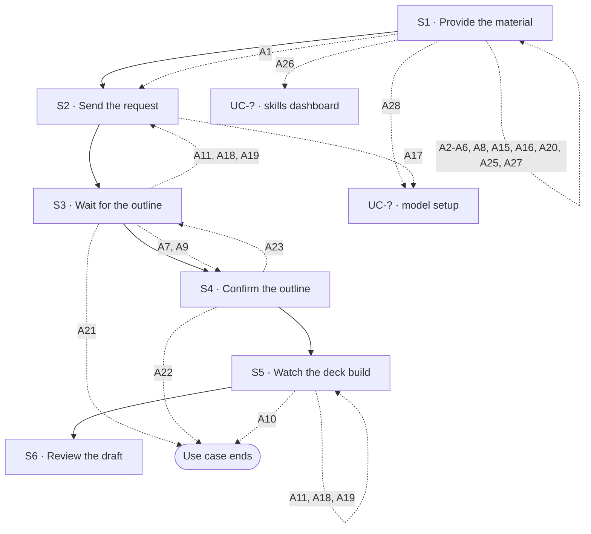

## Flow at a glance

<!-- BEGIN generated: use-case-flowchart -->

*Solid arrows are the main flow. Dotted arrows are alternative flows, labelled with their IDs.*
*Not drawn (the flow stays at the same step): A12, A13, A14 and A24.*
<!-- END generated: use-case-flowchart -->

## Situation and goal

- The user has material for a presentation, such as rough ideas, notes, a document or photos. The deck is empty.
- The user wants a first draft of the slides made for them. They do not want to build the deck slide by slide.

## Trigger and preconditions

- **Trigger:** The user starts a request in the request area of a chat that has no deck yet.
- **Preconditions:** The chat has no deck and no slides yet.
- **Evidence:** [observed: claude-report (a new request starts with an empty presentation)] [observed: napkin-report (a separate step for creating a presentation)]

## Main flow

- The main flow takes the user's input without saying how the user entered it. Each way to enter input is an alternative flow (A1 to A4, and A25).
- The deck uses the default design system. Choosing another one is A5.
- The outline is a checkpoint. The system builds no slide until the user confirms the outline.
- One chat holds one outline.

### S1 · Provide the material

- **User:** Provides the material and instructions for the deck in the request area.
- **System:**
  - Shows what the user provided in the request area.
- **Reqs:** FR-?

### S2 · Send the request

- **User:** Sends the request.
- **System:**
  - Moves the request and any attached files into the **conversation** as the user's message.
  - Clears the request area.
  - Shows that it received the request and is drafting the outline [NFR-?: feedback after sending].
  - Lets the user stop the system while it works.
- **Reqs:** FR-?
- **Evidence:** [observed: claude-report (on send, the product offers a way to stop it)] [observed: napkin-report (on send, the product offers no way to stop it)]

### S3 · Wait for the outline

- **User:** Waits for the outline.
- **System:**
  - Shows the **outline** in the conversation.
  - Lets the user edit the outline text.
  - Lets the user confirm or cancel the outline.
  - Says that the system builds no slide until the user confirms.
  - Does not show the deck canvas yet.
- **Reqs:** FR-?
- **Evidence:** [observed: napkin-report (outline: proposes an outline and waits for approval)] [assumed: editing the outline text directly; not observed in either product]

### S4 · Confirm the outline

- **User:** Reviews the outline, edits it when needed, and confirms it.
- **System:**
  - Shows the outline as confirmed and read-only.
  - Shows that it is preparing the slides from the outline.
- **Reqs:** FR-?

### S5 · Watch the deck build

- **User:** Waits and watches the deck canvas.
- **System:**
  - Shows the **deck canvas**. The deck canvas shows that work is in progress.
  - Shows each slide as soon as it is done. The system builds each slide from the confirmed outline, in the default design system [BR-?: default design system] [NFR-?: wait for first slides].
  - Shows in the deck canvas which slides are done and which are still to come.
  - Does not change which slide the user is looking at.
  - Says in the conversation, in plain words, what the system is doing. The **status message** shows the time elapsed [NFR-?: how often the status changes].
  - Does not offer adding slides by hand meanwhile.
- **Reqs:** FR-?
- **Evidence:** [observed: claude-report (waiting display; how slides arrive: the view stays on the first slide)] [observed: napkin-report (layout step and the editor: the view moves to each new slide by itself, not adopted)]

### S6 · Review the draft

- **User:** Reviews the draft.
- **System:**
  - Shows the full draft deck in the deck canvas.
  - Shows that the system has finished working. The user can send a new request.
  - Shows a closing message that says the draft is ready.
  - The message tells what was made per slide, which assumptions were used, and which text is placeholder.
  - The message also tells which content did not come from the user's material [BR-?: disclosure of content not from the user's material] and what the system did not check.
- **Reqs:** FR-?
- **Evidence:** [observed: claude-report (closing message: what was made, assumptions, placeholders, what was not checked)] [observed: napkin-report (closing message: one question and buttons, no summary)]

## Alternative flows

### A1 · Type or paste text

- **At:** S1
- **End:** Continues at S2
- **When:** The user types or pastes text.
- **System:**
  - Shows the text in the request area [BR-?: maximum request length].
- **Reqs:** FR-?
- **Evidence:** [observed: claude-report (the start invites the user to type or paste ideas)] [observed: napkin-report (the start offers a place to type a request)]

### A2 · Speak the request

- **At:** S1
- **End:** Returns to S1
- **When:** The user starts voice input.
- **System:**
  - Shows that it is connecting, then that it is listening.
  - Shows the words in the request area as the user speaks.
  - Sometimes replaces words it already showed while the user keeps speaking.
  - Lets the user confirm the words or discard them.
  - Does not allow sending until the user does one of the two.
  - Words confirmed: turns the words into ordinary editable request text. Does not send them.
  - Words discarded: removes the words just spoken.
- **Reqs:** FR-?
- **Evidence:** [observed: claude-report (voice dictation)] [observed: napkin-report (offers no voice input)] [inferred: claude-report (voice input replaces the send action with confirm and discard, so sending is not offered meanwhile)] [assumed: discarding the words was not tried in the recording]

### A3 · Attach files or photos

- **At:** S1
- **End:** Returns to S1
- **When:** The user chooses to add files or photos from the device.
- **System:**
  - Shows each chosen file in the request area as an **attachment**.
  - Each attachment shows its name or a preview, its type and its state. The state is being prepared, ready, or rejected with the reason.
  - Lets the user remove an attachment.
  - Does not allow sending while an attachment is still being prepared.
  - Lets the user preview an attachment, or says that no preview is available for that type [BR-?: accepted file types, number and size of attachments].
  - Lets the user add instructions in the request text.
- **Reqs:** FR-?
- **Evidence:** [observed: claude-report (the product offers adding files or photos among other additions)] [observed: napkin-report (adding goes straight to choosing files on the device)] [observed: claude-report (attached files show in the request area and in the conversation, with a preview)] [observed: napkin-report (document attached: the file shows an uploading state, then a preparing state)]

### A4 · Pick material from a connector

- **At:** S1
- **End:** Returns to S1
- **When:** The user chooses to add material from a connected third-party service.
- **System:**
  - Lets the user pick material from a connected third-party service.
  - Shows the picked material attached to the request [BR-?: which connectors are offered].
- **Reqs:** FR-?
- **Evidence:** [observed: the product lists third-party services, such as a cloud drive and a workspace tool, with an on or off setting for each service, an entry to add material from each, and an entry to change the connected services] [assumed: the product showed these entries, not the result of picking material]

### A5 · Choose a custom design system

- **At:** S1
- **End:** Returns to S1
- **When:** The user chooses a custom design system before sending.
- **System:**
  - Shows the available design systems [BR-?: which design systems are offered].
  - Shows the chosen design system.
  - Builds the slides in S5 with the chosen design system instead of the default.
- **Reqs:** FR-?
- **Evidence:** [observed: the product offers the choice of design system in two places before sending] [assumed: behavior after the choice]

### A6 · Send an empty request

- **At:** S1
- **End:** Returns to S1
- **When:** The request has no text and no files.
- **System:**
  - Does not offer sending. Shows no error message.
  - Lets the user send a file or photo with no text [BR-?: what makes a request sendable].
- **Reqs:** FR-?
- **Evidence:** [observed: claude-report (empty request: sending is not available, reported by the user; a file alone can be sent)] [observed: napkin-report (sending looks unavailable while the request is empty)]

### A8 · Reject an attached file

- **At:** S1
- **End:** Returns to S1
- **When:** A chosen file is rejected for its type, the number of files or its size.
- **System:**
  - Shows the reason on the attachment at once.
  - Keeps the attachment in the request area until the user removes it.
  - Leaves the rest of the request unchanged.
  - Does not allow sending while a rejected attachment remains [BR-?: accepted file types, number and size of attachments].
- **Reqs:** FR-?
- **Evidence:** [observed: claude-report (file over the size limit: the reason shows on the file and in a notice)]

### A15 · Voice input cannot start

- **At:** S1
- **End:** Returns to S1
- **When:** Voice input cannot start: permission was refused, there is no device, or the device cannot do it.
- **System:**
  - Says why voice input cannot start.
  - Keeps the request area usable for typing.
- **Reqs:** FR-?
- **Evidence:** [assumed]

### A16 · Voice input ends early

- **At:** S1
- **End:** Returns to S1
- **When:** Voice input ends without usable words, or is cut off.
- **System:**
  - Keeps the words captured so far as editable text.
  - No words captured: says that nothing was heard.
- **Reqs:** FR-?
- **Evidence:** [assumed]

### A20 · Attach a file the model cannot read

- **At:** S1
- **End:** Returns to S1
- **When:** A chosen file is of a type the selected model cannot read.
- **System:**
  - Shows the reason on the attachment, as in A8.
  - Lets the user remove the file or use a model that can read it.
- **Reqs:** FR-?

### A25 · Choose a skill

- **At:** S1
- **End:** Returns to S1
- **When:** The user chooses a skill to add to the request.
- **System:**
  - Shows the list of skills that are set up [BR-?: which skills are offered].
  - Lets the user read the description of each skill.
  - Adds a text shortcut for the chosen skill, such as `/decision-table`, to the request text.
  - Does not send the request.
  - Lets the user add instructions after the shortcut.
- **Reqs:** FR-?
- **Evidence:** [observed: claude-report (the skills list shows skill names with a description for each, and no on or off setting)] [observed: owner report (choosing a skill adds a text shortcut to the request text); not recorded] [assumed: where the shortcut goes when the request text already has words]

### A26 · Open the skills dashboard

- **At:** S1
- **End:** Goes to UC-? (skills dashboard)
- **When:** The user chooses to browse skills or to change which skills are set up.
- **System:**
  - Opens the skills dashboard.
  - Keeps the conversation, the request text and the attachments as they were.
  - Adds nothing to the request text.
- **Reqs:** FR-?
- **Evidence:** [observed: claude-report (the skills list offers one entry to browse skills and one to change them; each opens a place for setting up skills while the chat stays open)] [assumed: the request area keeps its text and files while the dashboard is open]

### A27 · Choose a different model

- **At:** S1
- **End:** Returns to S1
- **When:** The user chooses a different model for the chat.
- **System:**
  - Shows the list of models that are set up [BR-?: which models are offered].
  - Shows which model is chosen.
  - Uses the chosen model for the next request in this chat.
  - Does not send the request.
  - Keeps the request text and the attachments as they were.
- **Reqs:** FR-?
- **Evidence:** [observed: owner report (the user chooses among the models that are set up; the chat then uses the chosen model); not recorded] [assumed: choosing a model does not send the request and keeps the request area as it was]

### A28 · Open the model setup dashboard

- **At:** S1
- **End:** Goes to UC-? (model setup)
- **When:** The user chooses to add models or to change which models are set up.
- **System:**
  - Opens the model setup dashboard.
  - Keeps the conversation, the request text and the attachments as they were.
  - Adds nothing to the request text.
- **Reqs:** FR-?
- **Evidence:** [observed: owner report (the option to add or change models opens the model setup dashboard; the request text and files stay); not recorded]

### A17 · No model available

- **At:** S2
- **End:** Goes to UC-? (model setup)
- **When:** The user has no model available to run the request.
- **System:**
  - Does not start drafting the outline.
  - Says that a model is needed.
  - Keeps the request and files in the request area.
  - Points the user to where models are set up.
- **Reqs:** FR-?

### A7 · Request has no topic

- **At:** S3
- **End:** Continues at S4
- **When:** The request does not say what the deck is about. An example is a bare "generate deck", or a picture with no readable content.
- **System:**
  - Shows a sample outline. Its headings are marked as placeholder.
  - Says in the message with the outline that no topic was given.
  - Lets the user edit the outline at S4.
- **Reqs:** FR-?
- **Evidence:** [observed: claude-report (vague one-line request: asks two questions first; near-black picture: builds a placeholder deck without asking)] [observed: napkin-report (picture without text: asks questions before the outline)]

### A9 · File with nothing usable

- **At:** S3
- **End:** Continues at S4
- **When:** A file was accepted, but nothing in it can be used. For example, the file is damaged, protected, or has no readable content.
- **System:**
  - Drafts the outline from the rest of the request.
  - Names the file and the reason in the message with the outline.
  - No other usable material: shows a sample outline, as in A7.
- **Reqs:** FR-?
- **Evidence:** [observed: claude-report (near-black picture is read and reported in the chat)] [assumed: the "nothing usable" case]

### A11 · Model call fails

- **At:** S3, S5
- **End:** S3: Returns to S2 · S5: Returns to S5
- **When:** The model call fails or returns something the system cannot use.
- **System:**
  - At S3: says that drafting the outline failed. Keeps the S1 input in the conversation. Lets the user **try again** with the same request.
  - At S5: says that building the slides failed. Says how many slides were made. Keeps the confirmed outline and the slides made. Lets the user try again from the confirmed outline.
  - Never leaves a frame empty without an explanation.
- **Reqs:** FR-?

### A12 · Connection lost

- **At:** S3, S4, S5
- **End:** Same step
- **When:** The user's device loses its connection.
- **System:**
  - Shows a **notice** that the user is offline. Keeps everything it has shown.
  - Does not claim that the status message is updating live.
  - At S4: does not accept confirming. Keeps the outline and the user's edits.
  - Connection returns: removes the notice and shows the current progress.
  - Cannot continue: says so. At S3, keeps the S1 input. At S5, keeps the confirmed outline and the slides made. Lets the user try again, as in A11.
- **Reqs:** FR-?
- **Evidence:** [observed: claude-report (connection lost during the wait: offline notice, the run continues)] [observed: napkin-report (not recorded)]

### A13 · Reload or come back

- **At:** S3, S4, S5
- **End:** Same step
- **When:** The user reloads the product, or leaves and comes back.
- **System:**
  - Restores the conversation, the request, the outline and the slides made so far.
  - At S3 and S5: the status message shows what the system is doing now.
  - At S4: the outline still waits for the user's confirmation.
  - Shows no "interrupted" notice while the system is still working.
- **Reqs:** FR-?
- **Evidence:** [observed: claude-report (reload during the wait: the run continues, but a brief "interrupted" notice shows, not adopted)] [observed: napkin-report (not recorded)]

### A14 · Type while the system works

- **At:** S3, S5
- **End:** Same step
- **When:** The user types in the request area while the system is working.
- **System:**
  - Keeps the text in the request area as a draft.
  - Does not allow sending until the system finishes or the user stops it.
- **Reqs:** FR-?
- **Evidence:** [observed: claude-report (second message during the wait: accepted at once and added to the same deck, not adopted)]

### A18 · Model access refused

- **At:** S3, S5
- **End:** S3: Returns to S2 · S5: Returns to S5
- **When:** The provider of the chosen model refuses access because the key is invalid, expired or revoked.
- **System:**
  - Stops and says that access to the model was refused.
  - At S3: keeps the S1 input. Lets the user try again once the key is fixed.
  - At S5: keeps the confirmed outline and the slides made. Lets the user try again from the confirmed outline.
  - Points to where the key is fixed.
- **Reqs:** FR-?

### A19 · Usage limit reached

- **At:** S3, S5
- **End:** S3: Returns to S2 · S5: Returns to S5
- **When:** The provider's usage or rate limit is reached.
- **System:**
  - Stops and says that the limit of the model account was reached.
  - At S3: keeps the S1 input. Lets the user try again.
  - At S5: says how many slides were made. Keeps the confirmed outline and the slides made. Lets the user try again from the confirmed outline.
- **Reqs:** FR-?

### A21 · Stop while drafting the outline

- **At:** S3
- **End:** Ends
- **When:** The user stops the system while it drafts the outline.
- **System:**
  - Stops drafting.
  - Keeps the user's message in the conversation.
  - Shows a **notice** that the response was interrupted.
  - Lets the user **edit the request**. The user's message goes back to the request area and the flow returns to S1.
  - Lets the user try again. The system sends the same request again and the flow returns to S2.
- **Reqs:** FR-?
- **Evidence:** [observed: claude-report (stop during the wait: a notice that offers to edit the request or try again)] [observed: owner report (what editing the request and trying again do); not recorded] [observed: napkin-report (offers no way to stop it)]

### A22 · Cancel the outline

- **At:** S4
- **End:** Ends
- **When:** The user cancels the outline instead of confirming it.
- **System:**
  - Keeps the outline in the conversation.
  - Shows a notice that the user cancelled.
  - Builds no slide.
- **Reqs:** FR-?

### A23 · Send a new instruction for the outline

- **At:** S4
- **End:** Returns to S3
- **When:** The user sends a new instruction in the request area instead of editing the outline. An example is a request to add a point.
- **System:**
  - Updates the same outline block to match the instruction.
  - Builds no slide.
  - Applies the instruction to the outline as it stands, including the user's own edits.
- **Reqs:** FR-?
- **Evidence:** [observed: napkin-report (outline: the product offers ready-made revision requests that send their own text)] [assumed: typing a free instruction as a revision; not tried]

### A24 · Empty outline

- **At:** S4
- **End:** Same step
- **When:** The outline is empty.
- **System:**
  - Does not offer confirming. Shows no error message.
- **Reqs:** FR-?

### A10 · Stop while building slides

- **At:** S5
- **End:** Ends
- **When:** The user stops the system while it builds the slides.
- **System:**
  - Stops building.
  - Keeps the user's message and the confirmed outline in the conversation.
  - Shows a **notice** that the response was interrupted. The notice gives the number of slides made.
  - Keeps the slides already made in the deck canvas.
  - Lets the user edit the request. The user's message goes back to the request area and the flow returns to S1.
  - Lets the user try again. The system builds the slides again from the confirmed outline and the flow returns to S5.
- **Reqs:** FR-?
- **Evidence:** [observed: claude-report (stop during the wait, before any slide exists: a notice that offers to edit the request or try again, and an empty deck canvas)] [observed: owner report (what editing the request and trying again do); not recorded] [assumed: what the confirmed outline and the slides made become when the user sends the edited request] [observed: napkin-report (offers no way to stop it)]

A4 and A5 are documented here. Whether they ship is not decided yet. Their research stays in this file.

## Postconditions and minimal guarantee

Proposals, to be confirmed against recordings.

- **Postconditions:**
  - The chat holds the confirmed outline.
  - The deck has slides made from that outline.
  - The slides use the default design system, or the chosen one when A5 was used.
  - The deck canvas shows the slides.
- **Minimal guarantee:** Whatever branch fails or is interrupted:
  - The request text and attached material are kept. They stay in the conversation if the user sent them, and in the request area if not.
  - An outline already shown stays in the conversation.
  - Slides already made stay in the deck.
  - The user does not have to enter anything again.
- **Evidence:** [assumed]

## Product evidence

### Claude Slide Design

- **Coverage:** observed
- **Research card:** [claude-deck-generation-behavior](../../research/use-cases/claude-slides-design/claude-deck-generation-behavior.md)
- **Difference:**
  - Builds slides straight from the request. It has no outline step.
  - Asks the user only when the request is vague.
  - Shows its progress in the deck canvas and in a status message. The user can stop it.
  - Ends with a message that tells what it did and what it did not check.

### Napkin AI

- **Coverage:** observed
- **Research card:** [napkin-ai-deck-generation-behavior](../../research/use-cases/napkin-ai/napkin-ai-deck-generation-behavior.md)
- **Difference:**
  - Starts from a separate step for creating a presentation.
  - Proposes an outline and waits for approval before building. Then asks for a style and a layout per slide.
  - The team saw no voice input and no way to stop the system.
  - The team did not observe editing the outline text directly.

## Notes

1. Design choice for an ADR proposal: the default design system is fixed (hardcoded). What the default is, and how a later custom design system replaces it, is open.
2. Input type does not create a new use case. Text, voice, files, connectors and skill shortcuts are different ways to complete S1. The goal and the result are the same.
3. Files come from the device (A3). Third-party sources (A4) are a separate way to complete S1.
4. Accessibility (keyboard operation, announcements to assistive technology, zoom) is not written into steps. A global NFR in `032-nfr/` applies to every part of the interface, so this use case does not cite it.
5. Design choice for an ADR proposal: the outline is a mandatory checkpoint, and one chat holds one outline. It stands between the request and any change to the canvas. A request that fails or is cancelled then costs the user only the outline. The outline is part of this use case, not a separate one.
6. Design choice for an ADR proposal: A12 and A13 promise that the user comes back to the same state after losing the connection or reloading. This constrains how the work runs and where its state is kept.
7. Claude also offers a voice conversation that is separate from voice input. The user reported this, and the team did not record it. It is not a way to complete S1. It may become its own use case.
8. Skills are an input helper. Choosing a skill only adds a text shortcut to the request text (A25). After that, the shortcut is ordinary request text, as in A1. Plugins and Research are out of scope for this use case.
9. Design decision (owner, 2026-10-08): A8 blocks sending while a rejected attachment remains. The team did not test this in Claude Slide Design, and DeckAgent does not copy it.
10. Design decision (owner, 2026-10-08): A10 keeps the slides already made when the user stops the system. The team did not record this in Claude Slide Design, and DeckAgent does not copy it.
11. A17, A26 and A28 each go to a use case that is not written yet. The topic in brackets after `UC-?` names it. Flows with the same topic (A17 and A28) go to the same use case.
12. Choosing a model does not add input. It sets which model runs the request, so A27 and A28 are not ways to complete S1. They sit at S1 because the user can set the model while preparing a request. Whether the user can also set it at other steps is not known.
