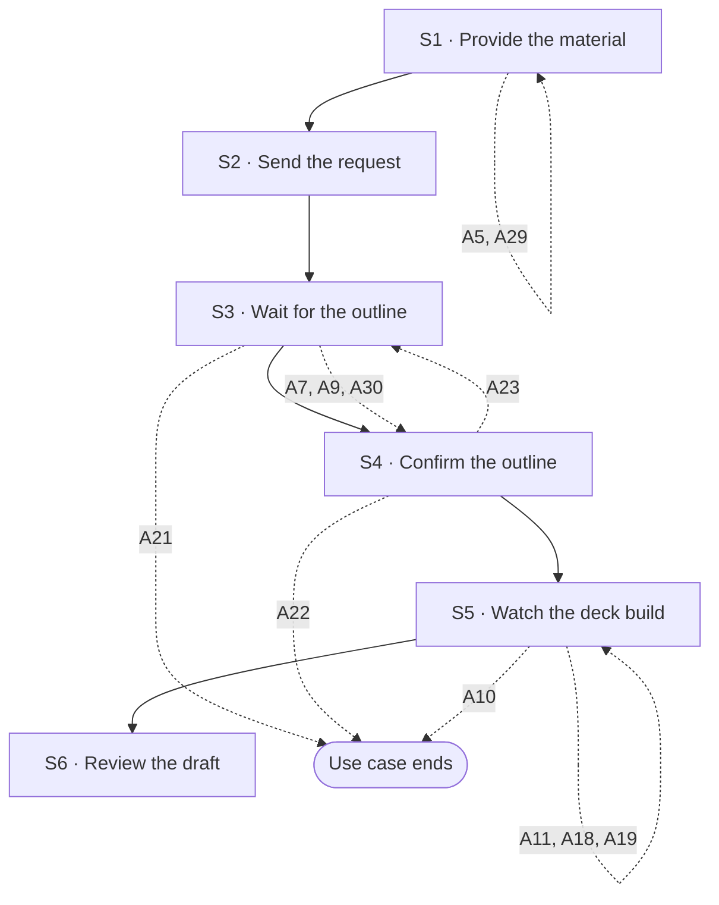

## Flow at a glance

<!-- BEGIN generated: use-case-flowchart -->

*Solid arrows are the main flow. Dotted arrows are alternative flows, labelled with their IDs.*
*Not drawn (the flow stays at the same step): A12, A13, A14 and A24.*
<!-- END generated: use-case-flowchart -->

## Situation and goal

- The user has material for a presentation, such as rough ideas, notes, a document or photos. The deck is empty.
- The user wants a first draft of the slides made for them. They do not want to build the deck slide by slide.

## Trigger and preconditions

- **Trigger:** The user starts a request in the request area of a chat that has no deck yet.
- **Preconditions:** The chat has no deck and no slides yet.
- **Evidence:** [observed: claude-report (a new request starts with an empty presentation)] [observed: napkin-report (a separate step for creating a presentation)]

## Main flow

- The main flow takes the user's input without saying how the user entered it. Each way to enter input is an alternative flow of UC-003 (A1 to A4, and A25).
- S1 to S3 call UC-003. The request is prepared and sent there, and the system works there. This use case adds what is specific to the first draft.
- The deck uses the default design system. Choosing another one is A5.
- The outline is a checkpoint. The system builds no slide until the user confirms the outline.
- One chat holds one outline. The checkpoint applies to this first draft only.

### S1 · Provide the material

- **User:** Provides the material and instructions for the deck in the request area.
- **System:**
  - Shows what the user provided in the request area, as UC-003 S1 says.
- **Reqs:** as in UC-003 S1

### S2 · Send the request

- **User:** Sends the request.
- **System:**
  - Sends the request as UC-003 S2 says.
- **Reqs:** as in UC-003 S2

### S3 · Wait for the outline

- **User:** Waits for the outline.
- **System:**
  - Shows the status message as UC-003 S3 says.
  - Shows the **outline** in the conversation.
  - Lets the user edit the outline text.
  - Lets the user confirm or cancel the outline.
  - Says that the system builds no slide until the user confirms.
  - Does not show the deck canvas yet.
- **Reqs:** FR-?
- **Evidence:** [observed: napkin-report (outline: proposes an outline and waits for approval)] [assumed: editing the outline text directly; not observed in either product]

### S4 · Confirm the outline

- **User:** Reviews the outline, edits it when needed, and confirms it.
- **System:**
  - Shows the outline as confirmed and read-only.
  - Shows that it is preparing the slides from the outline.
- **Reqs:** FR-?

### S5 · Watch the deck build

- **User:** Waits and watches the deck canvas.
- **System:**
  - Shows the **deck canvas**. The deck canvas shows that work is in progress.
  - Shows each slide as soon as it is done. The system builds each slide from the confirmed outline, in the default design system [BR-?: default design system] [NFR-?: wait for first slides].
  - Shows in the deck canvas which slides are done and which are still to come.
  - Does not change which slide the user is looking at.
  - Says in the conversation, in plain words, what the system is doing. The **status message** shows the time elapsed [NFR-?: how often the status changes].
  - Does not offer adding slides by hand meanwhile.
- **Reqs:** FR-?
- **Evidence:** [observed: claude-report (waiting display; how slides arrive: the view stays on the first slide)] [observed: napkin-report (layout step and the editor: the view moves to each new slide by itself, not adopted)]

### S6 · Review the draft

- **User:** Reviews the draft.
- **System:**
  - Shows the full draft deck in the deck canvas.
  - Shows that the system has finished working. The user can send a new request.
  - Shows a closing message that says the draft is ready.
  - The message tells what was made per slide, which assumptions were used, and which text is placeholder.
  - The message also tells which content did not come from the user's material [BR-?: disclosure of content not from the user's material] and what the system did not check.
- **Reqs:** FR-?
- **Evidence:** [observed: claude-report (closing message: what was made, assumptions, placeholders, what was not checked)] [observed: napkin-report (closing message: one question and buttons, no summary)]

## Alternative flows

### A5 · Choose a custom design system

- **At:** S1
- **End:** Returns to S1
- **When:** The user chooses a custom design system before sending.
- **System:**
  - Shows the available design systems [BR-?: which design systems are offered].
  - Shows the chosen design system.
  - Builds the slides in S5 with the chosen design system instead of the default.
- **Reqs:** FR-?
- **Evidence:** [observed: the product offers the choice of design system in two places before sending] [assumed: behavior after the choice]

### A29 · Give an earlier deck as the pattern

- **At:** S1
- **End:** Returns to S1
- **When:** The user gives a deck file as the pattern for the new deck.
- **System:**
  - Shows the file in the request area as an **attachment**.
  - Shows that the attachment is the pattern.
  - Shows its state, lets the user remove it, and rejects it, as in UC-003 A3, A8 and A20.
  - Accepts one pattern for each request [BR-?: number of patterns].
  - Keeps the request text and the other attachments as they were.
- **Reqs:** FR-?
- **Evidence:** [assumed]

### A7 · Request has no topic

- **At:** S3
- **End:** Continues at S4
- **When:** The request does not say what the deck is about. An example is a bare "generate deck", or a picture with no readable content.
- **System:**
  - Shows a sample outline. Its headings are marked as placeholder.
  - Says in the message with the outline that no topic was given.
  - Lets the user edit the outline at S4.
- **Reqs:** FR-?
- **Evidence:** [observed: claude-report (vague one-line request: asks two questions first; near-black picture: builds a placeholder deck without asking)] [observed: napkin-report (picture without text: asks questions before the outline)]

### A9 · File with nothing usable

- **At:** S3
- **End:** Continues at S4
- **When:** A file was accepted, but nothing in it can be used. For example, the file is damaged, protected, or has no readable content.
- **System:**
  - Drafts the outline from the rest of the request.
  - Names the file and the reason in the message with the outline.
  - No other usable material: shows a sample outline, as in A7.
- **Reqs:** FR-?
- **Evidence:** [observed: claude-report (near-black picture is read and reported in the chat)] [assumed: the "nothing usable" case]

### A21 · Stop while drafting the outline

- **At:** S3
- **End:** Ends
- **When:** The user stops the system while it drafts the outline.
- **System:**
  - Stops drafting.
  - Keeps the user's message in the conversation.
  - Shows a **notice** that the response was interrupted.
  - Lets the user **edit the request**. The user's message goes back to the request area and the flow returns to S1.
  - Lets the user try again. The system sends the same request again and the flow returns to S2.
- **Reqs:** FR-?
- **Evidence:** [observed: claude-report (stop during the wait: a notice that offers to edit the request or try again)] [observed: owner report (what editing the request and trying again do); not recorded] [observed: napkin-report (offers no way to stop it)]

### A30 · Draft the outline from a pattern

- **At:** S3
- **End:** Continues at S4
- **When:** The request has a pattern. The request also has new material in its text or its attachments.
- **System:**
  - Drafts the outline from the sections of the pattern, in the order of the pattern.
  - Takes from the pattern only its structure [BR-?: what the system takes from a pattern].
  - Writes each section from the new material.
  - Adds a section when the new material needs one that the pattern does not have.
  - Drops a section when it does not fit the new material.
  - Says in the message with the outline that it followed the pattern. Names each section it added or dropped.
  - No new material: shows the structure with placeholder headings, as in A7.
- **Reqs:** FR-?
- **Evidence:** [inferred: napkin-report (a deck file sent as material gave an outline with the same number of slides, in the same order as the source deck)] [assumed: a pattern given as a pattern, apart from new material]

### A12 · Connection lost

- **At:** S4, S5
- **End:** Same step
- **When:** The user's device loses its connection.
- **System:**
  - Shows a **notice** that the user is offline. Keeps everything it has shown.
  - Does not claim that the status message is updating live.
  - At S4: does not accept confirming. Keeps the outline and the user's edits.
  - Connection returns: removes the notice and shows the current progress.
  - Cannot continue: says so. At S5, keeps the confirmed outline and the slides made. Lets the user try again, as in A11.
- **Reqs:** FR-?
- **Evidence:** [observed: claude-report (connection lost during the wait: offline notice, the run continues)] [observed: napkin-report (not recorded)]

### A13 · Reload or come back

- **At:** S4, S5
- **End:** Same step
- **When:** The user reloads the product, or leaves and comes back.
- **System:**
  - Restores the conversation, the request, the outline and the slides made so far.
  - At S5: the status message shows what the system is doing now.
  - At S4: the outline still waits for the user's confirmation.
  - Shows no "interrupted" notice while the system is still working.
- **Reqs:** FR-?
- **Evidence:** [observed: claude-report (reload during the wait: the run continues, but a brief "interrupted" notice shows, not adopted)] [observed: napkin-report (not recorded)]

### A22 · Cancel the outline

- **At:** S4
- **End:** Ends
- **When:** The user cancels the outline instead of confirming it.
- **System:**
  - Keeps the outline in the conversation.
  - Shows a notice that the user cancelled.
  - Builds no slide.
- **Reqs:** FR-?

### A23 · Send a new instruction for the outline

- **At:** S4
- **End:** Returns to S3
- **When:** The user sends a new instruction in the request area instead of editing the outline. An example is a request to add a point.
- **System:**
  - Updates the same outline block to match the instruction.
  - Builds no slide.
  - Applies the instruction to the outline as it stands, including the user's own edits.
- **Reqs:** FR-?
- **Evidence:** [observed: napkin-report (outline: the product offers ready-made revision requests that send their own text)] [assumed: typing a free instruction as a revision; not tried]

### A24 · Empty outline

- **At:** S4
- **End:** Same step
- **When:** The outline is empty.
- **System:**
  - Does not offer confirming. Shows no error message.
- **Reqs:** FR-?

### A10 · Stop while building slides

- **At:** S5
- **End:** Ends
- **When:** The user stops the system while it builds the slides.
- **System:**
  - Stops building.
  - Keeps the user's message and the confirmed outline in the conversation.
  - Shows a **notice** that the response was interrupted. The notice gives the number of slides made.
  - Keeps the slides already made in the deck canvas.
  - Lets the user edit the request. The user's message goes back to the request area and the flow returns to S1.
  - Lets the user try again. The system builds the slides again from the confirmed outline and the flow returns to S5.
- **Reqs:** FR-?
- **Evidence:** [observed: claude-report (stop during the wait, before any slide exists: a notice that offers to edit the request or try again, and an empty deck canvas)] [observed: owner report (what editing the request and trying again do); not recorded] [assumed: what the confirmed outline and the slides made become when the user sends the edited request] [observed: napkin-report (offers no way to stop it)]

### A11 · Model call fails

- **At:** S5
- **End:** Returns to S5
- **When:** The model call fails or returns something the system cannot use.
- **System:**
  - Says that building the slides failed. Says how many slides were made.
  - Keeps the confirmed outline and the slides made.
  - Lets the user **try again** from the confirmed outline.
  - Never leaves a frame empty without an explanation.
- **Reqs:** FR-?

### A14 · Type while the system works

- **At:** S5
- **End:** Same step
- **When:** The user types in the request area while the system is working.
- **System:**
  - Keeps the text in the request area as a draft.
  - Does not allow sending until the system finishes or the user stops it.
- **Reqs:** FR-?
- **Evidence:** [observed: claude-report (second message during the wait: accepted at once and added to the same deck, not adopted)]

### A18 · Model access refused

- **At:** S5
- **End:** Returns to S5
- **When:** The provider of the chosen model refuses access because the key is invalid, expired or revoked.
- **System:**
  - Stops and says that access to the model was refused.
  - Keeps the confirmed outline and the slides made.
  - Lets the user try again from the confirmed outline once the key is fixed.
  - Points to where the key is fixed.
- **Reqs:** FR-?

### A19 · Usage limit reached

- **At:** S5
- **End:** Returns to S5
- **When:** The provider's usage or rate limit is reached.
- **System:**
  - Stops and says that the limit of the model account was reached.
  - Says how many slides were made.
  - Keeps the confirmed outline and the slides made.
  - Lets the user try again from the confirmed outline.
- **Reqs:** FR-?

A5 is documented here. Whether it ships is not decided yet. Its research stays in this file.

## Postconditions and minimal guarantee

Proposals, to be confirmed against recordings.

- **Postconditions:**
  - The chat holds the confirmed outline.
  - The deck has slides made from that outline.
  - The slides use the default design system, or the chosen one when A5 was used.
  - The deck canvas shows the slides.
- **Minimal guarantee:** Whatever branch fails or is interrupted:
  - The request text and attached material are kept. They stay in the conversation if the user sent them, and in the request area if not.
  - An outline already shown stays in the conversation.
  - Slides already made stay in the deck.
  - The user does not have to enter anything again.
- **Evidence:** [assumed]

## Product evidence

### Claude Slide Design

- **Coverage:** observed
- **Research card:** [claude-deck-generation-behavior](../../research/use-cases/claude-slides-design/claude-deck-generation-behavior.md)
- **Difference:**
  - Builds slides straight from the request. It has no outline step.
  - Asks the user only when the request is vague.
  - Shows its progress in the deck canvas and in a status message. The user can stop it.
  - Ends with a message that tells what it did and what it did not check.

### Napkin AI

- **Coverage:** observed
- **Research card:** [napkin-ai-deck-generation-behavior](../../research/use-cases/napkin-ai/napkin-ai-deck-generation-behavior.md)
- **Difference:**
  - Starts from a separate step for creating a presentation.
  - Proposes an outline and waits for approval before building. Then asks for a style and a layout per slide.
  - The team saw no voice input and no way to stop the system.
  - The team did not observe editing the outline text directly.
  - A deck file sent with no text was read as source material. The outline followed the structure of the source deck.

## Notes

1. Design choice for an ADR proposal: the default design system is fixed (hardcoded). What the default is, and how a later custom design system replaces it, is open.
2. Moved to UC-003 (Note 1).
3. Moved to UC-003 (Note 2).
4. Accessibility (keyboard operation, announcements to assistive technology, zoom) is not written into steps. A global NFR in `032-nfr/` applies to every part of the interface, so this use case does not cite it.
5. Design decision (owner, 2026-10-08): the outline checkpoint applies to the first draft only. A follow-up request shows no outline and changes the deck canvas directly (UC-002). Design choice for an ADR proposal: within the first draft, the outline is a mandatory checkpoint, and one chat holds one outline. It stands between the request and any change to the canvas. A request that fails or is cancelled then costs the user only the outline. The outline is part of this use case, not a separate one.
6. Moved to UC-003 (Note 8). The same promise applies to A12 and A13 here.
7. Moved to UC-003 (Note 3).
8. Moved to UC-003 (Note 4).
9. Moved to UC-003 (Note 5).
10. Design decision (owner, 2026-10-08): A10 keeps the slides already made when the user stops the system. The team did not record this in Claude Slide Design, and DeckAgent does not copy it.
11. Moved to UC-003 (Note 6).
12. Retired (owner, 2026-10-08): the model is not locked for a run. The user can choose a model for any request (UC-003 Note 7).
13. Moved to UC-003 (Note 7).
14. The ways to enter a request and the run failures at S3 moved to UC-003 with the same flow IDs. These IDs are retired here: A1, A2, A3, A4, A6, A8, A15, A16, A17, A20, A25, A26, A27 and A28. A11, A12, A13, A14, A18 and A19 stay here for the steps after the outline is confirmed.
15. Design decision (owner, 2026-10-09): an earlier deck can be the pattern for a new deck (A29, A30). The pattern is a strong reference for the structure of the outline, not a fixed form. The system adds or drops a section when the new material needs it. The pattern sets no content and no look, so the slides use the default design system or the one chosen in A5. A pattern whose file has nothing usable is an attachment with nothing usable (A9).
16. A deck made in an earlier chat is not covered as a pattern. That needs a way to find earlier decks, which is not scoped.
