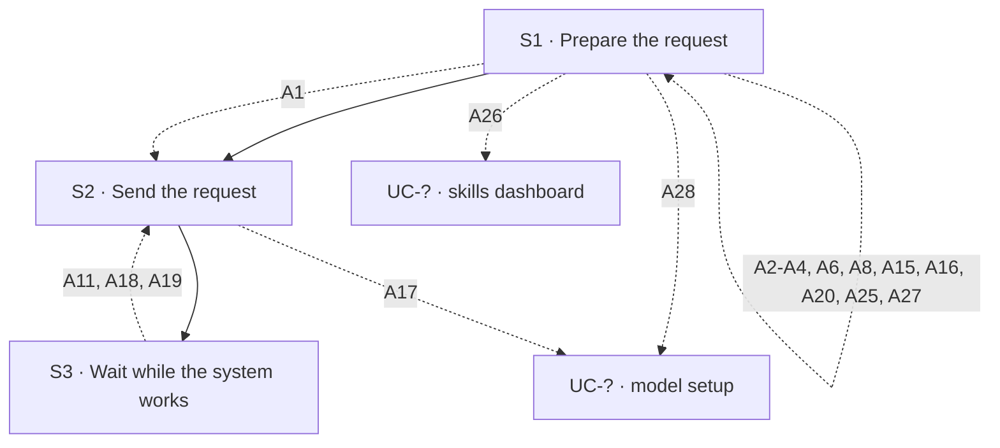

## Flow at a glance

<!-- BEGIN generated: use-case-flowchart -->

*Solid arrows are the main flow. Dotted arrows are alternative flows, labelled with their IDs.*
*Not drawn (the flow stays at the same step): A12, A13, A14 and A27.*
<!-- END generated: use-case-flowchart -->

## Situation and goal

- The user wants the system to do work for them. The user gives the system what it needs, such as text, files and a choice of model.
- The user sends the request and waits while the system works.
- The steps are the same whatever the system is asked to do.

## Trigger and preconditions

- **Trigger:** The user starts a request in the request area.
- **Preconditions:** The system is not working on another request.
- **Evidence:** [assumed]

## Main flow

- The main flow takes the user's input without saying how the user entered it. Each way to enter input is an alternative flow (A1 to A4, and A25).
- The user can choose the model for any request in the chat, also while the system works on an earlier one (A27).
- The system works on one request at a time.
- What the system produces is not part of this use case. Every use case that includes this one describes it.

### S1 · Prepare the request

- **User:** Provides the material and instructions in the request area.
- **System:**
  - Shows what the user provided in the request area.
- **Reqs:** FR-?

### S2 · Send the request

- **User:** Sends the request.
- **System:**
  - Moves the request and any attached files into the **conversation** as the user's message.
  - Clears the request area.
  - Shows that it received the request and is working on it [NFR-?: feedback after sending].
  - Lets the user stop the system while it works.
- **Reqs:** FR-?
- **Evidence:** [observed: claude-report (on send, the product offers a way to stop it)] [observed: napkin-report (on send, the product offers no way to stop it)]

### S3 · Wait while the system works

- **User:** Waits.
- **System:**
  - Says in the conversation, in plain words, what the system is doing. The **status message** shows the time elapsed [NFR-?: how often the status changes].
  - Keeps the request in the conversation.
- **Reqs:** FR-?
- **Evidence:** [observed: claude-report (the progress line says what the product is doing and shows the time elapsed)] [observed: napkin-report (the status line names the phase and shows the time elapsed)]

## Alternative flows

### A1 · Type or paste text

- **At:** S1
- **End:** Continues at S2
- **When:** The user types or pastes text.
- **System:**
  - Shows the text in the request area [BR-?: maximum request length].
- **Reqs:** FR-?
- **Evidence:** [observed: claude-report (the start invites the user to type or paste ideas)] [observed: napkin-report (the start offers a place to type a request)]

### A2 · Speak the request

- **At:** S1
- **End:** Returns to S1
- **When:** The user starts voice input.
- **System:**
  - Shows that it is connecting, then that it is listening.
  - Shows the words in the request area as the user speaks.
  - Sometimes replaces words it already showed while the user keeps speaking.
  - Lets the user confirm the words or discard them.
  - Does not allow sending until the user does one of the two.
  - Words confirmed: turns the words into ordinary editable request text. Does not send them.
  - Words discarded: removes the words just spoken.
- **Reqs:** FR-?
- **Evidence:** [observed: claude-report (voice dictation)] [observed: napkin-report (offers no voice input)] [inferred: claude-report (voice input replaces the send action with confirm and discard, so sending is not offered meanwhile)] [assumed: discarding the words was not tried in the recording]

### A3 · Attach files or photos

- **At:** S1
- **End:** Returns to S1
- **When:** The user chooses to add files or photos from the device.
- **System:**
  - Shows each chosen file in the request area as an **attachment**.
  - Each attachment shows its name or a preview, its type and its state. The state is being prepared, ready, or rejected with the reason.
  - Lets the user remove an attachment.
  - Does not allow sending while an attachment is still being prepared.
  - Lets the user preview an attachment, or says that no preview is available for that type [BR-?: accepted file types, number and size of attachments].
  - Lets the user add instructions in the request text.
- **Reqs:** FR-?
- **Evidence:** [observed: claude-report (the product offers adding files or photos among other additions)] [observed: napkin-report (adding goes straight to choosing files on the device)] [observed: claude-report (attached files show in the request area and in the conversation, with a preview)] [observed: napkin-report (document attached: the file shows an uploading state, then a preparing state)]

### A4 · Pick material from a connector

- **At:** S1
- **End:** Returns to S1
- **When:** The user chooses to add material from a connected third-party service.
- **System:**
  - Lets the user pick material from a connected third-party service.
  - Shows the picked material attached to the request [BR-?: which connectors are offered].
- **Reqs:** FR-?
- **Evidence:** [observed: the product lists third-party services, such as a cloud drive and a workspace tool, with an on or off setting for each service, an entry to add material from each, and an entry to change the connected services] [assumed: the product showed these entries, not the result of picking material]

### A6 · Send an empty request

- **At:** S1
- **End:** Returns to S1
- **When:** The request has no text and no files.
- **System:**
  - Does not offer sending. Shows no error message.
  - Lets the user send a file or photo with no text [BR-?: what makes a request sendable].
- **Reqs:** FR-?
- **Evidence:** [observed: claude-report (empty request: sending is not available, reported by the user; a file alone can be sent)] [observed: napkin-report (sending looks unavailable while the request is empty)]

### A8 · Reject an attached file

- **At:** S1
- **End:** Returns to S1
- **When:** A chosen file is rejected for its type, the number of files or its size.
- **System:**
  - Shows the reason on the attachment at once.
  - Keeps the attachment in the request area until the user removes it.
  - Leaves the rest of the request unchanged.
  - Does not allow sending while a rejected attachment remains [BR-?: accepted file types, number and size of attachments].
- **Reqs:** FR-?
- **Evidence:** [observed: claude-report (file over the size limit: the reason shows on the file and in a notice)] [observed: napkin-report (a protected deck file was rejected when attached, with a general message and a way to remove it; the image does not show whether sending is blocked)]

### A15 · Voice input cannot start

- **At:** S1
- **End:** Returns to S1
- **When:** Voice input cannot start: permission was refused, there is no device, or the device cannot do it.
- **System:**
  - Says why voice input cannot start.
  - Keeps the request area usable for typing.
- **Reqs:** FR-?
- **Evidence:** [assumed]

### A16 · Voice input ends early

- **At:** S1
- **End:** Returns to S1
- **When:** Voice input ends without usable words, or is cut off.
- **System:**
  - Keeps the words captured so far as editable text.
  - No words captured: says that nothing was heard.
- **Reqs:** FR-?
- **Evidence:** [assumed]

### A20 · Attach a file the model cannot read

- **At:** S1
- **End:** Returns to S1
- **When:** A chosen file is of a type the selected model cannot read.
- **System:**
  - Shows the reason on the attachment, as in A8.
  - Lets the user remove the file or use a model that can read it.
- **Reqs:** FR-?

### A25 · Choose a skill

- **At:** S1
- **End:** Returns to S1
- **When:** The user chooses a skill to add to the request.
- **System:**
  - Shows the list of skills that are set up [BR-?: which skills are offered].
  - Lets the user read the description of each skill.
  - Adds a text shortcut for the chosen skill, such as `/decision-table`, to the request text.
  - Does not send the request.
  - Lets the user add instructions after the shortcut.
- **Reqs:** FR-?
- **Evidence:** [observed: claude-report (the skills list shows skill names with a description for each, and no on or off setting)] [observed: owner report (choosing a skill adds a text shortcut to the request text); not recorded] [assumed: where the shortcut goes when the request text already has words]

### A26 · Open the skills dashboard

- **At:** S1
- **End:** Goes to UC-? (skills dashboard)
- **When:** The user chooses to browse skills or to change which skills are set up.
- **System:**
  - Opens the skills dashboard.
  - Keeps the conversation, the request text and the attachments as they were.
  - Adds nothing to the request text.
- **Reqs:** FR-?
- **Evidence:** [observed: claude-report (the skills list offers one entry to browse skills and one to change them; each opens a place for setting up skills while the chat stays open)] [assumed: the request area keeps its text and files while the dashboard is open]

### A27 · Choose a different model

- **At:** S1, S3
- **End:** S1: Returns to S1 · S3: Same step
- **When:** The user chooses a different model for the chat. The system can be working on an earlier request.
- **System:**
  - Shows the list of models that are set up [BR-?: which models are offered].
  - Shows which model is chosen.
  - Uses the chosen model for the next request in this chat. At S3: the work in progress keeps the model it started with.
  - Re-evaluates every attachment against the capabilities of the newly chosen model.
  - Makes a rejected attachment ready when the new model can read it.
  - Rejects a ready attachment when the new model cannot read it. Shows the reason on the attachment, as in A20.
  - Does not send the request. Keeps the request text and removes no attachment.
- **Reqs:** FR-?
- **Evidence:** [observed: owner report (the user chooses among the models that are set up; the chat then uses the chosen model); not recorded] [assumed: choosing a model does not send the request and keeps the request area as it was] [observed: owner report (a model chosen while the system works applies to the next request only and does not interrupt the work in progress); not recorded]

### A28 · Open the model setup dashboard

- **At:** S1
- **End:** Goes to UC-? (model setup)
- **When:** The user chooses to add models or to change which models are set up.
- **System:**
  - Opens the model setup dashboard.
  - Keeps the conversation, the request text and the attachments as they were.
  - Adds nothing to the request text.
- **Reqs:** FR-?
- **Evidence:** [observed: owner report (the option to add or change models opens the model setup dashboard; the request text and files stay); not recorded]

### A17 · No model available

- **At:** S2
- **End:** Goes to UC-? (model setup)
- **When:** The user has no model available to run the request.
- **System:**
  - Does not start drafting the outline.
  - Says that a model is needed.
  - Keeps the request and files in the request area.
  - Points the user to where models are set up.
- **Reqs:** FR-?

### A11 · Model call fails

- **At:** S3
- **End:** Returns to S2
- **When:** The model call fails or returns something the system cannot use.
- **System:**
  - Says that the system did not finish the work.
  - Says what it finished and what it did not.
  - Keeps the request in the conversation, and everything it finished.
  - Lets the user **try again** with the same request.
  - Never leaves a frame empty without an explanation.
- **Reqs:** FR-?

### A12 · Connection lost

- **At:** S3
- **End:** Same step
- **When:** The user's device loses its connection.
- **System:**
  - Shows a **notice** that the user is offline. Keeps everything it has shown.
  - Does not claim that the status message is updating live.
  - Connection returns: removes the notice and shows the current progress.
  - Cannot continue: says so. Keeps the request in the conversation. Lets the user try again, as in A11.
- **Reqs:** FR-?
- **Evidence:** [observed: claude-report (connection lost during the wait: offline notice, the run continues)] [observed: napkin-report (not recorded)]

### A13 · Reload or come back

- **At:** S3
- **End:** Same step
- **When:** The user reloads the product, or leaves and comes back.
- **System:**
  - Restores the conversation and the request.
  - The status message shows what the system is doing now.
  - Shows no "interrupted" notice while the system is still working.
- **Reqs:** FR-?
- **Evidence:** [observed: claude-report (reload during the wait: the run continues, but a brief "interrupted" notice shows, not adopted)] [observed: napkin-report (not recorded)]

### A14 · Type while the system works

- **At:** S3
- **End:** Same step
- **When:** The user types in the request area while the system is working.
- **System:**
  - Keeps the text in the request area as a draft.
  - Does not allow sending until the system finishes or the user stops it.
- **Reqs:** FR-?
- **Evidence:** [observed: claude-report (second message during the wait: accepted at once and added to the same deck, not adopted)]

### A18 · Model access refused

- **At:** S3
- **End:** Returns to S2
- **When:** The provider of the chosen model refuses access because the key is invalid, expired or revoked.
- **System:**
  - Stops and says that access to the model was refused.
  - Keeps the request in the conversation. Lets the user try again once the key is fixed.
  - Points to where the key is fixed.
- **Reqs:** FR-?

### A19 · Usage limit reached

- **At:** S3
- **End:** Returns to S2
- **When:** The provider's usage or rate limit is reached.
- **System:**
  - Stops and says that the limit of the model account was reached.
  - Keeps the request in the conversation. Lets the user try again.
- **Reqs:** FR-?

A4 is documented here. Whether it ships is not decided yet. Its research stays in this file.

## Postconditions and minimal guarantee

Proposals, to be confirmed against recordings.

- **Postconditions:**
  - The request and its attachments are in the conversation.
  - The system has finished its work on the request.
- **Minimal guarantee:** Whatever branch fails or is interrupted:
  - The request text and attached material are kept. They stay in the conversation if the user sent them, and in the request area if not.
  - The user does not have to enter anything again.
- **Evidence:** [assumed]

## Product evidence

### Claude Slide Design

- **Coverage:** observed
- **Research card:** [claude-deck-generation-behavior](../../research/use-cases/claude-slides-design/claude-deck-generation-behavior.md)
- **Difference:**
  - Offers voice input, files and photos, connectors, skills and a choice of model.
  - Offers a way to stop the system and shows its progress while it works.
  - Kept working after a reload or a lost connection.

### Napkin AI

- **Coverage:** observed
- **Research card:** [napkin-ai-deck-generation-behavior](../../research/use-cases/napkin-ai/napkin-ai-deck-generation-behavior.md)
- **Difference:**
  - Offers adding files from the device. The team saw no voice input and no choice of model.
  - The team saw no way to stop the system.
  - The team did not record a reload or a lost connection.
  - A protected deck file was rejected when it was attached. The message was general and did not say why.

## Notes

1. Input type does not create a new use case. Text, voice, files, connectors and skill shortcuts are different ways to complete S1. The goal and the result are the same.
2. Files come from the device (A3). Third-party sources (A4) are a separate way to complete S1.
3. Claude also offers a voice conversation that is separate from voice input. The user reported this, and the team did not record it. It is not a way to complete S1. It may become its own use case.
4. Skills are an input helper. Choosing a skill only adds a text shortcut to the request text (A25). After that, the shortcut is ordinary request text, as in A1. Plugins and Research are out of scope for this use case.
5. Design decision (owner, 2026-10-08): A8 blocks sending while a rejected attachment remains. The team did not test this in Claude Slide Design, and DeckAgent does not copy it.
6. A17, A26 and A28 each go to a use case that is not written yet. The topic in brackets after `UC-?` names it. Flows with the same topic (A17 and A28) go to the same use case.
7. Design decision (owner, 2026-10-08): the user can choose a model when preparing any request in the chat, including a follow-up request. The user can also choose it while the system works. Sending is not offered then (A14), so the choice only sets the model for the next request. Choosing a model adds no input. It sets which model runs the request, so A27 and A28 are not ways to complete S1. A27 re-evaluates every attachment against the newly chosen model, so A20 can also apply after a file was accepted.
8. Design choice for an ADR proposal: A12 and A13 promise that the user comes back to the same state after losing the connection or reloading. This constrains how the work runs and where its state is kept.
9. Accessibility (keyboard operation, announcements to assistive technology, zoom) is not written into steps. A global NFR in `032-nfr/` applies to every part of the interface, so this use case does not cite it.
10. A stop is offered at S2, but what a stop does depends on the work the system was doing. The use case that includes this one says what happens after a stop.
11. The flows A1 to A4, A6, A8, A15 to A17, A20 and A25 to A28 keep the IDs they had before this use case was split out. A11 to A14, A18 and A19 are the S3 part of flows whose later part stays in the use case that includes this one. IDs are never renumbered.
