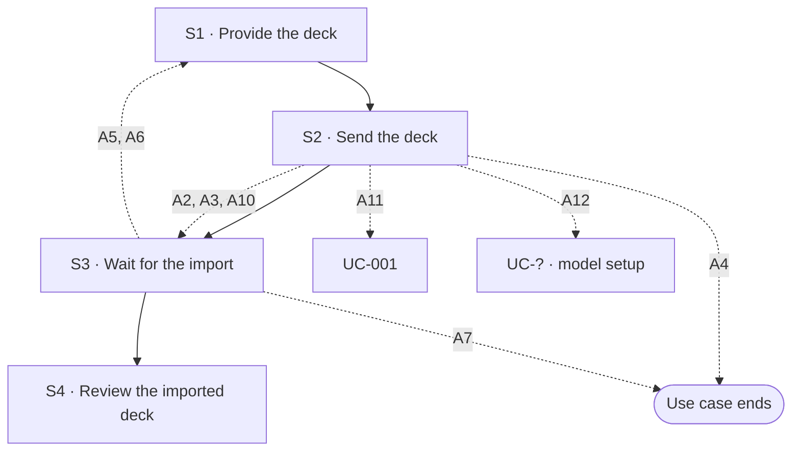

## Flow at a glance

<!-- BEGIN generated: use-case-flowchart -->

*Solid arrows are the main flow. Dotted arrows are alternative flows, labelled with their IDs.*
*Not drawn (the flow stays at the same step): A1, A8 and A9.*
<!-- END generated: use-case-flowchart -->

## Situation and goal

- The user already has a deck, made earlier or by someone else. They want to change it with the system's help.
- The user does not want a new deck made from it. They want the same deck in front of them, ready to change.
- The user wants nothing in the deck to change during the import.

## Trigger and preconditions

- **Trigger:** The user gives a deck file and wants to work on that deck.
- **Preconditions:** The user has a deck file. The system is not working on another request.
- **Evidence:** [assumed]

## Main flow

- S1 to S3 call UC-003. The deck file is prepared and sent there, and the system works there.
- The import uses no model. UC-003 A11, A17, A18, A19 and A20 do not apply here. UC-003 A27 does not re-evaluate the deck file.
- Using the file as material for a new deck needs a model (A11, A12).
- In a chat that has no deck, the request says what the file is for. When it does not, A9 asks the user.
- A chat that already has a deck goes to A1 to A4.
- The file is the deck to work on. It is not material for a new deck.
- The system changes nothing in the deck canvas until it has read the whole deck.
- The system shows no outline. The system does not change the content of any slide.

### S1 · Provide the deck

- **User:** Provides the deck file. The request text says that the user wants to work on that deck.
- **System:**
  - Shows what the user provided in the request area, as UC-003 S1 says.
- **Reqs:** as in UC-003 S1
- **Evidence:** [observed: claude-report (a deck file was accepted among the attached files; nothing was sent, so the result is not known)] [observed: napkin-report (a deck file sent with no text was accepted and read)] [assumed: the request text says that the user wants to work on the deck]

### S2 · Send the deck

- **User:** Sends the deck file.
- **System:**
  - Sends the deck file as UC-003 S2 says.
- **Reqs:** as in UC-003 S2

### S3 · Wait for the import

- **User:** Waits.
- **System:**
  - Shows the status message as UC-003 S3 says.
  - Reads every slide of the deck.
  - Changes nothing in the deck canvas until it has read the whole deck.
- **Reqs:** FR-?
- **Evidence:** [assumed]

### S4 · Review the imported deck

- **User:** Reviews the deck.
- **System:**
  - Shows each slide it brought in, in the order of the file, in the deck canvas.
  - Keeps the content and the look of each slide as the file had them, as far as it can [BR-?: what is brought in from a deck file].
  - Shows that the system has finished working. The user can send a request to change the deck.
  - Shows a closing message that says how many slides it brought in.
  - The message says that it changed no content.
- **Reqs:** FR-?
- **Evidence:** [assumed]

## Alternative flows

### A1 · Chat already has a deck

- **At:** S2
- **End:** Same step
- **When:** The deck canvas already holds slides.
- **System:**
  - Changes nothing in the deck canvas yet.
  - Says in the conversation that the chat already has a deck.
  - Keeps the file while it waits.
  - Offers three outcomes: replace the deck, add the slides, or keep the file as material.
  - Waits for the user to choose. The choice leads to A2, A3 or A4.
- **Reqs:** FR-?
- **Evidence:** [inferred: napkin-report (a request that would change existing slides got a question with three outcomes before any slide changed)] [assumed: the question comes before the system reads the file]

### A2 · Replace the current deck

- **At:** S2
- **End:** Continues at S3
- **When:** The user chooses, after A1, to replace the current deck.
- **System:**
  - Keeps the current deck until it has read the whole deck.
  - Replaces every slide of the current deck with the slides of the imported deck.
  - Asks nothing more before it replaces the slides.
- **Reqs:** FR-?
- **Evidence:** [assumed]

### A3 · Add the slides to the current deck

- **At:** S2
- **End:** Continues at S3
- **When:** The user chooses, after A1, to add the imported slides to the current deck.
- **System:**
  - Changes no slide of the current deck.
  - Adds each imported slide after the last slide of the current deck, in the order of the file.
  - Adds the slides only after it has read the whole deck.
- **Reqs:** FR-?
- **Evidence:** [assumed: the place where the slides are added]

### A4 · Keep the file as material

- **At:** S2
- **End:** Ends
- **When:** The user chooses, after A1, to keep the file as material and change no slide.
- **System:**
  - Changes no slide.
  - Keeps the file in the conversation as material for later requests in this chat.
  - Says in the conversation that it kept the file and changed no slide.
- **Reqs:** FR-?
- **Evidence:** [assumed]

### A9 · Request does not say what the file is for

- **At:** S2
- **End:** Same step
- **When:** The chat has no deck. The user gives a deck file, and the request does not say what the file is for.
- **System:**
  - Changes nothing in the deck canvas.
  - Does not guess what the user wants.
  - Keeps the file while it waits.
  - Offers two outcomes: work on this deck, or use the file as material for a new deck.
  - Waits for the user to choose. The choice leads to A10, A11 or A12.
- **Reqs:** FR-?
- **Evidence:** [inferred: napkin-report (a picture sent with no text got questions before the outline)] [observed: napkin-report (a deck file sent with no text got no question about its purpose; the product treated it as source material)] [assumed: the question comes before the system reads the file]

### A10 · Work on the deck

- **At:** S2
- **End:** Continues at S3
- **When:** The user chooses, after A9, to work on the deck.
- **System:**
  - Treats the file as the deck to work on, not as material.
- **Reqs:** FR-?
- **Evidence:** [assumed]

### A11 · Use the file as material for a new deck

- **At:** S2
- **End:** Goes to UC-001
- **When:** The user chooses, after A9, to use the file as material for a new deck. A model is available.
- **System:**
  - Changes nothing in the deck canvas.
  - Treats the file as material for a new deck.
- **Reqs:** FR-?
- **Evidence:** [observed: napkin-report (a deck file sent with no text was read as source material: two questions, then an outline with the same number of slides, in the same order)] [assumed: the deck canvas stays unchanged; the image shows the conversation only]

### A12 · No model for the new deck

- **At:** S2
- **End:** Goes to UC-? (model setup)
- **When:** The user chooses, after A9, to use the file as material for a new deck. No model is available.
- **System:**
  - Does not draft the outline.
  - Says that a model is needed.
  - Keeps the user's message and the file in the conversation.
  - Points the user to where models are set up.
- **Reqs:** FR-?
- **Evidence:** [assumed: same as the first request without a model]

### A5 · Deck cannot be used

- **At:** S3
- **End:** Returns to S1
- **When:** The file was accepted, but nothing in it can be brought in. For example, the file is not a deck, is damaged, is protected, or has no slide.
- **System:**
  - Changes nothing in the deck canvas.
  - Names the file and the reason in the conversation.
  - Keeps the user's message and the file in the conversation.
  - Lets the user choose another deck file.
- **Reqs:** FR-?
- **Evidence:** [inferred: claude-report (a file with nothing usable is read and reported in the chat)] [assumed: the case of a deck file]

### A6 · Import fails

- **At:** S3
- **End:** Returns to S1
- **When:** The system fails while it reads the deck.
- **System:**
  - Says that the import failed.
  - Changes nothing in the deck canvas.
  - Keeps the user's message and the file in the conversation.
  - Lets the user **edit the request**. The user's message goes back to the request area and the flow returns to S1.
- **Reqs:** FR-?
- **Evidence:** [assumed]

### A7 · Stop while importing

- **At:** S3
- **End:** Ends
- **When:** The user stops the system while it reads the deck.
- **System:**
  - Stops reading the deck.
  - Changes nothing in the deck canvas.
  - Keeps the user's message and the file in the conversation.
  - Shows a **notice** that the response was interrupted.
  - Lets the user edit the request. The user's message goes back to the request area and the flow returns to S1.
- **Reqs:** FR-?
- **Evidence:** [inferred: claude-report (a stop is offered while the system works, and its notice offers to edit the request)] [assumed: a stop during an import behaves the same]

### A8 · Some content cannot be kept

- **At:** S4
- **End:** Same step
- **When:** The system cannot keep some content of a slide. For example, a font, an effect or a media file the system does not have.
- **System:**
  - Shows the slide with the rest of its content.
  - Does not replace the missing part with other content.
  - Names each slide and the part that was not kept in the closing message [BR-?: what is brought in from a deck file].
- **Reqs:** FR-?
- **Evidence:** [assumed]

## Postconditions and minimal guarantee

Proposals, to be confirmed against recordings.

- **Postconditions:**
  - The deck canvas shows the imported slides. After A3 it also shows the slides the chat had before. After A4 it is as it was.
  - The conversation says how many slides were brought in and what was not kept.
  - After A11 the chat has no deck. The first draft continues from the request and the file.
- **Minimal guarantee:** Whatever branch fails or is interrupted:
  - The deck canvas is exactly as it was before the import attempt.
  - The user's file is kept in the conversation if the user sent it, and in the request area if not.
  - The user does not have to choose the file again.
- **Evidence:** [assumed]

## Product evidence

### Claude Slide Design

- **Coverage:** unverified
- **Research card:** [claude-deck-generation-behavior](../../research/use-cases/claude-slides-design/claude-deck-generation-behavior.md)
- **Difference:**
  - A deck file was accepted among other attached files.
  - The team did not send it, so what the product does with a deck file is not known.

### Napkin AI

- **Coverage:** not offered
- **Research card:** [napkin-ai-deck-generation-behavior](../../research/use-cases/napkin-ai/napkin-ai-deck-generation-behavior.md)
- **Difference:**
  - A deck file sent alone in an empty chat was read as source material. The product did not offer to bring the deck in.
  - It asked about the audience and the length. Then it showed an outline that followed the structure of the source deck.
  - It did not ask what the file was for. This differs from A9.
  - The team did not try a deck file in a chat that already has a deck.
  - The team did not try a deck file with a request text.
  - The team did not try a protected or damaged deck file.
  - A request that would change existing slides got a question with three outcomes.

## Notes

1. A deck file can be used in three ways: as material for a new deck, as a pattern for a new deck, or as the deck to work on. This use case covers the last way. A4 keeps a file as material instead.
2. Design decision (owner, 2026-10-09): the import uses no model. It is a parsing task, not a generation task. UC-003 flows that depend on a model do not apply. Where UC-003 A12 says "try again", it means bringing in the deck again.
3. Design decision (owner, 2026-10-09): the import is all or nothing. A failure or a stop leaves the deck canvas exactly as it was before the attempt.
4. Design decision (owner, 2026-10-09): a chat that already has a deck is not a dead end. The system asks which of three outcomes the user wants (A1 to A4), as UC-002 does for a change that reaches slides the request does not name.
5. A chat that has a deck has no outline step for a new request. So a deck cannot be a pattern there. A4 keeps it as material.
6. After the import, the user changes the deck with a request. The imported deck has no outline, and a request to change it shows none.
7. What the system keeps from a deck file is a rule, cited as a business rule. No recording of a baseline product covers it, so every flow here is `[assumed]` until the team tests it.
8. Design decision (owner, 2026-10-09): the user does not have to state what a deck file is for. When the request says it, the system follows it. In an empty chat, when the request does not say it, the system does not guess and asks (A9). In a chat that has a deck, it asks as in A1.
9. A11 hands the request and the file to the first draft with the request already sent. The first draft continues from the outline.
10. Design decision (owner, 2026-10-09): a later request uses the file kept in A4 as context material for its changes. UC-002 S3 says so.
11. Napkin AI read a deck file sent alone as source material and did not ask what it was for. A9 asks, as the owner decided. The difference is recorded in the product evidence and is not copied from Napkin AI.
