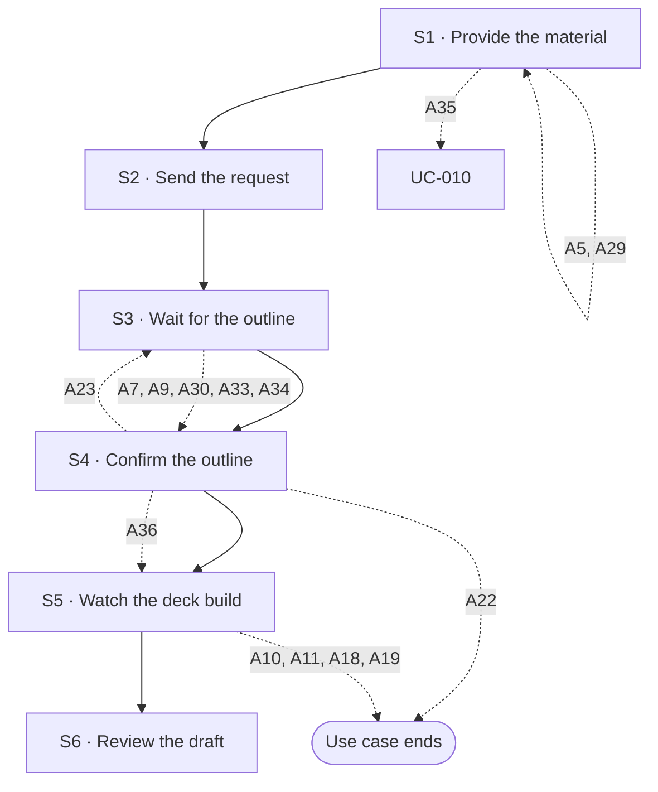

## Flow at a glance

<!-- BEGIN generated: use-case-flowchart -->

*Solid arrows are the main flow. Dotted arrows are alternative flows, labelled with their IDs.*
*Not drawn (the flow stays at the same step): A12, A13, A14, A24, A32 and A37.*
<!-- END generated: use-case-flowchart -->

## Situation and goal

- The user has material for a presentation, such as rough ideas, notes, a document or photos. The deck is empty.
- The user wants a first draft of the slides made for them. They do not want to build the deck slide by slide.

## Trigger and preconditions

- **Trigger:** The user starts a request in the request area of a chat that has no deck yet.
- **Preconditions:** The chat has no deck and no slides yet.
- **Evidence:** [observed: claude-report (a new request starts with an empty presentation)] [observed: napkin-report (a separate step for creating a presentation)]

## Main flow

- The main flow takes the user's input without saying how the user entered it. UC-003 S1 takes the request text. Each other way to enter input is an alternative flow of UC-003 (A2 to A4, and A25).
- S1 to S3 call UC-003. The request is prepared and sent there, and the system works there. This use case adds what is specific to the first draft.
- The request ends at S3, when the outline is shown and the system waits for the user to confirm it.
- This use case does not decide whether confirming the outline (S4) starts a new request. S4 to S6 do not call UC-003.
- A response written "as UC-003 … says" or "as in UC-003 …" in S4 to S6 reuses that wording only. So does one in a flow that starts at S4 or S5. It does not call UC-003.
- The deck uses the default design system. Choosing another one is A5.
- The outline is a checkpoint. The system builds no slide until the user confirms the outline.
- One chat holds one outline. The checkpoint applies to this first draft only.

### S1 · Provide the material

- **User:** Provides the material and instructions for the deck in the request area.
- **System:**
  - Shows what the user provided in the request area, as UC-003 S1 says.
- **Reqs:** none
- **Updated at:** 10-10-2026

### S2 · Send the request

- **User:** Sends the request.
- **System:**
  - Sends the request as UC-003 S2 says.
- **Reqs:** none
- **Updated at:** 10-10-2026

### S3 · Wait for the outline

- **User:** Waits for the outline.
- **System:**
  - Shows the status message as UC-003 S3 says.
  - Shows the **outline** in the conversation.
  - Lets the user edit the outline text.
  - Lets the user confirm or cancel the outline.
  - Says that the system builds no slide until the user confirms.
  - Does not show the deck canvas yet.
  - Ends the request as UC-003 S4 says, once the outline is shown.
- **Reqs:** FR-?
- **Evidence:** [observed: napkin-report (outline: proposes an outline and waits for approval)] [assumed: editing the outline text directly; not observed in either product]
- **Updated at:** 09-10-2026

### S4 · Confirm the outline

- **User:** Reviews the outline, edits it when needed, and confirms it.
- **System:**
  - Shows the outline as confirmed and read-only.
  - Shows that it is preparing the slides from the outline.
- **Reqs:** FR-?
- **Updated at:** 08-10-2026

### S5 · Watch the deck build

- **User:** Waits and watches the deck canvas.
- **System:**
  - Shows the **deck canvas**. The deck canvas shows that work is in progress.
  - Shows each slide as soon as it is done. The system builds each slide from the confirmed outline, in the default design system [BR-?: default design system] [NFR-?: wait for first slides].
  - Shows in the deck canvas which slides are done and which are still to come.
  - Does not change which slide the user is looking at.
  - Says in the conversation, in plain words, what the system is doing. The **status message** shows the time elapsed [NFR-?: how often the status changes].
  - Does not offer adding slides by hand meanwhile.
- **Reqs:** FR-?
- **Evidence:** [observed: claude-report (waiting display; how slides arrive: the view stays on the first slide)] [observed: napkin-report (layout step and the editor: the view moves to each new slide by itself, not adopted)]
- **Updated at:** 08-10-2026

### S6 · Review the draft

- **User:** Reviews the draft.
- **System:**
  - Shows the full draft deck in the deck canvas.
  - Shows that its work is done and lets the user send a new request, as UC-003 S4 says.
  - Shows a closing message that says the draft is ready.
  - The message tells what was made per slide, which assumptions were used, and which text is placeholder.
  - The message also tells which content did not come from the user's material [BR-?: disclosure of content not from the user's material] and what the system did not check.
  - For each figure taken from the user's material, the message names the part it comes from [BR-?: how a source is named].
  - The message says that naming a source does not mean the system checked the claim.
- **Reqs:** FR-?
- **Evidence:** [observed: claude-report (closing message: what was made, assumptions, placeholders, what was not checked)] [observed: napkin-report (closing message: one question and buttons, no summary)] [observed: claude-report (a closing message said that a citation came from memory and not from a lookup)] [assumed: naming the source of each figure]
- **Updated at:** 10-10-2026

## Alternative flows

### A5 · Choose a custom design system

- **At:** S1
- **End:** Returns to S1
- **When:** The user chooses a custom design system before sending.
- **System:**
  - Shows the available design systems [BR-?: which design systems are offered].
  - Shows the chosen design system.
  - Builds the slides in S5 with the chosen design system instead of the default.
- **Reqs:** FR-?
- **Evidence:** [observed: the product offers the choice of design system in two places before sending] [assumed: behavior after the choice]
- **Updated at:** 08-10-2026

### A29 · Give an earlier deck as the pattern

- **At:** S1
- **End:** Returns to S1
- **When:** The user gives a deck file as the pattern for the new deck.
- **System:**
  - Shows the file in the request area as an **attachment**.
  - Shows that the attachment is the pattern.
  - Shows its state, lets the user remove it, and rejects it, as in UC-003 A3, A8 and A20.
  - Accepts one pattern for each request [BR-?: number of patterns].
  - Keeps the request text and the other attachments as they were.
- **Reqs:** FR-?
- **Evidence:** [assumed]
- **Updated at:** 09-10-2026

### A35 · Set up a new design system

- **At:** S1
- **End:** Goes to UC-010
- **When:** The user chooses to set up a new design system while preparing the request.
- **System:**
  - Opens the design system setup.
  - Keeps the conversation, the request text and the attachments as they were.
  - Adds nothing to the request text.
- **Reqs:** FR-?
- **Evidence:** [assumed]
- **Updated at:** 10-10-2026

### A7 · Request has no topic

- **At:** S3
- **End:** Continues at S4
- **When:** The request does not say what the deck is about. An example is a bare "generate deck", or a picture with no readable content.
- **System:**
  - Shows a sample outline. Its headings are marked as placeholder.
  - Says in the message with the outline that no topic was given.
  - Lets the user edit the outline at S4.
- **Reqs:** FR-?
- **Evidence:** [observed: claude-report (vague one-line request: asks two questions first; near-black picture: builds a placeholder deck without asking)] [observed: napkin-report (picture without text: asks questions before the outline)]
- **Updated at:** 08-10-2026

### A9 · File with nothing usable

- **At:** S3
- **End:** Continues at S4
- **When:** A file was accepted, but nothing in it can be used. For example, the file has no readable content.
- **System:**
  - Drafts the outline from the rest of the request.
  - Names the file and the reason in the message with the outline.
  - No other usable material: shows a sample outline, as in A7.
- **Reqs:** FR-?
- **Evidence:** [observed: claude-report (near-black picture is read and reported in the chat)] [assumed: the "nothing usable" case]
- **Updated at:** 09-10-2026

### A30 · Draft the outline from a pattern

- **At:** S3
- **End:** Continues at S4
- **When:** The request has a pattern. The request also has new material in its text or its attachments.
- **System:**
  - Drafts the outline from the sections of the pattern, in the order of the pattern.
  - Takes from the pattern only its structure [BR-?: what the system takes from a pattern].
  - Writes each section from the new material.
  - Adds a section when the new material needs one that the pattern does not have.
  - Drops a section when it does not fit the new material.
  - Says in the message with the outline that it followed the pattern. Names each section it added or dropped.
  - No new material: shows the structure with placeholder headings, as in A7.
- **Reqs:** FR-?
- **Evidence:** [inferred: napkin-report (a deck file sent as material gave an outline with the same number of slides, in the same order as the source deck)] [assumed: a pattern given as a pattern, apart from new material]
- **Updated at:** 09-10-2026

### A32 · Ask before drafting the outline

- **At:** S3
- **End:** Same step
- **When:** The request leaves open something that changes the outline. Examples are the topic, the audience, the purpose or the length.
- **System:**
  - Asks its questions in the conversation before it drafts the outline.
  - Offers answers to choose from for each question. Lets the user give their own answer.
  - Lets the user skip a question.
  - Keeps the request and the questions in the conversation until the user answers or skips them.
  - Drafts the outline from the request and the answers.
  - Skipped question: says in the message with the outline what it assumed instead.
- **Reqs:** FR-?
- **Evidence:** [observed: claude-report (a vague one-line request got questions with answers to choose from before any slide)] [observed: napkin-report (a picture with no text got questions on topic, audience, purpose and length before the outline; a full request got none)] [observed: claude-report (an own answer and a skip were offered; neither was tried)] [assumed: what the system does after a skip]
- **Updated at:** 10-10-2026

### A33 · Material does not agree with itself

- **At:** S3
- **End:** Continues at S4
- **When:** Two parts of the user's material do not agree. An example is a figure in the text that differs from the same figure in a table.
- **System:**
  - Says in the message with the outline which parts do not agree, and where each one is.
  - Does not say which part is right.
  - Marks the point in the outline as open, so the user decides at S4.
- **Reqs:** FR-?
- **Evidence:** [observed: claude-report (a closing message said that percentages in the text did not match a table, and that it used the table values)] [assumed: marking the point in the outline; not adopted: choosing one part without the user]
- **Updated at:** 10-10-2026

### A34 · Material lacks a needed fact

- **At:** S3
- **End:** Continues at S4
- **When:** The deck needs a fact that the user's material does not give. An example is a figure for a results section.
- **System:**
  - Writes a placeholder instead of a figure the material does not give [BR-?: content and figures added without a source].
  - Names each missing fact in the message with the outline.
  - Marks each such point in the outline as a placeholder.
- **Reqs:** FR-?
- **Evidence:** [observed: claude-report (a vague request gave a deck in which every name, figure and claim was a bracketed placeholder)] [assumed: naming each missing fact]
- **Updated at:** 10-10-2026

### A12 · Connection lost

- **At:** S4, S5
- **End:** Same step
- **When:** The user's device loses its connection.
- **System:**
  - Shows a **notice** that the user is offline. Keeps everything it has shown.
  - Does not claim that the status message is updating live.
  - At S4: does not accept confirming. Keeps the outline and the user's edits.
  - Connection returns: removes the notice and shows the current progress.
  - Cannot continue: says so. At S5, keeps the confirmed outline and the slides made. Lets the user try again, as in A11.
- **Reqs:** FR-?
- **Evidence:** [observed: claude-report (connection lost during the wait: offline notice, the run continues)] [observed: napkin-report (not recorded)]
- **Updated at:** 08-10-2026

### A13 · Reload or come back

- **At:** S4, S5
- **End:** Same step
- **When:** The user reloads the product, or leaves and comes back.
- **System:**
  - Restores the conversation, the request, the outline and the slides made so far.
  - At S5: the status message shows what the system is doing now.
  - At S4: the outline still waits for the user's confirmation.
  - Shows no "interrupted" notice while the system is still working.
- **Reqs:** FR-?
- **Evidence:** [observed: claude-report (reload during the wait: the run continues, but a brief "interrupted" notice shows, not adopted)] [observed: napkin-report (not recorded)]
- **Updated at:** 08-10-2026

### A22 · Cancel the outline

- **At:** S4
- **End:** Ends
- **When:** The user cancels the outline instead of confirming it.
- **System:**
  - Keeps the outline in the conversation.
  - Shows a notice that the user cancelled.
  - Builds no slide.
- **Reqs:** FR-?
- **Updated at:** 08-10-2026

### A23 · Send a new instruction for the outline

- **At:** S4
- **End:** Returns to S3
- **When:** The user sends a new instruction in the request area instead of editing the outline. An example is a request to add a point.
- **System:**
  - Updates the same outline block to match the instruction.
  - Builds no slide.
  - Applies the instruction to the outline as it stands, including the user's own edits.
- **Reqs:** FR-?
- **Evidence:** [observed: napkin-report (outline: the product offers ready-made revision requests that send their own text)] [assumed: typing a free instruction as a revision; not tried]
- **Updated at:** 08-10-2026

### A24 · Empty outline

- **At:** S4
- **End:** Same step
- **When:** The outline is empty.
- **System:**
  - Does not offer confirming. Shows no error message.
- **Reqs:** FR-?
- **Updated at:** 08-10-2026

### A36 · Choose a look before the slides are built

- **At:** S4
- **End:** Continues at S5
- **When:** The user wants to choose among looks for this deck before any slide is built.
- **System:**
  - Offers a few looks for this deck, each with a sample [BR-?: how many looks are offered].
  - Makes each look with the chosen design system, or with the default one.
  - Lets the user ask for other looks, or keep the default look.
  - Builds the slides in S5 with the look the user chose.
  - Builds one deck. A look the user did not choose makes no slides.
- **Reqs:** FR-?
- **Evidence:** [observed: napkin-report (after the outline was accepted, the product offered six styles for the deck, more on request, and other colours for each; picking one continued the work)] [assumed: a look made with the chosen design system; keeping the default look]
- **Updated at:** 10-10-2026

### A10 · Stop while building slides

- **At:** S5
- **End:** Ends
- **When:** The user stops the system while it builds the slides.
- **System:**
  - Stops building the slides.
  - Gives the response to a stop, as in UC-003 A31, except for what trying again does.
  - The **notice** gives the number of slides made.
  - Keeps the confirmed outline in the conversation.
  - Keeps the slides already made in the deck canvas.
  - When the user tries again, the system builds the slides again from the confirmed outline.
- **Reqs:** FR-?
- **Evidence:** [observed: claude-report (stop during the wait, before any slide exists: a notice that offers to edit the request or try again, and an empty deck canvas)] [observed: owner report (what editing the request and trying again do); not recorded] [assumed: what the confirmed outline and the slides made become when the user sends the edited request] [observed: napkin-report (offers no way to stop it)]
- **Updated at:** 10-10-2026

### A11 · Model call fails

- **At:** S5
- **End:** Ends
- **When:** The model call fails or returns something the system cannot use.
- **System:**
  - Says that building the slides failed. Says how many slides were made.
  - Keeps the confirmed outline and the slides made.
  - Lets the user **try again** from the confirmed outline.
  - Never leaves a frame empty without an explanation.
- **Reqs:** FR-?
- **Updated at:** 10-10-2026

### A14 · Type while the system works

- **At:** S5
- **End:** Same step
- **When:** The user types in the request area while the system is working.
- **System:**
  - Keeps the text as a draft and does not allow sending, as in UC-003 A14.
- **Reqs:** FR-?
- **Evidence:** [observed: claude-report (second message during the wait: accepted at once and added to the same deck, not adopted)]
- **Updated at:** 10-10-2026

### A18 · Model access refused

- **At:** S5
- **End:** Ends
- **When:** The provider of the chosen model refuses access because the key is invalid, expired or revoked.
- **System:**
  - Stops and says that access to the model was refused, as in UC-003 A18.
  - Keeps the confirmed outline and the slides made.
  - Lets the user try again from the confirmed outline once the key is fixed.
  - Points to where the key is fixed, as in UC-003 A18.
- **Reqs:** FR-?
- **Updated at:** 10-10-2026

### A19 · Usage limit reached

- **At:** S5
- **End:** Ends
- **When:** The provider's usage or rate limit is reached.
- **System:**
  - Stops and says that the limit of the model account was reached, as in UC-003 A19.
  - Says how many slides were made.
  - Keeps the confirmed outline and the slides made.
  - Lets the user try again from the confirmed outline.
- **Reqs:** FR-?
- **Updated at:** 10-10-2026

A5 is documented here. Whether it ships is not decided yet. Its research stays in this file.

### A37 · Ask for presenter notes

- **At:** S5
- **End:** Same step
- **When:** The request asks for presenter notes, the words the user says while showing the slides.
- **System:**
  - Builds presenter notes for each slide while it builds that slide.
  - Shows the notes of a slide with that slide. The notes are not part of what the audience sees.
  - Says in the closing message which slides have notes.
- **Reqs:** FR-?
- **Evidence:** [inferred: claude-report (a closing message said that each slide has speaker notes; nobody opened them)] [assumed: notes only when the request asks for them]
- **Updated at:** 10-10-2026

## Postconditions and minimal guarantee

Proposals, to be confirmed against recordings.

- **Postconditions:**
  - The chat holds the confirmed outline.
  - The deck has slides made from that outline.
  - The slides use the default design system, or the chosen one when A5 was used.
  - The deck canvas shows the slides.
- **Minimal guarantee:** Whatever branch fails or is interrupted:
  - The request text and attached material are kept. They stay in the conversation if the user sent them, and in the request area if not.
  - An outline already shown stays in the conversation.
  - Slides already made stay in the deck.
  - The user does not have to enter anything again.
- **Evidence:** [assumed]

## Product evidence

### Claude Slide Design

- **Coverage:** observed
- **Research card:** [claude-deck-generation-behavior](../../research/use-cases/claude-slides-design/claude-deck-generation-behavior.md)
- **Difference:**
  - Builds slides straight from the request. It has no outline step.
  - Asks the user only when the request is vague.
  - Shows its progress in the deck canvas and in a status message. The user can stop it.
  - Ends with a message that tells what it did and what it did not check.
- **Updated at:** 08-10-2026

### Napkin AI

- **Coverage:** observed
- **Research card:** [napkin-ai-deck-generation-behavior](../../research/use-cases/napkin-ai/napkin-ai-deck-generation-behavior.md)
- **Difference:**
  - Starts from a separate step for creating a presentation.
  - Proposes an outline and waits for approval before building. Then asks for a style and a layout per slide.
  - The team saw no voice input and no way to stop the system.
  - The team did not observe editing the outline text directly.
  - A deck file sent with no text was read as source material. The outline followed the structure of the source deck.
- **Updated at:** 09-10-2026

## Open questions

1. A7, A32: for a request with no topic, does the system show a sample outline (A7) or ask first (A32)? Owner to decide.
2. A32: is the user's answer a new request through UC-003, or part of the same request? Owner to decide.
3. A32: when does the system ask no question, and how many does it ask at most [BR-?: when the system asks before the outline]? Owner to decide.
4. A33: does the system mark the point as open, ask first (A32), or use one part and say which? Owner to decide.
5. S6: how is a source named, for example a file or a passage in it? Owner to decide.
6. A36: does every first draft offer looks, or only when the user asks? Owner to decide.
7. A36: can the user choose a layout for each slide, or only one look for the deck? Owner to decide.
8. A36: can the user keep a look as a design system (UC-010)? Owner to decide.
9. A37: does every first draft get presenter notes, or only when the request asks for them? Owner to decide.
10. A37: can the user change presenter notes by hand (UC-007)? Owner to decide.

## Notes

1. Design choice for an ADR proposal: the default design system is fixed (hardcoded). What the default is, and how a later custom design system replaces it, is open.
2. Moved to UC-003 (Note 1).
3. Moved to UC-003 (Note 2).
4. Accessibility (keyboard operation, announcements to assistive technology, zoom) is not written into steps. A global NFR in `../04-requirements/nfr/` applies to every part of the interface, so this use case does not cite it.
5. Design decision (owner, 2026-10-08): the outline checkpoint applies to the first draft only. A follow-up request shows no outline and changes the deck canvas directly (UC-002). Design choice for an ADR proposal: within the first draft, the outline is a mandatory checkpoint, and one chat holds one outline. It stands between the request and any change to the canvas. A request that fails or is cancelled then costs the user only the outline. The outline is part of this use case, not a separate one.
6. Moved to UC-003 (Note 8). The same promise applies to A12 and A13 here.
7. Moved to UC-003 (Note 3).
8. Moved to UC-003 (Note 4).
9. Moved to UC-003 (Note 5).
10. Design decision (owner, 2026-10-08): A10 keeps the slides already made when the user stops the system. The team did not record this in Claude Slide Design, and DeckAgent does not copy it.
11. Moved to UC-003 (Note 6).
12. Retired (owner, 2026-10-08): the model is not locked for a run. The user can choose a model for any request (UC-003 Note 7).
13. Moved to UC-003 (Note 7).
14. The ways to enter a request and the run failures at S3 moved to UC-003 with the same flow IDs. These IDs are retired here: A1, A2, A3, A4, A6, A8, A15, A16, A17, A20, A25, A26, A27 and A28. A11, A12, A13, A14, A18 and A19 stay here for the steps after the outline is confirmed.
15. Design decision (owner, 2026-10-09): an earlier deck can be the pattern for a new deck (A29, A30). The pattern is a strong reference for the structure of the outline, not a fixed form. The system adds or drops a section when the new material needs it. The pattern sets no content and no look, so the slides use the default design system or the one chosen in A5. A pattern whose file has nothing usable is an attachment with nothing usable (A9).
16. A deck made in an earlier chat is not covered as a pattern. UC-006 lets the user find and open an earlier chat. It does not give the deck of that chat as a pattern. Whether a pattern can come from an earlier chat is open.
17. Retired (owner, 2026-10-10): A21 (stop while drafting the outline). UC-003 A31 gives the same response at S3, through `includes`. It also says that trying again sends the same request again. A21 added no response about the outline, because no outline is shown before the stop. The ID is never reused.
18. A7 and A32 both explore a request with no topic. A7 shows a sample outline. A32 asks first. Both stay as explored flows (Open questions).
19. Asking before the outline (A32) is part of drafting the outline, so it belongs here and not to UC-003. Whether the answer is a new request through UC-003 is open (Open questions).
20. Missing material (A34) and material that does not agree with itself (A33) are separate flows. A34 has nothing to use. A33 has two things that cannot both be used. A32 can also ask about either one (Open questions).
21. S6 names sources and says what was not checked. It does not check a claim. Naming a source is not a check that the claim is true.
22. A design system (A5, UC-010) is a set of rules the user can use for many decks. A look (A36) is how this one deck is shown. A look can use a design system. Choosing a look saves no design system.
23. A35 goes to UC-010, because the user leaves the first draft to set up a design system. Choosing a design system that is set up (A5) does not go there.
24. Presenter notes belong to the slides they go with. They are not a goal of their own, so they are a flow here (A37) and in UC-002 (A9). UC-004 A2 decides whether they go in the file. How notes are kept is not part of this use case.
