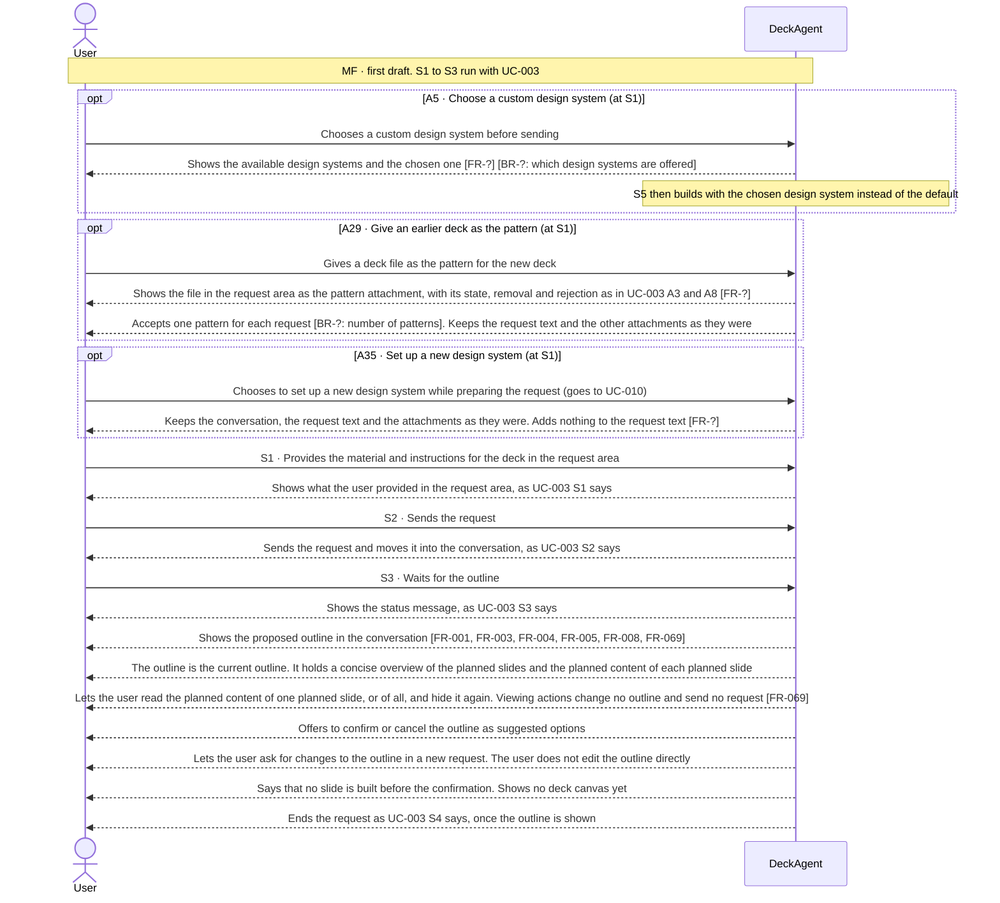
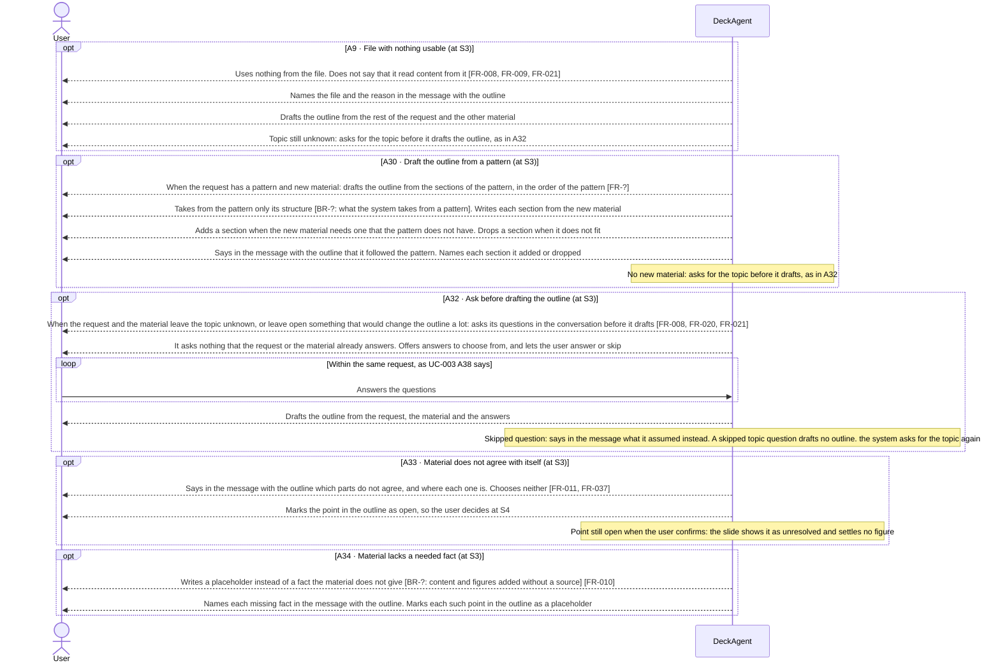
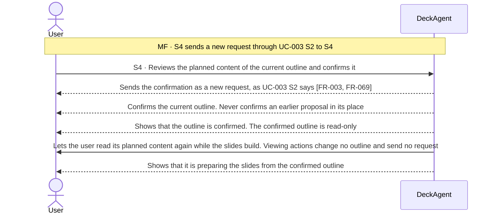
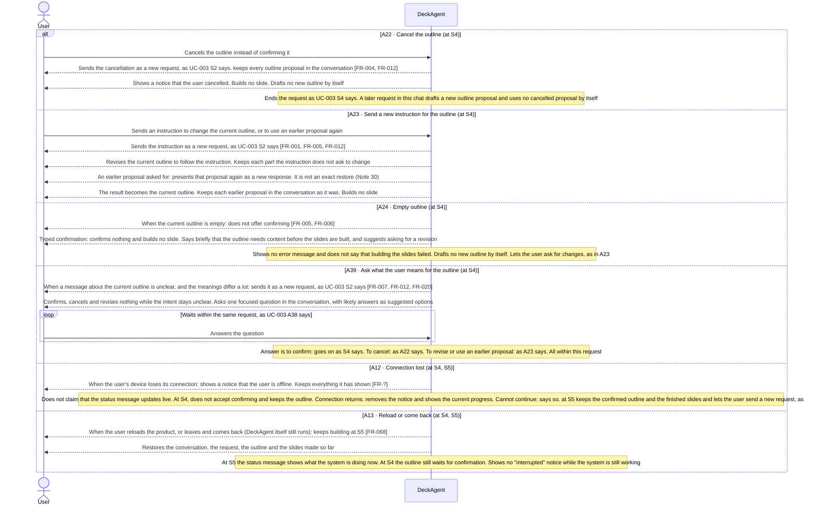
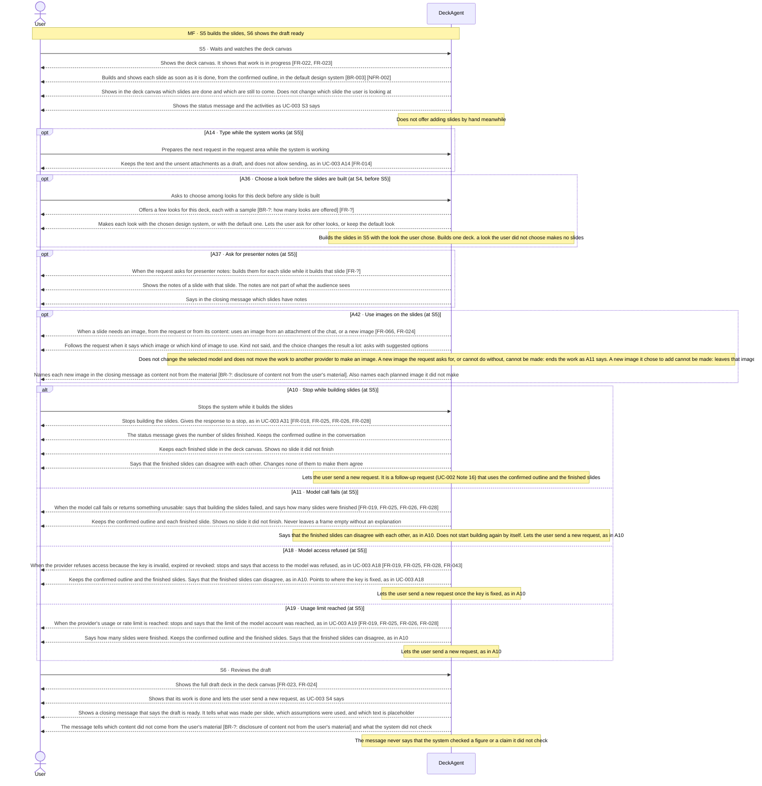

Updated at: 25-10-2026

<!-- A use case models the ideal product (UCG-01 in 03-use-cases/_CRITERIA.md). Every flow it holds is a
     behavior selected for the ideal product; this use case records no rejected options. A version file
     under docs/versions/ names the flows it takes; the use case holds no versions field (UCG-09).
     Write in plain English: docs/spec/_STYLE.md (UCG-11).
     Write intent and response, never interface (UCG-13, _STYLE rule 10). Open questions live in the
     design backlog of the ideal spec, outside docs/spec/. -->

## Goal

The user has material for a presentation, such as rough ideas, notes, a document or photos. The deck is empty. The user wants a first draft of the slides made for them. They do not want to build the deck slide by slide.

## Preconditions

- **Trigger:** The user starts a request in the request area of a chat that has no deck yet.
- **Preconditions:** The chat has no deck and no slides yet.

## Interactions

How to read the interactions:

- S1 to S3 run the main flow of UC-003 (`includes` UC-003). The request is prepared and sent there, and the system works there. This use case adds what is specific to the first draft. Each other way to enter input is a flow of UC-003 (A2 to A4, and A25).
- The request ends at S3, when the outline is shown and the system waits for the user to confirm it.
- Confirming the outline (S4) sends a new request. S4 to S6 run UC-003 S2 to S4 for it. This use case adds what is specific to the first draft.
- A confirmation given as the answer to a question (A39) stays in the request that asked. It starts no second request.
- In a flow that starts at S4 or S5, "as UC-003 … says" reuses wording only. It does not call UC-003.
- The user reviews the outline and changes it through the conversation (Note 29). A clear typed instruction and a suggested option have the same result.
- The deck uses the default design system. Choosing another one is A5.
- A5 is designed into the product. Which version takes it is a scope decision, not a product-design status.
- A choice to make a presentation or a new deck comes here. The user gives the material, the system asks what is missing before it drafts (A32), and the user confirms the outline before any slide exists (S4, Note 5). It adds no approval step beside the outline.

### From the request to the outline proposal (S1 to S3)

```mermaid
sequenceDiagram
    actor User
    participant DeckAgent
    Note over User,DeckAgent: MF · first draft. S1 to S3 run with UC-003
    opt A5 · Choose a custom design system (at S1)
        User->>DeckAgent: Chooses a custom design system before sending
        DeckAgent-->>User: Shows the available design systems and the chosen one [FR-?] [BR-?: which design systems are offered]
        note over DeckAgent: S5 then builds with the chosen design system instead of the default
    end
    opt A29 · Give an earlier deck as the pattern (at S1)
        User->>DeckAgent: Gives a deck file as the pattern for the new deck
        DeckAgent-->>User: Shows the file in the request area as the pattern attachment, with its state, removal and rejection as in UC-003 A3 and A8 [FR-?]
        DeckAgent-->>User: Accepts one pattern for each request [BR-?: number of patterns]. Keeps the request text and the other attachments as they were
    end
    opt A35 · Set up a new design system (at S1)
        User->>DeckAgent: Chooses to set up a new design system while preparing the request (goes to UC-010)
        DeckAgent-->>User: Keeps the conversation, the request text and the attachments as they were. Adds nothing to the request text [FR-?]
    end
    User->>DeckAgent: S1 · Provides the material and instructions for the deck in the request area
    DeckAgent-->>User: Shows what the user provided in the request area, as UC-003 S1 says
    User->>DeckAgent: S2 · Sends the request
    DeckAgent-->>User: Sends the request and moves it into the conversation, as UC-003 S2 says
    User->>DeckAgent: S3 · Waits for the outline
    DeckAgent-->>User: Shows the status message, as UC-003 S3 says
    DeckAgent-->>User: Shows the proposed outline in the conversation [FR-001, FR-003, FR-004, FR-005, FR-008, FR-069]
    DeckAgent-->>User: The outline is the current outline. It holds a concise overview of the planned slides and the planned content of each planned slide
    DeckAgent-->>User: Lets the user read the planned content of one planned slide, or of all, and hide it again. Viewing actions change no outline and send no request [FR-069]
    DeckAgent-->>User: Offers to confirm or cancel the outline as suggested options
    DeckAgent-->>User: Lets the user ask for changes to the outline in a new request. The user does not edit the outline directly
    DeckAgent-->>User: Says that no slide is built before the confirmation. Shows no deck canvas yet
    DeckAgent-->>User: Ends the request as UC-003 S4 says, once the outline is shown
```

### Drafting the outline (branches at S3)

```mermaid
sequenceDiagram
    actor User
    participant DeckAgent
    opt A9 · File with nothing usable (at S3)
        DeckAgent-->>User: Uses nothing from the file. Does not say that it read content from it [FR-008, FR-009, FR-021]
        DeckAgent-->>User: Names the file and the reason in the message with the outline
        DeckAgent-->>User: Drafts the outline from the rest of the request and the other material
        DeckAgent-->>User: Topic still unknown: asks for the topic before it drafts the outline, as in A32
    end
    opt A30 · Draft the outline from a pattern (at S3)
        DeckAgent-->>User: When the request has a pattern and new material: drafts the outline from the sections of the pattern, in the order of the pattern [FR-?]
        DeckAgent-->>User: Takes from the pattern only its structure [BR-?: what the system takes from a pattern]. Writes each section from the new material
        DeckAgent-->>User: Adds a section when the new material needs one that the pattern does not have. Drops a section when it does not fit
        DeckAgent-->>User: Says in the message with the outline that it followed the pattern. Names each section it added or dropped
        note over DeckAgent: No new material: asks for the topic before it drafts, as in A32
    end
    opt A32 · Ask before drafting the outline (at S3)
        DeckAgent-->>User: When the request and the material leave the topic unknown, or leave open something that would change the outline a lot: asks its questions in the conversation before it drafts [FR-008, FR-020, FR-021]
        DeckAgent-->>User: It asks nothing that the request or the material already answers. Offers answers to choose from, and lets the user answer or skip
        loop Within the same request, as UC-003 A38 says
            User->>DeckAgent: Answers the questions
        end
        DeckAgent-->>User: Drafts the outline from the request, the material and the answers
        note over DeckAgent: Skipped question: says in the message what it assumed instead. A skipped topic question drafts no outline. the system asks for the topic again
    end
    opt A33 · Material does not agree with itself (at S3)
        DeckAgent-->>User: Says in the message with the outline which parts do not agree, and where each one is. Chooses neither [FR-011, FR-037]
        DeckAgent-->>User: Marks the point in the outline as open, so the user decides at S4
        note over DeckAgent: Point still open when the user confirms: the slide shows it as unresolved and settles no figure
    end
    opt A34 · Material lacks a needed fact (at S3)
        DeckAgent-->>User: Writes a placeholder instead of a fact the material does not give [BR-?: content and figures added without a source] [FR-010]
        DeckAgent-->>User: Names each missing fact in the message with the outline. Marks each such point in the outline as a placeholder
    end
```

### Confirming the outline (S4)

```mermaid
sequenceDiagram
    actor User
    participant DeckAgent
    Note over User,DeckAgent: MF · S4 sends a new request through UC-003 S2 to S4
    User->>DeckAgent: S4 · Reviews the planned content of the current outline and confirms it
    DeckAgent-->>User: Sends the confirmation as a new request, as UC-003 S2 says [FR-003, FR-069]
    DeckAgent-->>User: Confirms the current outline. Never confirms an earlier proposal in its place
    DeckAgent-->>User: Shows that the outline is confirmed. The confirmed outline is read-only
    DeckAgent->>User: Lets the user read its planned content again while the slides build. Viewing actions change no outline and send no request
    DeckAgent-->>User: Shows that it is preparing the slides from the confirmed outline
```

- **MF S4:** no evidence line recorded. See Notes 29, 30 and 40.

### Deciding about the outline (branches at S4)

```mermaid
sequenceDiagram
    actor User
    participant DeckAgent
    alt A22 · Cancel the outline (at S4)
        User->>DeckAgent: Cancels the outline instead of confirming it
        DeckAgent-->>User: Sends the cancellation as a new request, as UC-003 S2 says. keeps every outline proposal in the conversation [FR-004, FR-012]
        DeckAgent-->>User: Shows a notice that the user cancelled. Builds no slide. Drafts no new outline by itself
        note over DeckAgent: Ends the request as UC-003 S4 says. A later request in this chat drafts a new outline proposal and uses no cancelled proposal by itself
    else A23 · Send a new instruction for the outline (at S4)
        User->>DeckAgent: Sends an instruction to change the current outline, or to use an earlier proposal again
        DeckAgent-->>User: Sends the instruction as a new request, as UC-003 S2 says [FR-001, FR-005, FR-012]
        DeckAgent-->>User: Revises the current outline to follow the instruction. Keeps each part the instruction does not ask to change
        DeckAgent-->>User: An earlier proposal asked for: presents that proposal again as a new response. It is not an exact restore (Note 30)
        DeckAgent-->>User: The result becomes the current outline. Keeps each earlier proposal in the conversation as it was. Builds no slide
    else A24 · Empty outline (at S4)
        DeckAgent-->>User: When the current outline is empty: does not offer confirming [FR-005, FR-006]
        DeckAgent-->>User: Typed confirmation: confirms nothing and builds no slide. Says briefly that the outline needs content before the slides are built, and suggests asking for a revision
        note over DeckAgent: Shows no error message and does not say that building the slides failed. Drafts no new outline by itself. Lets the user ask for changes, as in A23
    else A39 · Ask what the user means for the outline (at S4)
        DeckAgent-->>User: When a message about the current outline is unclear, and the meanings differ a lot: sends it as a new request, as UC-003 S2 says [FR-007, FR-012, FR-020]
        DeckAgent-->>User: Confirms, cancels and revises nothing while the intent stays unclear. Asks one focused question in the conversation, with likely answers as suggested options
        loop Waits within the same request, as UC-003 A38 says
            User->>DeckAgent: Answers the question
        end
        note over DeckAgent: Answer is to confirm: goes on as S4 says. To cancel: as A22 says. To revise or use an earlier proposal: as A23 says. All within this request
    else A12 · Connection lost (at S4, S5)
        DeckAgent-->>User: When the user's device loses its connection: shows a notice that the user is offline. Keeps everything it has shown [FR-?]
        note over DeckAgent: Does not claim that the status message updates live. At S4, does not accept confirming and keeps the outline. Connection returns: removes the notice and shows the current progress. Cannot continue: says so. at S5 keeps the confirmed outline and the finished slides and lets the user send a new request, as in A10
    else A13 · Reload or come back (at S4, S5)
        DeckAgent-->>User: When the user reloads the product, or leaves and comes back (DeckAgent itself still runs): keeps building at S5 [FR-068]
        DeckAgent-->>User: Restores the conversation, the request, the outline and the slides made so far
        note over DeckAgent: At S5 the status message shows what the system is doing now. At S4 the outline still waits for confirmation. Shows no "interrupted" notice while the system is still working
    end
```

### Building the slides and reviewing the draft (S5 and S6)

```mermaid
sequenceDiagram
    actor User
    participant DeckAgent
    Note over User,DeckAgent: MF · S5 builds the slides, S6 shows the draft ready
    User->>DeckAgent: S5 · Waits and watches the deck canvas
    DeckAgent-->>User: Shows the deck canvas. It shows that work is in progress [FR-022, FR-023]
    DeckAgent-->>User: Builds and shows each slide as soon as it is done, from the confirmed outline, in the default design system [BR-003] [NFR-002]
    DeckAgent-->>User: Shows in the deck canvas which slides are done and which are still to come. Does not change which slide the user is looking at
    DeckAgent-->>User: Shows the status message and the activities as UC-003 S3 says
    note over DeckAgent: Does not offer adding slides by hand meanwhile
    opt A14 · Type while the system works (at S5)
        User->>DeckAgent: Prepares the next request in the request area while the system is working
        DeckAgent-->>User: Keeps the text and the unsent attachments as a draft, and does not allow sending, as in UC-003 A14 [FR-014]
    end
    opt A36 · Choose a look before the slides are built (at S4, before S5)
        User->>DeckAgent: Asks to choose among looks for this deck before any slide is built
        DeckAgent-->>User: Offers a few looks for this deck, each with a sample [BR-?: how many looks are offered] [FR-?]
        DeckAgent-->>User: Makes each look with the chosen design system, or with the default one. Lets the user ask for other looks, or keep the default look
        note over DeckAgent: Builds the slides in S5 with the look the user chose. Builds one deck. a look the user did not choose makes no slides
    end
    opt A37 · Ask for presenter notes (at S5)
        DeckAgent-->>User: When the request asks for presenter notes: builds them for each slide while it builds that slide [FR-?]
        DeckAgent-->>User: Shows the notes of a slide with that slide. The notes are not part of what the audience sees
        DeckAgent-->>User: Says in the closing message which slides have notes
    end
    opt A42 · Use images on the slides (at S5)
        DeckAgent-->>User: When a slide needs an image, from the request or from its content: uses an image from an attachment of the chat, or a new image [FR-066, FR-024]
        DeckAgent-->>User: Follows the request when it says which image or which kind of image to use. Kind not said, and the choice changes the result a lot: asks with suggested options
        note over DeckAgent: Does not change the selected model and does not move the work to another provider to make an image. A new image the request asks for, or cannot do without, cannot be made: ends the work as A11 says. A new image it chose to add cannot be made: leaves that image out
        DeckAgent-->>User: Names each new image in the closing message as content not from the material [BR-?: disclosure of content not from the user's material]. Also names each planned image it did not make
    end
    alt A10 · Stop while building slides (at S5)
        User->>DeckAgent: Stops the system while it builds the slides
        DeckAgent-->>User: Stops building the slides. Gives the response to a stop, as in UC-003 A31 [FR-018, FR-025, FR-026, FR-028]
        DeckAgent-->>User: The status message gives the number of slides finished. Keeps the confirmed outline in the conversation
        DeckAgent-->>User: Keeps each finished slide in the deck canvas. Shows no slide it did not finish
        DeckAgent-->>User: Says that the finished slides can disagree with each other. Changes none of them to make them agree
        note over DeckAgent: Lets the user send a new request. It is a follow-up request (UC-002 Note 16) that uses the confirmed outline and the finished slides
    else A11 · Model call fails (at S5)
        DeckAgent-->>User: When the model call fails or returns something unusable: says that building the slides failed, and says how many slides were finished [FR-019, FR-025, FR-026, FR-028]
        DeckAgent-->>User: Keeps the confirmed outline and each finished slide. Shows no slide it did not finish. Never leaves a frame empty without an explanation
        note over DeckAgent: Says that the finished slides can disagree with each other, as in A10. Does not start building again by itself. Lets the user send a new request, as in A10
    else A18 · Model access refused (at S5)
        DeckAgent-->>User: When the provider refuses access because the key is invalid, expired or revoked: stops and says that access to the model was refused, as in UC-003 A18 [FR-019, FR-025, FR-028, FR-043]
        DeckAgent-->>User: Keeps the confirmed outline and the finished slides. Says that the finished slides can disagree, as in A10. Points to where the key is fixed, as in UC-003 A18
        note over DeckAgent: Lets the user send a new request once the key is fixed, as in A10
    else A19 · Usage limit reached (at S5)
        DeckAgent-->>User: When the provider's usage or rate limit is reached: stops and says that the limit of the model account was reached, as in UC-003 A19 [FR-019, FR-025, FR-026, FR-028]
        DeckAgent-->>User: Says how many slides were finished. Keeps the confirmed outline and the finished slides. Says that the finished slides can disagree, as in A10
        note over DeckAgent: Lets the user send a new request, as in A10
    end
    User->>DeckAgent: S6 · Reviews the draft
    DeckAgent-->>User: Shows the full draft deck in the deck canvas [FR-023, FR-024]
    DeckAgent-->>User: Shows that its work is done and lets the user send a new request, as UC-003 S4 says
    DeckAgent-->>User: Shows a closing message that says the draft is ready. It tells what was made per slide, which assumptions were used, and which text is placeholder
    DeckAgent-->>User: The message tells which content did not come from the user's material [BR-?: disclosure of content not from the user's material] and what the system did not check
    note over DeckAgent: The message never says that the system checked a figure or a claim it did not check
```

## Behavior constraints

- The outline is a checkpoint. The system builds no slide until the user confirms the outline (Note 5).
- One chat holds at most one confirmed outline (Note 39). The checkpoint applies to this first draft only.
- Each outline proposal is a response in the conversation. One of them is the **current outline** (Note 30).
- An outline proposal that the system did not finish is not the current outline (Note 39). No flow recovers an unfinished outline.

- **Postconditions:**
  - The chat holds the confirmed outline.
  - The deck has slides made from that outline.
  - The slides use the default design system, or the chosen one when A5 was used.
  - The deck canvas shows the slides.
- **Minimal guarantee:** Whatever branch fails or is interrupted:
  - The request text and attached material are kept. They stay in the conversation if the user sent them, and in the request area if not.
  - Each outline proposal already shown stays in the conversation.
  - Each finished slide stays in the deck.
  - The user does not have to enter anything again.

## Notes

1. Design choice for an ADR proposal: the default design system is fixed (hardcoded). What the default is, and how a later custom design system replaces it, is open.
2. Moved to UC-003 (Note 1).
3. Moved to UC-003 (Note 2).
4. Accessibility (keyboard operation, announcements to assistive technology, zoom) is not written into steps. NFR-013 covers keyboard use and screen readers in every part of the interface, so this use case does not cite it.
5. the outline checkpoint applies to the first draft only. A follow-up request shows no outline and changes the deck canvas directly (UC-002). Design choice for an ADR proposal: within the first draft, the outline is a mandatory checkpoint, and one chat holds one outline. It stands between the request and any change to the canvas. A request that fails or is cancelled then costs the user only the outline. The outline is part of this use case, not a separate one.
6. Moved to UC-003 (Note 8). The same promise applies to A12 and A13 here.
7. Moved to UC-003 (Note 3).
8. Moved to UC-003 (Note 4).
9. Moved to UC-003 (Note 5).
10. A10 keeps the slides already made when the user stops the system. The team did not record this in Claude Slide Design, and DeckAgent does not copy it.
11. Moved to UC-003 (Note 6).
12. Retired: the model is not locked for a run. The user can choose a model for any request (UC-003 Note 7).
13. Moved to UC-003 (Note 7).
14. The ways to enter a request and the run failures at S3 moved to UC-003 with the same flow IDs. These IDs are retired here: A1, A2, A3, A4, A6, A8, A15, A16, A17, A20, A25, A26, A27 and A28. A11, A12, A13, A14, A18 and A19 stay here for the steps after the outline is confirmed.
15. an earlier deck can be the pattern for a new deck (A29, A30). The pattern is a strong reference for the structure of the outline, not a fixed form. The system adds or drops a section when the new material needs it. The pattern sets no content and no look, so the slides use the default design system or the one chosen in A5. A pattern whose file has nothing usable is an attachment with nothing usable (A9).
16. A deck made in an earlier chat is not covered as a pattern. UC-006 lets the user find and open an earlier chat. It does not give the deck of that chat as a pattern. Whether a pattern can come from an earlier chat is open.
17. Retired: A21 (stop while drafting the outline). UC-003 A31 gives the same response at S3, through `includes`. It also said then that trying again sends the same request again. Since 2026-10-11, A31 no longer offers to try again (UC-003 Note 17). A21 added no response about the outline, because no outline is shown before the stop. The ID is never reused.
18. A7 and A32 both explore a request with no topic. A7 shows a sample outline. A32 asks first. Both stay as explored flows (Open questions). Replaced in part by Note 25: a request with no topic gets a question. A7 is retired (Note 28).
19. Asking before the outline (A32) is part of drafting the outline, so it belongs here and not to UC-003. Whether the answer is a new request through UC-003 was open. Settled: the answer is part of the same request (UC-003 Note 22).
20. Missing material (A34) and material that does not agree with itself (A33) are separate flows. A34 has nothing to use. A33 has two things that cannot both be used. A32 can also ask about either one (Open questions).
21. S6 names sources and says what was not checked. It does not check a claim. Naming a source is not a check that the claim is true. Since 2026-10-13, S6 need not name the source of each figure (Note 39).
22. A design system (A5, UC-010) is a set of rules the user can use for many decks. A look (A36) is how this one deck is shown. A look can use a design system. Choosing a look saves no design system.
23. A35 goes to UC-010, because the user leaves the first draft to set up a design system. Choosing a design system that is set up (A5) does not go there.
24. Presenter notes belong to the slides they go with. They are not a goal of their own, so they are a flow here (A37) and in UC-002 (A9). UC-004 A2 decides whether they go in the file. How notes are kept is not part of this use case.
25. before the outline, the system asks only the questions it needs (minimum necessary clarification). This settles the earlier open question on a request with no topic. The system asks first (A32) and shows no sample outline (A7).
   - It uses the request and the material first.
   - Topic still unknown: it asks for the topic before the outline. Other missing information would change the outline a lot: it asks about it.
   - It asks no fixed number of questions. It asks nothing only to explore a topic it knows enough about.
   - Enough information: it drafts the outline. It shows the assumptions left, so the user can check and correct them.
26. Stop and failure in the first draft: UC-003 Notes 17 to 20 hold the owner decisions of 2026-10-11. They agree with Note 10 here. A10, A11, A12, A18 and A19 follow them. Until 2026-10-11, these flows offered to try again from the confirmed outline. Trying again is now a future candidate (UC-003 Note 18). A new request after a stop or a failure is a follow-up request (UC-002 Note 16). It shows no second outline. The first draft does not count as finished.
27. Files as material: UC-003 Note 21 holds the owner decision of 2026-10-11. A file the system can read only in part is settled by UC-003 Note 32.
28. Retired: A7 (request has no topic). A7 showed a sample outline with placeholder headings. It said that no topic was given, and let the user edit the outline at S4. Its evidence came from two products. In Claude Slide Design, a near-black picture got a placeholder deck without questions. A vague one-line request got two questions first there. In Napkin AI, a picture without text got questions before the outline. Note 25 has the system ask for the topic instead (A32). The ID is never reused.
29. the user changes the outline through the conversation (chat-based outline editing).
   - The user reads the outline, asks for changes, confirms it or cancels it. The user does not edit its titles or points directly.
   - A clear typed instruction can confirm, cancel or revise the outline. A suggested option sends the same instruction, with the same result (UC-003 Note 23).
   - A positive message is not always a confirmation. "Looks good, but add a slide on costs" asks for a change (A23).
   - An unclear message gets a question first, as Note 25 says (Note 32).
   - Confirming (S4) and cancelling (A22) each send a new request. The request that drafted the outline has already ended.
   - A revision changes only what the instruction asks for. A request gives no permission to change content outside its scope.
   - Direct editing of slides is a future capability (UC-007). The deck canvas stays the place to review slides.
30. each outline proposal is a response in the conversation (outline conversation model).
   - The system shows each proposal as its own response. There is no separate place to view or edit the outline.
   - A revision shows a new response (A23). Earlier proposals stay in the conversation as they were.
   - The current outline is the proposal in the latest outline response. A revision starts from it, and a confirmation confirms it.
   - The slides are built from the confirmed outline. An earlier proposal never becomes current by itself.
   - The user can ask for an earlier proposal again (A23). The system presents it again as a new response.
   - That is a revision through the conversation, not an undo or a deck history (UC-008). It promises no exact copy.
   - An unclear reference to an earlier proposal gets a question first (Note 32).
   - Note 5 still holds: one chat holds one outline. Its proposals can show as several responses. Cancelling (A22) removes none of them.
   - How the system keeps proposals is not part of this use case. It is a matter for an ADR.
31. a confirmation of an empty outline gets guidance, not an error (A24).
   - The system confirms nothing and builds no slide.
   - To a typed confirmation, it says briefly that the outline needs content before the slides are built. It suggests asking for a revision.
   - This is a check on the request, not a failure of the work. The system does not say that building the slides failed.
   - "Shows no error message" means no error. It does not mean that the system stays silent.
   - It drafts no new outline by itself and adds no confirmation step.
   - What counts as an empty outline is not decided here.
32. an unclear message about the outline gets a question first.
   - A message about the current outline can leave unclear whether the user wants to confirm, revise or do something else. "OK?" is an example.
   - The system never takes an unclear message as a confirmation.
   - It asks one focused question when the possible meanings lead to results that differ a lot. It does not ask when the context makes the intent clear.
   - It changes no outline and builds no slide before the user answers.
   - The user answers in the conversation or by a suggested option. The answer is part of the same request (UC-003 A38 and Note 22).
   - "Looks good, but add a slide on costs" revises the outline (A23). "Confirm this outline and create the slides" confirms it (S4).
   - These examples show intent. They are not fixed words.
   - This follows minimum necessary clarification (Note 25). An unclear reference to an earlier proposal (Note 30) gets a question in the same way.
   - A39 asks this question since 2026-10-12 (Note 33). UC-003 A38 covers the wait and the answer.
33. a separate flow, A39, asks about an unclear message during the outline review.
   - A32 stays the question before the first outline. A39 asks while the user reviews an outline.
   - A39 covers an unclear confirmation, an unclear revision and an unclear reference to an earlier proposal.
   - The answer goes on as S4, A22 or A23 says, within the same request. It starts no second request.
   - A reply that does not settle the question gets another question when it still matters (UC-003 A38 and Note 24).
   - A39 is the flow that asks. This settles the earlier open question on which flow asks.
34. the system can use general knowledge when it drafts the outline (knowledge use).
   - It can add relevant general knowledge that helps the user's goal. It need not cite each such statement. This needs no web search.
   - It never presents uncertain information as a checked fact.
   - It keeps the meaning of the user's material. It can say a fact in other words or in an equal form, such as "one in four" for 25%.
   - It never adds a fact and says that it comes from the material.
   - It never invents a missing fact about the user's own subject, such as their organization, project or results. A34 applies to such facts.
   - It can make a reasonable inference that does not change the result a lot. It never presents an inference as a fact from the material.
   - An uncertainty that changes the result a lot gets a question first (Note 25).
   - The user asks to use only their material: the system adds no outside factual claim. An attached file alone does not ask for that.
   - Two parts of the material disagree: the system never uses one as settled without telling the user (A33). Open question 2 stays open. Note 39 settles it.
35. images on slides (A42, and UC-002 A12).
   - The agent can use images from the attachments the user gave.
   - The agent can make new images for slides.
   - Not decided: how new images are made, by which model or provider, and whether every model can make them. These stay open for architecture research.
   - The system adds no image service, no image search and no images from the internet. It never changes the selected model and never moves the work to another provider to make an image.
   - A missing capability follows the rules for work that cannot finish (A11, UC-003 A11). Note 38 refines this for a new image the agent chose to add.
   - Using images from attachments approves no file type. The accepted types stay in BR-001.
   - Note 38 says when the system asks about images.
36. the language of the deck.
   - The system writes the outline and the slides in the language the user asks for.
   - When the language is unclear, the rules for clarification apply (Note 25).
   - Vietnamese and English are checked first. This is not a list of languages DeckAgent commits to.
37. reloading or closing the interface (A13). The decision is UC-003 Note 30.
38. choosing a kind of image, and a new image that cannot be made (A42, UC-002 A12).
   - A clear request for attached images, or for new images, is followed. The system asks no question about it.
   - The request does not say, and the choice changes the result a lot: the system asks with suggested options (UC-003 A38). Otherwise it chooses within the request.
   - The system asks no question by default before it builds slides.
   - A new image that the user asked for, or that the result cannot do without, cannot be made: the work cannot finish (A11, UC-003 A11). Finished slides stay. Nothing else takes the place of the image.
   - A new image that the agent chose to add cannot be made: the agent leaves it out and finishes the rest, when the result still meets the request. The closing message says that the image was not made. The system never claims an image it did not make.
   - "Cannot be made" means that no valid way to make the image is available for the request, or that making it fails. A selected model with no image output does not by itself mean that.
   - Reading images, making images and placing an existing image are separate capabilities. How each one works is a matter for architecture research (UC-003 Note 34).
39. the outline, the closing message and an unfinished outline.
   - Before the outline, the topic must be known. The purpose, the audience, the detail, the number of slides and the emphasis count when they are relevant (A32).
   - Missing information gets a question only when it changes the result a lot. The system uses the clarification rules of Note 25 and suggested options.
   - No fixed form, no number of required items and no interface layout is set. An internal checklist is an idea for later design work, not a requirement.
   - Topic still unknown after the user skipped the question: the system makes up no topic and drafts no outline. It asks for the topic again (A32).
   - Two parts of the material disagree: the system says so, chooses neither and keeps the point open (A33). Confirmed with the point open: the slide shows it as unresolved. No figure is made up, and no part is chosen silently.
   - A number of slides that the user asks for is exact. By default, each planned slide gives one slide, in the order of the confirmed outline, with its planned title. An explicit instruction of the user can ask otherwise. The system adds no slide and changes the structure by itself in no other way (S5).
   - A cancelled outline stays in the conversation and is never treated as confirmed. A new request in the chat gets a new outline proposal. The system uses no cancelled proposal by itself (A22).
   - A chat can hold several outline proposals, cancelled ones included. It holds at most one current outline, at most one confirmed outline and one deck. Note 5 holds in this sense. This adds no chat with several decks.
   - The closing message need not name where each figure comes from (S6). The system does not check each figure against other sources. The user checks the figures before using the presentation.
   - The rules against made-up facts, unsupported claims and false claims of checking stay. So does the disclosure of assumptions, placeholders and content not from the material.
   - Tests of the product check that figures keep the meaning of the material.
   - A suggested option that no longer applies runs no outdated action. The system keeps the current state and tells the user (UC-003 S2).
   - An outline proposal that the system did not finish is not the current outline. The system never presents it as a proposal to confirm, and says that the request did not finish. No flow recovers an unfinished outline.
   - A request that ended before any outline was finished: a later request in the chat gets a new outline proposal. The system does not resume the earlier request, and uses no unfinished outline (UC-006 A4).
   - With no language named, the system uses the language of the request text, where it is clear. The language of an attachment does not override a clear request. A language that stays unclear gets the clarification of Note 25.
40. the outline is a detailed content plan, and opening or closing its detail is a viewing action.
   - Each planned slide says what the slide is about and what it argues. It gives the key content, arguments or facts planned for it.
   - A planned slide also holds important figures, placeholders and unresolved points, where they matter.
   - The detail fits the purpose of the slide. No number of points is set.
   - The outline is a content plan, not the final slide. It does not need every final sentence.
   - It holds enough detail for the user to review the plan. The user can find content that is missing, incorrect or poorly organized before the slides are built.
   - The system shows the outline as a concise overview of the planned slides. The user can read the detail of one planned slide or of all planned slides, and hide it again.
   - These are viewing actions: they change no outline, confirm nothing and send no request. The confirmed outline keeps the same detail and stays read-only.
