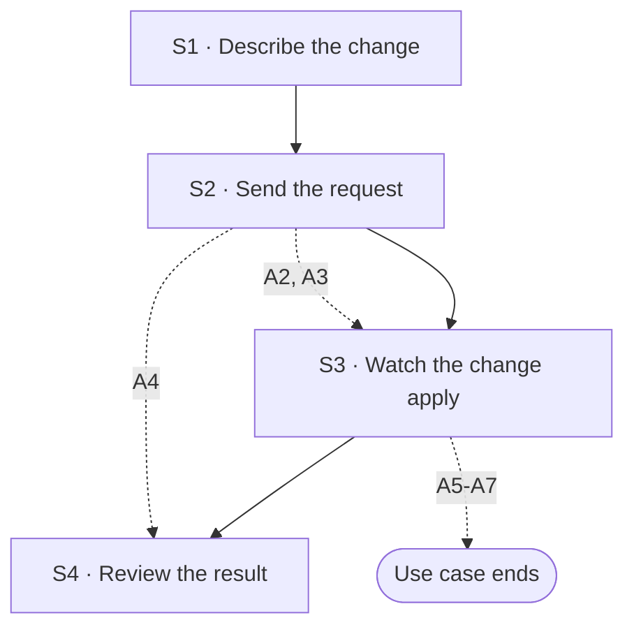

## Flow at a glance

<!-- BEGIN generated: use-case-flowchart -->

*Solid arrows are the main flow. Dotted arrows are alternative flows, labelled with their IDs.*
*Not drawn (the flow stays at the same step): A1, A8 and A9.*
<!-- END generated: use-case-flowchart -->

## Situation and goal

- The user has a deck with slides and sees something to change. Examples are one slide, the tone of the whole deck, or a missing slide.
- The user wants the system to make the change from a request in their own words.
- The user does not want to rebuild the deck. They want everything they did not ask to change to stay as it is.

## Trigger and preconditions

- **Trigger:** The user sends a request in a chat whose deck already has slides.
- **Preconditions:** The deck has at least one slide. The system is not working on another request.
- **Evidence:** [observed: napkin-report (after the deck was ready, the user sent a follow-up request in the same conversation)]

## Main flow

- S1 to S3 call UC-003 S1 to S3. The request is prepared and sent there, and the system works there. Writing the request text is UC-003 S1. Every other way to enter the request, including the choice of model, is an alternative flow of UC-003.
- S4 ends the request, as UC-003 S4 says. S4 also shows what this request changed.
- The main flow covers a request that names the slides it changes. The request can also ask for new slides.
- The system changes only the slides the request names. It leaves every other slide as it was.
- The system shows no outline for a follow-up request.
- A request that would change slides it does not name goes to A1 to A4.

### S1 · Describe the change

- **User:** Describes the change in the request area. The user names the slide and says what to change.
- **System:**
  - Shows what the user wrote in the request area, as UC-003 S1 says.
- **Reqs:** none
- **Evidence:** [observed: napkin-report (the request named a slide by number and title and said what to add)]
- **Updated at:** 10-10-2026

### S2 · Send the request

- **User:** Sends the request.
- **System:**
  - Sends the request as UC-003 S2 says.
- **Reqs:** none
- **Updated at:** 10-10-2026

### S3 · Watch the change apply

- **User:** Waits and watches the deck canvas.
- **System:**
  - Shows the **status message** as UC-003 S3 says.
  - Says in the conversation which slides it is changing.
  - Changes each named slide in place. The slide keeps its place in the deck.
  - Builds each new slide the request asks for, at the place the request names.
  - Uses the material the user gave earlier in the chat when the request needs it.
  - Leaves every slide the request does not name as it was.
  - Builds and shows no outline.
- **Reqs:** FR-?
- **Evidence:** [observed: napkin-report (the reply says the named slide was updated; no outline appeared)] [assumed: the other slides stayed as they were; the image has no earlier state to compare] [assumed: where a new slide goes; only a request for a slide at the very end was seen] [observed: napkin-report (a request to use a deck file as material for two new slides was refused; the product offered to edit the existing slides)] [assumed: use of earlier material]
- **Updated at:** 09-10-2026

### S4 · Review the result

- **User:** Reviews the changed slides.
- **System:**
  - Shows the changed slides in the deck canvas.
  - Shows that its work is done and lets the user send a new request, as UC-003 S4 says.
  - Shows a closing message that names each slide it changed or added.
  - The message says what changed in each slide.
  - The message says that it changed no other slide.
- **Reqs:** FR-?
- **Evidence:** [observed: napkin-report (the reply names the updated slide and what it added)] [assumed: the message says that no other slide changed]
- **Updated at:** 09-10-2026

## Alternative flows

### A1 · Change would alter slides the request does not name

- **At:** S2
- **End:** Same step
- **When:** The request would change existing slides that it does not name. An example is a new tone for the whole deck.
- **System:**
  - Changes no slide yet.
  - Says in the conversation that the change reaches slides the request does not name.
  - Keeps the user's instruction while it waits.
  - Offers two outcomes: apply to every slide, or keep the instruction and change no slide now.
  - Offers a third outcome, apply to new slides only, when the request asks for a new slide.
  - Waits for the user to choose. The choice leads to A2, A3 or A4.
- **Reqs:** FR-?
- **Evidence:** [observed: napkin-report (a request for a new tone for the whole deck and one new slide got a question with three outcomes)] [observed: napkin-report (the question starts "I've updated the deck's tone", so what changed before the question is not known)] [observed: owner report (the third outcome is not offered when the request asks for no new slide); not recorded] [assumed: no slide changed before the user chose; the image does not show the deck canvas]
- **Updated at:** 08-10-2026

### A2 · Apply the change to every slide

- **At:** S2
- **End:** Continues at S3
- **When:** The user chooses, after A1, to apply the change to every slide.
- **System:**
  - Replaces every existing slide with a new version made with the instruction.
  - Builds each new slide the request asks for with the same instruction.
  - Asks nothing more before it replaces the slides.
- **Reqs:** FR-?
- **Evidence:** [observed: napkin-report (the first outcome offers to regenerate all slides)] [observed: owner report (this outcome overwrites the current deck at once; the owner reports that Napkin AI does the same); not recorded]
- **Updated at:** 08-10-2026

### A3 · Apply the change to new slides only

- **At:** S2
- **End:** Continues at S3
- **When:** The request asks for a new slide. The user chooses, after A1, to apply the change to new slides only.
- **System:**
  - Changes no existing slide.
  - Builds each new slide the request asks for with the new instruction.
- **Reqs:** FR-?
- **Evidence:** [observed: napkin-report (the second outcome offers to create only the new slide)] [observed: owner report (existing slides are protected from the change); not recorded] [assumed: the new slide uses the new instruction]
- **Updated at:** 08-10-2026

### A4 · Keep the instruction for later

- **At:** S2
- **End:** Continues at S4
- **When:** The user chooses, after A1, to keep the instruction and change no slide now.
- **System:**
  - Changes no existing slide.
  - Builds no new slide now.
  - Keeps the instruction for every slide the system builds later in this chat.
  - Says in the conversation that it kept the instruction and changed no slide.
- **Reqs:** FR-?
- **Evidence:** [observed: napkin-report (the third outcome offers to keep the change and not regenerate now)] [observed: owner report (the instruction is kept for slides built later, and no new slide is built now); not recorded]
- **Updated at:** 08-10-2026

### A5 · Request names a slide the system cannot match

- **At:** S3
- **End:** Ends
- **When:** The request names a slide that is not in the deck. Or its slide number and its slide title point to different slides.
- **System:**
  - Changes no slide.
  - Says which part of the request does not match the deck.
  - Says how many slides the deck has.
  - Keeps the sent request in the conversation.
  - Lets the user **edit the request**. Does not send the request again by itself.
- **Reqs:** FR-?
- **Evidence:** [assumed]
- **Updated at:** 10-10-2026

### A6 · Request does not say what to change

- **At:** S3
- **End:** Ends
- **When:** The request names no slide and gives no change the system can act on.
- **System:**
  - Changes no slide.
  - Says that it cannot tell what to change.
  - Keeps the sent request in the conversation.
  - Lets the user edit the request. Does not send the request again by itself.
- **Reqs:** FR-?
- **Evidence:** [assumed]
- **Updated at:** 10-10-2026

### A7 · Stop while changing slides

- **At:** S3
- **End:** Ends
- **When:** The user stops the system while it changes slides.
- **System:**
  - Stops changing slides.
  - Gives the response to a stop, as in UC-003 A31.
  - The **notice** gives the number of slides changed.
  - Keeps every slide as it is at that moment. No slide is half changed.
  - What trying again does to the deck is open (Open questions).
- **Reqs:** FR-?
- **Evidence:** [observed: claude-report (stop during a run: a notice that offers to edit the request or try again)] [assumed: a stop during a follow-up behaves the same] [observed: napkin-report (offers no way to stop it)]
- **Updated at:** 10-10-2026

### A8 · Change the look of the deck

- **At:** S3
- **End:** Same step
- **When:** The request changes how slides look and not what they say. Examples are new colours, new fonts or another design system.
- **System:**
  - Changes the look of each slide the change reaches: the named slides, or every slide after A2.
  - Uses the design system the request names [BR-?: which design systems are offered].
  - Says in the conversation each slide whose content changed to fit the new look, and what changed.
  - Keeps the earlier design system among those the user can choose.
- **Reqs:** FR-?
- **Evidence:** [observed: napkin-report (after a change, the product offered to change the brand style as a next step; not tried)] [assumed: the response]
- **Updated at:** 10-10-2026

### A9 · Change presenter notes

- **At:** S3
- **End:** Same step
- **When:** The request asks to add or change the presenter notes of named slides.
- **System:**
  - Adds or changes the notes of each named slide.
  - Changes nothing the audience sees on those slides.
  - Keeps the notes of every other slide as they were.
  - Says in the closing message which slides have new notes.
- **Reqs:** FR-?
- **Evidence:** [assumed]
- **Updated at:** 10-10-2026

## Postconditions and minimal guarantee

Proposals, to be confirmed against recordings.

- **Postconditions:**
  - Main flow: the slides the request named show the change. Every other slide is as it was.
  - A2: every slide is a new version made with the instruction.
  - A3: only new slides were added. Existing slides are as they were.
  - A4: no slide changed. The instruction is kept for later slides.
  - The conversation holds the request and the closing message.
- **Minimal guarantee:** Whatever branch fails or is interrupted:
  - The request text is kept in the conversation.
  - Each slide is either as it was before the request or fully changed.
  - The user does not have to enter the request again.
- **Evidence:** [assumed]

## Product evidence

### Claude Slide Design

- **Coverage:** unverified
- **Research card:** [claude-deck-generation-behavior](../../research/use-cases/claude-slides-design/claude-deck-generation-behavior.md)
- **Difference:**
  - The team recorded a second request sent during a run. The system added one slide to the deck.
  - The team did not record a follow-up request after the draft was finished.
  - Its waiting messages say a user can comment on a slide for Claude to revise it. The team did not try this.
- **Updated at:** 08-10-2026

### Napkin AI

- **Coverage:** observed
- **Research card:** [napkin-ai-deck-generation-behavior](../../research/use-cases/napkin-ai/napkin-ai-deck-generation-behavior.md)
- **Difference:**
  - A request that named one slide changed that slide in place. No outline appeared.
  - A request for a new tone and one new slide got a question with three outcomes.
  - After a change, the system offers next steps: export the deck, edit another slide, change the brand style, add more slides.
  - A request with a deck file and a request for two new slides was refused. The product said it cannot add slides to this deck.
  - The product offered to edit the four existing slides instead.
  - In another chat the same product offered to create a new slide.
  - The team saw no way to stop the system.
- **Updated at:** 09-10-2026

## Open questions

1. A7: when the user tries again after a stop, which deck does the work start from? The deck as the stop left it, or the deck before the request? Owner to decide.
2. A7: what work runs again? The whole request, or only the changes not yet made? Owner to decide.
3. A7: how does the system avoid making the same change twice, for example adding the same new slide again? Owner to decide.
4. S3, A2, A8: the user changed a slide by hand (UC-007). A later request changes that slide, or every slide (A2). What happens to the change by hand? Owner to decide.
5. S3, A1: can the system tell a change by hand from a change it made? Does it say so before it changes such a slide? Owner to decide.
6. A8: when only the look changes, must the text and the figures of each slide stay the same? Owner to decide.
7. A8: what happens to content that does not fit the new look? Is it shortened, split onto another slide, or kept with a notice? Owner to decide.
8. A8: does a change of look leave a state in the deck history (UC-008)? Owner to decide.
9. A9: when a request changes a slide, do its presenter notes change with it? Owner to decide.

## Notes

1. Design decision (owner, 2026-10-08): a request that names the slides it changes is applied in place. Every other slide stays as it was.
2. Design decision (owner, 2026-10-08): a follow-up request never shows an outline. The outline checkpoint applies to the first draft only. The internal data structure is a backend concern, not part of this use case.
3. Design decision (owner, 2026-10-08): a request that would change slides it does not name gets outcomes before any slide changes (A1 to A4). A request that asks for no new slide is not offered "new slides only".
4. Design decision (owner, 2026-10-08): the system protects every slide the request does not name. It does so even when the change leaves the deck inconsistent, for example a repeated number.
5. Design decision (owner, 2026-10-08): the user can choose another model for a follow-up request, as for any request (UC-003 A27).
6. One use case, not two. Both paths share the goal, the trigger, the preconditions and the result. The user does not choose the path. The system chooses it from the request. The whole-deck path adds one decision, so it is an alternative flow.
7. Changes the user makes by hand, without asking the system, are a different goal. They are UC-007. Note 1 covers the main flow. There, a change by hand on a slide the request does not name stays.
8. A request uses the material the user gave earlier in the chat as context for its changes and new slides. An example is a file attached to an earlier request. The material changes no slide by itself.
9. Proposal, not confirmed (owner, 2026-10-10): "No slide is half changed" (A7) and "Each slide is either as it was before the request or fully changed" (minimal guarantee) are explored, not chosen. They state what the user sees, not how the system saves a slide. Whether DeckAgent commits to them is open.
10. A failure or a stop at S3 also runs the flow of UC-003 for it: A11, A18, A19 or A31. This use case adds only what is specific to the deck. A7 does so for a stop. No flow here says which slides changed before a failure.
11. A request that changes the look of slides it does not name goes to A1, like any such change. A8 adds what is specific to a change of look. Content and look can change in one request. A8 then applies to the look only.
12. A request for another deck from this one, for another use, is UC-011. This use case changes the deck in place and makes no second deck.
