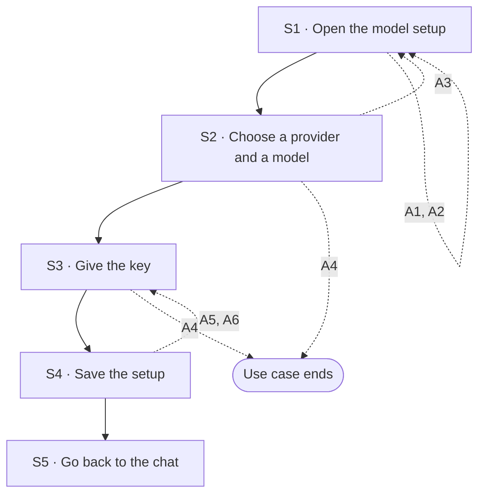

## Flow at a glance

<!-- BEGIN generated: use-case-flowchart -->

*Solid arrows are the main flow. Dotted arrows are alternative flows, labelled with their IDs.*
*Not drawn (the flow stays at the same step): none.*
<!-- END generated: use-case-flowchart -->

## Situation and goal

- The user wants DeckAgent to make a deck with a model they choose.
- The user has an account with a model provider and a key for it.
- The user has no model ready yet, or wants another one, or the key they gave no longer works.
- The user wants the model ready without losing the request they were preparing.

## Trigger and preconditions

- **Trigger:** The user chooses to set up models. Examples: from the request area (UC-003 A28), after a request found no model (UC-003 A17), or at the first start.
- **Preconditions:** DeckAgent runs on the user's computer.
- **Evidence:** [observed: owner report (the option to add or change models opens the model setup dashboard); not recorded] [assumed: the first start as a trigger]

## Main flow

- The main flow adds one model from a provider that needs a key.
- This use case changes which models are set up. Choosing one of them for a chat is UC-003 A27.
- The key belongs to the user's own account with the provider (Vision P-1).
- How and where the system keeps the key is not part of this use case.

### S1 · Open the model setup

- **User:** Chooses to set up models.
- **System:**
  - Opens the model setup **dashboard**.
  - Shows the models that are set up, with the provider of each.
  - Shows the providers the user can add [BR-?: which providers are offered].
  - Keeps the conversation, the request text and the attachments as they were.
- **Reqs:** FR-?
- **Evidence:** [observed: owner report (the option to add or change models opens the model setup dashboard; the request text and files stay); not recorded] [assumed: what the dashboard shows]
- **Updated at:** 10-10-2026

### S2 · Choose a provider and a model

- **User:** Chooses a provider and a model of that provider.
- **System:**
  - Shows the models of the provider that the user can add [BR-?: which models are offered].
  - Says what the provider needs before its models can run, such as a key [BR-?: what each provider needs].
  - Says that the key comes from the user's own account with the provider.
  - Says that each request run with this model goes to this provider.
- **Reqs:** FR-?
- **Evidence:** [assumed]
- **Updated at:** 10-10-2026

### S3 · Give the key

- **User:** Gives the key of their account with the provider.
- **System:**
  - Takes the key for this provider.
  - Does not show the whole key again after the user gives it [BR-?: how a saved key is shown].
  - Never shows the key in the conversation.
- **Reqs:** FR-?
- **Evidence:** [assumed]
- **Updated at:** 10-10-2026

### S4 · Save the setup

- **User:** Saves the setup.
- **System:**
  - Adds the model to the models that are set up.
  - Says that the model is set up.
  - Keeps every model that was set up before.
- **Reqs:** FR-?
- **Evidence:** [assumed]
- **Updated at:** 10-10-2026

### S5 · Go back to the chat

- **User:** Goes back to the chat.
- **System:**
  - Shows the conversation, the request text and the attachments as they were.
  - Offers the new model among the models the user can choose for the chat, as in UC-003 A27.
- **Reqs:** FR-?
- **Evidence:** [observed: owner report (the user chooses among the models that are set up; the chat then uses the chosen model); not recorded]
- **Updated at:** 10-10-2026

## Alternative flows

### A1 · Replace the key of a provider

- **At:** S1
- **End:** Returns to S1
- **When:** The user gives a new key for a provider that is set up. An example is a key the provider refused (UC-003 A18).
- **System:**
  - Replaces the old key of the provider with the new one.
  - Does not show the old key or the whole new key.
  - Keeps every model of the provider set up.
  - Uses the new key for each later request with a model of this provider.
  - Says that the key was replaced.
- **Reqs:** FR-?
- **Evidence:** [assumed]
- **Updated at:** 10-10-2026

### A2 · Remove a model

- **At:** S1
- **End:** Returns to S1
- **When:** The user removes a model that is set up.
- **System:**
  - Removes the model from the models that are set up.
  - Keeps every other model set up.
  - Changes no conversation and no deck.
- **Reqs:** FR-?
- **Evidence:** [assumed]
- **Updated at:** 10-10-2026

### A3 · Provider or model not offered

- **At:** S2
- **End:** Returns to S1
- **When:** The user asks for a provider or a model that is not offered [BR-?: which providers are offered].
- **System:**
  - Says that the provider or the model is not offered.
  - Adds no model.
- **Reqs:** FR-?
- **Evidence:** [assumed]
- **Updated at:** 10-10-2026

### A4 · Leave without saving

- **At:** S2, S3
- **End:** Ends
- **When:** The user leaves the model setup before saving.
- **System:**
  - Adds no model.
  - Keeps no key that the user gave in this setup.
  - Keeps every model that was set up before.
  - Shows the conversation, the request text and the attachments as they were.
- **Reqs:** FR-?
- **Evidence:** [assumed]
- **Updated at:** 10-10-2026

### A5 · Required setup missing

- **At:** S4
- **End:** Returns to S3
- **When:** The user saves, and something the provider needs is missing. An example is the key [BR-?: what each provider needs].
- **System:**
  - Does not add the model.
  - Says what is missing.
  - Keeps what the user gave.
- **Reqs:** FR-?
- **Evidence:** [assumed]
- **Updated at:** 10-10-2026

### A6 · Key refused at setup

- **At:** S4
- **End:** Returns to S3
- **When:** The system checks the key when the user saves, and the provider refuses it. Whether the system checks the key here is open (Open questions).
- **System:**
  - Does not add the model.
  - Says that the provider refused the key.
  - Says why, when the provider gives a reason.
  - Keeps what the user gave, except the refused key.
  - Does not check the key again by itself.
- **Reqs:** FR-?
- **Evidence:** [assumed]
- **Updated at:** 10-10-2026

## Postconditions and minimal guarantee

Proposals, to be confirmed against recordings.

- **Postconditions:**
  - Main flow: the new model is among the models the user can choose for a chat.
  - A1: later requests with a model of the provider use the new key.
  - A2: the model is no longer among the models the user can choose.
  - The conversation, the request text and the attachments are as they were.
- **Minimal guarantee:** Whatever branch fails or is left:
  - Every model set up before is still set up, except one the user removed (A2).
  - The key is never shown in the conversation.
  - The conversation, the request text and the attachments are as they were.
- **Evidence:** [assumed]

## Product evidence

### Claude Slide Design

- **Coverage:** unverified
- **Research card:** [claude-deck-generation-behavior](../../research/use-cases/claude-slides-design/claude-deck-generation-behavior.md)
- **Difference:**
  - The user reports that the product offers a choice of model. The team did not record it.
  - Its settings list an entry for API keys. The team did not open it.
  - The product runs on its own model account. The team saw no step where the user gives a key.
- **Updated at:** 10-10-2026

### Napkin AI

- **Coverage:** not offered
- **Research card:** [napkin-ai-deck-generation-behavior](../../research/use-cases/napkin-ai/napkin-ai-deck-generation-behavior.md)
- **Difference:**
  - The team saw no model name and no choice of model.
- **Updated at:** 10-10-2026

## Open questions

1. A6: does the system check a key when the user saves it, or only when a request runs (UC-003 A18)? Owner to decide.
2. S3: can the user set up a model that runs on their own computer and needs no key? Vision P-1 does not say. Owner to decide.
3. S2: what does each provider need besides a key, for example an address? Owner to decide.
4. S2, A3: which providers and models are offered? Can the user add one that is not offered? Owner to decide.
5. Trigger: at the first start with no model, does the system open the model setup by itself? Or does it wait for a request (UC-003 A17)? Owner to decide.
6. S5: after the user adds a model, which model does the chat use for the next request? Owner to decide.
7. A2: what happens to a chat whose chosen model was removed? Owner to decide.

## Notes

1. This use case changes which models are set up. Choosing a model for a chat or a request is UC-003 A27. One use case, not two: adding, replacing a key and removing share the goal of a ready model.
2. A refused key ends the request (UC-003 A18). The user fixes the key here (A1). A18 does not go to this use case, because the user can choose another model instead.
3. UC-003 A17 and A28 go to this use case. A17 brings a request that found no model. A28 brings a user who chose to set up models.
4. How and where the system keeps the key is an ADR matter. The proposed boundary B-3 in the vision is related.
5. A provider usage limit is a property of the user's provider account (Vision P-1). This use case shows no limit and no price.
6. Whether the system moves to another model by itself when a model fails is not part of this use case. It is not decided.
