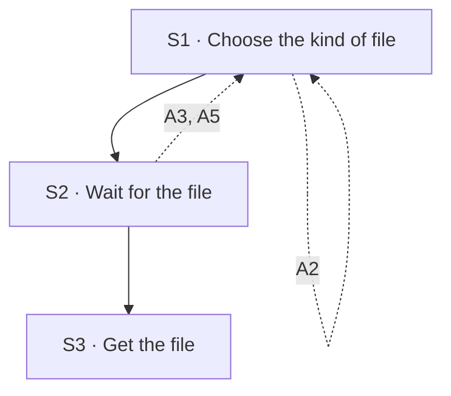

## Flow at a glance

<!-- BEGIN generated: use-case-flowchart -->

*Solid arrows are the main flow. Dotted arrows are alternative flows, labelled with their IDs.*
*Not drawn (the flow stays at the same step): A1 and A6.*
<!-- END generated: use-case-flowchart -->

## Situation and goal

- The user has a deck they are happy with. They want it as a file they can keep, send, print or present.
- The user wants to change the deck in their own tools. Or the user wants a file that looks the same on any device.
- The user wants the deck in the chat to stay as it is.

## Trigger and preconditions

- **Trigger:** The user chooses to get the deck as a file.
- **Preconditions:** The chat has a deck with at least one slide.
- **Evidence:** [observed: napkin-report (after the deck was built, the product offered to export it as a next step)]

## Main flow

- The user gets the deck as an editable file or as a fixed file.
- The export changes the form of the deck. It never changes the content of a slide.
- Presenting is done in the user's own tools, from the file.

### S1 · Choose the kind of file

- **User:** Chooses to get the deck as a file. The user says whether the file is editable or fixed.
- **System:**
  - Offers an editable file and a fixed file [BR-?: export formats].
  - Says in plain words how the two kinds differ.
  - Keeps the conversation, the request text and the attachments as they were.
  - Changes nothing in the deck.
- **Reqs:** FR-?
- **Evidence:** [observed: napkin-report (the product offers an export to a presentation file)] [assumed: the choice between an editable file and a fixed file]
- **Updated at:** 09-10-2026

### S2 · Wait for the file

- **User:** Waits.
- **System:**
  - Shows that the system is preparing the file [NFR-?: wait for the file].
  - Builds the file from the deck as it is now, with every edit the user made.
  - Editable file: keeps text as text and pictures as pictures. The user can change them in their own tools [BR-?: what an editable file keeps].
  - Fixed file: shows every slide the same on any device, with the fonts it needs [BR-?: what a fixed file holds].
  - Leaves presenter notes out of the file unless the user chose to put them in (A2).
  - Changes nothing in the deck.
- **Reqs:** FR-?
- **Evidence:** [assumed]
- **Updated at:** 09-10-2026

### S3 · Get the file

- **User:** Gets the file.
- **System:**
  - Gives the file to the user.
  - Tells the user where the file is.
  - Says in the conversation that the file is ready and how many slides it holds.
  - Keeps the deck as it was.
- **Reqs:** FR-?
- **Evidence:** [assumed]
- **Updated at:** 09-10-2026

## Alternative flows

### A1 · Deck is still being built

- **At:** S1
- **End:** Same step
- **When:** The system is still working on the deck.
- **System:**
  - Does not offer the export yet.
  - Says that the deck is not finished.
- **Reqs:** FR-?
- **Evidence:** [assumed]
- **Updated at:** 09-10-2026

### A2 · Choose whether presenter notes go in the file

- **At:** S1
- **End:** Returns to S1
- **When:** The deck has presenter notes, and the kind of file can hold them [BR-?: what each kind of file keeps].
- **System:**
  - Leaves the presenter notes out of the file by default.
  - Offers to put the presenter notes in the file.
  - Says that anyone who opens the file can read the notes in it.
- **Reqs:** FR-?
- **Evidence:** [inferred: claude-report (the closing message said that each slide has speaker notes; the notes were never opened)] [assumed: the choice and the default]
- **Updated at:** 09-10-2026

### A3 · Export fails

- **At:** S2
- **End:** Returns to S1
- **When:** The system fails while it prepares or saves the file. For example, there is no room to save it.
- **System:**
  - Gives no file.
  - Says that the export failed, and says why when the reason is known.
  - Changes nothing in the deck.
  - Lets the user choose the export again.
- **Reqs:** FR-?
- **Evidence:** [assumed]
- **Updated at:** 09-10-2026

### A5 · Reload or come back

- **At:** S2
- **End:** Returns to S1
- **When:** The user reloads the product, or leaves and comes back.
- **System:**
  - Restores the conversation and the deck as they were.
  - Gives no file that was not finished.
  - Lets the user choose the export again.
- **Reqs:** FR-?
- **Evidence:** [assumed]
- **Updated at:** 09-10-2026

### A6 · Some content cannot be kept

- **At:** S3
- **End:** Same step
- **When:** The kind of file cannot keep some content of a slide. For example, a font or an effect.
- **System:**
  - Gives the file with the rest of the slide.
  - Does not replace the missing part with other content.
  - Names each slide and the part that was not kept in the conversation [BR-?: what each kind of file keeps].
- **Reqs:** FR-?
- **Evidence:** [assumed]
- **Updated at:** 09-10-2026

## Postconditions and minimal guarantee

Proposals, to be confirmed against recordings.

- **Postconditions:**
  - The user has a file of the kind they chose.
  - The file holds every slide of the deck, as the deck was when the export started.
  - The file holds no presenter notes unless the user chose to put them in.
  - The conversation says how many slides the file holds and what was not kept.
- **Minimal guarantee:** Whatever branch fails or is interrupted:
  - The deck in the chat is exactly as it was before the export.
  - The user can choose the export again.
- **Evidence:** [assumed]

## Product evidence

### Claude Slide Design

- **Coverage:** unverified
- **Research card:** [claude-deck-generation-behavior](../../research/use-cases/claude-slides-design/claude-deck-generation-behavior.md)
- **Difference:**
  - The team recorded no way to take the deck out as a file.
  - The closing message said that each slide has speaker notes. The team never opened them.
- **Updated at:** 09-10-2026

### Napkin AI

- **Coverage:** unverified
- **Research card:** [napkin-ai-deck-generation-behavior](../../research/use-cases/napkin-ai/napkin-ai-deck-generation-behavior.md)
- **Difference:**
  - The product offers an export to a presentation file. It offers it in the editor and as a next step after the deck is built.
  - The team did not use it, so what the file holds is not known.
- **Updated at:** 09-10-2026

## Notes

1. Design decision (owner, 2026-10-09): the user gets the deck as an editable file or as a fixed file. The product does not read or edit other people's deck files. It does allow a basic edit of a deck it made, on the deck canvas. That edit is a separate use case. The editable file lets the user go further in their own tools. The file types are a business rule [BR-?: export formats].
2. The export changes the form of the deck, never its content. A change to the content is a request to the system or an edit on the deck canvas. An example is a request to make the deck denser for reading. The export includes every such change.
3. Design decision (owner, 2026-10-09): the product has no way to present the deck. The user presents from the file, in their own tools.
4. The user prints the fixed file. Whether slides print well without colour is a property of the slides and not of the export [NFR-?: readable without colour].
5. This draft assumes the export uses no model and offers no way to stop it. The export is short.
6. Design decision (owner, 2026-10-09): the product has no shared viewing of a deck. The user sends the file. The file leaves the product at S3, so the product cannot control who reads it.
7. Design decision (owner, 2026-10-09): presenter notes stay out of the file by default (A2). The user can choose to put them in. The kinds of file that can hold notes are a business rule.
8. The export writes a file on the user's computer and needs no network. The ID A4 is retired. IDs are never renumbered.
