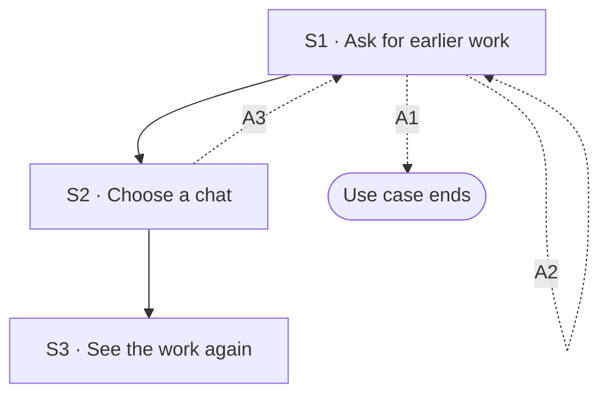

## Flow at a glance

<!-- BEGIN generated: use-case-flowchart -->

*Solid arrows are the main flow. Dotted arrows are alternative flows, labelled with their IDs.*
*Not drawn (the flow stays at the same step): A4, A5 and A6.*
<!-- END generated: use-case-flowchart -->

## Situation and goal

- The user worked on a deck in an earlier chat, on another day or before closing DeckAgent.
- The user wants to see that chat and its deck again.
- The user then wants to change the deck, or get it as a file, without starting over.

## Trigger and preconditions

- **Trigger:** The user chooses to see earlier work.
- **Preconditions:** DeckAgent runs on the user's computer.
- **Evidence:** [assumed]

## Main flow

- The main flow opens an earlier chat in which the system is no longer working.
- A chat is the unit of earlier work, as in the other use cases. It holds the conversation and the slides.
- After S3 the user can change the deck (UC-002) or get it as a file (UC-004). This use case ends at S3.
- How the system keeps a chat is not part of this use case.

### S1 · Ask for earlier work

- **User:** Asks to see earlier work.
- **System:**
  - Shows the earlier chats the user can open [BR-?: which chats are kept].
  - Names each chat from its content.
  - Says for each chat when it last changed.
  - Says for each chat whether it has slides.
  - Keeps the current chat as it was, with its request text and attachments.
- **Reqs:** FR-?
- **Evidence:** [observed: claude-report (the product names each chat by itself from its content)] [assumed: the rest]
- **Updated at:** 10-10-2026

### S2 · Choose a chat

- **User:** Chooses the chat to open.
- **System:**
  - Opens the chosen chat.
  - Starts no work and sends no request.
- **Reqs:** FR-?
- **Evidence:** [assumed]
- **Updated at:** 10-10-2026

### S3 · See the work again

- **User:** Reviews the chat and its deck.
- **System:**
  - Shows the conversation of the chat, in order.
  - Shows the slides of the chat in the deck canvas, as they were when the user last left the chat.
  - Changes no slide.
  - Lets the user send a new request in this chat.
  - Lets the user get the deck as a file.
- **Reqs:** FR-?
- **Evidence:** [inferred: napkin-report (a chat with a deck made earlier still showed its closing message, and the deck was in the editor)] [observed: claude-report (after a reload, the chat came back from history with its messages)] [assumed: opening a chat chosen from earlier work]
- **Updated at:** 10-10-2026

## Alternative flows

### A1 · No earlier work

- **At:** S1
- **End:** Ends
- **When:** There is no earlier chat the user can open.
- **System:**
  - Says that there is no earlier chat.
  - Keeps the current chat as it was.
  - Lets the user start a new chat.
- **Reqs:** FR-?
- **Evidence:** [assumed]
- **Updated at:** 10-10-2026

### A2 · Look for a chat by its words

- **At:** S1
- **End:** Returns to S1
- **When:** The user looks for an earlier chat by words it contains.
- **System:**
  - Shows only the chats whose name or conversation holds the words.
  - No chat matches: says so, and keeps the words the user gave.
  - Lets the user see every earlier chat again.
- **Reqs:** FR-?
- **Evidence:** [assumed]
- **Updated at:** 10-10-2026

### A3 · Chat cannot be opened

- **At:** S2
- **End:** Returns to S1
- **When:** The chosen chat cannot be opened. For example, what the system kept for it is missing or cannot be read.
- **System:**
  - Says that the chat cannot be opened, and says why when the reason is known.
  - Changes no other chat.
  - Keeps the current chat as it was.
- **Reqs:** FR-?
- **Evidence:** [assumed]
- **Updated at:** 10-10-2026

### A4 · Chat has no slides yet

- **At:** S3
- **End:** Same step
- **When:** The chosen chat has no slides. For example, it holds only a request, or an outline the user has not confirmed.
- **System:**
  - Shows the conversation of the chat, in order.
  - Says that the chat has no slides yet.
  - An outline waits for confirmation: it still waits, as in UC-001 A13.
  - No outline: lets the user send a request for a first draft.
- **Reqs:** FR-?
- **Evidence:** [assumed]
- **Updated at:** 10-10-2026

### A5 · Work still running in the chat

- **At:** S3
- **End:** Same step
- **When:** The system is still working on a request in the chosen chat.
- **System:**
  - Shows the chat and the work in progress, as in UC-003 A13.
  - During a first draft: also shows the outline and the slides made so far, as in UC-001 A13.
- **Reqs:** FR-?
- **Evidence:** [observed: claude-report (after a reload, the run went on and the chat showed what the product was doing)] [assumed: the same holds for a chat chosen from earlier work]
- **Updated at:** 10-10-2026

### A6 · Work ended before it finished

- **At:** S3
- **End:** Same step
- **When:** The last request in the chosen chat did not finish, and the system no longer works on it. For example, DeckAgent was closed during the work.
- **System:**
  - Shows the conversation and the slides as the chat kept them.
  - Says that the work on the last request did not finish.
  - Does not start the work again by itself.
  - Keeps the request in the conversation.
  - Lets the user **edit the request** or **try again**. What trying again does is open (Open questions).
- **Reqs:** FR-?
- **Evidence:** [observed: claude-report (after a reload, the chat came back with a notice that the response was interrupted; it offered to edit the request or try again)] [assumed: the case where the work truly ended]
- **Updated at:** 10-10-2026

## Postconditions and minimal guarantee

Proposals, to be confirmed against recordings.

- **Postconditions:**
  - The chosen chat is open. Its conversation and its slides are as the chat kept them.
  - No slide changed and no request was sent.
- **Minimal guarantee:** Whatever branch fails:
  - Opening a chat changes no chat and no deck.
  - The chat the user was in stays as it was.
- **Evidence:** [assumed]

## Product evidence

### Claude Slide Design

- **Coverage:** unverified
- **Research card:** [claude-deck-generation-behavior](../../research/use-cases/claude-slides-design/claude-deck-generation-behavior.md)
- **Difference:**
  - The product names each chat by itself from its content.
  - After a reload, the chat came back from history with its messages.
  - The team did not record opening an earlier chat from earlier work.
- **Updated at:** 10-10-2026

### Napkin AI

- **Coverage:** unverified
- **Research card:** [napkin-ai-deck-generation-behavior](../../research/use-cases/napkin-ai/napkin-ai-deck-generation-behavior.md)
- **Difference:**
  - Images show a chat with a deck made earlier, its closing message and the deck in the editor.
  - How the user came back to that chat was not recorded.
- **Updated at:** 10-10-2026

## Open questions

1. S3: can one chat hold more than one deck? The other use cases speak of the deck of a chat. Owner to decide.
2. S1: which earlier work can the user open? Only chats, or also an exported file? Owner to decide.
3. S3: does an unsent request text come back with the chat? Owner to decide.
4. A6: what does trying again do after the work ended early? Which deck does it start from, and what runs again? Owner to decide.
5. A5, A6: does the work go on after the user leaves a chat or closes DeckAgent? This decides which of the two flows applies (UC-003 Note 8). Owner to decide, with an ADR.
6. S1: can the user open earlier work while the system works on a request in the current chat? Owner to decide.

## Notes

1. Two behaviors differ. This use case opens earlier work in which the system is no longer working. Coming back to work still in progress is UC-003 A13 and UC-001 A13. A5 reuses that response. It does not promise that the work goes on.
2. Design choice for an ADR proposal: S3 needs the system to keep each chat and its slides. How it keeps them (files, a database, when it saves) is an ADR matter. The proposed boundary B-3 in the vision is related.
3. Reopening only to look, to change the deck or to get a file is the same goal. The user chooses what comes next after S3, so these are not alternative flows.
4. Giving the deck of an earlier chat as a pattern (UC-001 Note 16) is not part of this use case.
5. Renaming or deleting an earlier chat is not covered. It may become its own flow or use case.
