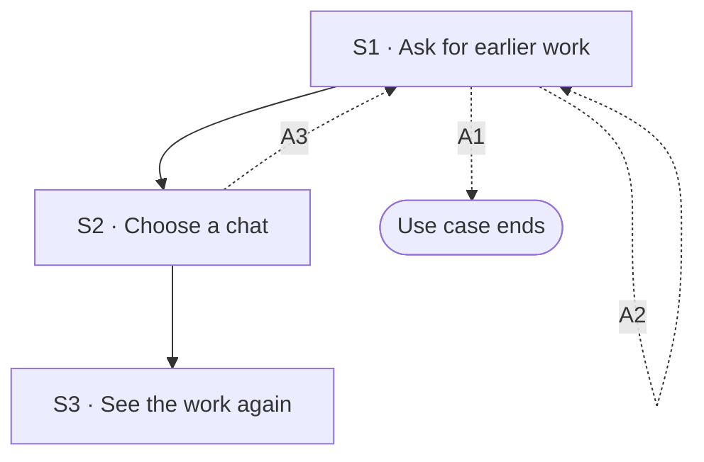

## Flow at a glance

<!-- BEGIN generated: use-case-flowchart -->

```mermaid
flowchart TD
  S1["S1 · Ask for earlier work"]
  S2["S2 · Choose a chat"]
  S3["S3 · See the work again"]
  DONE(["Use case ends"])
  S1 --> S2 --> S3
  S1 -.->|"A1"| DONE
  S1 -.->|"A2"| S1
  S2 -.->|"A3"| S1
```

*Solid arrows are the main flow. Dotted arrows are alternative flows, labelled with their IDs.*
*Not drawn (the flow stays at the same step): A4, A5 and A6.*
<!-- END generated: use-case-flowchart -->

## Situation and goal

- The user worked on a deck in an earlier chat, on another day or before closing DeckAgent.
- The user wants to see that chat and its deck again.
- The user then wants to change the deck, or get it as a file, without starting over.

## Trigger and preconditions

- **Trigger:** The user chooses to see earlier work.
- **Preconditions:** DeckAgent runs on the user's computer. No request in the current chat is active, including one that waits for the user's answer (Note 8).
- **Evidence:** [assumed]

## Main flow

- The main flow opens an earlier chat in which the system is no longer working.
- A chat is the unit of earlier work, as in the other use cases. It holds the conversation and the slides.
- After S3 the user can change the deck (UC-002) or get it as a file (UC-004). This use case ends at S3.
- Earlier chats and their decks stay available after DeckAgent is closed and opened again (Note 6).
- How the system keeps a chat is not part of this use case.

### S1 · Ask for earlier work

- **User:** Asks to see earlier work.
- **System:**
  - Shows the earlier chats the user can open [BR-004].
  - Includes chats from before DeckAgent was last closed.
  - Names each chat from its content.
  - Says for each chat when it last changed.
  - Says for each chat whether it has slides.
  - Keeps the current chat as it was, with its request text and attachments.
  - Lets the user open earlier work only while no request in the current chat is active. A request that waits for the user's answer is active.
- **Reqs:** FR-048, FR-054
- **Evidence:** [observed: claude-report (the product names each chat by itself from its content)] [assumed: the rest]
- **Updated at:** 12-10-2026

### S2 · Choose a chat

- **User:** Chooses the chat to open.
- **System:**
  - Opens the chosen chat.
  - Starts no work and sends no request.
  - Keeps unsent request text with the chat the user left. Does not send, delete or move it.
  - Removes the unsent attachments of the chat the user left from the request area. Changes no file on the user's computer.
- **Reqs:** FR-049
- **Evidence:** [assumed]
- **Updated at:** 13-10-2026

### S3 · See the work again

- **User:** Reviews the chat and its deck.
- **System:**
  - Shows the conversation of the chat, in order.
  - Shows the slides of the chat in the deck canvas, as they were when the user last left the chat.
  - Changes no slide.
  - Keeps the selected model of the chat. Takes no selected model from another chat.
  - Does not change the selected model by itself. Selected model removed: shows no selected model and says so, as UC-003 A41 says.
  - Lets the user send a new request in this chat. The chat needs a selectable selected model first (UC-003 A17, A40).
  - DeckAgent ran the whole time since the user left the chat: shows its unsent request text again. Shows none of its unsent attachments.
- **Reqs:** FR-042, FR-046, FR-049, FR-056, FR-065
- **Evidence:** [inferred: napkin-report (a chat with a deck made earlier still showed its closing message, and the deck was in the editor)] [observed: claude-report (after a reload, the chat came back from history with its messages)] [assumed: opening a chat chosen from earlier work]
- **Updated at:** 13-10-2026

## Alternative flows

### A1 · No earlier work

- **At:** S1
- **End:** Ends
- **When:** There is no earlier chat the user can open.
- **System:**
  - Says that there is no earlier chat.
  - Keeps the current chat as it was.
  - Lets the user start a new chat (UC-012).
- **Reqs:** FR-048
- **Evidence:** [assumed]
- **Updated at:** 12-10-2026

### A2 · Look for a chat by its words

- **At:** S1
- **End:** Returns to S1
- **When:** The user looks for an earlier chat by words it contains.
- **System:**
  - Shows only the chats whose name or conversation holds the words.
  - No chat matches: says so, and keeps the words the user gave.
  - Lets the user see every earlier chat again.
- **Reqs:** FR-?
- **Evidence:** [assumed]
- **Updated at:** 10-10-2026

### A3 · Chat cannot be opened

- **At:** S2
- **End:** Returns to S1
- **When:** The chosen chat cannot be opened. For example, what the system kept for it is missing or cannot be read.
- **System:**
  - Says that the chat cannot be opened, and says why when the reason is known.
  - Changes no other chat.
  - Keeps the current chat as it was.
- **Reqs:** FR-050
- **Evidence:** [assumed]
- **Updated at:** 12-10-2026

### A4 · Chat has no slides yet

- **At:** S3
- **End:** Same step
- **When:** The chosen chat has no slides. For example, it holds only a request, or an outline the user has not confirmed.
- **System:**
  - Shows the conversation of the chat, in order.
  - Says that the chat has no slides yet.
  - An outline waits for confirmation: it still waits, as in UC-001 A13.
  - Confirmed outline: lets the user send a follow-up request (UC-002).
  - No finished outline: lets the user send a request for a first draft. It gets a new outline proposal. The earlier request is not resumed.
- **Reqs:** FR-051, FR-?
- **Evidence:** [assumed]
- **Updated at:** 13-10-2026

### A5 · Work still running in the chat

- **At:** S3
- **End:** Same step
- **When:** The system is still working on a request in the chosen chat.
- **System:**
  - Shows the chat and the work in progress, as in UC-003 A13.
  - During a first draft: also shows the outline and the slides made so far, as in UC-001 A13.
- **Reqs:** FR-?
- **Evidence:** [observed: claude-report (after a reload, the run went on and the chat showed what the product was doing)] [assumed: the same holds for a chat chosen from earlier work]
- **Updated at:** 10-10-2026

### A6 · Work ended before it finished

- **At:** S3
- **End:** Same step
- **When:** The last request in the chosen chat did not finish, and the system no longer works on it. For example, DeckAgent was closed during the work.
- **System:**
  - Shows the conversation and the finished slides the chat kept before it closed.
  - Says that the work on the last request did not finish.
  - Does not start the work again by itself.
  - Keeps the request in the conversation.
  - Lets the user send a new request in this chat.
- **Reqs:** FR-052
- **Evidence:** [observed: claude-report (after a reload, the chat came back with a notice that the response was interrupted; it offered to edit the request or try again)] [assumed: the case where the work truly ended]
- **Updated at:** 12-10-2026

## Postconditions and minimal guarantee

Proposals, to be confirmed against recordings.

- **Postconditions:**
  - The chosen chat is open. Its conversation and its slides are as the chat kept them.
  - No slide changed and no request was sent.
- **Minimal guarantee:** Whatever branch fails:
  - Opening a chat changes no chat and no deck.
  - The chat the user was in stays as it was.
- **Evidence:** [assumed]

## Product evidence

### Claude Slide Design

- **Coverage:** unverified
- **Research card:** [claude-deck-generation-behavior](../../research/use-cases/claude-slides-design/claude-deck-generation-behavior.md)
- **Difference:**
  - The product names each chat by itself from its content.
  - After a reload, the chat came back from history with its messages.
  - The team did not record opening an earlier chat from earlier work.
- **Updated at:** 10-10-2026

### Napkin AI

- **Coverage:** unverified
- **Research card:** [napkin-ai-deck-generation-behavior](../../research/use-cases/napkin-ai/napkin-ai-deck-generation-behavior.md)
- **Difference:**
  - Images show a chat with a deck made earlier, its closing message and the deck in the editor.
  - How the user came back to that chat was not recorded.
- **Updated at:** 10-10-2026

## Open questions

1. Settled (owner, 2026-10-13): in V1 a chat holds one deck. A new deck starts in a new chat (Note 9).
2. S1: which earlier work can the user open? Only chats, or also an exported file? Owner to decide.
3. Settled (owner, 2026-10-13): unsent request text comes back with its chat while DeckAgent runs. Unsent attachments do not (S2, S3, Note 9).
4. Later try-again action (UC-003 Note 18): after the work ended early, which deck does it start from, and what runs again? Owner to decide.
5. Settled (owner, 2026-10-13): reloading or closing the interface does not stop the work while DeckAgent runs (UC-003 Note 30). Work that was running when DeckAgent itself closed is not resumed (A6, Note 8). A5 stays unselected: in V1 the user cannot open another chat while a request is active.

## Notes

1. Two behaviors differ. This use case opens earlier work in which the system is no longer working. Coming back to work still in progress is UC-003 A13 and UC-001 A13. A5 reuses that response. It does not promise that the work goes on.
2. Design choice for an ADR proposal: S3 needs the system to keep each chat and its slides. How it keeps them (files, a database, when it saves) is an ADR matter. The proposed boundary B-3 in the vision is related.
3. Reopening only to look, to change the deck or to get a file is the same goal. The user chooses what comes next after S3, so these are not alternative flows.
4. Giving the deck of an earlier chat as a pattern (UC-001 Note 16) is not part of this use case.
5. Renaming or deleting an earlier chat is not covered. It may become its own flow or use case.
6. Design decision (owner, 2026-10-11): earlier chats and their decks stay available after DeckAgent is closed and opened again.
   - The user can see earlier chats, open one, and carry on through new requests.
   - Work that was running when DeckAgent closed is not resumed (A6).
   - Why: not recorded. Starting a new chat is UC-012. How chats are kept is an ADR matter (Note 2). This note selects no flow.
7. Changed on 2026-10-11 so that no flow here offers to try again or to edit the request (UC-003 Notes 17 and 19). Closing DeckAgent is not a stop (Note 8).
   - A6 offered to edit the request and to try again. It now lets the user send a new request.
   - S3 offered to get the deck as a file. That offer now stays with UC-004, which comes next (Main flow).
   - Trying again remains a future candidate (UC-003 Note 18).
8. Design decision (owner, 2026-10-11): changing chats and closing DeckAgent during a request.
   - The user cannot open an earlier chat while a request in the current chat is active. A request that waits for the user's answer is active (UC-003 A38). The same rule holds for a new chat (UC-012 Note 4).
   - After the request finished, stopped or failed, the user can open an earlier chat. The system never stops a request to change chats.
   - DeckAgent closed during a request: when opened again, the chat shows the finished slides it kept (A6). The work is not resumed, and nothing promises more slides. The user sends a new request to go on.
   - Closing DeckAgent is not a stop (UC-003 A31). This note defines nothing about what runs after DeckAgent closes.
   - Why: not recorded. This settles the earlier open question on opening earlier work during a request.
   - Future candidate, with no version assigned: opening another chat while a request goes on in the background. A5 belongs to that case. This note selects no flow.
9. Design decisions (owner, 2026-10-13): one deck per chat, unsent text and saved history.
   - In V1 a chat holds one deck. A new deck starts in a new chat (UC-012). V1 has no chat with several decks.
   - Unsent request text stays with its own chat. Changing chats does not send, delete or move it (S2).
   - While DeckAgent runs, reopening the chat shows that text again (S3). Keeping it after DeckAgent ends is not promised. NFR-008 does not cover it.
   - Unsent attachments leave the request area when the user changes chats. Reopening the chat does not bring them back. The user adds them again before sending (option B).
   - Changing chats deletes no file on the user's computer. Attachments sent with a request stay with that request.
   - A request is never active while the user changes chats (Note 8). So changing chats never changes an active request. Preparing the next request during an active request stays as UC-003 A14 says.
   - A chat with no sent request need not appear among earlier chats [BR-004].
   - Saved chats, their conversations and their decks are kept with no time limit [BR-004]. Earlier messages stay part of their chat.
   - The interface can load old history in parts. No way to do it is set.
   - No way to delete a chat or a deck is added (Note 5). Nothing promises to keep data that the user removes on purpose, or that a lost disk takes.
   - This settles open questions 1 and 3. S2 and S3 follow this note since 2026-10-13. Why: not recorded. This note selects no flow.
