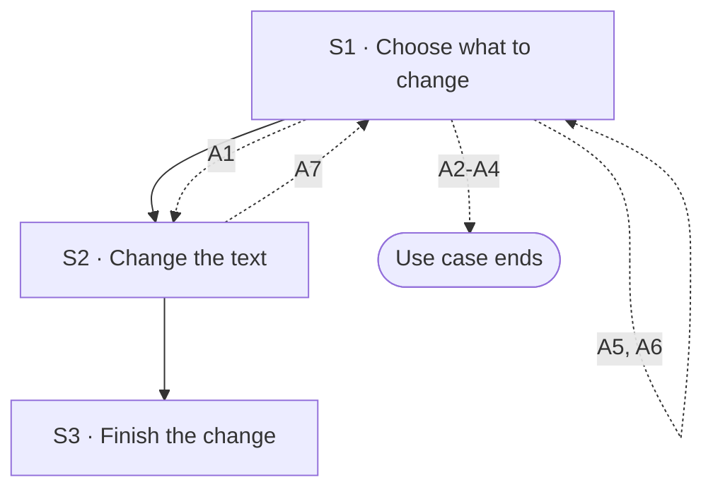

## Flow at a glance

<!-- BEGIN generated: use-case-flowchart -->

*Solid arrows are the main flow. Dotted arrows are alternative flows, labelled with their IDs.*
*Not drawn (the flow stays at the same step): none.*
<!-- END generated: use-case-flowchart -->

## Situation and goal

- The user has a deck the system made and sees a small thing to fix. Examples are a wrong word or a slide in the wrong place.
- Fixing it by hand is quicker than describing it in a request.
- The user wants only that change. They do not want to wait for the model or to risk other slides.

## Trigger and preconditions

- **Trigger:** The user chooses a part of the deck to change in the deck canvas.
- **Preconditions:** The chat has a deck with at least one slide. The system is not working on a request in this chat.
- **Evidence:** [assumed]

## Main flow

- The main flow changes the text of one slide.
- Every change here is made by the user. The system sends no request to the model and starts no work.
- The other kinds of change are alternative flows: add, delete, duplicate and move a slide (A1 to A4).
- Which kinds of change are offered is open (Open questions).

### S1 · Choose what to change

- **User:** Chooses the text on a slide that they want to change.
- **System:**
  - Shows which text is chosen.
  - Keeps the conversation, the request text and the attachments as they were.
- **Reqs:** FR-?
- **Evidence:** [inferred: claude-report (a tip on the canvas said that text on a slide can be edited; nobody tried it)] [assumed: the response]
- **Updated at:** 10-10-2026

### S2 · Change the text

- **User:** Changes the text.
- **System:**
  - Shows the change on the slide while the user makes it.
  - Changes nothing else on the slide or in the deck.
  - Sends no request to the model and starts no work.
- **Reqs:** FR-?
- **Evidence:** [assumed]
- **Updated at:** 10-10-2026

### S3 · Finish the change

- **User:** Finishes the change.
- **System:**
  - Keeps the changed text in the deck.
  - Shows the deck with the change in the deck canvas.
  - Keeps every other slide as it was.
- **Reqs:** FR-?
- **Evidence:** [assumed]
- **Updated at:** 10-10-2026

## Alternative flows

### A1 · Add a slide

- **At:** S1
- **End:** Continues at S2
- **When:** The user adds a slide at a place in the deck.
- **System:**
  - Adds an empty slide at that place.
  - Builds the new slide in the design system of the deck.
  - Keeps every other slide as it was, in the same order.
  - Shows the new slide in the deck canvas.
  - Sends no request to the model.
- **Reqs:** FR-?
- **Evidence:** [inferred: claude-report (an empty deck offered to add a slide, and each slide offered to add one after it; nobody tried it)] [assumed: the response]
- **Updated at:** 10-10-2026

### A2 · Delete a slide

- **At:** S1
- **End:** Ends
- **When:** The user deletes a slide.
- **System:**
  - Removes the slide from the deck.
  - Keeps every other slide as it was, in the same order.
  - Shows the deck without the slide in the deck canvas.
- **Reqs:** FR-?
- **Evidence:** [inferred: claude-report (each slide offered to delete it; nobody tried it)] [assumed: the response]
- **Updated at:** 10-10-2026

### A3 · Duplicate a slide

- **At:** S1
- **End:** Ends
- **When:** The user duplicates a slide.
- **System:**
  - Adds a copy of the slide as the next slide.
  - Keeps every other slide as it was, in the same order.
  - Shows the copy in the deck canvas.
- **Reqs:** FR-?
- **Evidence:** [inferred: claude-report (each slide offered to duplicate it; nobody tried it)] [assumed: where the copy goes]
- **Updated at:** 10-10-2026

### A4 · Move a slide

- **At:** S1
- **End:** Ends
- **When:** The user moves a slide to another place in the deck.
- **System:**
  - Puts the slide at the new place.
  - Keeps the content of every slide as it was.
  - Shows the new order in the deck canvas.
- **Reqs:** FR-?
- **Evidence:** [inferred: claude-report (each slide offered to move it one place earlier or later; nobody tried it)] [assumed: the response]
- **Updated at:** 10-10-2026

### A5 · Undo the last change by hand

- **At:** S1
- **End:** Returns to S1
- **When:** The user takes back their last change by hand.
- **System:**
  - Takes back the user's last change by hand.
  - Shows the deck in the deck canvas.
  - A request changed the same part after that change: what undo does is open (Open questions).
- **Reqs:** FR-?
- **Evidence:** [assumed]
- **Updated at:** 10-10-2026

### A6 · Part cannot be changed by hand

- **At:** S1
- **End:** Returns to S1
- **When:** The user chooses a part of a slide that cannot be changed by hand [BR-?: which parts of a slide can be changed by hand]. An example is a picture.
- **System:**
  - Says that this part cannot be changed by hand.
  - Lets the user ask for the change in a request instead.
  - Changes nothing.
- **Reqs:** FR-?
- **Evidence:** [assumed]
- **Updated at:** 10-10-2026

### A7 · Cancel the change

- **At:** S2
- **End:** Returns to S1
- **When:** The user cancels the change before finishing it.
- **System:**
  - Puts the text back as it was before S2.
  - Changes nothing else in the deck.
- **Reqs:** FR-?
- **Evidence:** [assumed]
- **Updated at:** 10-10-2026

## Postconditions and minimal guarantee

Proposals, to be confirmed against recordings.

- **Postconditions:**
  - Main flow: the slide shows the user's new text. Every other slide is as it was.
  - A1 to A4: the deck shows the added, removed, copied or moved slide. Every other slide keeps its content.
  - No request was sent and the model did no work.
  - The conversation, the request text and the attachments are as they were.
- **Minimal guarantee:** Whatever branch fails or is cancelled:
  - Every slide the user did not change is as it was.
  - The system sends no request to the model.
- **Evidence:** [assumed]

## Product evidence

### Claude Slide Design

- **Coverage:** unverified
- **Research card:** [claude-deck-generation-behavior](../../research/use-cases/claude-slides-design/claude-deck-generation-behavior.md)
- **Difference:**
  - A tip on the canvas said that text on a slide can be edited. The team did not try it.
  - Each slide offered to duplicate, copy, delete, skip or move it, or to add a slide after it. The team tried none of these.
  - An empty deck offered to add a slide.
- **Updated at:** 10-10-2026

### Napkin AI

- **Coverage:** unverified
- **Research card:** [napkin-ai-deck-generation-behavior](../../research/use-cases/napkin-ai/napkin-ai-deck-generation-behavior.md)
- **Difference:**
  - The deck is shown in an editor. After a deck, the product offered to edit the text of a slide as a next step.
  - The team saw an undo entry in the editor.
  - The team tried none of these.
- **Updated at:** 10-10-2026

## Open questions

1. S1, A1 to A7: which changes does a basic edit offer? Text only, or also adding, deleting, duplicating and moving slides? Owner to decide.
2. Preconditions: can the user change the deck by hand while the system works on a request? UC-001 S5 offers no adding of slides by hand meanwhile. Owner to decide.
3. A6: which parts of a slide can the user change by hand? Owner to decide.
4. S3: does a change by hand make a new state of the deck in its history (UC-008)? Owner to decide.
5. S3: does the conversation record a change by hand? Does the model know about it at the next request? Owner to decide.
6. A5: is undo the same behavior as going back to an earlier state (UC-008)? Owner to decide.
7. A2: can the user delete the only slide of the deck? Owner to decide.
8. S1: does every interface offer changes by hand (Vision Q-8)? Owner to decide.
9. A5: a request changed the same part after the change by hand. Does undo take back only the change by hand, also the later change, or is undo not offered then? Owner to decide.

## Notes

1. Design decision (owner, 2026-10-09, UC-004 Note 1): the product allows a basic edit of a deck it made, on the deck canvas. That edit is this use case. The product does not edit other people's deck files.
2. One use case, not two: a change of text and a change of slide order share the goal of a quick fix by the user. Each other kind of change is an alternative flow.
3. This use case is not UC-002. Here the user makes the change and the model does nothing. In UC-002 the user asks and the system makes the change. This use case does not include UC-003.
4. What happens to a change by hand when a later request changes the same slide is open. UC-002 holds that question.
5. Export builds the file from the deck as it is now, with every change by hand (UC-004 S2).
