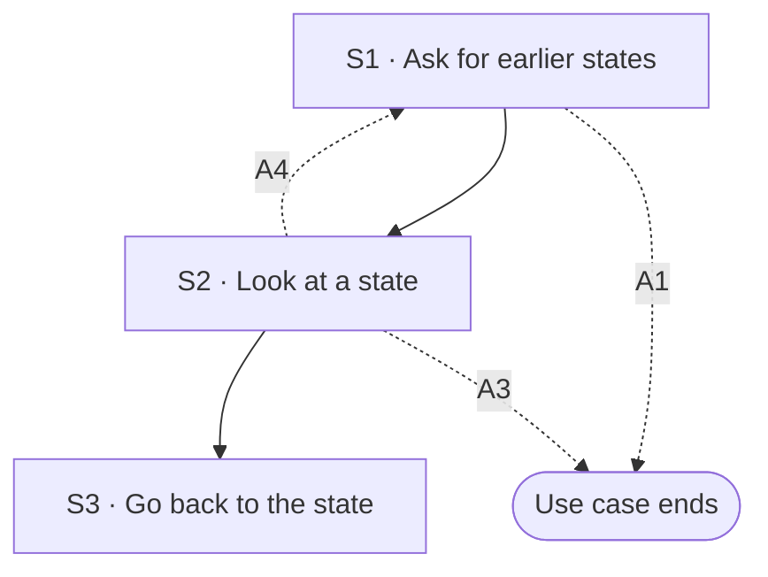

## Flow at a glance

<!-- BEGIN generated: use-case-flowchart -->

*Solid arrows are the main flow. Dotted arrows are alternative flows, labelled with their IDs.*
*Not drawn (the flow stays at the same step): A2.*
<!-- END generated: use-case-flowchart -->

## Situation and goal

- The user changed the deck, by a request or by hand, and likes the result less than before.
- The user wants to see how the deck was earlier and what changed since then.
- The user wants that earlier deck back, without rebuilding it and without starting a new chat.

## Trigger and preconditions

- **Trigger:** The user asks to see the earlier states of the deck.
- **Preconditions:** The chat has a deck. The system is not working on a request in this chat.
- **Evidence:** [assumed]

## Main flow

- A state is the deck as it was at one moment. Every state belongs to the same deck in the same chat.
- The main flow looks at one earlier state and makes it the current deck.
- When the system keeps a state is open (Open questions). How it keeps a state is not part of this use case.

### S1 · Ask for earlier states

- **User:** Asks to see the earlier states of the deck.
- **System:**
  - Shows the earlier states of the deck [BR-?: when the system keeps a state of the deck].
  - Says for each state when the system kept it, and what changed, when the system knows it.
  - Shows which state is the current deck.
  - Keeps the current deck as it is.
- **Reqs:** FR-?
- **Evidence:** [assumed]
- **Updated at:** 10-10-2026

### S2 · Look at a state

- **User:** Chooses an earlier state to look at.
- **System:**
  - Shows the slides of that state in the deck canvas.
  - Says that this is an earlier state and not the current deck.
  - Changes nothing in the current deck.
- **Reqs:** FR-?
- **Evidence:** [assumed]
- **Updated at:** 10-10-2026

### S3 · Go back to the state

- **User:** Chooses to go back to that state.
- **System:**
  - Makes the chosen state the current deck.
  - Shows the deck in the deck canvas.
  - Says in the conversation which state the deck went back to.
  - Keeps every message in the conversation.
- **Reqs:** FR-?
- **Evidence:** [assumed]
- **Updated at:** 10-10-2026

## Alternative flows

### A1 · No earlier state

- **At:** S1
- **End:** Ends
- **When:** The deck has no earlier state.
- **System:**
  - Says that the deck has no earlier state.
  - Changes nothing.
- **Reqs:** FR-?
- **Evidence:** [assumed]
- **Updated at:** 10-10-2026

### A2 · Compare with the current deck

- **At:** S2
- **End:** Same step
- **When:** The user asks what differs between the chosen state and the current deck.
- **System:**
  - Names each slide that differs, and each slide added or removed since that state.
  - Says what differs on each changed slide.
  - Changes nothing in the current deck.
- **Reqs:** FR-?
- **Evidence:** [assumed]
- **Updated at:** 10-10-2026

### A3 · Keep the current deck

- **At:** S2
- **End:** Ends
- **When:** The user decides not to go back.
- **System:**
  - Shows the current deck again in the deck canvas.
  - Changes nothing.
- **Reqs:** FR-?
- **Evidence:** [assumed]
- **Updated at:** 10-10-2026

### A4 · State cannot be shown

- **At:** S2
- **End:** Returns to S1
- **When:** The chosen state cannot be shown. For example, what the system kept for it is missing or cannot be read.
- **System:**
  - Says that the state cannot be shown, and says why when the reason is known.
  - Changes nothing in the current deck or in the other states.
- **Reqs:** FR-?
- **Evidence:** [assumed]
- **Updated at:** 10-10-2026

## Postconditions and minimal guarantee

Proposals, to be confirmed against recordings.

- **Postconditions:**
  - Main flow: the current deck is the chosen earlier state.
  - A2 and A3: the current deck is as it was.
  - The conversation keeps every message.
- **Minimal guarantee:** Whatever branch fails or is left:
  - Looking at a state changes nothing in the current deck.
  - A branch that fails or is left changes nothing in the current deck or in the other states.
- **Evidence:** [assumed]

## Product evidence

### Claude Slide Design

- **Coverage:** unverified
- **Research card:** [claude-deck-generation-behavior](../../research/use-cases/claude-slides-design/claude-deck-generation-behavior.md)
- **Difference:**
  - The team recorded no earlier state of a deck and no way to go back to one.
- **Updated at:** 10-10-2026

### Napkin AI

- **Coverage:** unverified
- **Research card:** [napkin-ai-deck-generation-behavior](../../research/use-cases/napkin-ai/napkin-ai-deck-generation-behavior.md)
- **Difference:**
  - The team saw an undo entry in the editor. The team did not try it.
  - The team recorded no list of earlier states.
- **Updated at:** 10-10-2026

## Open questions

1. S1: when does the system keep a state? After each request (UC-002), after each change by hand (UC-007), or when the user chooses to keep one? Owner to decide.
2. S3: after going back, are the newer states still there? Can the user go forward to them again? Owner to decide.
3. S2: can the user look at a state without going back to it? This draft says yes. Owner to confirm.
4. S1: are the states still there after DeckAgent is closed and the chat is opened again (UC-006)? Owner to decide.
5. S1: does a request that stopped or failed leave a state? This links to the open questions of UC-002 A7. Owner to decide.
6. S3: does going back change what the model knows at the next request? Owner to decide.
7. S3: what does the user see when going back fails partway? This use case states no rule for it. Owner to decide.

## Notes

1. A state and a variant are not the same. A state is the same deck at an earlier moment. A variant is another deck that exists beside it. This use case makes no second deck.
2. This use case is not UC-006. UC-006 opens an earlier chat. This use case stays in the current chat and changes which state is its deck.
3. Undo in UC-007 (A5) takes back the last change by hand. This use case chooses among earlier states. Whether the two are one behavior is open (UC-007 open questions).
4. Design choice for an ADR proposal: this use case needs the system to keep earlier states of a deck. How it keeps them (checkpoints, copies, a database or files) is an ADR matter.
