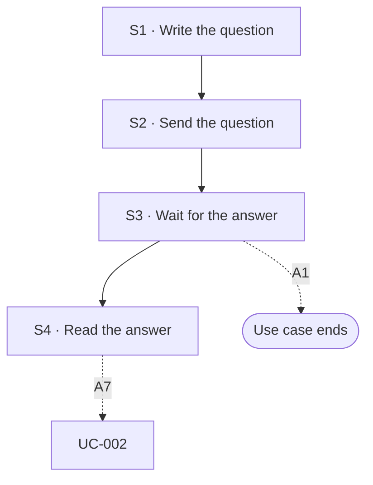

## Flow at a glance

<!-- BEGIN generated: use-case-flowchart -->

*Solid arrows are the main flow. Dotted arrows are alternative flows, labelled with their IDs.*
*Not drawn (the flow stays at the same step): A2, A3, A4, A5 and A6.*
<!-- END generated: use-case-flowchart -->

## Situation and goal

- The user has a deck and needs to understand it or trust it before they use it.
- Examples: where a figure comes from, whether two slides disagree, what the deck leaves out, or what a passage means.
- The user wants an answer. They do not want the deck changed.

## Trigger and preconditions

- **Trigger:** The user sends a question about the deck in a chat whose deck has slides.
- **Preconditions:** The deck has at least one slide. The system is not working on another request.
- **Evidence:** [assumed]

## Main flow

- S1 to S3 call UC-003 S1 to S3. The question is prepared and sent there, and the system works there.
- S4 ends the request, as UC-003 S4 says. S4 also gives the answer.
- The answer rests on the deck and on the material the user gave in this chat. It is not a full check of the facts.
- The system changes no slide in any flow of this use case.

### S1 · Write the question

- **User:** Writes a question about the deck, or asks the system to check it.
- **System:**
  - Shows what the user wrote in the request area, as UC-003 S1 says.
- **Reqs:** none
- **Updated at:** 10-10-2026

### S2 · Send the question

- **User:** Sends the question.
- **System:**
  - Sends the request as UC-003 S2 says.
- **Reqs:** none
- **Updated at:** 10-10-2026

### S3 · Wait for the answer

- **User:** Waits.
- **System:**
  - Shows the **status message** as UC-003 S3 says.
  - Says in the conversation which slides it is looking at.
  - Changes no slide.
- **Reqs:** FR-?
- **Evidence:** [assumed]
- **Updated at:** 10-10-2026

### S4 · Read the answer

- **User:** Reads the answer.
- **System:**
  - Shows that its work is done and lets the user send a new request, as UC-003 S4 says.
  - Answers in the conversation.
  - Names the slides the answer is about.
  - Says what the answer rests on: the deck, the user's material, or the model's own knowledge.
  - Says what it did not check [BR-?: what an answer says it did not check].
  - Keeps every slide as it was.
- **Reqs:** FR-?
- **Evidence:** [observed: claude-report (a closing message said what was checked, what was not, and that a citation came from memory)] [assumed: the same for an answer about the deck]
- **Updated at:** 10-10-2026

## Alternative flows

### A1 · Request does not say which part

- **At:** S3
- **End:** Ends
- **When:** The question does not say which slide or part of the deck it is about, and the system cannot tell.
- **System:**
  - Says that it cannot tell which part the question is about.
  - Keeps the sent request in the conversation.
  - Lets the user **edit the request**. Does not send the request again by itself.
  - Changes no slide.
- **Reqs:** FR-?
- **Evidence:** [assumed]
- **Updated at:** 10-10-2026

### A2 · Request also asks for a change

- **At:** S4
- **End:** Same step
- **When:** The request asks a question about the deck and also asks for a change to it.
- **System:**
  - Answers the question.
  - Changes no slide.
  - Says that it did not make the change.
  - Lets the user send the change as its own request.
- **Reqs:** FR-?
- **Evidence:** [assumed]
- **Updated at:** 10-10-2026

### A3 · Ask where content comes from

- **At:** S4
- **End:** Same step
- **When:** The question asks where a figure or a claim comes from, or which content comes from no material the user gave.
- **System:**
  - Names the part of the user's material the content comes from.
  - Content from no material the user gave: says so, and says that it is not checked.
  - Says that naming a source does not mean the claim is true.
- **Reqs:** FR-?
- **Evidence:** [observed: claude-report (a closing message said that a citation came from memory and not from a lookup)] [assumed: the answer to a question]
- **Updated at:** 10-10-2026

### A4 · Check the deck for conflicts

- **At:** S4
- **End:** Same step
- **When:** The user asks the system to check whether the deck agrees with itself or with the user's material.
- **System:**
  - Names each pair of slides or points that do not agree, and says what each one says.
  - Does not say which one is right, unless the user's material settles it.
  - Says that the check covers only what it found. It is not a full check.
- **Reqs:** FR-?
- **Evidence:** [observed: claude-report (a closing message said that percentages in the text did not match a table)] [assumed: a check of the deck on request]
- **Updated at:** 10-10-2026

### A5 · Find gaps in the deck

- **At:** S4
- **End:** Same step
- **When:** The user asks what the deck leaves out.
- **System:**
  - Names each point the deck does not cover.
  - Says for each gap what it rests on: the user's material, or what such a deck usually covers.
  - Says that the list is not complete.
- **Reqs:** FR-?
- **Evidence:** [assumed]
- **Updated at:** 10-10-2026

### A6 · Not enough to answer

- **At:** S4
- **End:** Same step
- **When:** The deck and the user's material do not hold what the answer needs.
- **System:**
  - Says that it cannot answer from the deck and the user's material.
  - Says what is missing.
  - Does not present the model's own knowledge as the user's material.
- **Reqs:** FR-?
- **Evidence:** [assumed]
- **Updated at:** 10-10-2026

### A7 · Fix what the answer found

- **At:** S4
- **End:** Goes to UC-002
- **When:** The user asks the system to change the deck to fix what the answer found.
- **System:**
  - Keeps the answer in the conversation.
  - Uses the answer as context for the change.
- **Reqs:** FR-?
- **Evidence:** [assumed]
- **Updated at:** 10-10-2026

## Postconditions and minimal guarantee

Proposals, to be confirmed against recordings.

- **Postconditions:**
  - The conversation holds the question and the answer.
  - Every slide is as it was before the question.
- **Minimal guarantee:** Whatever branch fails or is interrupted:
  - No slide changes.
  - The question is kept in the conversation.
- **Evidence:** [assumed]

## Product evidence

### Claude Slide Design

- **Coverage:** unverified
- **Research card:** [claude-deck-generation-behavior](../../research/use-cases/claude-slides-design/claude-deck-generation-behavior.md)
- **Difference:**
  - After a draft, closing messages said what was checked and what was not. One said that a citation came from memory.
  - The team did not record a question about a finished deck.
- **Updated at:** 10-10-2026

### Napkin AI

- **Coverage:** unverified
- **Research card:** [napkin-ai-deck-generation-behavior](../../research/use-cases/napkin-ai/napkin-ai-deck-generation-behavior.md)
- **Difference:**
  - An image shows the editor offering to inspect and update the visuals of a deck. It suggests questions such as which visual is in view.
  - The team did not try it.
- **Updated at:** 10-10-2026

## Open questions

1. S1: how does the system tell a question from a request to change the deck (UC-002)? Owner to decide.
2. A2: when a request asks a question and a change, does the system do both, or answer only? Owner to decide.
3. S4: can the answer use sources outside the deck and the user's material, such as the web? Owner to decide.
4. S1: is a question about something other than this deck part of this use case? Examples are practice for questions from an audience, learning a topic, or a general question. Owner to decide.
5. A5: what does the system compare the deck with to find gaps? Owner to decide.

## Notes

1. This use case is not UC-002. Here the system answers and changes no slide. In UC-002 the system changes the deck. Both send a request through UC-003, so they share a trigger. They do not share a result.
2. This use case is not UC-001. UC-001 tells the sources and assumptions once, in the closing message of the first draft (S6). Here the user asks at any time after.
3. Naming a source, finding a conflict and checking a fact are three different things. This use case names sources and finds conflicts. It does not promise that a claim is true.
4. A failure or a stop at S3 runs the flow of UC-003 for it: A11, A18, A19 or A31. No slide changes in any of them.
5. One use case, not one per kind of question. The kinds share the trigger, the steps and the result. A3 to A5 add only what differs in the answer.
