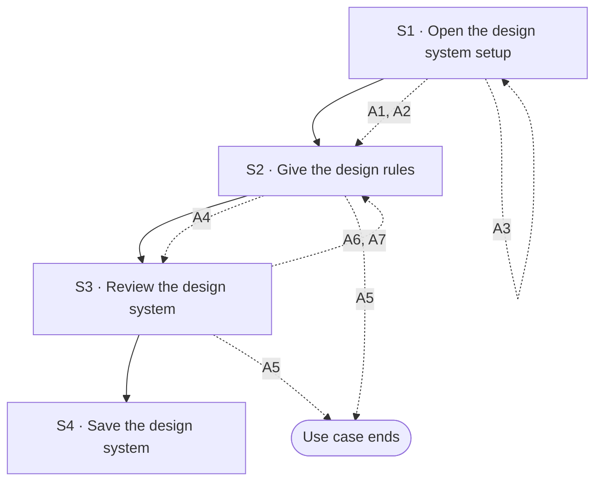

## Flow at a glance

<!-- BEGIN generated: use-case-flowchart -->

*Solid arrows are the main flow. Dotted arrows are alternative flows, labelled with their IDs.*
*Not drawn (the flow stays at the same step): none.*
<!-- END generated: use-case-flowchart -->

## Situation and goal

- The user makes decks that must follow the same look, such as a company brand or a client's brand.
- The user wants that look set up once, so they can choose it for any deck.
- The user does not want to describe the colours, fonts and rules again in every request.

## Trigger and preconditions

- **Trigger:** The user chooses to set up a design system. An example is while preparing a first draft (UC-001 A35).
- **Preconditions:** DeckAgent runs on the user's computer.
- **Evidence:** [assumed]

## Main flow

- A design system is a set of design rules the user can use for many decks. Examples are colours, fonts, a logo and spacing.
- The main flow makes a new design system from rules the user gives in words.
- This use case makes and changes design systems. It builds no deck and changes no deck.
- Choosing a design system for a first draft is UC-001 A5. Choosing one for a deck that exists is UC-002.
- How and where the system keeps a design system is not part of this use case.

### S1 · Open the design system setup

- **User:** Chooses to set up a design system.
- **System:**
  - Opens the design system setup.
  - Shows the design systems that are set up, and the default design system.
  - Keeps the conversation, the request text and the attachments as they were.
- **Reqs:** FR-?
- **Evidence:** [assumed]
- **Updated at:** 10-10-2026

### S2 · Give the design rules

- **User:** Describes the design rules in words, such as colours, fonts and spacing.
- **System:**
  - Says which kinds of design rules a design system can hold [BR-?: which design rules a design system holds].
  - Shows the rules the user gave.
- **Reqs:** FR-?
- **Evidence:** [assumed]
- **Updated at:** 10-10-2026

### S3 · Review the design system

- **User:** Reviews the design system.
- **System:**
  - Shows each rule of the design system in words.
  - Shows a sample slide made with the design system.
  - Says which rules it cannot use, and why.
  - Changes no deck.
- **Reqs:** FR-?
- **Evidence:** [assumed]
- **Updated at:** 10-10-2026

### S4 · Save the design system

- **User:** Saves the design system. A new design system also gets a name.
- **System:**
  - New design system: adds it to the design systems that are set up.
  - Changed design system (A2): keeps it under its name, with the new rules.
  - Says that the user can choose it for a new deck or for a change to a deck.
  - Changes no deck now.
  - Shows the conversation, the request text and the attachments as they were.
- **Reqs:** FR-?
- **Evidence:** [assumed]
- **Updated at:** 10-10-2026

## Alternative flows

### A1 · Start from a design system that is set up

- **At:** S1
- **End:** Continues at S2
- **When:** The user chooses to start from a design system that is set up, or from the default design system.
- **System:**
  - Takes the rules of that design system into the new one.
  - Keeps the design system it started from as it was.
- **Reqs:** FR-?
- **Evidence:** [assumed]
- **Updated at:** 10-10-2026

### A2 · Change a design system that is set up

- **At:** S1
- **End:** Continues at S2
- **When:** The user chooses to change a design system that is set up.
- **System:**
  - Shows the rules of that design system.
  - Changes no deck now. A deck made with it keeps its look until a later change (Open questions).
- **Reqs:** FR-?
- **Evidence:** [assumed]
- **Updated at:** 10-10-2026

### A3 · Remove a design system

- **At:** S1
- **End:** Returns to S1
- **When:** The user removes a design system that is set up.
- **System:**
  - Removes it from the design systems that are set up.
  - Changes no deck.
  - Keeps the default design system.
- **Reqs:** FR-?
- **Evidence:** [assumed]
- **Updated at:** 10-10-2026

### A4 · Give a brand guide or brand files

- **At:** S2
- **End:** Continues at S3
- **When:** The user gives a brand guide or brand files, such as a logo, instead of rules in words.
- **System:**
  - Shows each file the user gave.
  - Takes the design rules it can find in the files.
  - Says which rule it took from which file.
  - Says which files or parts it cannot use, and why.
  - Does not claim that it found every rule in the files.
- **Reqs:** FR-?
- **Evidence:** [assumed]
- **Updated at:** 10-10-2026

### A5 · Leave without saving

- **At:** S2, S3
- **End:** Ends
- **When:** The user leaves the design system setup before saving.
- **System:**
  - Saves no design system.
  - Keeps every design system as it was.
  - Shows the conversation, the request text and the attachments as they were.
- **Reqs:** FR-?
- **Evidence:** [assumed]
- **Updated at:** 10-10-2026

### A6 · Not enough to make a design system

- **At:** S3
- **End:** Returns to S2
- **When:** What the user gave is not enough to make a design system [BR-?: what a design system needs at least].
- **System:**
  - Says what is missing.
  - Keeps what the user gave.
  - Saves nothing.
- **Reqs:** FR-?
- **Evidence:** [assumed]
- **Updated at:** 10-10-2026

### A7 · Design rules do not agree

- **At:** S3
- **End:** Returns to S2
- **When:** Two rules the user gave do not agree. An example is two different main colours.
- **System:**
  - Names both rules, and where each one came from.
  - Does not choose one of them.
  - Lets the user choose one or change the rules.
- **Reqs:** FR-?
- **Evidence:** [assumed]
- **Updated at:** 10-10-2026

## Postconditions and minimal guarantee

Proposals, to be confirmed against recordings.

- **Postconditions:**
  - Main flow and A1: the new design system is among those the user can choose for a deck.
  - A2: the changed design system has the new rules, under the same name.
  - A3: the design system is no longer among them.
  - No deck changed.
- **Minimal guarantee:** Whatever branch fails or is left:
  - No deck changes.
  - Every design system set up before is as it was, except one the user removed or changed and saved.
  - The conversation, the request text and the attachments are as they were.
- **Evidence:** [assumed]

## Product evidence

### Claude Slide Design

- **Coverage:** unverified
- **Research card:** [claude-deck-generation-behavior](../../research/use-cases/claude-slides-design/claude-deck-generation-behavior.md)
- **Difference:**
  - The product offers to choose a design system before sending. The team never opened that choice.
  - How a design system is set up was not recorded.
- **Updated at:** 10-10-2026

### Napkin AI

- **Coverage:** unverified
- **Research card:** [napkin-ai-deck-generation-behavior](../../research/use-cases/napkin-ai/napkin-ai-deck-generation-behavior.md)
- **Difference:**
  - The editor offers a place for brand settings. The team did not open it.
  - The team saw a choice of brand style only inside the first draft. That choice is not a saved design system.
- **Updated at:** 10-10-2026

## Open questions

1. S2, A4: what can a design system come from? Examples are rules in words, a brand guide, brand files or an earlier deck. Owner to decide.
2. S2: which design rules can a design system hold? Owner to decide.
3. A4: does reading a brand guide need the model the user set up (UC-005)? Owner to decide.
4. A2: when the user changes a design system, do decks made with it change too? Owner to decide.
5. S3: does every slide have to follow every rule? What does the system do when a slide cannot? Owner to decide.
6. S4: can the user make a design system the default for new decks? Owner to decide.

## Notes

1. Setting up a design system and choosing one are different goals. This use case sets up. UC-001 A5 and UC-002 choose one for a deck.
2. A design system is not a look for one deck. A look chosen during a first draft (UC-001 A36) is not saved as a design system.
3. UC-001 Note 1 proposes a fixed default design system. This use case adds design systems beside it. It does not change the default.
4. Design choice for an ADR proposal: the system keeps each design system so the user can choose it later. How it keeps it is an ADR matter.
5. A design system does not promise that every slide follows every rule. Whether the system checks a deck against its rules is open.
