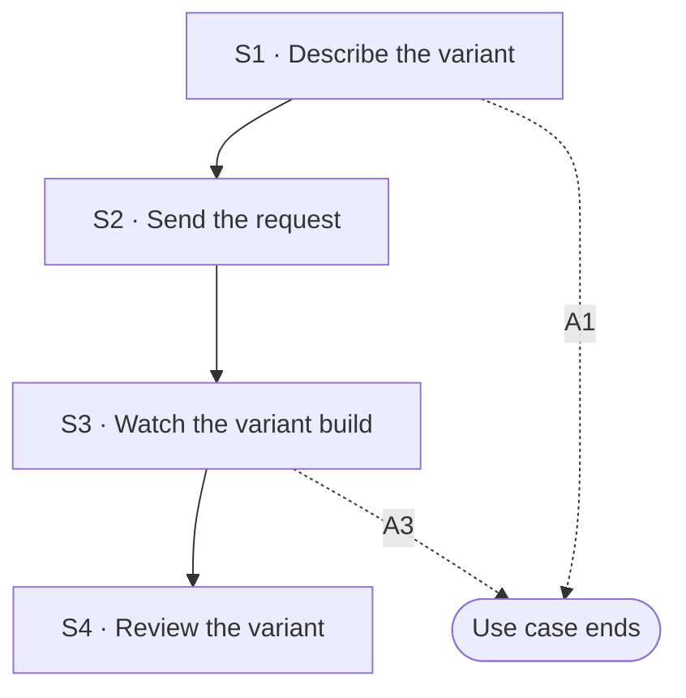

## Flow at a glance

<!-- BEGIN generated: use-case-flowchart -->

*Solid arrows are the main flow. Dotted arrows are alternative flows, labelled with their IDs.*
*Not drawn (the flow stays at the same step): A2.*
<!-- END generated: use-case-flowchart -->

## Situation and goal

- The user has a deck and needs a second one from it for another use.
- Examples: a deck to present and a deck to read, a deck in another language, or a deck for a client and one for the team.
- The user wants to keep the first deck as it is. They do not want to build the second deck from nothing.

## Trigger and preconditions

- **Trigger:** The user sends a request for another deck made from the deck in the chat.
- **Preconditions:** The deck has at least one slide. The system is not working on another request.
- **Evidence:** [assumed]

## Main flow

- S1 to S3 call UC-003 S1 to S3. The request is prepared and sent there, and the system works there.
- S4 ends the request, as UC-003 S4 says. S4 also shows the new deck.
- The new deck is a **variant**. The deck it comes from is the original. The original stays as it was.
- Where the system keeps the variant, in this chat or in another one, is open (Open questions).

### S1 · Describe the variant

- **User:** Describes the other deck they need and what it is for.
- **System:**
  - Shows what the user wrote in the request area, as UC-003 S1 says.
- **Reqs:** none
- **Updated at:** 10-10-2026

### S2 · Send the request

- **User:** Sends the request.
- **System:**
  - Sends the request as UC-003 S2 says.
- **Reqs:** none
- **Updated at:** 10-10-2026

### S3 · Watch the variant build

- **User:** Waits.
- **System:**
  - Shows the **status message** as UC-003 S3 says.
  - Builds the variant from the original deck and the request.
  - Changes no slide of the original deck.
- **Reqs:** FR-?
- **Evidence:** [assumed]
- **Updated at:** 10-10-2026

### S4 · Review the variant

- **User:** Reviews the variant.
- **System:**
  - Shows that its work is done and lets the user send a new request, as UC-003 S4 says.
  - Shows the variant in the deck canvas.
  - Names the variant so the user can tell it from the original.
  - Says in the closing message how the variant differs from the original.
  - Keeps the original deck as it was, and lets the user see it again.
- **Reqs:** FR-?
- **Evidence:** [assumed]
- **Updated at:** 10-10-2026

## Alternative flows

### A1 · Copy the deck without changes

- **At:** S1
- **End:** Ends
- **When:** The user chooses to copy the deck as it is, without a request.
- **System:**
  - Makes a copy of the deck.
  - Names the copy so the user can tell it from the original.
  - Sends no request to the model.
  - Keeps the original deck as it was.
- **Reqs:** FR-?
- **Evidence:** [assumed]
- **Updated at:** 10-10-2026

### A2 · Variant in another language

- **At:** S3
- **End:** Same step
- **When:** The request asks for the variant in another language.
- **System:**
  - Writes the text of the variant in that language.
  - Keeps the figures and the order of the slides as in the original [BR-?: what a variant in another language keeps].
  - Says in the closing message that no person checked the new text.
- **Reqs:** FR-?
- **Evidence:** [assumed]
- **Updated at:** 10-10-2026

### A3 · Request does not say how the variant differs

- **At:** S3
- **End:** Ends
- **When:** The request asks for another deck but does not say how it differs or what it is for.
- **System:**
  - Makes no variant.
  - Says that it cannot tell how the new deck differs from the original.
  - Keeps the sent request in the conversation.
  - Lets the user **edit the request**. Does not send the request again by itself.
- **Reqs:** FR-?
- **Evidence:** [assumed]
- **Updated at:** 10-10-2026

## Postconditions and minimal guarantee

Proposals, to be confirmed against recordings.

- **Postconditions:**
  - Main flow and A1: there are two decks. The original is as it was.
  - The conversation holds the request and the closing message, except in A1.
- **Minimal guarantee:** Whatever branch fails or is interrupted:
  - The original deck is as it was.
  - The request text is kept in the conversation.
- **Evidence:** [assumed]

## Product evidence

### Claude Slide Design

- **Coverage:** unverified
- **Research card:** [claude-deck-generation-behavior](../../research/use-cases/claude-slides-design/claude-deck-generation-behavior.md)
- **Difference:**
  - Each slide offered to duplicate it. The team saw no copy of a whole deck and tried none.
- **Updated at:** 10-10-2026

### Napkin AI

- **Coverage:** unverified
- **Research card:** [napkin-ai-deck-generation-behavior](../../research/use-cases/napkin-ai/napkin-ai-deck-generation-behavior.md)
- **Difference:**
  - Next steps such as "make it more formal" changed the deck in place. The team saw no second deck.
- **Updated at:** 10-10-2026

## Open questions

1. Main flow: is the variant in the same chat as the original, or in a new chat? Owner to decide.
2. S3: does the variant use the material the user gave for the original? Owner to decide.
3. S4: does the variant have its own deck history (UC-008), apart from the original? Owner to decide.
4. S4: when the original changes later, does the variant change too? Owner to decide.
5. S1: how does the system tell a request for a variant from a request to change the deck (UC-002)? Owner to decide.
6. S4: can the user export several variants at once (UC-004)? Owner to decide.

## Notes

1. A variant is not a deck state. A deck state is the same deck at another moment (UC-008). A variant is another deck that exists beside the original.
2. This use case is not UC-002. UC-002 changes the deck in place. This use case keeps the original and makes a second deck.
3. A look chosen in UC-001 A36 makes one deck. Trying looks there makes no variant.
4. A failure or a stop at S3 runs the flow of UC-003 for it: A11, A18, A19 or A31. The original deck stays as it was in each of them. What happens to a variant that is half made is open.
5. Whether a later change to one deck reaches the other is open (Open questions).
