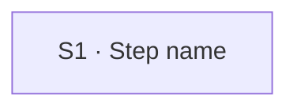

<!-- Write in plain English: docs/spec/_STYLE.md (UCG-11).
     Write intent and response, never interface (UCG-13, _STYLE rule 11). No control, menu, gesture, position, look or label.
     Name a place only by a zone: request area, conversation, deck canvas. Before you finish, run the interface check in _STYLE.md. -->

## Flow at a glance

<!-- Generated from the steps and alternative flows below. Do not edit between the markers (UCG-12).
     The use-case-flowchart skill rewrites it. Keep the markers exactly as written. -->

<!-- BEGIN generated: use-case-flowchart -->

*Solid arrows are the main flow. Dotted arrows are alternative flows, labelled with their IDs.*
*Not drawn (the flow stays at the same step): none.*
<!-- END generated: use-case-flowchart -->

## Situation and goal

<!-- Who wants what, and why now, in the user's words. No feature or solution (UCG-01, UCG-02). Do not name a segment: 02-users lists this use case. -->

## Trigger and preconditions

<!-- Trigger: what starts the case. Preconditions: what is already true. Both observable. No implementation and no interface. -->

- **Trigger:**
- **Preconditions:**

## Main flow

<!-- 3 to 9 steps, one block per step, in order (UCG-03). IDs are stable: retire, never renumber (UCG-10).
     Heading: "### Sx · Step name". The name is short (5 words or fewer).
     User: what the user wants to do, as an intent ("Chooses a skill"), not an action on a control.
     System: bullets for what the user can observe: what the system tells, keeps, changes or builds. No "if", no implementation, no interface. A rule or quality target is cited by ID,
       never written as a value: [BR-xxx], [NFR-xxx]. Unwritten: [BR-?: topic] / [NFR-?: topic] (UCG-06).
     Reqs: FR IDs for this response, or FR-? while unwritten (UCG-06).
     Evidence: tags from _STYLE.md on one line. Remove the field when the step makes no claim about a product (UCG-08).
     Fixed field names and order: User, System, Reqs, Evidence, Updated at. Rules for each field: _STYLE.md.
     Updated at: the date of the last change to this block, as dd-mm-yyyy, always the last field (UCG-14). Set it on every edit to the block. -->

### S1 · Step name

- **User:**
- **System:**
  -
- **Reqs:** FR-?
- **Evidence:**
- **Updated at:** DD-MM-YYYY

## Alternative flows

<!-- One block per branch. Cover each step that takes input, can be cancelled, uses an external service or can take long,
     or say why not (UCG-04). Same citation rules as the main flow.
     Order the blocks by their first At step, then by ID. IDs keep their number (UCG-10).
     Heading: "### Ax · Branch name".
     At: the step or steps where the branch starts, for example "S3" or "S3, S5".
     End: one of the values below. With several At steps and different ends, write "S3: Returns to S2 · S5: Returns to S5".
       Returns to Sx    the flow goes back to step Sx
       Continues at Sx  the flow moves on to step Sx
       Same step        the flow stays where it is (nothing is drawn)
       Ends             the use case ends
       Goes to UC-xxx   another use case takes over
       Goes to UC-? (topic)   a use case that is not written yet takes over; the topic names it, for example "model setup"
     An action offered after the end (for example "Try again") is written in System, not in End.
     When: a condition the system can detect, or an intent of the user (UCG-04). Fixed field names and order: At, End, When, System, Reqs, Evidence, Updated at (UCG-14). -->

### A1 · Branch name

- **At:** S?
- **End:** Returns to S?
- **When:**
- **System:**
  -
- **Reqs:** FR-?
- **Evidence:**
- **Updated at:** DD-MM-YYYY

## Postconditions and minimal guarantee

<!-- Postconditions: what is true after success, verifiable by observing the product.
     Minimal guarantee: what stays true after any branch fails (UCG-05). -->

- **Postconditions:**
- **Minimal guarantee:**

## Product evidence

<!-- Coverage only: observed | not offered | unverified. Raw observations and their values stay in docs/research/use-cases/ (UCG-08).
     This case links the research card; the card does not name this use case. "Difference" in words, no rule values.
     One block per product. Add a block for each baseline product. -->

### Claude Slide Design

- **Coverage:** unverified
- **Research card:**
- **Difference:**
- **Updated at:** DD-MM-YYYY

### Napkin AI

- **Coverage:** unverified
- **Research card:**
- **Difference:**
- **Updated at:** DD-MM-YYYY

## Open questions

<!-- Each has "?" and who will resolve it. An Active case has none that changes a flow or result (UCG-10). Remove the section if empty. -->

## Notes

<!-- Why this is not the same case as another. Design choices that become ADR proposals. Do not name segments. Remove if empty. -->
